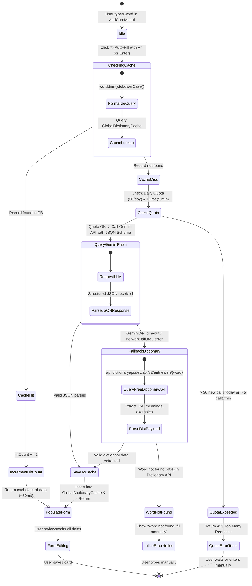
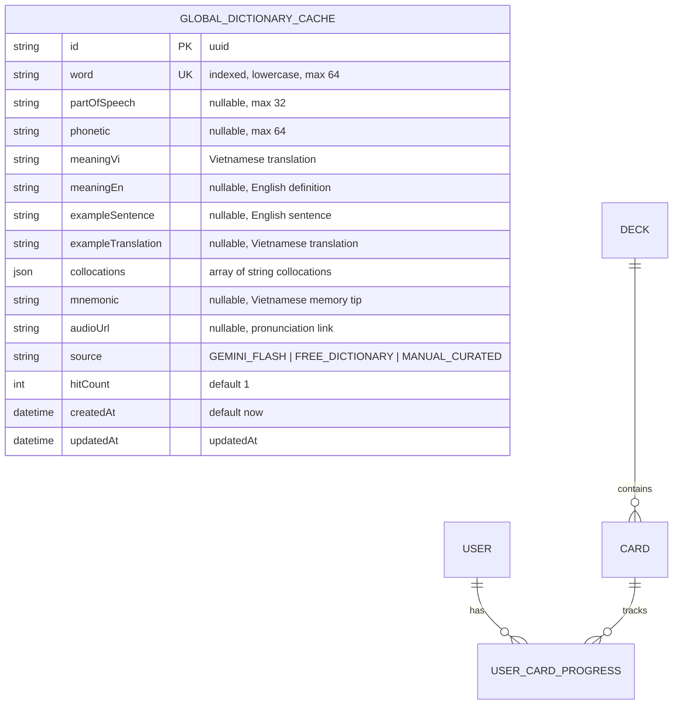

# Domain Model: AI-Assisted Vocabulary Generator & Global Dictionary Cache

- **Feature Slug**: `ai-vocabulary-generator`
- **Epics**: `EPIC-07` (US-AI-01: Auto-fill Card Data & US-AI-02: Shared Word Dictionary Cache)

---

## 1. RBAC Matrix

| Role | Lookup / Generate Card Data | Add/Edit Card with AI | Read Global Cache | Invalidate / Clear Cache |
| :--- | :---: | :---: | :---: | :---: |
| **Guest / Unauthenticated** | ❌ Blocked (401) | ❌ Blocked (401) | ❌ Blocked | ❌ Blocked |
| **Learner (Authenticated)** | ✅ Allowed (30/day) | ✅ Allowed (Own decks) | ✅ Internal Service | ❌ Forbidden |
| **System Service** | ✅ Unlimited | N/A | ✅ Full Access | ✅ Internal Cleanup |

**Ownership & Privacy Rules**:
- Users can only attach generated card content to Decks they own.
- `GlobalDictionaryCache` entries are completely anonymized — no `userId`, `deckId`, or PII is ever associated with cache records.

---

## 2. State Machine & Entity Lifecycle

---

## 3. Business Rules & Algorithms

- **`BR-AI-001 (Word Normalization)`**:
  - Input strings are sanitized: trimmed of leading/trailing whitespace, collapsed internal whitespace, lowercased, and stripped of unsafe script tags or control characters.
  - Maximum input query length is 64 characters (supports single words and standard multi-word collocations/phrasal verbs like `take for granted`).
- **`BR-AI-002 (Global Shared Cache Keying)`**:
  - Cache lookup key is strictly the normalized English string `word`.
  - Cache reads and writes are atomic; concurrent lookups for the same word use DB upsert/first-write-wins to avoid duplicate records.
- **`BR-AI-003 (Free-Tier Daily Generation Quota)`**:
  - Each authenticated user is allocated 30 *new* AI generations per UTC day (`00:00 UTC` reset).
  - Cache hits do NOT decrement the quota. Only uncached lookups that invoke the LLM or external dictionary count towards the quota.
- **`BR-AI-004 (Anti-Abuse & Burst Rate Limiting)`**:
  - Maximum 5 generation requests per minute per user account.
  - Excessive requests return HTTP `429 Too Many Requests` with `Retry-After` header.
- **`BR-AI-005 (Structured Payload Integrity)`**:
  - Every successful AI payload must conform to the `AiGeneratedCardDto`:
    - `word`: string (matching input word)
    - `partOfSpeech`: string (e.g., "noun", "verb", "adjective", "phrasal verb")
    - `phonetic`: string (standard IPA format, e.g., `"/ˈrez.ɪ.li.ənt/"`)
    - `meaningVi`: string (concise, high-quality Vietnamese translation)
    - `meaningEn`: string (concise English definition with nuance)
    - `exampleSentence`: string (natural English context sentence)
    - `exampleTranslation`: string (accurate Vietnamese translation of the example)
    - `collocations`: string[] (2–4 high-frequency collocations)
    - `mnemonic`: string (creative Vietnamese memory hook or etymology association)
    - `audioUrl`: string? (optional pronunciation link from dictionary CDN)
- **`BR-AI-006 (Graceful Multi-tier Fallback)`**:
  - Primary provider: Google Gemini Flash (`gemini-2.5-flash` or `gemini-1.5-flash`).
  - Secondary fallback: Free Dictionary API (`https://api.dictionaryapi.dev/api/v2/entries/en/<word>`).
  - If both fail, backend returns `404 Word Not Found` with code `AI_WORD_NOT_FOUND`.
- **`BR-AI-007 (Form Non-Destructive Auto-Fill)`**:
  - When auto-fill data arrives, frontend populates empty fields or replaces existing values, while preserving the user's manual focus and allowing instant editing.
  - If user had already typed custom notes, frontend provides visual feedback indicating fields were filled.
- **`BR-AI-008 (Cache Source Auditing)`**:
  - Every `GlobalDictionaryCache` record tracks its source: `GEMINI_FLASH`, `FREE_DICTIONARY`, or `MANUAL_CURATED`.

---

## 4. Workflows & Resiliency

| Workflow | Condition / Trigger | System Action | Error & Recovery Strategy |
| :--- | :--- | :--- | :--- |
| **WF-1: Instant Cache Hit** | User types cached word (e.g. `serendipity`) | DB query finds word -> increments `hitCount` -> returns payload in <50ms | No LLM call; zero API cost; instant UI feedback. |
| **WF-2: Uncached AI Generation** | Word not in DB | Backend checks user daily quota (<30) -> calls Gemini Flash -> saves result to DB -> returns payload in ~1.2s | If Gemini takes > 5s (timeout), automatically falls back to Free Dictionary API. |
| **WF-3: Dictionary API Fallback** | Gemini API key missing, offline, or rate limited | Backend queries Free Dictionary API -> maps fields -> returns partial card payload | UI displays notice: "Filled using Free Dictionary". User can edit any missing mnemonic. |
| **WF-4: Invalid / Non-existent Word** | User enters typo or non-word (e.g. `xyzabc123`) | Both providers fail | Returns HTTP 404. UI displays non-intrusive warning: "Word not found. You can fill the fields manually." Input values are preserved. |
| **WF-5: Quota Exceeded** | User attempts 31st uncached generation in one day | Backend rejects with HTTP 429 | UI shows toast: "Daily AI generation limit reached (30/30). Cached words remain unlimited!" |
| **WF-6: Network Disconnection** | Client offline when clicking Auto-Fill | Client network error | Shows toast: "Network disconnected. Please check your connection." User can continue editing offline. |

---

## 5. ERD & Data Boundaries

- **Deletion Policy**:
  - `GlobalDictionaryCache` is a perpetual, shared system dictionary cache. No automatic deletion.
  - Deleting a user card or user account has ZERO effect on `GlobalDictionaryCache`.
- **Privacy & Safety**:
  - No user identifiers are stored in `GlobalDictionaryCache`.
  - Prompts use parameterized system prompts with markdown escaping to prevent prompt injection.

---

## 6. UX States & Non-Functional Requirements

- **UX States in Card Modal**:
  - *Default*: Sparkle button `✨ Auto-Fill with AI` active next to Word input.
  - *Loading*: Button enters subtle spinning / pulse state, text changes to `"Generating..."`, button disabled to prevent duplicate clicks.
  - *Success*: Form fields smoothly populate; subtle green glow / badge indicating AI auto-filled.
  - *Warning/Error*: Inline message below word field if not found; toast message if quota reached.
- **Performance Targets**:
  - Cache Hit: P95 Latency < 50ms.
  - Gemini Flash Generation: P95 Latency < 1500ms.
- **Design System Tokens (WordStreak UI)**:
  - Strict compliance with `apps/web/DESIGN.md`:
    - Canvas: Pure white (`#ffffff`).
    - Border: 1px hairline (`#e5e5e5`).
    - Button: Obsidian black pill (`#000000`, `text-white`, `rounded-full`) or ghost pill with sparkle icon.
    - Typography: `Nunito` for modal headers, `Inter` for input fields, `JetBrains Mono` for IPA.
    - Zero hover jitter (stable outer anchor).
- **Accessibility**:
  - WCAG 2.1 AA compliant.
  - `aria-label="Auto-fill card data with AI"` on sparkle button.
  - Keyboard accessible: `Enter` triggers lookup when word input is focused; `Tab` flows naturally into populated fields.
