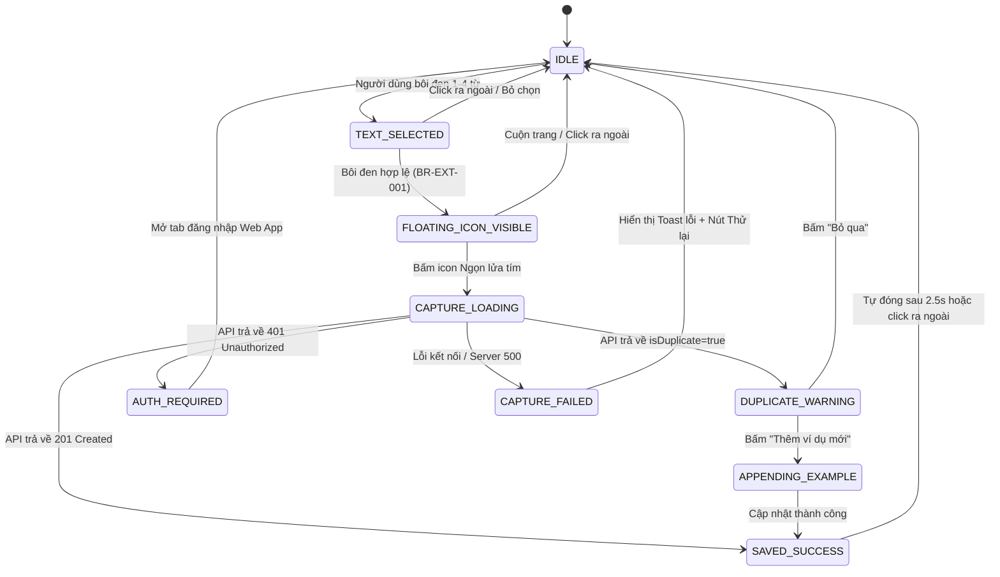
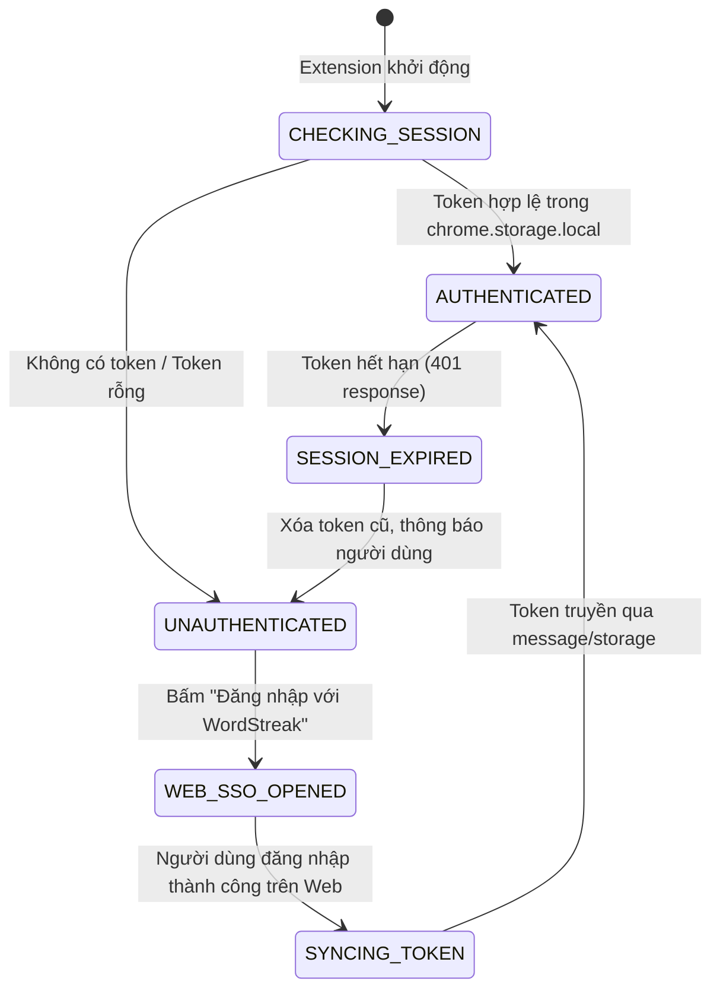
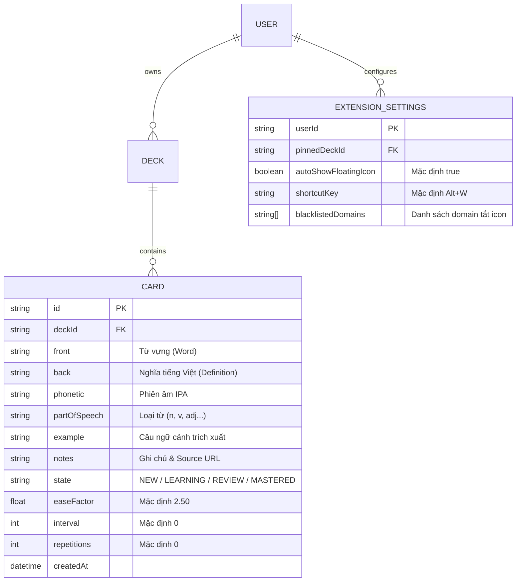

# Domain Model: Tiện ích mở rộng trình duyệt (Chrome Extension Manifest V3)

- **Feature Slug**: `browser-extension`
- **Target User Story**: `US-ECO-03`
- **Date**: 2026-08-23

---

## 1. RBAC Matrix

| Role                       | Tra từ nhanh trên Web (Tooltip) | Lưu 1-Click vào Deck         | Đổi Target Deck | Quản lý Cài đặt Extension | Xem Lịch sử Từ vừa lưu |
| -------------------------- | ------------------------------- | ---------------------------- | --------------- | ------------------------- | ---------------------- |
| **Guest (Chưa đăng nhập)** | ✅ Cho phép (Preview nghĩa)     | ❌ Yêu cầu Đăng nhập         | ❌ Không        | ⚠️ Cài đặt cục bộ cơ bản  | ❌ Không               |
| **Learner (Đã đăng nhập)** | ✅ Đầy đủ                       | ✅ Đầy đủ (Vào Deck cá nhân) | ✅ Đầy đủ       | ✅ Đầy đủ                 | ✅ 10 từ gần nhất      |
| **Pro Subscriber**         | ✅ Đầy đủ                       | ✅ Đầy đủ + AI Deep Enrich   | ✅ Đầy đủ       | ✅ Đầy đủ                 | ✅ Không giới hạn      |
| **System Admin**           | ✅ Đầy đủ                       | ✅ Đầy đủ                    | ✅ Đầy đủ       | ✅ Đầy đủ                 | ✅ Đầy đủ              |

---

## 2. State Machines & Lifecycles

### 2.1. Vòng đời Tương tác Quick Capture trên Trang Web (Content Script)

### 2.2. Vòng đời Xác thực & Đồng bộ Phiên (Auth Sync Lifecycle)

---

## 3. Quy tắc Nghiệp vụ (Business Rules)

- **`BR-EXT-001` (Text Selection Filter)**: Extension chỉ kích hoạt Floating Icon khi độ dài chuỗi bôi đen từ 1 đến 5 từ (độ dài ký tự từ 2 đến 60 ký tự). Bỏ qua các chuỗi chỉ chứa số, ký tự đặc biệt, URL hoặc email.
- **`BR-EXT-002` (Smart Context Sentence Extraction)**: Tự động trích xuất toàn bộ câu văn chứa từ được bôi đen bằng thuật toán quét ranh giới câu (`.`, `!`, `?`, `\n`, `
`, `<li>`). Giới hạn độ dài câu tối đa 250 ký tự để đảm bảo tính ngắn gọn và tập trung của flashcard.
- **`BR-EXT-003` (Target Deck Resolution & Auto-provisioning)**:
  - Khi lưu từ 1-click, hệ thống ưu tiên lưu vào `pinnedDeckId` đã chọn trong Extension.
  - Nếu chưa có `pinnedDeckId`, ưu tiên lưu vào Deck gần nhất (`lastUsedDeckId`).
  - Nếu tài khoản người dùng chưa có bất kỳ Deck nào, hệ thống tự động khởi tạo Deck mang tên _"Inbox / Thu thập Web"_ và gán thẻ mới vào Deck này.
- **`BR-EXT-004` (SM-2 Initial State)**: Mọi thẻ từ tạo qua Extension bắt buộc phải khởi tạo với `state = NEW`, `easeFactor = 2.50`, `interval = 0`, `repetitions = 0`.
- **`BR-EXT-005` (Duplicate Resilience & Append Context)**:
  - Nếu từ vựng (không phân biệt hoa thường) đã tồn tại trong Deck đích, hệ thống trả về thông báo cảnh báo trùng lặp.
  - Người dùng có thể chọn _"Thêm ví dụ mới vào thẻ hiện có"_ $\rightarrow$ Hệ thống nối thêm câu ngữ cảnh vào trường `notes` của thẻ cũ mà **KHÔNG** làm thay đổi tiến độ ôn tập SM-2 (`state`, `interval`, `easeFactor`).
- **`BR-EXT-006` (Token Storage & Transport Security)**: Token JWT được lưu độc quyền trong `chrome.storage.local` (cách ly hoàn toàn với các extension khác và script của trang web thứ 3). Mọi lệnh gọi API gửi qua header `Authorization: Bearer <token>`.
- **`BR-EXT-007` (Shadow DOM Isolation)**: Toàn bộ thành phần UI nổi trên trang web (Content Script) bắt buộc phải đóng gói trong **Shadow Root (`attachShadow({ mode: 'open' })`)** để miễn nhiễm 100% với CSS bên ngoài.

---

## 4. Sơ đồ Thực thể & Dữ liệu (Entity Model Sketch)

---

## 5. Yêu cầu Phi Chức năng & UX (NFRs)

- **Design System & Anti-AI-Slop**:
  - Khung giao diện trắng tối giản (`#ffffff`), đường viền hairline 1px (`#e5e5e5`/`#d4d4d4`).
  - Nút bấm Obsidian Pure Black (`#000000`, `rounded-full`, text trắng).
  - Mascot Ngọn lửa WordStreak tím thương hiệu làm icon kích hoạt.
  - Typography: `Nunito` cho tiêu đề, `Inter` cho nội dung, `JetBrains Mono` cho phiên âm/mã.
  - Tuyệt đối không dùng gradient lòe loẹt, neon glow hoặc dark-mode mờ ảo không theo chuẩn.
- **Hiệu năng & Trải nghiệm**:
  - Thời gian phản hồi 1-click capture: P95 < 1.5 giây.
  - Tự động huỷ popup/icon khi người dùng cuộn trang hoặc click ra ngoài để không gây cản trở đọc văn bản.
- **Khả năng tương thích**: 100% hoạt động mượt mà trên Chrome, Brave, Microsoft Edge, Opera, Arc.
