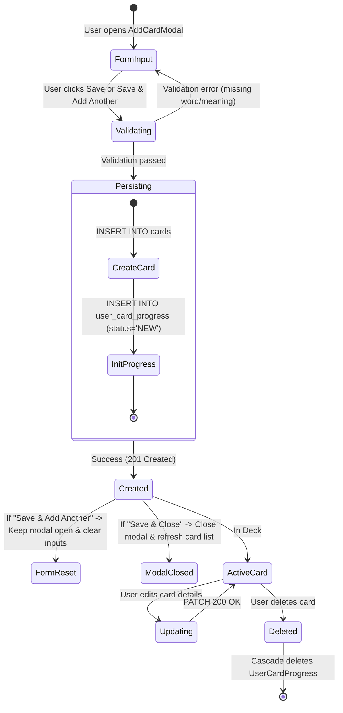
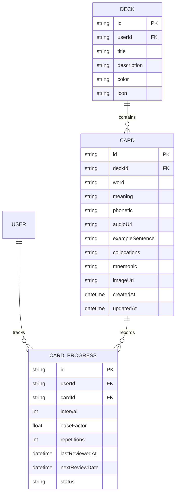

# Domain Model: Contextual Card Creation (US-CARD-01)

## 1. RBAC Matrix

| Role                     | Create Card                    | View Cards in Deck                   | Edit Card                      | Delete Card                    |
| :----------------------- | :----------------------------- | :----------------------------------- | :----------------------------- | :----------------------------- |
| **Guest / Anonymous**    | ❌ (401 Unauthorized)          | ❌ (Requires Auth)                   | ❌ (401 Unauthorized)          | ❌ (401 Unauthorized)          |
| **Learner (Deck Owner)** | ✅ (`deck.userId === user.id`) | ✅ (`deck.userId === user.id`)       | ✅ (`deck.userId === user.id`) | ✅ (`deck.userId === user.id`) |
| **Learner (Non-Owner)**  | ❌ (403 Forbidden / 404)       | ❌ (Private) / ✅ (If Deck IsPublic) | ❌ (403 Forbidden)             | ❌ (403 Forbidden)             |

**Ownership Rule**: A user can only perform CUD operations on cards within decks they own. Creating a card in a deck belonging to another user results in `404 Not Found` (or `403 Forbidden`).

---

## 2. State Machine & Lifecycle

---

## 3. Business Rules & Algorithms

- **BR-CARD-001 (Field Requiredness & Length)**:
  - `word`: Required, String, `1 <= length <= 100`, trimmed of leading/trailing whitespace.
  - `meaning`: Required, String, `1 <= length <= 500`, trimmed.
  - `phonetic`: Optional, String, max 100 chars.
  - `audioUrl`: Optional, Valid URL string or empty, max 500 chars.
  - `exampleSentence`: Optional, String, max 1000 chars.
  - `collocations`: Optional, String, max 500 chars.
  - `mnemonic`: Optional, String, max 1000 chars.
  - `imageUrl`: Optional, Valid URL string or empty, max 500 chars.

- **BR-CARD-002 (Deck Association & Ownership)**:
  - Card must belong to a valid `deckId`. The API verifies that `deck.userId === authenticatedUser.id`.

- **BR-CARD-003 (Automatic UserCardProgress Initialization)**:
  - Upon successful creation of a `Card`, the backend MUST atomically (within transaction) create a `UserCardProgress` record with:
    - `userId = authenticatedUser.id`
    - `cardId = card.id`
    - `status = "NEW"`
    - `interval = 0`
    - `easeFactor = 2.5`
    - `repetitions = 0`
    - `nextReviewDate = CURRENT_TIMESTAMP`

- **BR-CARD-004 (Duplicate Word Soft Warning)**:
  - Frontend checks if `word.trim().toLowerCase()` exists in current deck's card list.
  - If match is found, show informational badge: _"Từ này đã có trong bộ từ"_.
  - User can proceed without blocking.

- **BR-CARD-005 (Audio Pronunciation Fallback)**:
  - If `audioUrl` is valid, audio is streamed via HTML5 Audio element.
  - If `audioUrl` is not provided or fails to load, client synthesizes pronunciation via Web Speech API (`window.speechSynthesis.speak(new SpeechSynthesisUtterance(word))`, voice `en-US` / `en-GB`).

- **BR-CARD-006 (Cascade Deletion)**:
  - Deleting a Card removes associated `UserCardProgress` via database foreign key `ON DELETE CASCADE`.

---

## 4. Workflows & Edge Cases

### Happy Path: Fast Card Addition

1. User navigates to `/decks/:id` (Deck Detail Page).
2. User clicks **"Thêm thẻ mới" (+ Add Card)** button.
3. `AddCardModal` opens with focus on `word` input.
4. User enters word, meaning, and optional rich fields (IPA, example sentence, mnemonic).
5. Live Preview updates in real-time. User clicks 🔊 to test pronunciation.
6. User clicks **"Lưu & Thêm từ tiếp" (Save & Add Another)**.
7. Card is persisted to DB; toast notification _"Đã thêm thẻ thành công"_; form resets to blank with focus returned to `word` input; deck card counter increments.
8. User inputs next card or closes modal.

### Edge Cases

- **EC-01 (Offline / Network Interruption)**: Form state is retained in React state; error banner shown with Retry button; no data is lost.
- **EC-02 (Duplicate Rapid Submissions)**: "Save" button is disabled and displays a spinner during request processing to prevent double creation.
- **EC-03 (Web Speech Unsupported)**: In rare browsers where `window.speechSynthesis` is unavailable, audio button gracefully shows a tooltip _"Trình duyệt không hỗ trợ phát âm tự động"_.

---

## 5. Entity Relationship & Schema

---

## 6. UX & Non-Functional Requirements

- **Performance**: API P95 latency < 150ms; modal opens in < 50ms.
- **Accessibility**: Modal traps focus, supports `Escape` to close, `Enter` / `Ctrl+Enter` to submit; ARIA labels on audio buttons (`aria-label="Phát âm từ vựng"`).
- **Design & Aesthetics**: Cosmic dark palette (#0A0D14 background, Indigo/Violet accents, glassmorphism preview card with 3D flip animation).
