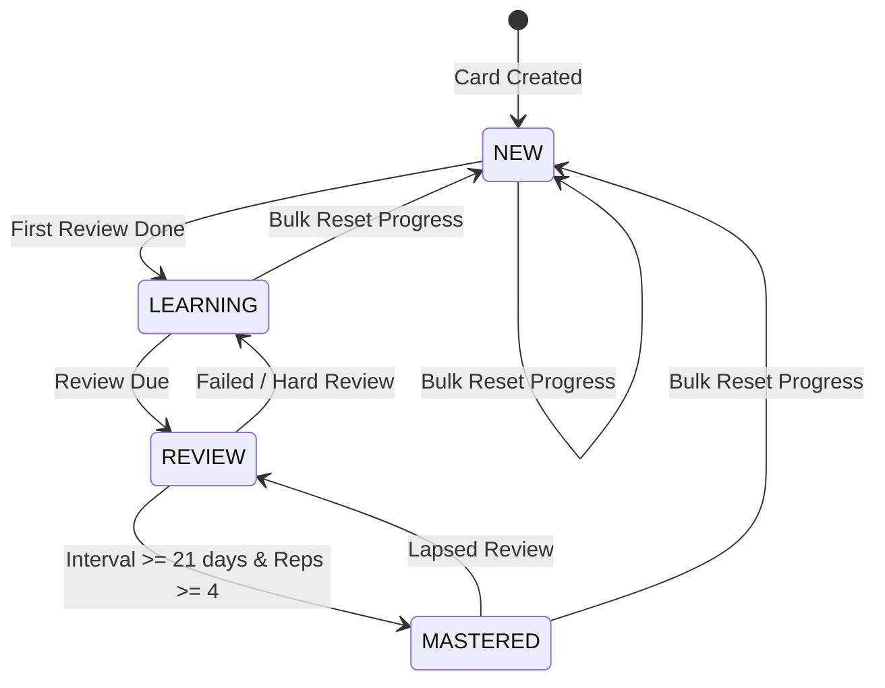
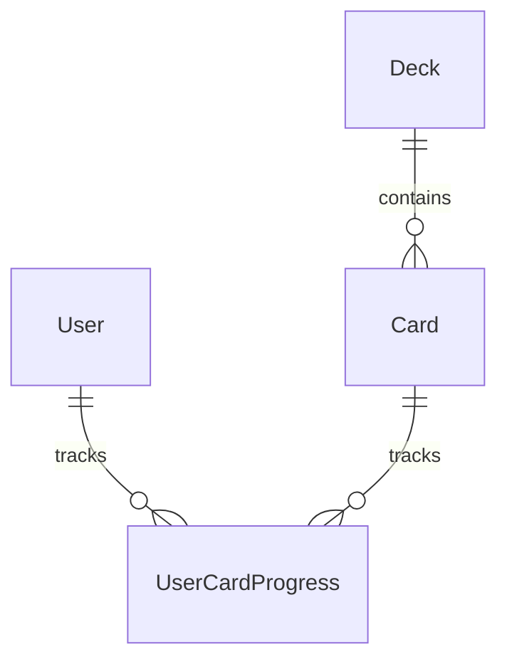

# Domain Model: Card List Management & Search/Filter (US-CARD-02)

## 1. RBAC Matrix

| Role                            |    View Deck Cards     |    Search & Filter     |      Bulk Delete      |         Bulk Move         |  Bulk Reset Progress   |
| :------------------------------ | :--------------------: | :--------------------: | :-------------------: | :-----------------------: | :--------------------: |
| **Deck Owner (Learner)**        |       ✅ Allowed       |       ✅ Allowed       | ✅ Allowed (Own deck) | ✅ Allowed (To own decks) | ✅ Allowed (Own cards) |
| **Other Authenticated Learner** | ✅ Allowed (if Public) | ✅ Allowed (if Public) |  ❌ Forbidden (403)   |    ❌ Forbidden (403)     |   ❌ Forbidden (403)   |
| **Guest / Unauthenticated**     |  ❌ (Protected route)  |           ❌           |          ❌           |            ❌             |           ❌           |

## 2. State Machine & Lifecycle (UserCardProgress)

## 3. Business Rules & Algorithms

- **BR-CARD-001 (Server-side Pagination & Query Parameters)**:
  - Query parameters for `GET /api/v1/decks/:deckId/cards`:
    - `page`: positive integer, default `1`.
    - `limit`: positive integer, default `20` (max `100`).
    - `search`: string (optional, trim whitespace). Case-insensitive search on `word`, `meaning`, `exampleSentence`.
    - `status`: enum `['ALL', 'NEW', 'LEARNING', 'MASTERED']`, default `'ALL'`.
  - Response metadata includes `{ data: CardResponse[], meta: { total, page, limit, totalPages, hasNextPage, hasPrevPage } }`.

- **BR-CARD-002 (Bulk Actions Transactionality & Validation)**:
  - `POST /api/v1/decks/:deckId/cards/bulk-action`:
    - Payload: `{ action: 'DELETE' | 'MOVE' | 'RESET_PROGRESS', cardIds: string[], targetDeckId?: string }`.
    - `cardIds` must not be empty and size $\le 100$.
    - For `MOVE`: `targetDeckId` is required, must exist and be owned by the same user.
    - All operations execute inside an ACID transaction (`tx`).
    - `DELETE` cascade removes `UserCardProgress` records.
    - `MOVE` updates `card.deckId` while preserving `UserCardProgress`.
    - `RESET_PROGRESS` updates `UserCardProgress` to `status = 'NEW'`, `interval = 0`, `repetitions = 0`, `easeFactor = 2.5`, `nextReviewDate = now()`.

- **BR-CARD-003 (View Mode Persistence)**:
  - View preference (Grid vs Table) stored in client `localStorage` under key `wordstreak_deck_view_mode`.

## 4. Workflows & Edge Cases

1. **Happy Path — Search & Status Filter**:
   - User types keyword or selects "Learning" status chip -> Request sent to backend with debounce (300ms) -> Backend returns paginated matched cards + pagination metadata -> UI renders cards in selected view mode (Grid or Table).
2. **Happy Path — Bulk Move/Delete/Reset**:
   - User checks multiple cards (or "Select All on Page") -> Clicks Bulk Action -> Modal confirms action -> Backend processes batch in single transaction -> UI refreshes list and updates deck stats badge.
3. **Edge Case — Empty Search/Filter Result**:
   - Distinct empty state indicating no results matched criteria, with a 1-click "Clear Filters" button.
4. **Edge Case — Concurrency & Deletion**:
   - If a card was already deleted when executing bulk move/delete, transaction verifies existing IDs and ignores already missing records without crashing.

## 5. Entities, Data Boundaries & Privacy

- Deletion Policy: Hard delete on Card with cascade to `UserCardProgress`.

## 6. UX States & Non-Functional Requirements

- **UX States**:
  - Skeleton loading placeholders matching Grid and Table layouts.
  - Sticky selection action bar when $\ge 1$ cards are selected.
  - Toast notification upon successful bulk action.
- **Accessibility**: Keyboard navigable table rows, ARIA attributes on view switcher and selection checkboxes.
- **Performance**: Database indexed on `Card(deckId, word)` and `UserCardProgress(userId, status)`.
