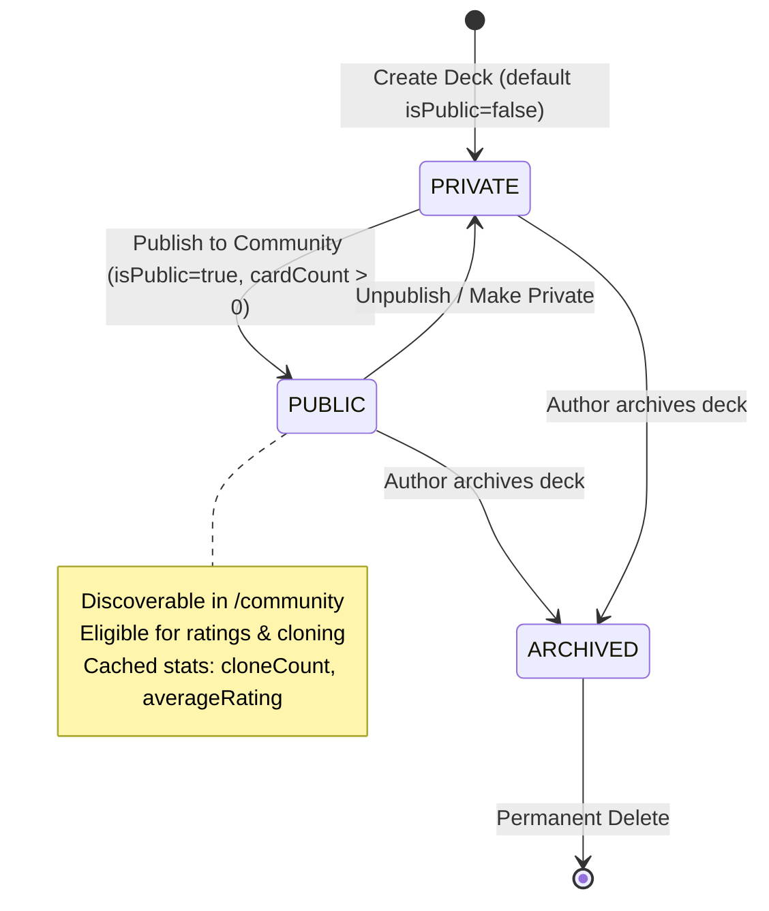
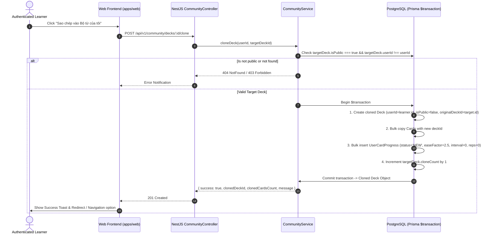
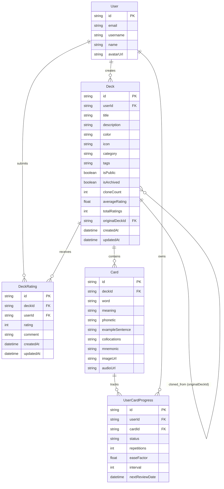

# Domain Model: Community Decks Marketplace (US-ECO-02)

- **Date**: 2026-08-22
- **Feature Slug**: `community-decks`
- **User Story**: `US-ECO-02: Chia sẻ Bộ từ vựng cộng đồng (Community Decks Marketplace)`
- **Status**: COMPLETED

---

## 1. Actor & RBAC Matrix

| Role                      | Browse Marketplace |   Preview Cards   |      Clone Deck       |       Rate / Review Deck       |     Edit / Delete Deck     |
| :------------------------ | :----------------: | :---------------: | :-------------------: | :----------------------------: | :------------------------: |
| **Guest / Anonymous**     |       ✅ Yes       | ✅ First 10 cards |   ❌ Requires Login   |       ❌ Requires Login        |         ❌ Blocked         |
| **Authenticated Learner** |       ✅ Yes       |   ✅ All cards    | ✅ 1-Click Deep Copy  | ✅ Allowed (if cloned/studied) |         ❌ Blocked         |
| **Deck Author / Owner**   |       ✅ Yes       |   ✅ All cards    | ❌ Self-clone blocked |      ❌ Self-rate blocked      |      ✅ Full Control       |
| **System Admin**          |       ✅ Yes       |   ✅ All cards    |      ✅ Allowed       |  ✅ Moderate / Delete Review   | ✅ Archive / Remove Public |

---

## 2. State Machines & Entity Lifecycles

### 2.1. Community Deck Visibility State Machine

### 2.2. 1-Click Clone Lifecycle

---

## 3. Numbered Business Rules (`BR-COMM-###`)

- **`BR-COMM-001` (Marketplace Eligibility)**: A deck is eligible to appear in the Community Marketplace if and only if:
  1. `deck.isPublic === true`
  2. `deck.isArchived === false`
  3. Total cards in deck $\ge 1$.
- **`BR-COMM-002` (Deep Copy Isolation)**: When a deck is cloned:
  1. A new `Deck` is created with `userId = learner.id`, `isPublic = false`, `originalDeckId = sourceDeck.id`.
  2. All `Card` entities are duplicated with new UUIDs and mapped to the new `deckId`.
  3. `UserCardProgress` records are created for all cloned cards with initial SM-2 defaults: `status = 'NEW'`, `easeFactor = 2.5`, `interval = 0`, `repetitions = 0`, `nextReviewDate = now()`.
  4. Modifications in the cloned deck have zero effect on the original deck or other clones.
- **`BR-COMM-003` (Anti-Abuse: Self-Cloning & Self-Rating)**:
  1. A user cannot clone their own deck (`userId !== sourceDeck.userId`). Attempting self-clone returns `400 Bad Request`.
  2. A user cannot rate their own deck (`userId !== sourceDeck.userId`). Attempting self-rate returns `403 Forbidden`.
- **`BR-COMM-004` (Rating Eligibility & Uniqueness)**:
  1. A user may rate a deck only if they have cloned the deck or completed at least 1 study/quiz session on that deck (`UserCardProgress.count > 0` or `originalDeckId === sourceDeck.id`).
  2. Rating is on a discrete scale of $1 \le \text{rating} \le 5$ (integer stars).
  3. Exactly 1 rating record per `(deckId, userId)` pair. Submitting a new rating updates the existing record (upsert semantics).
  4. Optional text comment max length is 500 characters.
- **`BR-COMM-005` (Atomic Rating Denormalization)**:
  Upon any `DeckRating` creation, update, or deletion:
  $$\text{averageRating} = \frac{\sum_{i=1}^{N} \text{rating}_i}{N}, \quad \text{totalRatings} = N$$
  Calculated and stored directly on `Deck.averageRating` (rounded to 1 decimal place) and `Deck.totalRatings` within the rating transaction.
- **`BR-COMM-006` (Marketplace Sorting & Query Optimization)**:
  Marketplace query supports 3 standard sorts:
  - `POPULAR`: Order by `cloneCount DESC, totalRatings DESC, createdAt DESC`.
  - `TOP_RATED`: Order by `averageRating DESC, totalRatings DESC, cloneCount DESC`.
  - `NEWEST`: Order by `createdAt DESC`.
- **`BR-COMM-007` (Public Projection Privacy)**:
  Endpoints returning deck creator info MUST ONLY expose safe public fields (`id`, `name`, `username`, `avatarUrl`). Sensitive fields (`email`, `passwordHash`, `role`, `dailyGoal`, `settings`) MUST NEVER be returned.
- **`BR-COMM-008` (Clone Rate-Limiting)**:
  A single user is rate-limited to a maximum of 5 clone operations per minute to prevent database bloat and bot scraping.

---

## 4. Entity Relationship Diagram (ERD)

---

## 5. Non-Functional Requirements (NFRs)

- **Performance**:
  - Marketplace list response time P95 < 80ms for catalog queries up to 10,000 decks.
  - Clone execution time P95 < 400ms for decks containing up to 300 cards.
- **Security & A11y**:
  - All public search inputs sanitized against SQL / NoSQL / XSS injection.
  - WCAG 2.1 AA compliant color contrasts on rating badges, category tags, and clone action buttons.
  - Keyboard navigation support (`Tab`, `Enter`, `Escape`) for modal previews and star rating selections.
