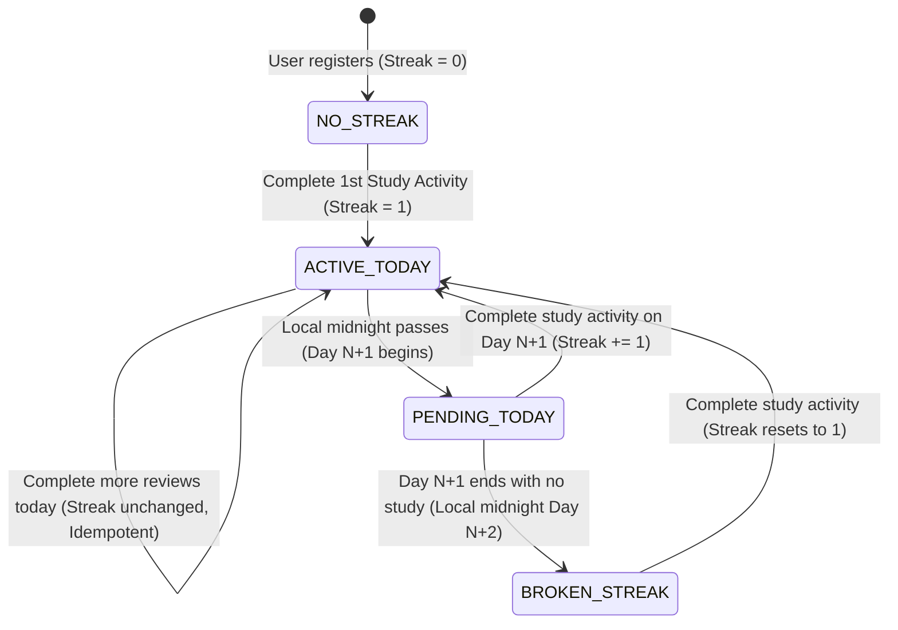

# Domain Model: Daily Streak Engine (US-GAME-01)

- **Feature**: Daily Streak Engine & Timezone Logic
- **Date**: 2026-08-20
- **Status**: COMPLETE

---

## 1. Role-Based Access Control (RBAC)

| Role                      |   View Own Streak   | Record Streak Activity | View Others' Streak | Reset/Manage Streaks |
| :------------------------ | :-----------------: | :--------------------: | :-----------------: | :------------------: |
| **Guest / Anonymous**     | ❌ (Login required) |           ❌           |         ❌          |          ❌          |
| **Authenticated Learner** |         ✅          | ✅ (Own account only)  | ❌ (Private in v1)  |          ❌          |
| **System Admin / Cron**   |         ✅          |           ✅           |         ✅          |          ✅          |

---

## 2. State Machine & Streak Lifecycle



---

## 3. Business Rules & Formulas

- `BR-STREAK-001` (**Qualifying Activity Trigger**):
  - A qualifying activity is logged when:
    - User submits a flashcard rating via SRS review (`POST /api/v1/reviews/submit`).
    - User finishes a multiple-choice or fill-in-the-blank quiz.
    - Explicit activity sync via `POST /api/v1/streaks/record-activity`.
- `BR-STREAK-002` (**Timezone Calendar Day Calculation**):
  - The calendar day string $D(t, tz) = \text{"YYYY-MM-DD"}$ is extracted for timestamp $t$ using the IANA timezone $tz$ (e.g. `'Asia/Ho_Chi_Minh'`, `'America/New_York'`).
  - If $tz$ is invalid or missing, fallback to `'UTC'`.
  - Let $D_{today} = D(now, tz)$ and $D_{yesterday} = D(now - 86400000, tz)$.
- `BR-STREAK-003` (**Streak Increment Algorithm**):
  - Let $D_{last} = lastActiveDate ? D(lastActiveDate, tz) : \text{null}$.
  - **Case 1 (Already active today)**:
    If $D_{last} == D_{today}$:
    $\rightarrow currentStreak$ remains unchanged.
    $\rightarrow streakIncreased = false$.
    $\rightarrow message = \text{"Streak already maintained for today"}$.
  - **Case 2 (Consecutive day activity)**:
    If $D_{last} == D_{yesterday}$:
    $\rightarrow currentStreak = currentStreak + 1$.
    $\rightarrow bestStreak = \max(bestStreak, currentStreak)$.
    $\rightarrow lastActiveDate = now$.
    $\rightarrow streakIncreased = true$.
    $\rightarrow message = \text{"Streak increased! Great job!"}$.
  - **Case 3 (Broken or initial streak)**:
    If $D_{last} < D_{yesterday} \lor D_{last} == \text{null}$:
    $\rightarrow currentStreak = 1$.
    $\rightarrow bestStreak = \max(bestStreak, 1)$.
    $\rightarrow lastActiveDate = now$.
    $\rightarrow streakIncreased = true$.
    $\rightarrow message = \text{"New streak started!"}$.
- `BR-STREAK-004` (**Lazy Status Calculation on Read**):
  - When querying `GET /api/v1/streaks/me`:
    - If $D_{last} < D_{yesterday}$ (user missed at least one full calendar day):
      - `isStreakAtRisk`: true (if $D_{last} == D_{yesterday}$, pending for today)
      - If $D_{last} < D_{yesterday}$, `currentStreak` is reported as `0` in the live view (broken), although database is updated lazily on next write.
    - `isActiveToday`: $(D_{last} === D_{today})$.
- `BR-STREAK-005` (**Anti-Abuse & Clock Drift Policy**):
  - Incoming request timestamps cannot exceed server clock $+5\text{ minutes}$.
  - Maximum 1 streak increment per 4-hour window regardless of timezone adjustments to prevent rapid timezone-hopping abuse.
- `BR-STREAK-006` (**Mascot Tier Progression**):
  - Tier 1: $1 \le Streak \le 6$ (Baby Flame / Spark)
  - Tier 2: $7 \le Streak \le 13$ (Ember Flame)
  - Tier 3: $14 \le Streak \le 29$ (Radiant Inferno)
  - Tier 4: $Streak \ge 30$ (Cosmic Violet Nova)
- `BR-STREAK-007` (**Celebration Modal Trigger**):
  - Whenever an API response returns `streakIncreased: true`, client renders the `StreakCelebrationModal` with confetti and flame rank animation.

---

## 4. Shared DTO Contracts

```typescript
export interface UserStreakDto {
  userId: string;
  currentStreak: number;
  bestStreak: number;
  lastActiveDate: string | null; // ISO string
  isActiveToday: boolean;
  isPendingToday: boolean;
  timezone: string;
  flameTier: 1 | 2 | 3 | 4;
}

export interface RecordStreakActivityDto {
  timezone?: string;
}

export interface StreakActivityResponseDto {
  currentStreak: number;
  bestStreak: number;
  streakIncreased: boolean;
  isActiveToday: boolean;
  flameTier: 1 | 2 | 3 | 4;
  message: string;
}
```

---

## 5. Non-Functional Requirements (NFR)

- **Execution Latency**: Streak evaluation overhead $\le 10\text{ms}$ per request.
- **Idempotency**: Executing `recordActivity` 100 times in the same day results in exactly 1 streak increment.
- **Anti-AI-Slop Visual Standards**: Purple flame `#9333ea`, hairline borders `#e5e5e5`, Obsidian pills, stable outer hover anchors.
