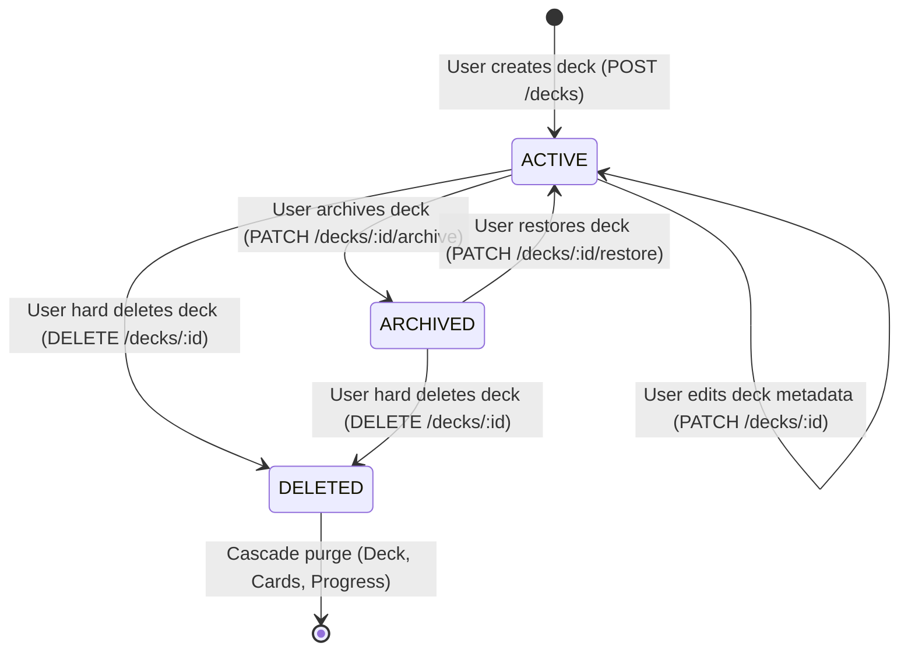
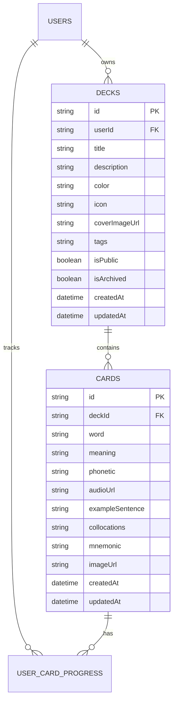

# Domain Model: Deck CRUD & Management (US-DECK-01)

- **Feature**: Deck CRUD & Management
- **Protocol**: Bounded Task
- **Date**: 2026-08-19

## 1. RBAC Matrix

| Role                        | Create Deck | View Own Decks |  View Public Decks  |  Edit Own Deck  | Archive/Restore Own Deck | Delete Own Deck | Access Others' Private Deck |
| --------------------------- | :---------: | :------------: | :-----------------: | :-------------: | :----------------------: | :-------------: | :-------------------------: |
| **Guest (Unauthenticated)** |     ❌      |       ❌       | ❌ (Redirect Login) |       ❌        |            ❌            |       ❌        |             ❌              |
| **Learner (Authenticated)** |     ✅      |       ✅       |         ✅          |       ✅        |            ✅            |       ✅        |     ❌ (403 Forbidden)      |
| **System Admin**            |     ✅      |       ✅       |         ✅          | ✅ (Audit only) |     ✅ (Audit only)      | ✅ (Audit only) |   ❌ (Subject to privacy)   |

- **Ownership Policy**: Mọi thao tác ghi (`UPDATE`, `ARCHIVE`, `RESTORE`, `DELETE`) bắt buộc kiểm tra `deck.userId === currentUserId`. Trả về `404 Not Found` hoặc `403 Forbidden` nếu vi phạm.

---

## 2. State Machine & Lifecycle

| Current State         | Event / Trigger | Target State | Description & Side Effects                                                    |
| --------------------- | --------------- | ------------ | ----------------------------------------------------------------------------- |
| _(None)_              | `CREATE_DECK`   | `ACTIVE`     | Khởi tạo Deck với `isArchived = false`. Sẵn sàng thêm Card.                   |
| `ACTIVE`              | `UPDATE_DECK`   | `ACTIVE`     | Cập nhật thông tin (tiêu đề, mô tả, màu sắc, icon, ảnh bìa, isPublic).        |
| `ACTIVE`              | `ARCHIVE_DECK`  | `ARCHIVED`   | Đặt `isArchived = true`. Ẩn khỏi danh sách học chủ động và due reviews.       |
| `ARCHIVED`            | `RESTORE_DECK`  | `ACTIVE`     | Đặt `isArchived = false`. Khôi phục lại hàng đợi học tập bình thường.         |
| `ACTIVE` / `ARCHIVED` | `DELETE_DECK`   | `DELETED`    | Xóa vĩnh viễn khỏi Database cùng toàn bộ Cards và UserCardProgress liên quan. |

---

## 3. Business Rules & Validations

- **BR-DECK-001 (Title Validation)**: Tiêu đề Deck bắt buộc phải có, độ dài từ 1 đến 100 ký tự sau khi `trim()`. Không chứa mã độc HTML/Script.
- **BR-DECK-002 (Description Validation)**: Mô tả Deck là tùy chọn (optional), độ dài tối đa 500 ký tự sau khi `trim()`.
- **BR-DECK-003 (Visual Customization Validation)**:
  - Trường `color`: Chuỗi Hex hợp lệ (định dạng `^#(?:[0-9a-fA-F]{3}){1,2}$`) hoặc mã màu từ Preset Palette Cosmos (mặc định: `#6366F1` - Indigo).
  - Trường `icon`: Tên định danh icon hợp lệ (từ danh sách Preset Lucide Icons, mặc định: `Book`).
  - Trường `coverImageUrl`: Phải là URL hợp lệ (`http://` hoặc `https://`) hoặc `null`.
- **BR-DECK-004 (Archive & Active Separation)**:
  - Khi truy vấn `GET /api/v1/decks`, tham số `status=active` (mặc định) chỉ trả về các Deck có `isArchived = false`.
  - Tham số `status=archived` chỉ trả về các Deck có `isArchived = true`.
  - Tham số `status=all` trả về tất cả.
- **BR-DECK-005 (Cascade Deletion Guarantee)**:
  - Khi thực hiện Hard Delete một Deck, hệ thống phải xóa bản ghi `Deck` và tự động kích hoạt xóa Cascade tất cả `Card` thuộc Deck đó, đồng thời xóa mọi `UserCardProgress` liên quan trong 1 transaction an toàn.
- **BR-DECK-006 (Summary Statistics Calculation)**:
  - Mỗi bản ghi Deck khi trả về cho Client phải kèm đối tượng thống kê `stats`:
    - `totalCards`: Tổng số thẻ từ vựng trong Deck.
    - `newCards`: Số thẻ có trạng thái `NEW` hoặc chưa có progress.
    - `learningCards`: Số thẻ đang trong quá trình học (`interval > 0` và chưa đạt tiêu chuẩn mastered).
    - `masteredCards`: Số thẻ đã thuần thục (`interval >= 21` hoặc `repetitions >= 5`).
    - `dueCards`: Số thẻ đến hạn ôn tập hôm nay (`nextReviewDate <= CURRENT_TIMESTAMP`).

---

## 4. Workflows & Edge Cases

### 4.1 Happy Path: Tạo và quản lý Deck

1. Người dùng bấm nút **"+ Tạo Bộ Từ Mới"** trên trang `/decks`.
2. Modal mở ra, người dùng nhập Tiêu đề, Mô tả, chọn Màu sắc & Icon (hoặc custom hex/cover image), chọn trạng thái riêng tư.
3. Bấm **"Lưu bộ từ"** -> Gửi `POST /api/v1/decks`.
4. Backend xác thực DTO, tạo bản ghi Deck trong DB, trả về thông tin kèm `stats` ban đầu (0 cards).
5. Frontend cập nhật ngay vào danh sách Decks (Optimistic UI / Toast thành công).

### 4.2 Edge Cases & Resilience

- **EC-DECK-001 (Duplicate Deck Name)**: Cho phép tạo 2 deck cùng tên nếu user muốn phân biệt bằng tags/icon, nhưng hiển thị gợi ý nếu trùng 100% để tránh nhầm lẫn.
- **EC-DECK-002 (Xóa Deck có nhiều từ vựng)**: Khi bấm Xóa Deck, Modal hiển thị cảnh báo đỏ nổi bật: _"Bộ từ này đang có X từ vựng và toàn bộ tiến độ ôn tập sẽ bị xóa vĩnh viễn"_. Yêu cầu người dùng bấm nút xác nhận nguy hiểm.
- **EC-DECK-003 (Lỗi tải ảnh Cover tùy chỉnh)**: Nếu `coverImageUrl` bị lỗi 404 hoặc mạng chặn, UI tự động fallback về Gradient nền theo trường `color` và hiển thị `icon` trung tâm.
- **EC-DECK-004 (Phân trang và Tìm kiếm rỗng)**: Khi tìm kiếm không có kết quả, hiển thị Empty State minh họa trực quan kèm nút _"Xóa bộ lọc"_.

---

## 5. Entities, Data Boundaries & Privacy

- **Prisma Schema Diff (Additive)**:
  - Bổ sung vào model `Deck`:
    - `color`: `String @default("#6366F1")`
    - `icon`: `String @default("Book")`
    - `coverImageUrl`: `String?`
    - `tags`: `String?` (Lưu dưới dạng mảng JSON chuỗi hoặc chuỗi phân tách bằng dấu phẩy)
    - `isArchived`: `Boolean @default(false)`
  - Thêm index `@@index([userId, isArchived])` để tối ưu hóa truy vấn danh sách.

---

## 6. UX States & Non-Functional Requirements

- **UX States**:
  - **Empty State**: Khi người dùng chưa có Deck nào -> Hiển thị Hero Card mời gọi _"Bắt đầu hành trình bằng việc tạo bộ từ vựng đầu tiên!"_ kèm nút Action nhanh và template gợi ý (IELTS, Daily English).
  - **Loading State**: Skeleton card loading cho danh sách Decks (tránh giật layout).
  - **Error State**: Toast thông báo lỗi cụ thể khi mất kết nối hoặc dữ liệu không hợp lệ.
- **Performance**:
  - P95 query response time < 150ms cho `GET /api/v1/decks` (kết hợp Prisma `_count` và quan hệ aggregation tối ưu).
- **Accessibility**:
  - Tuân thủ WCAG 2.1 AA: Độ tương phản màu sắc đạt chuẩn, hỗ trợ điều hướng bàn phím (Tab, Enter, Escape để đóng modal), `aria-label` cho các icon button.
