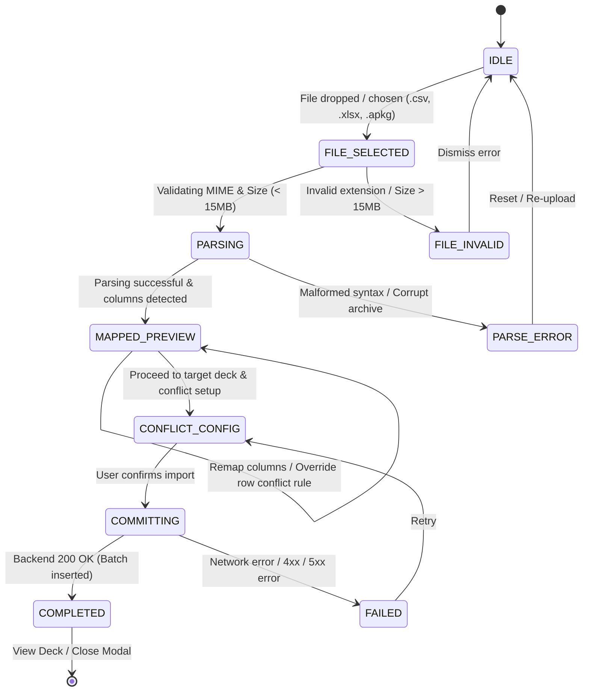
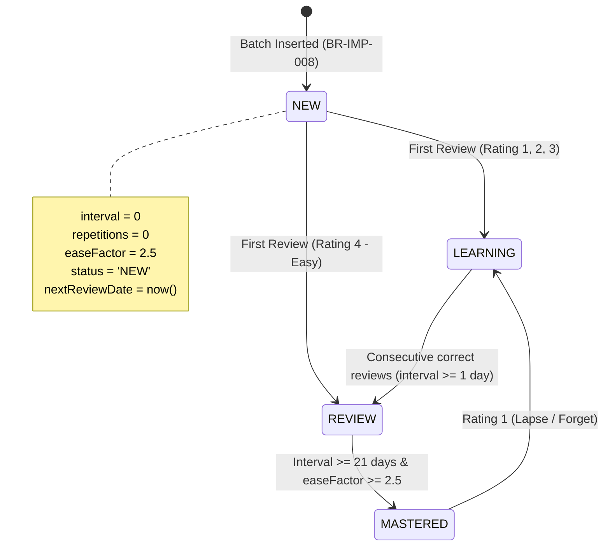
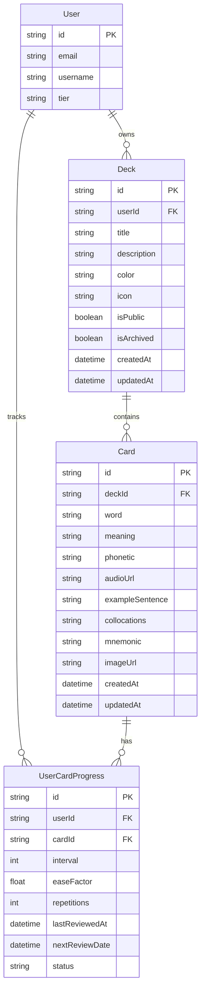

# Domain Model: Deck Import/Export (CSV, Excel & Anki .apkg)

- **Date**: 2026-08-21
- **Feature Slug**: `deck-import-export`
- **Target Release**: Sprint 6 (EPIC-09: US-ECO-01)
- **Status**: COMPLETED

---

## 1. RBAC Matrix

| Role                  | Import to Owned Deck | Import as New Deck | Export Owned Deck |  Export Public Deck  | Export Others' Private Deck | Rate Limit Tier                      |
| :-------------------- | :------------------: | :----------------: | :---------------: | :------------------: | :-------------------------: | :----------------------------------- |
| **Guest / Anonymous** |      ❌ Blocked      |     ❌ Blocked     |    ❌ Blocked     |      ❌ Blocked      |         ❌ Blocked          | N/A (Requires Login)                 |
| **Learner (Free)**    |       ✅ Full        |      ✅ Full       |      ✅ Full      | ✅ Card Content Only |     ❌ Forbidden (403)      | 5 imports/min, max 5,000 cards/day   |
| **Pro Subscriber**    |       ✅ Full        |      ✅ Full       |      ✅ Full      | ✅ Card Content Only |     ❌ Forbidden (403)      | 10 imports/min, max 20,000 cards/day |
| **Content Creator**   |       ✅ Full        |      ✅ Full       |      ✅ Full      | ✅ Card Content Only |     ❌ Forbidden (403)      | 10 imports/min, max 20,000 cards/day |
| **System Admin**      |       ✅ Full        |      ✅ Full       |      ✅ Full      |       ✅ Full        |    ✅ Full (Audit/Debug)    | Unlimited                            |

### Ownership & Privacy Rules

- Users have full read/write/import/export permissions over their own created decks (`userId === session.userId`).
- Public community decks (`isPublic === true`) can be exported by any authenticated user for personal offline study. The exported file includes deck metadata and card contents, but **never** includes the original author's private `UserCardProgress` study history.
- Private decks owned by other users (`isPublic === false` and `userId !== session.userId`) return HTTP 403 Forbidden on import and export attempts.

---

## 2. State Machine & Entity Lifecycle

### 2.1 Import Client Wizard Lifecycle

### 2.2 Imported Card Progress Lifecycle

---

## 3. Business Rules & Algorithms

### **BR-IMP-001: Mandatory Field Validation**

- Every card must have a non-empty `word` (1 to 200 characters after whitespace trimming) and `meaning` (1 to 2,000 characters after whitespace trimming).
- Optional fields supported: `phonetic` (max 100 chars), `exampleSentence` (max 2,000 chars), `collocations` (max 1,000 chars), `mnemonic` (max 1,000 chars), `imageUrl` (valid URI or null, max 500 chars), `audioUrl` (valid URI or null, max 500 chars).
- Rows with missing or empty `word` / `meaning` are marked `INVALID` in the preview table and blocked from database submission.

### **BR-IMP-002: Batch Limit & Payload Boundaries**

- Maximum cards per single import batch: **2,000 cards**.
- Maximum file upload size: **15 MB**.
- If an uploaded file exceeds 2,000 valid rows, the preview wizard alerts the user and stages the first 2,000 rows, offering a notice to split larger files.

### **BR-IMP-003: Duplicate Detection Algorithm**

- A card is identified as a duplicate if `normalize(incoming.word) === normalize(existing.word)` within the target deck.
- Normalization algorithm:
  $$\text{normalize}(w) = \text{trim}(\text{toLower}(\text{normalizeNFC}(w)))$$
- Duplicate detection is pre-calculated during the client preview step by comparing parsed rows against the target deck's current card index, as well as checking intra-file duplicates.

### **BR-IMP-004: Duplicate Conflict Resolution Strategies**

1. **`SKIP` (Default)**: Ignore the incoming duplicate row; existing card remains untouched.
2. **`OVERWRITE`**: Update existing card attributes (`meaning`, `phonetic`, `exampleSentence`, `collocations`, `mnemonic`, `imageUrl`, `audioUrl`) with new values, while preserving the existing card's `id`, `deckId`, `createdAt`, and `UserCardProgress` learning history.
3. **`KEEP_BOTH`**: Insert a new card entity with the duplicate word, generating a distinct UUID and independent `UserCardProgress`.

- The user can select a global default and toggle individual row rules in the interactive preview table.

### **BR-IMP-005: CSV/Excel Delimiter & Encoding Standard**

- Supports UTF-8 encoding with or without Byte Order Mark (BOM: `\uFEFF`).
- Auto-detects column delimiters: Comma (`,`), Semicolon (`;`), Tab (`\t`), Pipe (`|`).
- Handles quoted multiline cells containing embedded commas, line breaks (`\r\n`, `\n`), and escaped quotes (`""`).
- Guarantees 100% preservation of Vietnamese diacritics (e.g. `Tiếng Việt`, `Học từ vựng`).

### **BR-IMP-006: Anki `.apkg` Extraction & HTML Stripping**

- Decompresses the `.apkg` ZIP container in-memory.
- Queries SQLite database (`collection.anki2` / `collection.anki21`) `notes` and `cards` tables.
- Extracts note fields delimited by `\x1f` (unit separator).
- Sanitizes and strips HTML formatting:
  - ` `, ` `, `
`, `
` converted to newline `\n`.
  - `<b>`, `<strong>`, `<i>`, `<em>`, `<u>` converted to Markdown equivalents (`**`, `*`, `_`).
  - Strip `<script>`, `<style>`, `<iframe>`, and Anki cloze syntax `{{c1::...}}` converted to plain text target.

### **BR-IMP-007: CSV Formula Injection (CWE-1236) Defense**

- **On Export**: Any cell whose string value starts with formula trigger characters (`=`, `+`, `-`, `@`, `\t`, `\r`) must be escaped by prepending a single quote `'`.
- **On Import**: Formula trigger characters at the beginning of fields are sanitized or stripped to prevent downstream client exploitation.

### **BR-IMP-008: SM-2 Spaced Repetition Progress Initialization**

- Every newly created card during import automatically initializes a corresponding `UserCardProgress` record with:
  - `status = 'NEW'`
  - `repetitions = 0`
  - `interval = 0`
  - `easeFactor = 2.5`
  - `nextReviewDate = DateTime.now()`
  - `lastReviewedAt = null`

### **BR-IMP-009: Atomic Batch Transaction**

- The backend endpoint `POST /api/v1/decks/:deckId/cards/bulk` executes all insertions, overwrites, and `UserCardProgress` initializations within a single Prisma interactive `$transaction`.
- If an unhandled database error occurs, all modifications in the batch roll back completely, ensuring zero partial deck corruption.

### **BR-IMP-010: Rate Limiting & Anti-Abuse**

- Burst limit: Max 5 batch import requests per minute per IP/User ID.
- Daily quota: Max 5,000 cards imported per day for Free tier; 20,000 cards per day for Pro tier.

---

## 4. Workflows & Edge Cases

### 4.1 Happy Path Workflow

1. User clicks **"Import Cards"** in Deck Detail page or Deck Management toolbar.
2. `DeckImportModal` opens on Step 1 (Upload). User drags a CSV, XLSX, or APKG file into the dropzone.
3. Client instantly parses the file in < 500ms, detects columns, and advances to Step 2 (Mapping & Preview).
4. System auto-maps detected columns (e.g. `Front` -> `word`, `Back` -> `meaning`). User reviews first 5 rows and verifies total row count.
5. User navigates to Step 3 (Target & Conflict), selects target deck (or opts to create a new deck), and selects duplicate strategy (`SKIP`).
6. User clicks **"Import X Cards"**. Client sends validated JSON payload to backend.
7. Backend executes atomic `$transaction` in < 1,000ms and returns `{ imported: 150, skipped: 12, overwritten: 0 }`.
8. Wizard shows Step 4 (Summary) with a celebratory success checkmark, summary breakdown, and "Review Deck Now" button.

### 4.2 Edge Cases & Negative Scenarios

| Scenario                       | Detection / Condition                      | Handling & System Behavior                                                                           |
| :----------------------------- | :----------------------------------------- | :--------------------------------------------------------------------------------------------------- |
| **Malformed CSV Syntax**       | Unmatched quotes or invalid row formatting | PapaParse error caught; user alerted with exact row number; offers sample template download.         |
| **Empty File / Zero Cards**    | File has 0 data rows                       | Wizard displays warning: _"No valid flashcard rows found in this file."_ Step 2 disabled.            |
| **Missing Mandatory Column**   | User leaves `meaning` column unmapped      | Step 2 shows red alert: _"Word and Meaning columns are required."_ Proceed button disabled.          |
| **Intra-file Duplicates**      | File contains 'Apple' on row 3 and row 15  | Preview table highlights both rows with warning badge; resolves according to chosen conflict rule.   |
| **Huge Cell Content**          | Meaning text > 2,000 characters            | Truncated to 2,000 chars with an amber warning badge in preview.                                     |
| **Corrupted Anki `.apkg`**     | Missing `collection.anki2` in zip          | Parser catches missing SQLite db; shows friendly message: _"Unsupported or corrupted Anki package."_ |
| **Network Loss during Submit** | Request times out during commit            | Axios retry handler displays error toast; transactional backend guarantees no partial state.         |
| **Formula Injection Payload**  | Cell contains `=cmd\|' /C calc'!A0`        | CWE-1236 sanitizer strips leading `=`; safe plain text stored.                                       |

---

## 5. Entities, Data Boundaries & Privacy

### Data Deletion & Cascade Policy

- Deleting a `Deck` cascades to all child `Card` records and associated `UserCardProgress` records.
- Deleting a single `Card` cascades to its `UserCardProgress` record.
- In-memory temporary file parsing objects are garbage-collected immediately upon modal closure; zero raw files are stored on server disk.

---

## 6. UX States & Non-Functional Requirements

### 6.1 UX States

- **Empty / Initial**: Clean drag-and-drop zone with animated cloud upload icon, accepted file format badges (`.csv`, `.xlsx`, `.apkg`), and "Download Sample Template (.csv)" button.
- **Loading / Processing**: Animated pulsating spinner during file parsing with live row counter (`"Parsed 450 / 1200 rows..."`).
- **Preview & Mapping**:
  - Column dropdowns with auto-match indicators.
  - Interactive table showing 5 preview rows + expandable full list modal.
  - Badges: 🟢 Valid (Green), 🟡 Duplicate (Amber), 🔴 Invalid (Red).
- **Error States**: Inline contextual alerts beneath affected columns or rows with actionable fix suggestions.
- **Completion**: High-contrast summary card with stats breakdown (`Imported`, `Skipped`, `Overwritten`) and primary CTA button to start studying.

### 6.2 Non-Functional Requirements

- **Performance**:
  - P95 Client parsing & preview generation for 1,000 rows < **800ms**.
  - P95 Backend batch `$transaction` commit for 1,000 cards < **1,500ms**.
  - P95 Deck export generation & download trigger for 2,000 cards < **1,000ms**.
- **Security**:
  - OWASP Top 10 compliance: Strict input sanitization against XSS and CSV Formula Injection (CWE-1236).
  - RBAC verification on all deck endpoints ensuring users cannot write to decks they do not own.
- **Internationalization (i18n)**:
  - English and Vietnamese localization for all wizard labels, error messages, and column aliases.
  - Full UTF-8 charset support for all global languages and Vietnamese diacritics.
- **Accessibility (a11y)**:
  - WCAG 2.1 Level AA conformance.
  - Full keyboard navigability (`Tab`, `Enter`, `Escape`, Arrow keys).
  - `aria-live="polite"` announcements on upload progress and validation errors.
- **Observability**:
  - Structured NestJS Winston logger output for bulk operations:
    `{ event: 'DECK_IMPORT_BATCH', userId, deckId, totalCount, importedCount, skippedCount, durationMs }`.
