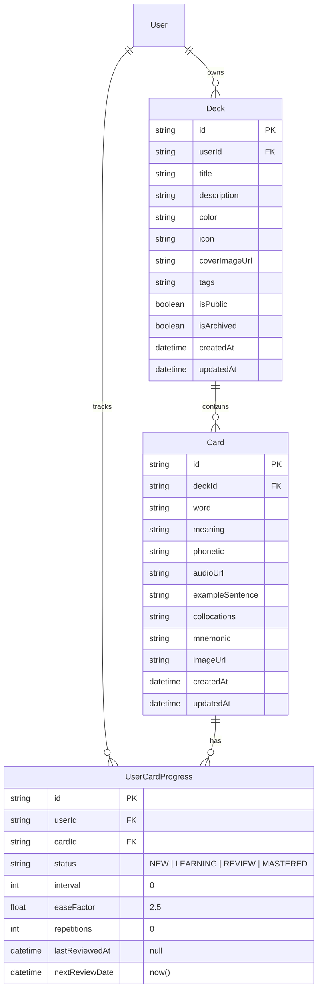

# Data Model: Deck Import & Export (CSV, Excel & Anki .apkg)

**Feature Slug**: `deck-import-export`  
**Date**: 2026-08-21  
**Status**: APPROVED

---

## 1. Database Schema & Entities

The import/export feature operates on existing Prisma entities without requiring structural schema migrations, utilizing high-efficiency batch mutations and transactions.



---

## 2. Enums & Value Objects

```typescript
export type ConflictStrategy = "SKIP" | "OVERWRITE" | "KEEP_BOTH";

export type RowConflictAction = "DEFAULT" | "SKIP" | "OVERWRITE" | "KEEP_BOTH";

export type ImportRowValidationStatus = "VALID" | "DUPLICATE" | "INVALID";

export type ExportFormat = "CSV" | "APKG";

export type ExportMasteryFilter = "ALL" | "MASTERED" | "LEARNING" | "NEW";

export type CardFieldKey =
  | "word"
  | "meaning"
  | "phonetic"
  | "exampleSentence"
  | "collocations"
  | "mnemonic"
  | "imageUrl"
  | "audioUrl";
```

---

## 3. Data Transfer Objects (DTOs) & Contracts

### 3.1 Bulk Import DTOs (`packages/shared-types`)

```typescript
export interface CardBatchItemDto {
  word: string;
  meaning: string;
  phonetic?: string | null;
  exampleSentence?: string | null;
  collocations?: string | null;
  mnemonic?: string | null;
  imageUrl?: string | null;
  audioUrl?: string | null;
  rowConflictAction?: RowConflictAction;
}

export interface BulkImportCardsDto {
  cards: CardBatchItemDto[];
  conflictStrategy?: ConflictStrategy; // Default: 'SKIP'
  createAsNewDeck?: boolean;
  newDeckTitle?: string;
}

export interface BulkImportCardsResult {
  success: boolean;
  deckId: string;
  totalSubmitted: number;
  imported: number;
  skipped: number;
  overwritten: number;
  errors?: Array<{
    index: number;
    word: string;
    reason: string;
  }>;
  message: string;
}
```

### 3.2 Client-Side Parsing Model

```typescript
export interface ParsedImportRow {
  rowIndex: number;
  raw: Record<string, string>;
  normalized: {
    word: string;
    meaning: string;
    phonetic?: string;
    exampleSentence?: string;
    collocations?: string;
    mnemonic?: string;
    imageUrl?: string;
    audioUrl?: string;
  };
  status: ImportRowValidationStatus;
  validationErrors: string[];
  isDuplicate: boolean;
  duplicateCardId?: string;
  rowConflictAction: RowConflictAction;
  excluded: boolean;
}

export interface ColumnMappingConfig {
  word: string | null;
  meaning: string | null;
  phonetic: string | null;
  exampleSentence: string | null;
  collocations: string | null;
  mnemonic: string | null;
  imageUrl: string | null;
  audioUrl: string | null;
}
```

### 3.3 Export Data Contract

```typescript
export interface DeckExportDataResponse {
  deck: {
    id: string;
    title: string;
    description: string | null;
    tags: string[] | null;
    isPublic: boolean;
    totalCards: number;
  };
  cards: Array<{
    id: string;
    word: string;
    meaning: string;
    phonetic: string | null;
    exampleSentence: string | null;
    collocations: string | null;
    mnemonic: string | null;
    imageUrl: string | null;
    audioUrl: string | null;
    status: string; // 'NEW' | 'LEARNING' | 'REVIEW' | 'MASTERED'
  }>;
}
```

---

## 4. State Invariants & Business Rules

1. **Mandatory Card Fields**:
   - `word`: 1 to 200 characters after `trim()`. Cannot be empty string.
   - `meaning`: 1 to 2,000 characters after `trim()`. Cannot be empty string.
2. **SM-2 Initial State (`BR-IMP-008`)**:
   - `status` = `'NEW'`
   - `interval` = `0`
   - `easeFactor` = `2.5`
   - `repetitions` = `0`
   - `nextReviewDate` = current UTC timestamp (`DateTime.now()`)
   - `lastReviewedAt` = `null`
3. **Overwrite Invariant (`BR-IMP-004`)**:
   - When updating an existing card under `OVERWRITE`, `Card` text attributes are updated, but the associated `UserCardProgress` record remains unchanged to preserve user study progress.
4. **Duplicate Normalization (`BR-IMP-003`)**:
   - Comparison uses `word.normalize('NFC').trim().toLowerCase()`.
