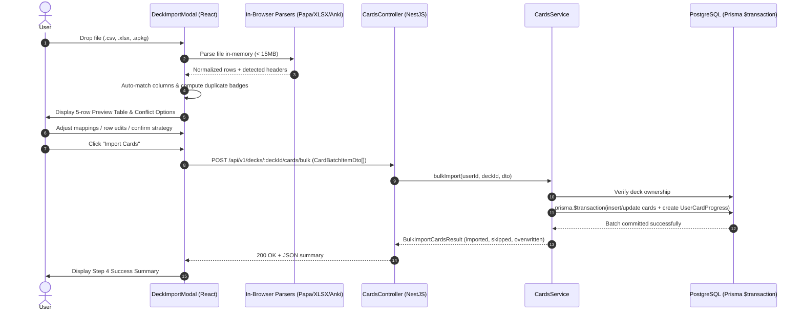

# Implementation Plan: Deck Import & Export (CSV, Excel & Anki .apkg)

**Branch**: `feat/deck-import-export` | **Date**: 2026-08-21 | **Spec**: [spec.md](./spec.md)  
**Status**: APPROVED (Ready for Implementation Tasks)

---

## Summary

The Deck Import/Export feature enables high-speed, bidirectional flashcard migration for WordStreak learners. Flashcard files (`.csv`, `.xlsx`, `.apkg`) up to 15MB / 2,000 cards are parsed in-browser via WebAssembly and JavaScript parsers (PapaParse, SheetJS, JSZip, sql.js), providing sub-500ms column auto-mapping, interactive 5-row preview, cell editing, and duplicate conflict handling (`SKIP`, `OVERWRITE`, `KEEP_BOTH`). Clean normalized payloads are submitted to `POST /api/v1/decks/:deckId/cards/bulk` where an atomic Prisma `$transaction` persists cards and initializes SM-2 spaced repetition progress in `NEW` state. Decks can be exported to RFC 4180 CSV with UTF-8 BOM (`\uFEFF`) and CWE-1236 formula defense or Anki `.apkg` archives with optional mastery status filtering.

---

## Technical Context

- **Language/Version**: TypeScript 5.7+ (Node.js 22 LTS, ES2023, strict mode enabled across all monorepo workspaces).
- **Primary Dependencies**:
  - **Backend (`apps/api`)**: NestJS 11, `@prisma/client` 7.9, `class-validator`, `class-transformer`, `@wordstreak/shared-types`.
  - **Frontend (`apps/web`)**: React 19, Vite 8, `papaparse` 5.x, `xlsx` 0.18.x (dynamic import), `jszip` 3.10.x, `sql.js` 1.12.x (dynamic import), `lucide-react`, `framer-motion`.
  - **Shared Types (`packages/shared-types`)**: Zero runtime dependencies.
- **Storage**: PostgreSQL 16+ via Prisma ORM (`Card`, `Deck`, `UserCardProgress`).
- **Testing**: Jest / Supertest (Backend unit & API integration), Vitest / React Testing Library (Frontend component & parser unit tests).
- **Target Platform**: Modern Web Browsers (Desktop & Mobile viewports 320px–1440px) + NestJS Node.js API server.
- **Project Type**: Full-stack Monorepo Web Application.
- **Performance Goals**:
  - P95 Client parsing & preview generation for 1,000 rows < **800ms**.
  - P95 Backend batch `$transaction` commit for 1,000 cards < **1,500ms**.
  - P95 Deck export generation for 2,000 cards < **1,000ms**.
- **Constraints**:
  - Strict TypeScript with zero `any` usage.
  - Zero server filesystem writes for parsed imports (all in-memory client parsing).
  - P95 API response time < 200ms for read/export endpoints; < 1,500ms for 1,000-card batch commit.
  - Maximum upload size: 15MB; max batch size: 2,000 cards.
- **Scale/Scope**: Free tier: 5 imports/min, max 5,000 cards/day; Pro tier: 10 imports/min, max 20,000 cards/day.

---

## Constitution Check

_GATE: Must pass before Phase 0 research. Re-check after Phase 1 design._

- [x] **I. Code Quality First**:
  - `strict: true` across all packages.
  - All shared interfaces and DTOs placed in `packages/shared-types`.
  - Zero `any` types; all parse results and SQL query responses strictly typed.
- [x] **II. Testing Standards (NON-NEGOTIABLE)**:
  - Unit tests for parsers (CSV delimiter detection, Anki HTML sanitizer, CWE-1236 escaper) with ≥ 80% coverage.
  - Integration tests for `POST /api/v1/decks/:deckId/cards/bulk` covering happy path, `SKIP`, `OVERWRITE`, `KEEP_BOTH`, validation errors, and rollback on error.
  - Component tests for `DeckImportModal` and `DeckExportModal` verifying wizard steps, column mapping, preview badges, and cell editing.
- [x] **III. User Experience Consistency**:
  - Follows existing WordStreak design tokens and modal components (`AddCardModal`, `BulkMoveModal`).
  - Clear loading skeletons, animated progress bars, error callouts, and success summary cards.
  - Accessible keyboard navigation (`Tab`, `Escape`, `Enter`) with `aria-live` status regions.
- [x] **IV. Performance Requirements**:
  - Dynamic code splitting for `xlsx` and `sql.js` WASM to protect initial JS bundle size (< 200KB gzipped).
  - Bulk database inserts using Prisma transactions with batch query optimization.
  - No N+1 queries during duplicate checking or card insertion.

---

## Project Structure

### Documentation (this feature)

```text
.specify/features/deck-import-export/
├── spec.md              # Technical specification (Phase 2)
├── checklists/
│   └── requirements.md  # Specification quality checklist
├── research.md          # Technology decisions & library choices (Phase 0)
├── plan.md              # Implementation plan (Phase 3)
├── data-model.md        # Data models, DTOs & state machine (Phase 1)
├── quickstart.md        # Validation guide & test workflows (Phase 1)
├── contracts/           # API and data contracts (Phase 1)
│   ├── bulk-import.contract.ts
│   └── export-deck.contract.ts
└── tasks.md             # Implementation tasks breakdown (Phase 4)
```

### Source Code Layout

```text
packages/shared-types/src/
├── cards.ts                   # Add CardBatchItemDto, BulkImportCardsDto, BulkImportCardsResult, ExportFormatEnum, ConflictStrategyEnum
├── decks.ts                   # Export options & stats extensions
└── index.ts                   # Re-export all new contracts

apps/api/src/
└── modules/
    ├── cards/
    │   ├── dto/
    │   │   ├── bulk-import-cards.dto.ts    # Class-validator DTO for bulk ingestion
    │   │   └── bulk-card-action.dto.ts
    │   ├── cards.controller.ts            # POST /decks/:deckId/cards/bulk endpoint
    │   ├── cards.controller.spec.ts       # Controller unit/integration tests
    │   ├── cards.service.ts               # bulkImport() with Prisma $transaction & SM-2 init
    │   └── cards.service.spec.ts          # Service batch execution unit tests
    └── decks/
        ├── decks.controller.ts            # GET /decks/:deckId/export endpoint (all card data with progress)
        ├── decks.controller.spec.ts
        ├── decks.service.ts               # findDeckForExport() with security & ownership checks
        └── decks.service.spec.ts

apps/web/src/
├── features/
│   ├── deck-import-export/
│   │   ├── components/
│   │   │   ├── DeckImportModal.tsx         # 4-step wizard modal container
│   │   │   ├── DeckImportModal.spec.tsx
│   │   │   ├── DeckExportModal.tsx         # Format & mastery filter modal
│   │   │   ├── DeckExportModal.spec.tsx
│   │   │   ├── steps/
│   │   │   │   ├── FileUploadStep.tsx      # Dropzone with MIME & 15MB validation
│   │   │   │   ├── ColumnMappingStep.tsx   # Header auto-detection & preview table
│   │   │   │   ├── ConflictConfigStep.tsx  # Strategy selection & per-row overrides
│   │   │   │   └── ImportSummaryStep.tsx   # Success metrics & review CTA
│   │   │   └── preview/
│   │   │       ├── ImportPreviewTable.tsx  # 5-row interactive table with status badges
│   │   │       └── EditableCell.tsx        # In-line cell editor
│   │   ├── utils/
│   │   │   ├── csvParser.ts                # PapaParse wrapper with delimiter detection
│   │   │   ├── csvParser.spec.ts
│   │   │   ├── excelParser.ts              # SheetJS dynamic loader & sheet reader
│   │   │   ├── excelParser.spec.ts
│   │   │   ├── ankiParser.ts               # JSZip + sql.js WASM extractor & HTML sanitizer
│   │   │   ├── ankiParser.spec.ts
│   │   │   ├── columnMapper.ts             # Fuzzy header matching dictionary
│   │   │   ├── columnMapper.spec.ts
│   │   │   ├── formulaSanitizer.ts         # CWE-1236 escaping and stripping
│   │   │   ├── formulaSanitizer.spec.ts
│   │   │   ├── csvExporter.ts              # RFC 4180 generator with UTF-8 BOM
│   │   │   └── ankiExporter.ts             # sql.js + JSZip .apkg packager
│   │   ├── hooks/
│   │   │   ├── useDeckImport.ts            # Import wizard state machine hook
│   │   │   └── useDeckExport.ts            # Export generator and file download hook
│   │   └── services/
│   │       └── deckImportExportApi.ts      # Axios API client for bulk endpoints
│   └── decks/
│       └── pages/
│           ├── DeckDetailPage.tsx          # Add "Import Cards" and "Export Deck" action buttons
│           └── DecksListPage.tsx           # Add "Import as New Deck" action in header
```

---

## Layered Architecture & Data Flow



---

## Security & Reliability Design

1. **CWE-1236 Formula Injection**:
   - Every string field emitted to CSV runs through `escapeCsvFormula()` prepending `'` to `=, +, -, @, \t, \r`.
   - Imported fields have leading formula characters stripped or sanitized to prevent downstream browser/spreadsheet attacks.
2. **Authorization & RBAC**:
   - `POST /api/v1/decks/:deckId/cards/bulk` validates `deck.userId === user.sub`. Non-owners receive 403 Forbidden.
   - `GET /api/v1/decks/:deckId/export` validates ownership or `deck.isPublic === true`. Public deck exports exclude private `UserCardProgress`.
3. **Transaction Safety**:
   - Batch insert runs within `prisma.$transaction()` with a 5,000ms timeout.
   - Any database constraint failure triggers complete rollback.
4. **Bundle Size Protection**:
   - `xlsx` and `sql.js` are loaded strictly via dynamic ES imports (`const XLSX = await import('xlsx')`).

---

## Complexity Tracking

No violations of the WordStreak Constitution. Architecture uses existing NestJS and React conventions, Prisma ORM, and shared contracts in `packages/shared-types`.
