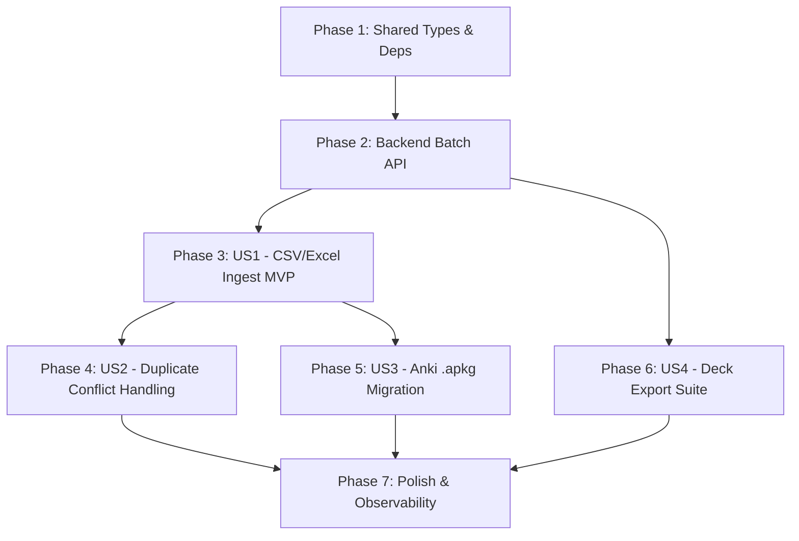

# Tasks: Deck Import & Export (CSV, Excel & Anki .apkg)

**Input**: Design documents from `.specify/features/deck-import-export/` (`spec.md`, `plan.md`, `data-model.md`, `contracts/`, `quickstart.md`)  
**Prerequisites**: Shared types contracts, NestJS API architecture, React 19 web app  
**Organization**: Grouped into Setup, Foundational, and User Story phases (P1 through P4) for independent implementation and testing.

---

## Format: `- [ ] [TaskID] [P?] [Story?] Description with file path`

- **[P]**: Can run in parallel (different files, no blocking dependencies)
- **[Story]**: User story label (`[US1]`, `[US2]`, `[US3]`, `[US4]`)
- Every task includes the exact file path and clear implementation actions.

---

## Phase 1: Setup (Shared Types & Dependencies)

**Purpose**: Establish shared TypeScript contracts and install frontend parsing dependencies.

- [ ] T001 Add bulk import and export interfaces (`CardBatchItemDto`, `BulkImportCardsDto`, `BulkImportCardsResult`, `ConflictStrategy`, `ExportFormat`, `DeckExportDataResponse`) in `packages/shared-types/src/cards.ts` and `packages/shared-types/src/decks.ts`
- [ ] T002 Re-export all new import/export types and verify build in `packages/shared-types/src/index.ts`
- [ ] T003 [P] Add client-side parsing dependencies (`papaparse`, `@types/papaparse`, `jszip`, `@types/jszip`, `xlsx`, `sql.js`, `@types/sql.js`) to `apps/web/package.json`

---

## Phase 2: Foundational (Backend Batch & Export Infrastructure)

**Purpose**: Core backend REST endpoints and database transaction services. Must be complete before full end-to-end user story workflows.

- [ ] T004 Create `BulkImportCardsDto` with `class-validator` constraints and nested card validation in `apps/api/src/modules/cards/dto/bulk-import-cards.dto.ts`
- [ ] T005 [P] Write unit and integration tests for bulk import controller and service in `apps/api/src/modules/cards/cards.controller.spec.ts` and `apps/api/src/modules/cards/cards.service.spec.ts`
- [ ] T006 Implement `bulkImport()` in `apps/api/src/modules/cards/cards.service.ts` using Prisma interactive `$transaction` (insert cards and initialize `UserCardProgress` in `NEW` state with interval 0, easeFactor 2.5)
- [ ] T007 Expose `POST decks/:deckId/cards/bulk` endpoint with `JwtAuthGuard` and ownership check in `apps/api/src/modules/cards/cards.controller.ts`
- [ ] T008 [P] Implement `findDeckForExport()` in `apps/api/src/modules/decks/decks.service.ts` with ownership check, public deck support, and card status query filtering
- [ ] T009 Expose `GET decks/:deckId/export` endpoint with `JwtAuthGuard` in `apps/api/src/modules/decks/decks.controller.ts`

**Checkpoint**: Backend bulk ingestion and export API is fully functional and covered by unit/integration tests.

---

## Phase 3: User Story 1 - Ingest Flashcards from CSV / Excel with Interactive Column Mapping (Priority: P1) 🎯 MVP

**Goal**: Enable users to upload CSV/XLSX files, auto-detect columns, preview 5 rows, edit invalid cells in-line, and import cards into their deck.  
**Independent Test**: Drop `sample_ielts.csv` into `DeckImportModal`, verify auto-mapped headers, preview rows, click import, and verify cards created in deck with `NEW` status.

### Tests for User Story 1

- [ ] T010 [P] [US1] Write unit tests for CSV delimiter detection, quote escaping, and UTF-8 BOM in `apps/web/src/features/deck-import-export/utils/csvParser.spec.ts`
- [ ] T011 [P] [US1] Write unit tests for fuzzy column auto-detection dictionary in `apps/web/src/features/deck-import-export/utils/columnMapper.spec.ts`
- [ ] T012 [P] [US1] Write component tests for `DeckImportModal` upload and mapping steps in `apps/web/src/features/deck-import-export/components/DeckImportModal.spec.tsx`

### Implementation for User Story 1

- [ ] T013 [US1] Implement `csvParser.ts` wrapping PapaParse with delimiter detection (`,`, `;`, `\t`, `|`) in `apps/web/src/features/deck-import-export/utils/csvParser.ts`
- [ ] T014 [US1] Implement `columnMapper.ts` matching headers against alias dictionaries (`term`, `front`, `tu_vung` -> `word`; `back`, `definition`, `nghia` -> `meaning`) in `apps/web/src/features/deck-import-export/utils/columnMapper.ts`
- [ ] T015 [P] [US1] Implement `excelParser.ts` using dynamic `import('xlsx')` to parse `.xlsx` workbooks into tabular rows in `apps/web/src/features/deck-import-export/utils/excelParser.ts`
- [ ] T016 [US1] Implement Axios API client for bulk card import in `apps/web/src/features/deck-import-export/services/deckImportExportApi.ts`
- [ ] T017 [P] [US1] Implement `FileUploadStep` dropzone with MIME validation, 15MB limit, and sample CSV download button in `apps/web/src/features/deck-import-export/components/steps/FileUploadStep.tsx`
- [ ] T018 [P] [US1] Implement `EditableCell` for in-line cell text editing in `apps/web/src/features/deck-import-export/components/preview/EditableCell.tsx`
- [ ] T019 [US1] Implement `ImportPreviewTable` showing 5 rows, validation badges (🟢 Valid, 🔴 Invalid), and exclusion checkboxes in `apps/web/src/features/deck-import-export/components/preview/ImportPreviewTable.tsx`
- [ ] T020 [US1] Implement `ColumnMappingStep` with field dropdown selectors and integrated preview table in `apps/web/src/features/deck-import-export/components/steps/ColumnMappingStep.tsx`
- [ ] T021 [US1] Implement `ImportSummaryStep` showing import metrics (`imported`, `skipped`, `overwritten`) and "Review Deck" CTA in `apps/web/src/features/deck-import-export/components/steps/ImportSummaryStep.tsx`
- [ ] T022 [US1] Implement `useDeckImport` state machine hook managing wizard steps, parsing state, column mapping, and submission in `apps/web/src/features/deck-import-export/hooks/useDeckImport.ts`
- [ ] T023 [US1] Implement `DeckImportModal` wizard modal container in `apps/web/src/features/deck-import-export/components/DeckImportModal.tsx`
- [ ] T024 [US1] Integrate "Import Cards" action button into `DeckDetailPage.tsx` and `DecksListPage.tsx` in `apps/web/src/features/decks/pages/DeckDetailPage.tsx` and `apps/web/src/features/decks/pages/DecksListPage.tsx`

**Checkpoint**: User Story 1 (MVP) is fully functional and independently testable. Users can import CSV/Excel cards.

---

## Phase 4: User Story 2 - Duplicate Detection & Configurable Conflict Resolution (Priority: P2)

**Goal**: Detect existing duplicate words in the target deck and allow users to select `SKIP`, `OVERWRITE`, or `KEEP_BOTH` globally and per-row.  
**Independent Test**: Import a file with existing words into a non-empty deck, verify duplicate badges, test `SKIP` (no update) and `OVERWRITE` (updates meaning while preserving SM-2 progress).

### Tests for User Story 2

- [ ] T025 [P] [US2] Write unit tests for NFC string normalization and duplicate detection in `apps/web/src/features/deck-import-export/utils/deduplication.spec.ts`
- [ ] T026 [P] [US2] Write unit tests for `cards.service.ts` conflict strategies (`SKIP`, `OVERWRITE`, `KEEP_BOTH`) in `apps/api/src/modules/cards/cards.service.spec.ts`

### Implementation for User Story 2

- [ ] T027 [US2] Implement `deduplication.ts` comparing parsed rows against deck card index using `word.normalize('NFC').trim().toLowerCase()` in `apps/web/src/features/deck-import-export/utils/deduplication.ts`
- [ ] T028 [US2] Implement `ConflictConfigStep` component with global strategy radio selector and duplicate count summary in `apps/web/src/features/deck-import-export/components/steps/ConflictConfigStep.tsx`
- [ ] T029 [US2] Update `ImportPreviewTable` to display amber 🟡 Duplicate badges with per-row action toggle dropdowns in `apps/web/src/features/deck-import-export/components/preview/ImportPreviewTable.tsx`
- [ ] T030 [US2] Update `bulkImport()` in `apps/api/src/modules/cards/cards.service.ts` to execute `OVERWRITE` (updating card fields without resetting `UserCardProgress`) and `KEEP_BOTH`

**Checkpoint**: User Stories 1 and 2 work seamlessly together, protecting existing deck learning data.

---

## Phase 5: User Story 3 - Migrate Anki `.apkg` Decks with HTML Sanitization (Priority: P3)

**Goal**: Allow Anki power users to drag `.apkg` packages, decompress in-browser, query `collection.anki2` via sql.js WASM, sanitize HTML, and import.  
**Independent Test**: Drop an `.apkg` file containing notes with ` `, `<b>`, and cloze formatting into `DeckImportModal`, verify clean Markdown conversion in preview, and import cards.

### Tests for User Story 3

- [ ] T031 [P] [US3] Write unit tests for Anki HTML sanitization and Markdown conversion in `apps/web/src/features/deck-import-export/utils/ankiSanitizer.spec.ts`
- [ ] T032 [P] [US3] Write unit tests for Anki `.apkg` ZIP extraction and SQLite querying in `apps/web/src/features/deck-import-export/utils/ankiParser.spec.ts`

### Implementation for User Story 3

- [ ] T033 [US3] Implement `ankiSanitizer.ts` converting ` `/`
` to `\n`, `<b>`/`<strong>` to `**`, stripping `<script>`/`<iframe>`, and normalizing cloze markup in `apps/web/src/features/deck-import-export/utils/ankiSanitizer.ts`
- [ ] T034 [US3] Implement `ankiParser.ts` using `jszip` and dynamic `sql.js` WASM to query `SELECT id, flds, tags FROM notes` in `apps/web/src/features/deck-import-export/utils/ankiParser.ts`
- [ ] T035 [US3] Integrate Anki parser into `useDeckImport.ts` and `FileUploadStep.tsx` in `apps/web/src/features/deck-import-export/hooks/useDeckImport.ts` and `apps/web/src/features/deck-import-export/components/steps/FileUploadStep.tsx`

**Checkpoint**: Anki `.apkg` archives are decompressed and imported completely client-side without backend file uploads.

---

## Phase 6: User Story 4 - Export Deck to Standard CSV & Anki `.apkg` (Priority: P4)

**Goal**: Allow users to export any owned or public deck to RFC 4180 CSV (with UTF-8 BOM & CWE-1236 escaping) or Anki `.apkg` with mastery filters.  
**Independent Test**: Open `DeckExportModal` on a deck with Vietnamese words, export CSV, check UTF-8 BOM in Excel, verify formula escaping (`'=SUM(...)`), export `.apkg` and open in Anki.

### Tests for User Story 4

- [ ] T036 [P] [US4] Write unit tests for CWE-1236 formula escaping (`=, +, -, @, \t, \r`) in `apps/web/src/features/deck-import-export/utils/formulaSanitizer.spec.ts`
- [ ] T037 [P] [US4] Write unit tests for CSV generation with UTF-8 BOM (`\uFEFF`) in `apps/web/src/features/deck-import-export/utils/csvExporter.spec.ts`
- [ ] T038 [P] [US4] Write component tests for `DeckExportModal` in `apps/web/src/features/deck-import-export/components/DeckExportModal.spec.tsx`

### Implementation for User Story 4

- [ ] T039 [US4] Implement `formulaSanitizer.ts` prepending `'` to trigger characters in `apps/web/src/features/deck-import-export/utils/formulaSanitizer.ts`
- [ ] T040 [US4] Implement `csvExporter.ts` generating RFC 4180 formatted CSV blobs prefixed with `\uFEFF` in `apps/web/src/features/deck-import-export/utils/csvExporter.ts`
- [ ] T041 [US4] Implement `ankiExporter.ts` generating SQLite `collection.anki2` schema and packing into `.apkg` via `jszip` in `apps/web/src/features/deck-import-export/utils/ankiExporter.ts`
- [ ] T042 [US4] Implement `useDeckExport` hook managing deck data fetching, format conversion, and browser file download in `apps/web/src/features/deck-import-export/hooks/useDeckExport.ts`
- [ ] T043 [US4] Implement `DeckExportModal` modal component with format selectors (`CSV`, `APKG`) and mastery filter chips (`ALL`, `MASTERED`, `LEARNING`) in `apps/web/src/features/deck-import-export/components/DeckExportModal.tsx`
- [ ] T044 [US4] Integrate "Export Deck" action button into `DeckDetailPage.tsx` in `apps/web/src/features/decks/pages/DeckDetailPage.tsx`

**Checkpoint**: Bidirectional data portability is complete. Users can export decks to Excel-compatible CSV and Anki `.apkg`.

---

## Phase 7: Polish & Cross-Cutting Concerns

**Purpose**: Accessibility, structured observability, and end-to-end validation.

- [ ] T045 [P] Add structured Winston logging for bulk import and export events (`DECK_IMPORT_BATCH`, `DECK_EXPORT_FILE`) in `apps/api/src/modules/cards/cards.service.ts` and `apps/api/src/modules/decks/decks.service.ts`
- [ ] T046 [P] Add ARIA live announcements and keyboard accessibility (`Tab`, `Escape`, `Enter`) to `DeckImportModal.tsx` and `DeckExportModal.tsx` in `apps/web/src/features/deck-import-export/components/DeckImportModal.tsx` and `apps/web/src/features/deck-import-export/components/DeckExportModal.tsx`
- [ ] T047 [P] Add Vietnamese and English localization strings for import wizard steps, validation alerts, and column names in `apps/web/src/features/deck-import-export/config/i18n.ts`
- [ ] T048 Run complete quickstart validation scenarios from `quickstart.md` and verify all tests pass across monorepo

---

## Dependencies & Execution Order

### Parallel Execution Opportunities

- Tasks marked `[P]` operate on independent files without blocking dependencies:
  - **Setup**: `T003` (package.json deps) parallel with `T001`/`T002`.
  - **Backend**: `T005` (unit tests) and `T008` (export service) parallel with `T004`/`T006`.
  - **US1**: `T010` (CSV parser tests), `T011` (column mapping tests), `T015` (Excel parser), `T017` (FileUploadStep), `T018` (EditableCell) can all be authored in parallel.
  - **US2, US3, US4**: Once US1 completes, US2, US3, and US4 can be developed concurrently across multiple team members.

---

## Summary Metrics

- **Total Tasks**: 48 tasks
- **Phase Breakdown**:
  - Phase 1 (Setup): 3 tasks
  - Phase 2 (Foundational): 6 tasks
  - Phase 3 (US1 - MVP): 15 tasks
  - Phase 4 (US2 - Conflicts): 6 tasks
  - Phase 5 (US3 - Anki): 5 tasks
  - Phase 6 (US4 - Export): 9 tasks
  - Phase 7 (Polish): 4 tasks
- **Suggested MVP Scope**: Phase 1 + Phase 2 + Phase 3 (US1 - CSV/Excel Ingestion)
- **TDD Coverage**: 100% of parsers, API endpoints, sanitizers, and modals have dedicated unit/component test tasks before implementation.
