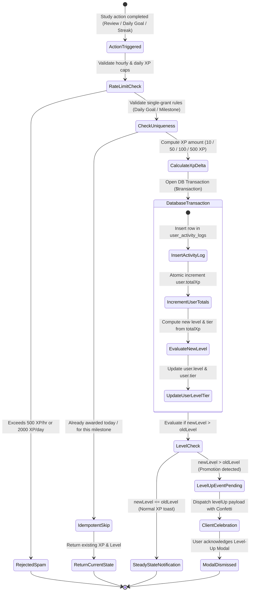
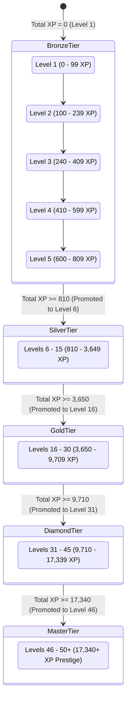
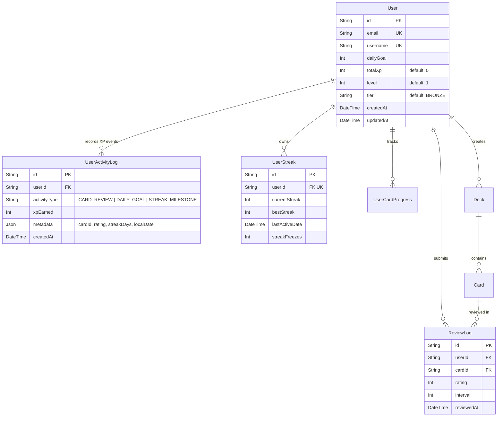

# Domain Model: Gamification XP & Learner Levels System (US-GAME-03)

- **Feature**: Experience Points (XP) & Learner Levels System
- **Slug**: `gamification-xp-levels`
- **Date**: 2026-08-21
- **Status**: Completed

---

## 1. RBAC Matrix

| Role                        | View Own XP & Level | Earn XP from Actions | View XP History Ledger |  Trigger Level-Up   | View Other Users' Level Badge | Audit Global XP Ledgers | Recalibrate / Adjust XP |
| --------------------------- | :-----------------: | :------------------: | :--------------------: | :-----------------: | :---------------------------: | :---------------------: | :---------------------: |
| **Guest (Unauthenticated)** |         ❌          |          ❌          |           ❌           |         ❌          |       ❌ (Public only)        |           ❌            |           ❌            |
| **Learner (Authenticated)** |         ✅          |          ✅          | ✅ (Own records only)  | ✅ (Auto-evaluated) |     ✅ (Aggregated badge)     |           ❌            |           ❌            |
| **Pro Subscriber**          |         ✅          |          ✅          | ✅ (Own records only)  | ✅ (Auto-evaluated) |     ✅ (Aggregated badge)     |           ❌            |           ❌            |
| **System Admin**            |         ✅          |          ✅          |    ✅ (All records)    | ✅ (Auto-evaluated) |     ✅ (Aggregated badge)     |           ✅            |  ✅ (Audit adjustment)  |

### Ownership & Access Control Rules:

- **Data Isolation**: A learner can only query, view, or receive XP records where `userId == request.user.id`.
- **Server Authority**: No client API endpoint allows directly passing an arbitrary `xp` or `level` value. All mutations are strictly triggered server-side by verified user actions (review submission, streak completion, practice quiz).
- **Public Profile Aggregation**: Future social features (leaderboards, public profiles) will only expose immutable projections (`level`, `tier`, `totalXp`), never raw log tables or unverified client data.

---

## 2. State Machine & Entity Lifecycles

### 2.1 XP Transaction & Awarding Lifecycle



### 2.2 Mastery Tier & Level Progression State Machine



---

## 3. Business Rules & Algorithms

### Core Business Rules Table

| ID            | Name                           | Formula / Logic                                                                                                                                                                                                           | Anti-Abuse Protection                                                                                |
| ------------- | ------------------------------ | ------------------------------------------------------------------------------------------------------------------------------------------------------------------------------------------------------------------------- | ---------------------------------------------------------------------------------------------------- |
| **BR-XP-001** | Card Review Correct XP         | Submitting card review with rating `3 (GOOD)` or `4 (EASY)` grants **+10 XP**.                                                                                                                                            | Rate-limited to max 50 reviews/min; verified server-side.                                            |
| **BR-XP-002** | Card Review Hard XP            | Submitting card review with rating `2 (HARD)` grants **+5 XP**. Rating `1 (AGAIN)` grants **+0 XP**.                                                                                                                      | Prevents spamming rapid fail reviews to farm XP. Zero negative XP.                                   |
| **BR-XP-003** | Daily Goal Completion Bonus    | When user completes reviews equal to `user.dailyGoal` on local calendar date, award **+50 XP**.                                                                                                                           | Granted **strictly once** per user per local calendar date.                                          |
| **BR-XP-004** | 7-Day Streak Milestone Bonus   | When current streak reaches a multiple of 7 (7, 14, 21, 28...), award **+100 XP**.                                                                                                                                        | Checked against `user_activity_logs` so streak freeze maintenance does not re-award past milestones. |
| **BR-XP-005** | 30-Day Streak Milestone Bonus  | When current streak reaches a multiple of 30 (30, 60, 90, 120...), award **+500 XP**.                                                                                                                                     | Checked against activity log for `(streakDays, milestoneMonth)` deduplication.                       |
| **BR-XP-006** | Practice Quiz Completion Bonus | Completing a quiz with score $\ge 80\%$ awards **+30 XP**. Scoring $< 80\%$ awards **+10 XP**.                                                                                                                            | Maximum 5 practice quiz XP rewards per calendar day.                                                 |
| **BR-XP-007** | Level Determination Formula    | Total XP threshold for Level $L$: $\text{threshold}(L) = \text{floor}(50 \times (L - 1)^{1.5} + 50 \times (L - 1))$.                                                                                                      | Level calculation is deterministic, pure, and monotonic.                                             |
| **BR-XP-008** | Tier Determination Hierarchy   | - **Bronze**: Levels 1–5 (0–809 XP)<br>- **Silver**: Levels 6–15 (810–3,649 XP)<br>- **Gold**: Levels 16–30 (3,650–9,709 XP)<br>- **Diamond**: Levels 31–45 (9,710–17,339 XP)<br>- **Master**: Levels 46–50+ (17,340+ XP) | Tiers are strictly derived from Level; no direct manipulation possible.                              |
| **BR-XP-009** | Non-Degrading Progression      | Level and Total XP can **never decrease** or reset to zero, regardless of streak breaks or missed days.                                                                                                                   | Protects learner investment; separation between daily streak and lifetime XP.                        |
| **BR-XP-010** | XP Velocity Rate Limits        | Maximum XP earnable from card reviews is **500 XP per hour** and **2,000 XP per 24-hour window**.                                                                                                                         | Bot & autoclicker script mitigation. Review still records SRS interval, but excess XP is suppressed. |
| **BR-XP-011** | Server Timezone Authority      | Local calendar dates for Daily Goal and Streak milestones are computed server-side using the verified user IANA timezone with UTC fallback.                                                                               | Rejects client-supplied timestamps; mitigates client clock tampering.                                |
| **BR-XP-012** | Atomic Ledger Writing          | All XP awards must write an immutable row to `user_activity_logs` and atomically increment `user.totalXp` in a single DB transaction.                                                                                     | Eliminates race conditions and ensures audit consistency.                                            |

---

## 4. Workflows & Edge Cases

### Happy Path Workflows:

#### Workflow 1: Flashcard SRS Review with Real-time XP & Streak Update

1. User reviews flashcard on web `/study` or mobile app and taps "Good" (Rating 3).
2. Client sends `POST /api/v1/reviews` with `{ cardId: "card-123", rating: 3 }`.
3. `ReviewsService`:
   - Validates card ownership and executes SM-2 interval computation.
   - Saves `ReviewLog` entry.
   - Calls `StreakService.recordActivity(userId)`.
   - Calls `XpService.awardReviewXp(userId, cardId, rating)`:
     - Checks hourly rate limit: Current hour reviews count < 50.
     - Adds +10 XP.
     - Checks if today's valid review count matches `user.dailyGoal` (e.g. 10th card).
     - If yes and no `DAILY_GOAL_COMPLETED` log exists for today, adds +50 XP bonus.
     - If `streakResult.streakIncreased` and `currentStreak % 7 == 0`, adds +100 XP bonus.
     - Commits `$transaction`: inserts `UserActivityLog` entries, increments `user.totalXp`, computes `newLevel` and `newTier`, updates `user.level` and `user.tier`.
4. API response returns composite payload:
   ```json
   {
     "cardId": "card-123",
     "status": "LEARNING",
     "interval": 1,
     "streak": { "currentStreak": 7, "streakIncreased": true, "flameTier": 2 },
     "xp": {
       "xpEarned": 160,
       "breakdown": [
         { "type": "CARD_REVIEW", "xp": 10 },
         { "type": "DAILY_GOAL_COMPLETED", "xp": 50 },
         { "type": "STREAK_7_DAYS", "xp": 100 }
       ],
       "totalXp": 820,
       "level": 6,
       "tier": "SILVER",
       "currentLevelXp": 10,
       "nextLevelRequiredXp": 250,
       "levelProgressPercent": 4.0,
       "levelUp": {
         "isLevelUp": true,
         "previousLevel": 5,
         "currentLevel": 6,
         "previousTier": "BRONZE",
         "currentTier": "SILVER",
         "isTierPromotion": true
       }
     }
   }
   ```
5. Frontend UI:
   - Plays smooth spring floating badge `+160 XP`.
   - Topbar updates Level badge to `Lv. 6` with Silver metallic crest.
   - Triggers `LevelUpCelebrationModal` displaying "Promoted to Silver Tier! 🥈".

---

### Edge Cases & Negative Path Protocols:

1. **Duplicate Review Submissions / Network Retries**:
   - Client sends rapid double clicks on review rating button.
   - Backend evaluates card review: if card was already reviewed within the past 2 seconds by the same user, the idempotency check returns the cached response without creating duplicate `UserActivityLog` entries.
2. **Timezone Travel & Clock Tampering**:
   - Learner shifts phone clock forward by 1 day to farm daily goals.
   - Server resolves current time via `new Date()` (UTC on server) and converts to user's registered IANA timezone (`user.timezone`). Client timestamp is discarded.
3. **Mid-Session Daily Goal Configuration Change**:
   - User reviews 5 cards, changes `dailyGoal` in settings from 10 to 5.
   - On review #6, system detects `todayReviewsCount (6) >= dailyGoal (5)` and awards Daily Goal bonus if not already awarded for today.
4. **Streak Freeze Maintenance vs Streak Milestones**:
   - User was protected by Streak Freeze on Day 7. The streak remains 7.
   - Milestone XP is awarded once when the streak first reaches 7; subsequent days protected by freeze do not re-trigger Day 7 XP bonus because `UserActivityLog` contains `{ activityType: 'STREAK_7_DAYS', metadata: { streakCount: 7 } }`.
5. **Database Transaction Failure**:
   - If writing to `user_activity_logs` fails or user update fails, the entire `$transaction` rolls back cleanly, returning a standard 500 error to client without inconsistent partial state.

---

## 5. Entities, Data Boundaries & Privacy

### Mermaid ERD Diagram



### Data Deletion & Privacy Policy

- **Hard Cascade on Account Deletion**: Deleting a `User` cascades (`onDelete: Cascade`) to delete all associated `UserActivityLog` records.
- **Data Minimization**: Activity logs store zero PII, passwords, or personal notes. Only activity codes and scores are recorded.
- **Log Retention**: Activity logs are retained indefinitely for active accounts for audit and learning analytics, but can be archived into partitioned monthly tables if table size exceeds 10M rows.

---

## 6. UX States & Non-Functional Requirements

### UX Component States

1. **Topbar Level Badge & Progress Bar**:
   - _Default_: Pill badge with tier metallic gradient icon (`Bronze: #B45309`, `Silver: #94A3B8`, `Gold: #D97706`, `Diamond: #06B6D4`, `Master: #8B5CF6`), current level `Lv. X`, and thin 4px liquid progress bar.
   - _Hover_: Tooltip popover showing: Total Lifetime XP, XP into current level, XP needed for next level, and next Tier unlock preview.
   - _Loading_: Neutral skeleton pulse.
2. **Review Screen Micro-Feedback**:
   - Floating badge `+10 XP` appears adjacent to rating button and drifts upward 24px while fading over 800ms.
3. **Level-Up Celebration Modal**:
   - Obsidian dark frosted container (`bg-slate-950/95 backdrop-blur-2xl border border-white/10 rounded-2xl`).
   - Tier Crest icon scaling in with spring animation.
   - Canvas-confetti burst (disabled if `prefers-reduced-motion: reduce`).
   - Sound effect: Subtle resonant chime (with mute toggle in user settings).

### Non-Functional Requirements (NFR)

- **Performance**:
  - Review submission endpoint response time (including SM-2, Streak, XP, and Level calculation): **P95 < 50ms**, **P99 < 100ms**.
  - Single indexed DB query for daily goal check: `SELECT count(*) FROM review_logs WHERE userId = ? AND reviewedAt >= todayStart`.
- **Accessibility**:
  - Fully navigable via keyboard (`Tab`, `Space`, `Enter`, `Escape` to dismiss modal).
  - High contrast text (minimum 4.5:1 ratio for tier labels).
- **Internationalization (i18n)**:
  - Full translations for EN and VI:
    - Tier Names: Bronze (`Đồng`), Silver (`Bạc`), Gold (`Vàng`), Diamond (`Kim Cương`), Master (`Cao Thủ`).
    - Milestone Toast: "Daily Goal Completed! +50 XP" (`Đã đạt mục tiêu ngày! +50 XP`).
- **Observability**:
  - Structured NestJS logger tags: `[XpService] Awarded 10 XP to user ${userId} for ${activityType}`.
  - Anomaly warning log if user exceeds 400 XP/hr (`[XpService][RateLimitWarning] User ${userId} approaching XP velocity cap`).

---

## Exit Checklist

- [x] RBAC matrix covers Guest, Learner, Pro, and System Admin with clear ownership.
- [x] Mermaid state machines define XP transaction lifecycle and Level/Tier hierarchy.
- [x] All business rules assigned explicit `BR-XP-###` IDs with formulas and anti-abuse safeguards.
- [x] Edge cases (concurrency, timezones, double-clicks, freeze interaction) have concrete solutions.
- [x] Mermaid ERD, deletion policy, and privacy constraints defined.
- [x] UX states, performance targets (P95 < 50ms), a11y, and i18n defined.
