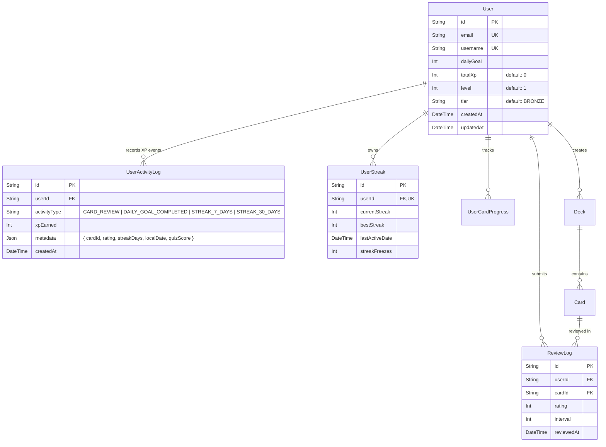

# Data Model & Database Migration Plan: Gamification XP & Learner Levels

- **Feature**: Experience Points (XP) & Learner Levels System
- **Feature Slug**: `gamification-xp-levels`
- **Target Backlog Item**: `US-GAME-03`
- **Specification Phase**: Phase 3 (speckit-plan)
- **Status**: **APPROVED (Ready for Implementation)**
- **Author**: WordStreak Database & Backend Architect
- **Date**: 2026-08-21
- **Target Branch**: `feat/gamification-xp-levels`

---

## 1. Prisma Schema Additions

The database schema updates are applied to [`apps/api/prisma/schema.prisma`](file:///Users/vutuanhau/Documents/PROJECT/WordStreak/apps/api/prisma/schema.prisma).

### 1.1 `User` Model Extensions

```prisma
model User {
  id           String             @id @default(uuid())
  email        String             @unique
  passwordHash String
  username     String             @unique
  dailyGoal    Int                @default(10)
  avatarUrl    String?

  // Gamification Extensions (US-GAME-03)
  totalXp      Int                @default(0)
  level        Int                @default(1)
  tier         String             @default("BRONZE") // BRONZE | SILVER | GOLD | DIAMOND | MASTER

  createdAt    DateTime           @default(now())
  updatedAt    DateTime           @updatedAt
  sessions     Session[]
  decks        Deck[]
  progress     UserCardProgress[]
  streaks      UserStreak[]
  reviewLogs   ReviewLog[]
  activityLogs UserActivityLog[]

  @@map("users")
}
```

### 1.2 `UserActivityLog` Model (New Entity)

```prisma
model UserActivityLog {
  id           String   @id @default(uuid())
  userId       String
  activityType String   // CARD_REVIEW | DAILY_GOAL_COMPLETED | STREAK_7_DAYS | STREAK_30_DAYS | PRACTICE_QUIZ | ADMIN_ADJUSTMENT | HISTORICAL_BACKFILL
  xpEarned     Int
  metadata     Json?    // e.g. { "cardId": "...", "rating": 3, "streakDays": 7, "localDate": "2026-08-21" }
  createdAt    DateTime @default(now())

  user         User     @relation(fields: [userId], references: [id], onDelete: Cascade)

  @@index([userId, createdAt])
  @@index([userId, activityType])
  @@index([createdAt])
  @@map("user_activity_logs")
}
```

---

## 2. Entity Relationship Diagram (ERD)



---

## 3. Indexes & Query Optimization

| Index                             | Target Table         | Query Pattern Supported                                                                                                                                     | Estimated Performance Impact                                                        |
| --------------------------------- | -------------------- | ----------------------------------------------------------------------------------------------------------------------------------------------------------- | ----------------------------------------------------------------------------------- |
| `@@index([userId, createdAt])`    | `user_activity_logs` | Fetching paginated user activity history (`GET /api/v1/gamification/xp/history`) and sliding window velocity check (`WHERE userId = ? AND createdAt >= ?`). | Query time drops from $O(N)$ scan to $O(\log N)$ index range scan ($< 2\text{ms}$). |
| `@@index([userId, activityType])` | `user_activity_logs` | Daily goal deduplication (`WHERE userId = ? AND activityType = 'DAILY_GOAL_COMPLETED'`) and streak milestone check.                                         | Eliminates full table scans on activity logs during review transactions.            |
| `@@index([createdAt])`            | `user_activity_logs` | Global platform analytics, daily active XP volume reports, and monthly data archiving partitions.                                                           | Speeds up system administrator analytics queries.                                   |

---

## 4. PostgreSQL Migration SQL (UP)

```sql
-- Migration: 20260821000001_add_gamification_xp_and_activity_logs
-- Feature: gamification-xp-levels (US-GAME-03)

-- 1. Add XP, Level, and Tier columns to users table
ALTER TABLE "users"
ADD COLUMN IF NOT EXISTS "totalXp" INTEGER NOT NULL DEFAULT 0,
ADD COLUMN IF NOT EXISTS "level" INTEGER NOT NULL DEFAULT 1,
ADD COLUMN IF NOT EXISTS "tier" TEXT NOT NULL DEFAULT 'BRONZE';

-- 2. Create user_activity_logs table
CREATE TABLE IF NOT EXISTS "user_activity_logs" (
    "id" TEXT NOT NULL,
    "userId" TEXT NOT NULL,
    "activityType" TEXT NOT NULL,
    "xpEarned" INTEGER NOT NULL,
    "metadata" JSONB,
    "createdAt" TIMESTAMP(3) NOT NULL DEFAULT CURRENT_TIMESTAMP,

    CONSTRAINT "user_activity_logs_pkey" PRIMARY KEY ("id")
);

-- 3. Add Foreign Key constraint with CASCADE delete
ALTER TABLE "user_activity_logs"
ADD CONSTRAINT "user_activity_logs_userId_fkey"
FOREIGN KEY ("userId") REFERENCES "users"("id") ON DELETE CASCADE ON UPDATE CASCADE;

-- 4. Create compound and single indexes
CREATE INDEX IF NOT EXISTS "user_activity_logs_userId_createdAt_idx" ON "user_activity_logs"("userId", "createdAt");
CREATE INDEX IF NOT EXISTS "user_activity_logs_userId_activityType_idx" ON "user_activity_logs"("userId", "activityType");
CREATE INDEX IF NOT EXISTS "user_activity_logs_createdAt_idx" ON "user_activity_logs"("createdAt");
```

---

## 5. Migration Rollback Strategy (DOWN)

In the unlikely event of an emergency rollback:

```sql
-- Rollback Migration: 20260821000001_rollback_gamification_xp_and_activity_logs

-- 1. Drop foreign key and table
DROP TABLE IF EXISTS "user_activity_logs" CASCADE;

-- 2. Drop columns from users table
ALTER TABLE "users"
DROP COLUMN IF EXISTS "totalXp",
DROP COLUMN IF EXISTS "level",
DROP COLUMN IF EXISTS "tier";
```

---

## 6. Idempotent Historical Backfill Script

To ensure legacy active users are credited for their existing hard work upon deployment:

```typescript
/**
 * apps/api/src/scripts/backfill-xp.ts
 * Idempotent historical XP and Level backfill script.
 */
import { PrismaClient } from "@prisma/client";
import {
  calculateLevelFromXp,
  calculateTierFromLevel,
} from "@wordstreak/shared-types";

const prisma = new PrismaClient();

async function backfillHistoricalXp() {
  console.log("--- Starting Gamification XP Historical Backfill ---");

  const users = await prisma.user.findMany({
    select: { id: true, username: true, totalXp: true },
  });

  console.log(`Found ${users.length} total users to process.`);
  let processedCount = 0;

  for (const user of users) {
    // Only backfill if user has 0 totalXp and no activity logs
    const existingLogsCount = await prisma.userActivityLog.count({
      where: { userId: user.id },
    });

    if (user.totalXp > 0 || existingLogsCount > 0) {
      continue;
    }

    // 1. Calculate XP from historical review logs (Rating >= 2 => +10 XP)
    const validReviewsCount = await prisma.reviewLog.count({
      where: {
        userId: user.id,
        rating: { gte: 2 },
      },
    });
    const reviewXp = validReviewsCount * 10;

    // 2. Calculate XP from current best streak
    const streak = await prisma.userStreak.findUnique({
      where: { userId: user.id },
    });
    const bestStreak = streak?.bestStreak ?? 0;
    const streak7Milestones = Math.floor(bestStreak / 7);
    const streak30Milestones = Math.floor(bestStreak / 30);
    const streakXp = streak7Milestones * 100 + streak30Milestones * 500;

    const totalCalculatedXp = reviewXp + streakXp;
    const level = calculateLevelFromXp(totalCalculatedXp);
    const tier = calculateTierFromLevel(level);

    if (totalCalculatedXp > 0) {
      await prisma.$transaction([
        prisma.userActivityLog.create({
          data: {
            userId: user.id,
            activityType: "HISTORICAL_BACKFILL",
            xpEarned: totalCalculatedXp,
            metadata: {
              validReviewsCount,
              reviewXp,
              bestStreak,
              streakXp,
              backfilledAt: new Date().toISOString(),
            },
          },
        }),
        prisma.user.update({
          where: { id: user.id },
          data: {
            totalXp: totalCalculatedXp,
            level,
            tier,
          },
        }),
      ]);
      processedCount++;
    }
  }

  console.log(`Successfully backfilled XP for ${processedCount} users.`);
}

backfillHistoricalXp()
  .catch((e) => {
    console.error("Backfill failed:", e);
    process.exit(1);
  })
  .finally(async () => {
    await prisma.$disconnect();
  });
```

---

## 7. Data Privacy, Cascade Rules & Retention Policy

1. **User Deletion Cascade**:
   - `UserActivityLog` includes `onDelete: Cascade`. When a learner exercises their "Right to be Forgotten" and deletes their WordStreak account, all associated activity logs are purged immediately.
2. **Data Minimization**:
   - Activity log records store strictly numerical scores, identifiers, and action codes. No private notes, personal words, or user-generated vocabulary are logged into `user_activity_logs`.
3. **Partitioning & Archival**:
   - When `user_activity_logs` exceeds $10\text{M}$ rows, table partitioning by range on `createdAt` (e.g. `user_activity_logs_y2026m08`) will be enabled with zero application code changes.
