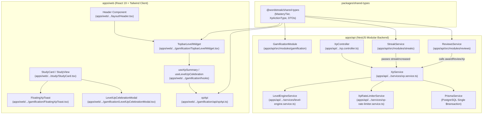
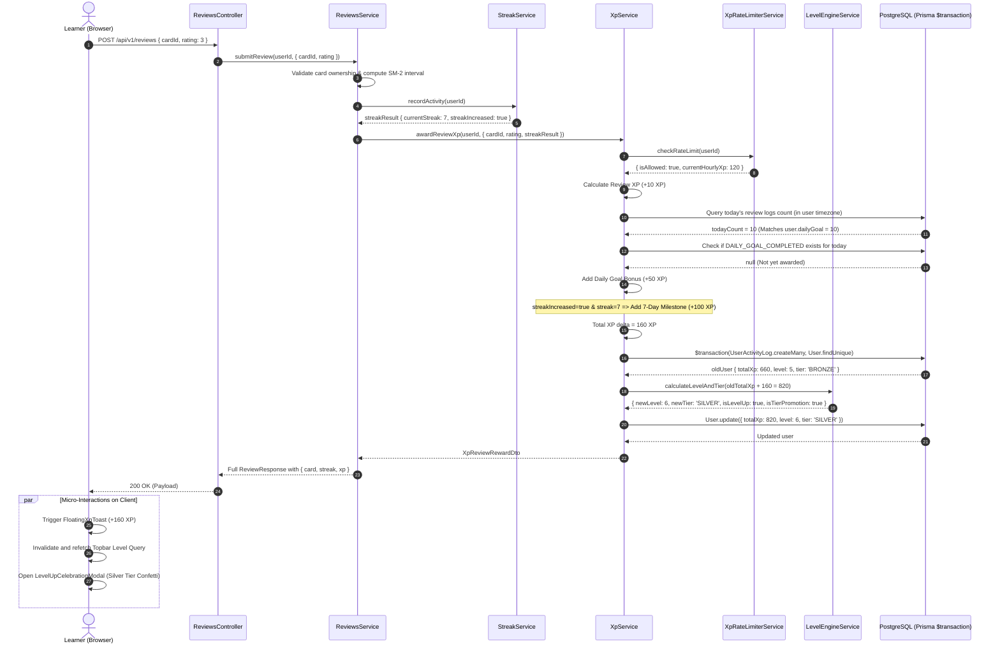
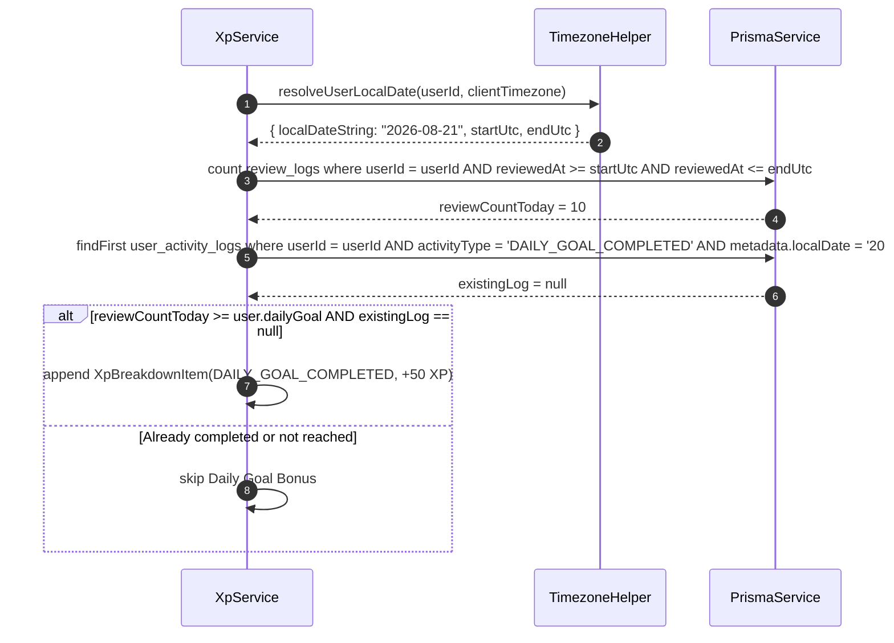
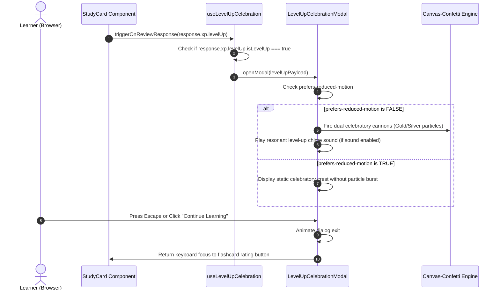

# Technical Architecture & System Implementation Plan: Gamification XP & Learner Levels

- **Feature**: Experience Points (XP) & Learner Levels System
- **Feature Slug**: `gamification-xp-levels`
- **Target Backlog Item**: `US-GAME-03`
- **Specification Phase**: Phase 3 (speckit-plan)
- **Status**: **APPROVED (Ready for Implementation)**
- **Author**: WordStreak Senior System Architect
- **Date**: 2026-08-21
- **Target Branch**: `feat/gamification-xp-levels`

---

## 1. Component Architecture & Monorepo Boundaries

WordStreak strictly adheres to a modular Clean Architecture in a TypeScript monorepo (`pnpm workspace`). Application boundaries are strictly decoupled:

- **`packages/shared-types`**: Single source of truth for DTOs, Enums, and interfaces shared across Web and API.
- **`apps/api`**: NestJS 11 modular backend with Prisma ORM. Never imports from `apps/web`.
- **`apps/web`**: React 19 + Vite frontend. Never imports directly from `apps/api`.

---

## 2. Sequence Diagrams

### 2.1 Flashcard Review XP & Streak Milestone Flow

The primary hot path: when a learner rates a flashcard, the backend orchestrates SRS scheduling, streak incrementing, XP rate limit verification, daily goal detection, milestone evaluation, and executes an atomic single database transaction.

---

### 2.2 Daily Goal Evaluation Flow

---

### 2.3 Level-Up & Tier Promotion Modal Flow

---

## 3. Architecture Decision Records (ADRs)

### ADR-001: Atomic Activity Ledger (`UserActivityLog`) vs Denormalized Total XP on User Table

- **Status**: **ACCEPTED**
- **Context**:
  Querying lifetime XP from `SUM(xpEarned)` across millions of activity log records on every HTTP request introduces high CPU and I/O bottlenecks. Conversely, storing only `User.totalXp` without an audit log creates irrecoverable state upon concurrency bugs, prevents historical analytics, and disables rate limit velocity verification.
- **Decision**:
  Implement a **Dual-Write Architecture inside a Single PostgreSQL `$transaction`**:
  1. `User.totalXp`, `User.level`, and `User.tier` are denormalized columns on the `users` table for $O(1)$ read performance by the Topbar widget and review payloads.
  2. An immutable append-only record is inserted into `user_activity_logs` for every XP event.
- **Consequences**:
  - **Pros**: Sub-millisecond read access to user level data; 100% auditability and replayability; trivial recalculation during migrations.
  - **Cons**: Minor write overhead during review submission ($\approx 3\text{ms}$ inside the transaction). Handled with compound indexes.

---

### ADR-002: Monotonic Polynomial-Power Level Curve Algorithm

- **Status**: **ACCEPTED**
- **Context**:
  Linear level curves ($100 \times L$) result in learners leveling up too fast at high levels. Pure exponential curves ($100 \times 2^L$) create an impossible grind wall by Level 15. We require an engaging curve that provides rapid early gratification (Levels 1–5 in week 1) and steady, achievable long-term progression up to Level 50+.
- **Decision**:
  Adopt the **1.5 Power-Polynomial Curve**:
  $$\text{threshold}(L) = \left\lfloor 50 \times (L - 1)^{1.5} + 50 \times (L - 1) \right\rfloor$$

  **Progression Curve Benchmarks**:
  - Level 1: 0 XP
  - Level 2: 100 XP (1 day of reviews + goal)
  - Level 5: 600 XP ($\approx 5$ days of steady reviews)
  - Level 6 (Silver Tier): 810 XP ($\approx 1$ week)
  - Level 16 (Gold Tier): 3,650 XP ($\approx 1$ month)
  - Level 31 (Diamond Tier): 9,710 XP ($\approx 3$ months)
  - Level 46 (Master Tier): 17,340 XP ($\approx 6$ months)

- **Consequences**:
  - **Pros**: Pure deterministic formula without lookup table memory overhead; predictable milestone distribution; identical calculation on backend and frontend.
  - **Cons**: Requires fractional exponent calculation (`Math.pow`), which executes in $<0.01\text{ms}$.

---

### ADR-003: XP Velocity Rate Limiting Strategy (Sliding Window & DB Guard)

- **Status**: **ACCEPTED**
- **Context**:
  Malicious users or rogue browser scripts could spam review endpoints at 50 requests/sec, gaining thousands of unearned XP.
- **Decision**:
  Enforce a two-tier velocity check:
  1. **Primary Guard**: In-memory Redis/LRU rolling counter tracking hourly XP per user (max 500 XP/hr).
  2. **Secondary Fallback**: If cache is cold, perform an indexed query `SUM(xpEarned) WHERE userId = ? AND createdAt >= NOW() - INTERVAL '1 HOUR' AND activityType = 'CARD_REVIEW'`.
  3. When rate limited, the review's SM-2 interval is updated normally, but XP is suppressed (`0 XP` awarded) with a structured warning log.
- **Consequences**:
  - Protects economy integrity and leaderboard fairness without breaking the learner's study momentum.

---

### ADR-004: Anti-AI Slop & Minimalist Design System Adherence

- **Status**: **ACCEPTED**
- **Context**:
  Standard AI-generated gamification interfaces often inject cluttered gradients, garish saturated badges, excessive floating dialogs, and heavy 3D assets that violate the clean, minimalist WordStreak design ethos ([apps/web/DESIGN.md](apps/web/DESIGN.md)).
- **Decision**:
  All gamification UI components must strictly follow WordStreak design tokens:
  1. **Canvas**: Pure white canvas (`#ffffff`) with 1px hairline borders (`#e5e5e5`).
  2. **Topbar Pill**: Obsidian black pill (`#000000`) or clean bordered pill with 4px thin liquid progress bar and SF Pro Rounded/Nunito typography.
  3. **Tier Colors**: Minimalist refined metallic accents:
     - Bronze: `#B45309` (Amber-700)
     - Silver: `#94A3B8` (Slate-400)
     - Gold: `#D97706` (Amber-600)
     - Diamond: `#06B6D4` (Cyan-500)
     - Master: `#8B5CF6` (Royal Violet / WordStreak Accent)
  4. **Celebration Modal**: Obsidian frosted glass backdrop (`#090909/95`) with 1px border (`#ffffff/10`) and zero decorative clutter.
- **Consequences**:
  - Cohesive, high-craft user experience that reinforces brand quality without distracting from vocabulary learning.

---

## 4. Architectural Quality Checklist

- [x] Monorepo boundaries strictly maintained (shared types extracted, no cross-app imports).
- [x] All 3 core sequence diagrams modeled with error branches.
- [x] 4 ADRs documented with explicit rationale, formulas, and trade-offs.
- [x] Design token compliance verified against `apps/web/DESIGN.md` and `apps/web/MEMORY.md`.
