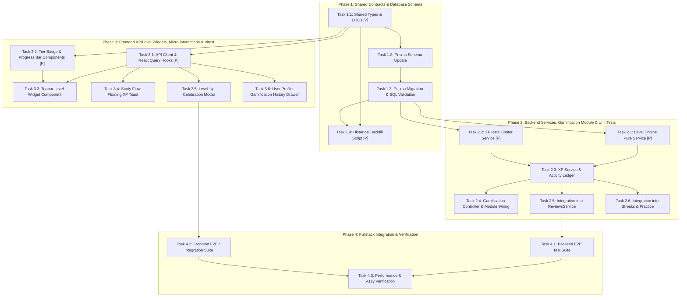

# Task Breakdown: Gamification XP & Learner Levels System

- **Feature**: Experience Points (XP) & Learner Levels System
- **Feature Slug**: `gamification-xp-levels`
- **Target Backlog Item**: `US-GAME-03`
- **Specification Phase**: Phase 4 (speckit-tasks)
- **Status**: **APPROVED (Ready for Implementation)**
- **Author**: WordStreak Technical Planning Specialist & Senior Architect
- **Date**: 2026-08-21
- **Target Branch**: `feat/gamification-xp-levels`

---

## Execution Overview & Dependency Graph

---

## Phase 1: Shared Contracts & Database Schema

### [P] Task 1.1: Shared Types & DTO Definitions

- **Target Files**:
  - `packages/shared-types/src/gamification-xp.ts`
  - `packages/shared-types/src/index.ts`
- **Description**:
  Create the shared contract module with `MasteryTier` enum, `XpActionType` enum, pure mathematical formulas (`calculateThresholdForLevel`, `calculateLevelFromXp`, `calculateTierFromLevel`, `calculateLevelProgress`), `TIER_METADATA_CONFIG`, and DTOs (`XpBreakdownItem`, `LevelUpEventDto`, `XpReviewRewardDto`, `XpSummaryResponseDto`, `UserActivityLogItemDto`, `XpHistoryQueryDto`, `XpHistoryResponseDto`, `AwardPracticeXpDto`, `PracticeQuizXpRewardDto`). Export everything in `index.ts`.
- **Verification**: `pnpm --filter @wordstreak/shared-types build` passes without errors.

---

### Task 1.2: Prisma Schema Update

- **Target Files**:
  - `apps/api/prisma/schema.prisma`
- **Description**:
  Extend `User` model with `totalXp Int @default(0)`, `level Int @default(1)`, `tier String @default("BRONZE")`, and relation `activityLogs UserActivityLog[]`. Add new `UserActivityLog` model with fields `id`, `userId`, `activityType`, `xpEarned`, `metadata Json?`, `createdAt DateTime @default(now())`, foreign key relation to `User` with `onDelete: Cascade`, and indexes `@@index([userId, createdAt])`, `@@index([userId, activityType])`, `@@index([createdAt])`.
- **Verification**: `pnpm --filter api prisma validate` succeeds.

---

### Task 1.3: Prisma Migration & SQL Validation

- **Target Files**:
  - `apps/api/prisma/migrations/20260821000001_add_gamification_xp_and_activity_logs/migration.sql`
- **Description**:
  Generate and execute the migration. Verify that columns on `users` and table `user_activity_logs` are created cleanly with default values and compound indexes.
- **Verification**: `pnpm --filter api prisma migrate dev` applies migration successfully.

---

### [P] Task 1.4: Historical Backfill Script

- **Target Files**:
  - `apps/api/src/scripts/backfill-xp.ts`
- **Description**:
  Create an idempotent CLI script that scans existing users with 0 total XP and 0 activity logs, calculates total XP based on legacy `review_logs` (rating $\ge 2 \rightarrow +10\text{ XP}$) and `user_streaks` ($100\text{ XP}/7\text{d}, 500\text{ XP}/30\text{d}$), inserts initial `HISTORICAL_BACKFILL` activity logs, and updates `totalXp`, `level`, and `tier`.
- **Verification**: Run `pnpm --filter api tsx src/scripts/backfill-xp.ts` against local test seed and verify that existing users receive correct XP and levels without duplication.

---

## Phase 2: Backend Services, Gamification Module & Unit Tests

### [P] Task 2.1: Level Engine Pure Service & Unit Tests

- **Target Files**:
  - `apps/api/src/modules/gamification/services/level-engine.service.ts`
  - `apps/api/src/modules/gamification/services/level-engine.service.spec.ts`
- **Description**:
  Implement pure, stateless NestJS injectable service `LevelEngineService` wrapping `@wordstreak/shared-types` formulas. Implement full unit test matrix verifying Level 1 through Level 50+ boundaries, tier transitions (Bronze $\rightarrow$ Silver at Lv 6, Silver $\rightarrow$ Gold at Lv 16, Gold $\rightarrow$ Diamond at Lv 31, Diamond $\rightarrow$ Master at Lv 46), and zero negative level edge cases.
- **Verification**: `pnpm --filter api test level-engine.service.spec.ts` passes with 100% coverage.

---

### [P] Task 2.2: XP Velocity Rate Limiter Service & Unit Tests

- **Target Files**:
  - `apps/api/src/modules/gamification/services/xp-rate-limiter.service.ts`
  - `apps/api/src/modules/gamification/services/xp-rate-limiter.service.spec.ts`
- **Description**:
  Implement `XpRateLimiterService` enforcing sliding window caps of 500 XP/hr and 2,000 XP/24h for card reviews. Include in-memory rolling buffer with database fallback to `user_activity_logs` aggregation.
- **Verification**: `pnpm --filter api test xp-rate-limiter.service.spec.ts` verifies rate limit triggers and warning logging.

---

### Task 2.3: XP Service & Activity Ledger Transaction

- **Target Files**:
  - `apps/api/src/modules/gamification/services/xp.service.ts`
  - `apps/api/src/modules/gamification/services/xp.service.spec.ts`
- **Description**:
  Implement `XpService` providing:
  - `awardReviewXp(userId, { cardId, rating, streakResult, clientTimezone })`: Handles rate limiting, card review XP (+10/+5/0), daily goal completion check (+50 XP), streak milestone check (+100/+500 XP), and executes atomic `$transaction`.
  - `getXpSummary(userId, clientTimezone)`: Returns real-time progress details and today's earned XP.
  - `getXpHistory(userId, query)`: Returns paginated user activity ledger items.
  - `awardPracticeQuizXp(userId, dto)`: Awards practice quiz XP (+30/+10) with 5 daily grants cap.
- **Verification**: Unit tests mock Prisma transaction and verify all combination branches (card review + goal + milestone simultaneously, rate limited state, single grant deduplication).

---

### Task 2.4: Gamification Controller & Module Wiring

- **Target Files**:
  - `apps/api/src/modules/gamification/xp.controller.ts`
  - `apps/api/src/modules/gamification/xp.controller.spec.ts`
  - `apps/api/src/modules/gamification/gamification.module.ts`
  - `apps/api/src/app.module.ts`
- **Description**:
  Create `XpController` exposing:
  - `GET /api/v1/gamification/xp/summary`
  - `GET /api/v1/gamification/xp/history`
  - `POST /api/v1/gamification/xp/practice`
    Configure `GamificationModule` with exports and import into root `AppModule`.
- **Verification**: Controller unit tests verify authenticated route guards and query validation.

---

### Task 2.5: Integration into ReviewsService & Submit Review API

- **Target Files**:
  - `apps/api/src/modules/reviews/reviews.service.ts`
  - `apps/api/src/modules/reviews/reviews.controller.ts`
  - `apps/api/src/modules/reviews/reviews.module.ts`
  - `apps/api/src/modules/reviews/reviews.service.spec.ts`
- **Description**:
  Inject `XpService` into `ReviewsService`. Update `submitReview` to call `xpService.awardReviewXp(...)` and return composite response payload containing card progress, streak, and `xp: XpReviewRewardDto`.
- **Verification**: `pnpm --filter api test reviews.service.spec.ts` passes with updated response schema.

---

### Task 2.6: Integration into StreaksModule & PracticeModule

- **Target Files**:
  - `apps/api/src/modules/streaks/streak.service.ts`
  - `apps/api/src/modules/practice/practice.service.ts`
- **Description**:
  Ensure streak milestones pass `streakIncreased` metadata cleanly to review flow. Connect practice quiz completion endpoint to `awardPracticeQuizXp`.
- **Verification**: Streaks and practice unit tests pass with XP integration.

---

## Phase 3: Frontend XP/Level Widgets, Micro-interactions & Vitest

### [P] Task 3.1: API Client & React Query Hooks

- **Target Files**:
  - `apps/web/src/features/gamification/api/xpApi.ts`
  - `apps/web/src/features/gamification/hooks/useXpSummary.ts`
  - `apps/web/src/features/gamification/hooks/useXpHistory.ts`
- **Description**:
  Implement frontend Axios/Fetch client functions for XP summary and history. Implement `useXpSummary` and `useXpHistory` using TanStack React Query with cache keys `['gamification', 'summary']` and `['gamification', 'history']`.
- **Verification**: Unit tests mock API responses and verify query cache invalidation.

---

### [P] Task 3.2: Tier Badge & Progress Bar Components

- **Target Files**:
  - `apps/web/src/features/gamification/components/TierBadgeIcon.tsx`
  - `apps/web/src/features/gamification/components/XpProgressBar.tsx`
  - `apps/web/src/features/gamification/components/TierBadgeIcon.spec.tsx`
- **Description**:
  Build SVG metallic tier badges (`Bronze`, `Silver`, `Gold`, `Diamond`, `Master`) matching WordStreak design tokens. Build liquid 4px progress bar with smooth Framer Motion spring physics (`stiffness: 300, damping: 30`).
- **Verification**: Vitest tests render all 5 tiers and verify color tokens and progress fill widths.

---

### Task 3.3: Topbar Level Widget Component

- **Target Files**:
  - `apps/web/src/features/gamification/components/TopbarLevelWidget.tsx`
  - `apps/web/src/features/gamification/components/TopbarLevelWidget.spec.tsx`
  - `apps/web/src/components/layout/Header.tsx`
- **Description**:
  Build the compact Topbar Level Pill widget (`rounded-full`, 36px height) rendering tier crest, `Lv. X`, and thin progress bar. Implement hover popover showing Lifetime XP, XP needed for next level, and next tier unlock preview. Mount into `Header.tsx`.
- **Verification**: Vitest tests verify layout rendering, popover trigger on hover, and mobile responsive compactness.

---

### Task 3.4: Study Flow Floating XP Toast Micro-interaction

- **Target Files**:
  - `apps/web/src/features/gamification/components/FloatingXpToast.tsx`
  - `apps/web/src/features/gamification/components/FloatingXpToast.spec.tsx`
  - `apps/web/src/features/study/StudyCard.tsx`
- **Description**:
  Implement lightweight floating badge component that animates upward 24px and fades over 800ms adjacent to the clicked review button. Respects `prefers-reduced-motion`.
- **Verification**: Vitest tests verify animation keyframes and non-blocking DOM removal upon completion.

---

### Task 3.5: Level-Up Celebration Modal with Confetti

- **Target Files**:
  - `apps/web/src/features/gamification/components/LevelUpCelebrationModal.tsx`
  - `apps/web/src/features/gamification/hooks/useLevelUpCelebration.ts`
  - `apps/web/src/features/gamification/components/LevelUpCelebrationModal.spec.tsx`
- **Description**:
  Create the Obsidian dark celebration modal dialog (`bg-slate-950/95 backdrop-blur-2xl border border-white/10 rounded-2xl`). Trigger `canvas-confetti` explosion with tier metallic particles upon open. Support `Escape` key and click-outside dismissal, restoring study card focus.
- **Verification**: Vitest tests verify modal mount on `isLevelUp: true`, keyboard trapping, and reduced-motion fallback.

---

### Task 3.6: User Profile Gamification History Drawer

- **Target Files**:
  - `apps/web/src/features/gamification/components/XpHistoryDrawer.tsx`
- **Description**:
  Build paginated activity log drawer/tab in user profile showing detailed activity history entries (`CARD_REVIEW`, `DAILY_GOAL_COMPLETED`, `STREAK_7_DAYS`) with timestamps and XP badges.
- **Verification**: Vitest tests verify pagination and activity type icons.

---

## Phase 4: Fullstack Integration & Verification

### Task 4.1: Backend E2E Test Suite

- **Target Files**:
  - `apps/api/test/gamification-xp.e2e-spec.ts`
- **Description**:
  Create comprehensive Supertest suite executing full flow: Register user $\rightarrow$ Submit reviews $\rightarrow$ Cross daily goal (+50 XP) $\rightarrow$ Cross Level 2 threshold $\rightarrow$ Verify `User.totalXp`, `User.level`, and `user_activity_logs` in DB $\rightarrow$ Test hourly velocity rate limiting limit.
- **Verification**: `pnpm --filter api test:e2e` passes 100%.

---

### Task 4.2: Frontend E2E / Integration Suite

- **Target Files**:
  - `apps/web/e2e/gamification-xp-flow.spec.ts`
- **Description**:
  Implement Playwright end-to-end test: Log in $\rightarrow$ Open study session $\rightarrow$ Rate cards $\rightarrow$ Verify floating XP toast $\rightarrow$ Verify topbar level bar fill $\rightarrow$ Trigger Level Up modal $\rightarrow$ Dismiss modal with `Escape`.
- **Verification**: Playwright test passes on desktop and mobile viewports.

---

### Task 4.3: Performance Benchmarking & Anti-Slop Design Token Audit

- **Target Files**:
  - Verification across `apps/api/` and `apps/web/`
- **Description**:
  1. Measure review submission latency with XP calculation ($P95 < 50\text{ms}$).
  2. Execute a11y audit (WCAG 2.1 AA contrast ratio $> 4.5:1$, keyboard navigation, `prefers-reduced-motion`).
  3. Validate design token compliance against [`apps/web/DESIGN.md`](apps/web/DESIGN.md) (no unauthorized colors, pure `#ffffff` canvas, `#000000` obsidian pills).
- **Verification**: All quality gates and audit checks pass.
