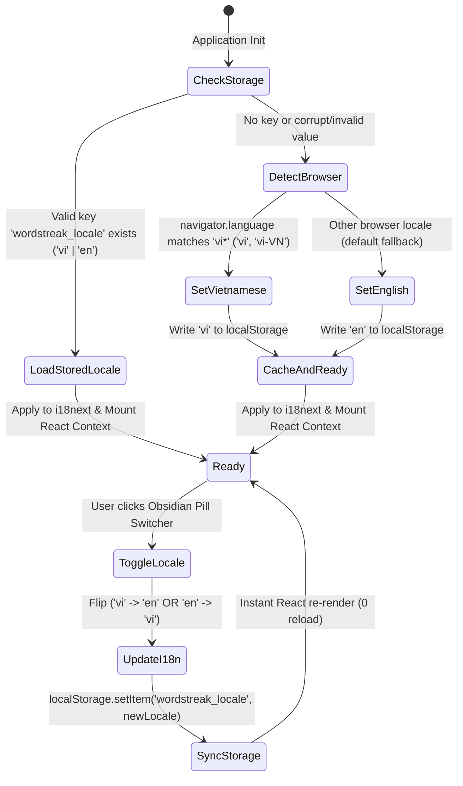

# Domain Model: Core i18n Infrastructure & Instant Language Switcher (US-I18N-01)

- **Feature Slug**: `i18n-core-switcher`
- **Backlog Reference**: `US-I18N-01`
- **Date**: 2026-08-22
- **Author**: Business Analyst Agent

---

## 1. RBAC Matrix

| Role                | View Localized UI | Toggle Language  |   Persist to Storage    |  Customize Namespaces  |
| :------------------ | :---------------: | :--------------: | :---------------------: | :--------------------: |
| **Guest / Visitor** |      ✅ Yes       | ✅ Yes (1-Click) | ✅ Yes (`localStorage`) | ❌ No (System default) |
| **Learner**         |      ✅ Yes       | ✅ Yes (1-Click) | ✅ Yes (`localStorage`) | ❌ No (System default) |
| **Pro Subscriber**  |      ✅ Yes       | ✅ Yes (1-Click) | ✅ Yes (`localStorage`) | ❌ No (System default) |
| **Content Creator** |      ✅ Yes       | ✅ Yes (1-Click) | ✅ Yes (`localStorage`) | ❌ No (System default) |
| **System Admin**    |      ✅ Yes       | ✅ Yes (1-Click) | ✅ Yes (`localStorage`) | ❌ No (System default) |

_Note_: Language toggle is a global, client-side preference that does not require user authentication or role authorization.

---

## 2. Locale State Machine & Lifecycle



### State Transition Table

| Current State      | Event / Trigger        | Guard Condition                  | Next State         | Actions / Side Effects                                 |
| :----------------- | :--------------------- | :------------------------------- | :----------------- | :----------------------------------------------------- |
| `Uninitialized`    | App Boot / Mount       | None                             | `CheckingStorage`  | Read `localStorage.getItem('wordstreak_locale')`       |
| `CheckingStorage`  | Value Found            | `val === 'vi' \|\| val === 'en'` | `Ready`            | Initialize i18next with `val`                          |
| `CheckingStorage`  | Value Absent / Invalid | `val !== 'vi' && val !== 'en'`   | `DetectingBrowser` | Read `navigator.languages` / `navigator.language`      |
| `DetectingBrowser` | Vietnamese Detected    | `lang.startsWith('vi')`          | `Ready`            | Set i18n locale `vi`, cache to `localStorage`          |
| `DetectingBrowser` | Other Language         | `!lang.startsWith('vi')`         | `Ready`            | Set i18n locale `en`, cache to `localStorage`          |
| `Ready`            | Switcher Click         | Click event on Obsidian Pill     | `Switching`        | Determine opposite locale (`vi` ↔ `en`)                |
| `Switching`        | State Updated          | Valid target locale              | `Ready`            | `i18n.changeLanguage(next)`, persist to `localStorage` |

---

## 3. Business Rules (`BR-I18N-###`)

- **`BR-I18N-001 (Supported Locales)`**: The system strictly supports two ISO 639-1 language codes: `'vi'` (Tiếng Việt) and `'en'` (English).
- **`BR-I18N-002 (Browser Detection Rule)`**: On initial visit with no stored preference:
  - If `navigator.language` or any entry in `navigator.languages` starts with `'vi'`, active locale is `'vi'`.
  - In all other cases, active locale defaults to `'en'`.
- **`BR-I18N-003 (Fallback Strategy)`**:
  - The base fallback language for the entire application is `'en'`.
  - If a translation key is missing in `'vi'`, the runtime shall resolve the corresponding string from `'en'`.
  - If a key is missing in all locales, `i18next` outputs the key without crashing.
- **`BR-I18N-004 (Persistence Key)`**: Client preference must be stored in `localStorage` under the exact key `'wordstreak_locale'`.
- **`BR-I18N-005 (Zero-Reload Transition)`**: Switching language must update the React component tree reactively without invoking `window.location.reload()` or disrupting in-flight forms or client state.
- **`BR-I18N-006 (Namespace Isolation)`**: Translations must be partitioned into 9 domain namespaces:
  1. `common` — Global navigation, actions, buttons, generic alerts, headers, footers.
  2. `auth` — Login, registration, password recovery, verification, OAuth prompts.
  3. `dashboard` — Dashboard metrics, streak widgets, goal trackers, recent activity.
  4. `decks` — Deck listings, deck creation, deck cards, deck tags, deck modal actions.
  5. `study` — Flashcard review interface, SRS rating buttons (Again, Hard, Good, Easy), study summary.
  6. `practice` — Quiz modes (Multiple Choice, Fill in Blank, Word Matching, Listening).
  7. `community` — Public deck gallery, ratings, clone deck actions, search filters.
  8. `analytics` — Accuracy charts, learning pace, heatmaps, SRS interval retention metrics.
  9. `settings` — User profile settings, avatar picker, password management, audio preferences.
- **`BR-I18N-007 (Obsidian Pill Geometry & Styling)`**:
  - Background: `#000000` (Obsidian Dark) with smooth backdrop blur.
  - Border: 1px hairline border (`#e5e5e5` in light mode, `#262626` in dark mode / hover `#404040`).
  - Content: Flag emoji/icon (`🇻🇳` / `🇬🇧`) + Uppercase locale code (`VI` / `EN`).
  - Shape: `rounded-full` (Pill geometry).
  - Transition: Smooth hover opacity/scale (100–150ms) without triggering repaint jitter.
- **`BR-I18N-008 (Anti-Jitter Layout Stability)`**:
  - The switcher container must have an explicit min-width (`min-w-[72px]`) and fixed height (`h-8` or `h-9`) to ensure `VI` and `EN` text widths do not induce Cumulative Layout Shift (CLS = 0) or 60Hz hover jitter.

---

## 4. Namespace Architecture & Type Contracts

```typescript
// apps/web/src/locales/types.ts
export type SupportedLocale = "vi" | "en";

export type TranslationNamespaces = {
  common: typeof import("./vi/common.json");
  auth: typeof import("./vi/auth.json");
  dashboard: typeof import("./vi/dashboard.json");
  decks: typeof import("./vi/decks.json");
  study: typeof import("./vi/study.json");
  practice: typeof import("./vi/practice.json");
  community: typeof import("./vi/community.json");
  analytics: typeof import("./vi/analytics.json");
  settings: typeof import("./vi/settings.json");
};

declare module "i18next" {
  interface CustomTypeOptions {
    defaultNS: "common";
    resources: TranslationNamespaces;
  }
}
```

---

## 5. Workflows & Edge Cases

### 1. First Visit Workflow

1. User loads `WordStreak`.
2. Core i18n detector checks `localStorage.getItem('wordstreak_locale')` → returns `null`.
3. Detector evaluates `navigator.language`.
4. If `vi-VN` → loads `vi` resources, writes `'vi'` to `localStorage`.
5. Application renders Vietnamese strings instantly on Landing Page.

### 2. Manual Toggle Workflow

1. User clicks the `LanguageSwitcher` pill on Header or DashboardNavbar.
2. Event handler invokes `i18n.changeLanguage(newLocale)`.
3. New locale is written to `localStorage.setItem('wordstreak_locale', newLocale)`.
4. `react-i18next` triggers re-render across all mounted components using `useTranslation()`.
5. P95 latency is < 16ms, zero page reload occurs.

### 3. Corrupt / Tampered Storage Recovery

1. User or third-party script set `localStorage.setItem('wordstreak_locale', 'invalid_code')`.
2. On app load, validation detects value is not in `['vi', 'en']`.
3. Validation discards invalid value and runs browser detection fallback.
4. Correct valid locale is written back to `localStorage`.

### 4. Storage Quota / Private Browsing Error

1. If `localStorage` write throws a `QuotaExceededError` or `SecurityError` (incognito restrictions), catch error silently and retain locale in React / i18next runtime memory.

---

## 6. UX States & Non-Functional Requirements

### UX States

- **Idle / Active State**: Clean Obsidian Pill showing current flag and uppercase code (`🇻🇳 VI` or `🇬🇧 EN`).
- **Hover State**: Subtle hairline border highlight (`border-neutral-600` or `#404040`) and soft background elevation (`bg-neutral-900/80`).
- **Active / Press State**: Micro-scale compression (`scale-95`) with 100ms spring return.
- **Focus-Visible State**: Accessible focus ring (`ring-2 ring-primary-500 ring-offset-2 ring-offset-black`).

### Non-Functional Requirements (NFRs)

- **NFR-PERF-01 (Toggle Latency)**: Switch execution time < 16ms (within 1 frame at 60fps).
- **NFR-PERF-02 (Bundle Footprint)**: Core i18n dependencies + initial namespaces overhead < 15KB gzipped.
- **NFR-CLS-01 (Layout Stability)**: Switching languages or hovering the pill causes 0 Cumulative Layout Shift (`CLS = 0.00`).
- **NFR-A11Y-01 (Accessibility)**: Conforms to WCAG 2.1 AA. Dynamic `aria-label` announces target action (`"Chuyển sang Tiếng Anh"` / `"Switch to Vietnamese"`). Keyboard navigable via Tab and triggered with Enter / Space.
