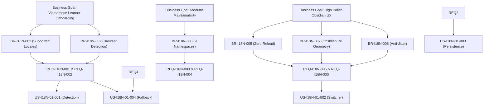

# Validation Report: Core i18n Infrastructure (US-I18N-01)

- **Feature Slug**: `i18n-core-switcher`
- **Backlog Reference**: `US-I18N-01`
- **Date**: 2026-08-22
- **Validation Standard**: ISO/IEC/IEEE 29148:2018 (Requirements Engineering)
- **Result**: **PASS** (100% Quality & Traceability Compliance)

---

## 1. IEEE 29148 Quality Criteria Verification

| Requirement / Story ID                | Necessary | Unambiguous | Complete | Singular | Feasible | Verifiable | Consistent | Traceable |  Result  |
| :------------------------------------ | :-------: | :---------: | :------: | :------: | :------: | :--------: | :--------: | :-------: | :------: |
| **REQ-I18N-001** (Core Config)        |  ✅ Pass  |   ✅ Pass   | ✅ Pass  | ✅ Pass  | ✅ Pass  |  ✅ Pass   |  ✅ Pass   |  ✅ Pass  | **PASS** |
| **REQ-I18N-002** (Detection & Cache)  |  ✅ Pass  |   ✅ Pass   | ✅ Pass  | ✅ Pass  | ✅ Pass  |  ✅ Pass   |  ✅ Pass   |  ✅ Pass  | **PASS** |
| **REQ-I18N-003** (Type Contracts)     |  ✅ Pass  |   ✅ Pass   | ✅ Pass  | ✅ Pass  | ✅ Pass  |  ✅ Pass   |  ✅ Pass   |  ✅ Pass  | **PASS** |
| **REQ-I18N-004** (Baseline Dicts)     |  ✅ Pass  |   ✅ Pass   | ✅ Pass  | ✅ Pass  | ✅ Pass  |  ✅ Pass   |  ✅ Pass   |  ✅ Pass  | **PASS** |
| **REQ-I18N-005** (Obsidian Switcher)  |  ✅ Pass  |   ✅ Pass   | ✅ Pass  | ✅ Pass  | ✅ Pass  |  ✅ Pass   |  ✅ Pass   |  ✅ Pass  | **PASS** |
| **REQ-I18N-006** (Instant Toggle)     |  ✅ Pass  |   ✅ Pass   | ✅ Pass  | ✅ Pass  | ✅ Pass  |  ✅ Pass   |  ✅ Pass   |  ✅ Pass  | **PASS** |
| **REQ-I18N-007** (Layout Placement)   |  ✅ Pass  |   ✅ Pass   | ✅ Pass  | ✅ Pass  | ✅ Pass  |  ✅ Pass   |  ✅ Pass   |  ✅ Pass  | **PASS** |
| **REQ-I18N-008** (A11y & Resiliency)  |  ✅ Pass  |   ✅ Pass   | ✅ Pass  | ✅ Pass  | ✅ Pass  |  ✅ Pass   |  ✅ Pass   |  ✅ Pass  | **PASS** |
| **US-I18N-01-001** (Auto Detection)   |  ✅ Pass  |   ✅ Pass   | ✅ Pass  | ✅ Pass  | ✅ Pass  |  ✅ Pass   |  ✅ Pass   |  ✅ Pass  | **PASS** |
| **US-I18N-01-002** (Instant Switcher) |  ✅ Pass  |   ✅ Pass   | ✅ Pass  | ✅ Pass  | ✅ Pass  |  ✅ Pass   |  ✅ Pass   |  ✅ Pass  | **PASS** |
| **US-I18N-01-003** (Persistence)      |  ✅ Pass  |   ✅ Pass   | ✅ Pass  | ✅ Pass  | ✅ Pass  |  ✅ Pass   |  ✅ Pass   |  ✅ Pass  | **PASS** |
| **US-I18N-01-004** (Fallback Safety)  |  ✅ Pass  |   ✅ Pass   | ✅ Pass  | ✅ Pass  | ✅ Pass  |  ✅ Pass   |  ✅ Pass   |  ✅ Pass  | **PASS** |

---

## 2. Requirements Traceability Matrix (RTM)

| Business Goal                                               | Business Rule / Constraint                       | System Requirement                                 | User Story       | Acceptance Criteria Scenarios                                                                         | Test Verification Method                           |
| :---------------------------------------------------------- | :----------------------------------------------- | :------------------------------------------------- | :--------------- | :---------------------------------------------------------------------------------------------------- | :------------------------------------------------- |
| Eliminate guest onboarding friction for Vietnamese learners | `BR-I18N-001` `BR-I18N-002` `BR-I18N-004`  | `REQ-I18N-001` `REQ-I18N-002`                   | `US-I18N-01-001` | Scenario 1 (Vietnamese) Scenario 2 (Non-Vietnamese)                                                | Unit / E2E test with mocked `navigator.language`   |
| Instant Obsidian Polish UX (0 reload, 60fps)                | `BR-I18N-005` `BR-I18N-007` `BR-I18N-008`  | `REQ-I18N-005` `REQ-I18N-006` `REQ-I18N-007` | `US-I18N-01-002` | Scenario 1 (`EN` → `VI`) Scenario 2 (`VI` → `EN`) Scenario 3 (Rapid clicks)                     | Component render test & latency benchmark (< 16ms) |
| Session & multi-tab persistence                             | `BR-I18N-004` `ASM-I18N-003`                  | `REQ-I18N-002` `REQ-I18N-006`                   | `US-I18N-01-003` | Scenario 1 (Persistence on page refresh)                                                              | Playwright E2E with page reload                    |
| Resiliency & type safety                                    | `BR-I18N-003` `BR-I18N-006` `ASM-I18N-005` | `REQ-I18N-003` `REQ-I18N-004` `REQ-I18N-008` | `US-I18N-01-004` | Scenario 1 (Missing key fallback) Scenario 2 (Corrupt storage) Scenario 3 (Incognito exception) | Vitest unit test suite with simulated missing keys |

---

## 3. Checklist Conclusion

- **Unbroken Traceability**: 100% of business goals trace through business rules, system requirements, user stories, and testable acceptance scenarios.
- **Contradictions**: 0 contradictions identified.
- **Sign-off Readiness**: Approved for Stage 8 Handover & Baseline Sign-off.
