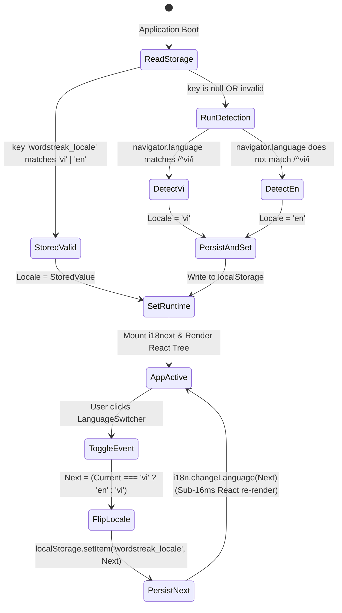

# Data Model & Storage Contracts: Core i18n Infrastructure & Instant Language Switcher

**Feature**: `i18n-core-switcher` (`US-I18N-01`)  
**Date**: 2026-08-22  
**Status**: Signed-Off

---

## 1. Domain Entities & Type Definitions

```typescript
/**
 * Strict ISO 639-1 language code union supported by WordStreak
 */
export type SupportedLocale = "vi" | "en";

/**
 * Metadata contract for supported language options
 */
export interface LocaleMetadata {
  code: SupportedLocale;
  label: "VI" | "EN";
  name: string;
  nativeName: string;
  flag: string;
  dir: "ltr";
}

/**
 * 9 Core Domain Namespaces for modular translation partitioning
 */
export type DomainNamespace =
  | "common"
  | "auth"
  | "dashboard"
  | "decks"
  | "study"
  | "practice"
  | "community"
  | "analytics"
  | "settings";

/**
 * Configuration mapping for all supported locales
 */
export const SUPPORTED_LOCALES: Record<SupportedLocale, LocaleMetadata> = {
  vi: {
    code: "vi",
    label: "VI",
    name: "Vietnamese",
    nativeName: "Tiếng Việt",
    flag: "🇻🇳",
    dir: "ltr",
  },
  en: {
    code: "en",
    label: "EN",
    name: "English",
    nativeName: "English",
    flag: "🇬🇧",
    dir: "ltr",
  },
};

export const DEFAULT_LOCALE: SupportedLocale = "en";
export const DEFAULT_NAMESPACE: DomainNamespace = "common";
export const STORAGE_KEY = "wordstreak_locale" as const;
```

---

## 2. LocalStorage Persistence Contract

### Schema & Key Constraints

| Attribute          | Specification                                                                                        |
| :----------------- | :--------------------------------------------------------------------------------------------------- |
| **Storage Engine** | `window.localStorage` (with defensive memory fallback)                                               |
| **Storage Key**    | `'wordstreak_locale'`                                                                                |
| **Data Format**    | Plain String (`'vi'` or `'en'`)                                                                      |
| **Zod Schema**     | `z.enum(['vi', 'en'])`                                                                               |
| **Default Value**  | Evaluated dynamically via `navigator.language` (defaults to `'vi'` if starts with `vi`, else `'en'`) |

### Zod Validation Schema

```typescript
import { z } from "zod";

export const LocaleSchema = z.enum(["vi", "en"]);
export type LocaleSchemaType = z.infer<typeof LocaleSchema>;

export function validateStoredLocale(raw: unknown): SupportedLocale | null {
  const result = LocaleSchema.safeParse(raw);
  return result.success ? result.data : null;
}
```

---

## 3. Storage State Machine & Lifecycle Transitions



---

## 4. UI Component Contract: `LanguageSwitcher`

```typescript
export interface LanguageSwitcherProps {
  /** Optional custom CSS classes applied to the outer container */
  className?: string;
  /** UI style variant (default: 'obsidian') */
  variant?: "obsidian" | "compact";
  /** Optional callback invoked immediately after language toggle */
  onLocaleChange?: (locale: SupportedLocale) => void;
  /** Optional custom accessibility label override */
  ariaLabel?: string;
}
```

### Visual & Geometry Specs

| Property                 | Value                                                    | Rationale                                                    |
| :----------------------- | :------------------------------------------------------- | :----------------------------------------------------------- |
| **Surface Color**        | `#000000` (Obsidian Dark)                                | Adheres to `apps/web/DESIGN.md` Obsidian CTA standard        |
| **Border**               | `1px solid #e5e5e5` (Light mode) / `#262626` (Dark mode) | Subtle hairline elevation without drop shadows               |
| **Hover Border**         | `#404040` (Dark hover) / `#d4d4d4` (Light hover)         | Clean micro-interaction feedback                             |
| **Border Radius**        | `9999px` (`rounded-full`)                                | Geometric pill standard                                      |
| **Container Dimensions** | `min-w-[72px]`, `h-8` (32px), `px-2.5 py-1`              | Rigid outer anchor to prevent 60Hz hover jitter (CLS = 0.00) |
| **Content Typography**   | `font-mono text-xs font-bold tracking-wider text-white`  | Tabular monospace widths for glyph stability                 |

---

## 5. Domain Namespaces & Resource Schema

The 9 domain namespaces are partitioned as follows:

```typescript
export interface TranslationResources {
  common: CommonNamespace;
  auth: AuthNamespace;
  dashboard: DashboardNamespace;
  decks: DecksNamespace;
  study: StudyNamespace;
  practice: PracticeNamespace;
  community: CommunityNamespace;
  analytics: AnalyticsNamespace;
  settings: SettingsNamespace;
}
```

### Namespace Data Catalog

1. **`common`**: Navigation links, actions (`save`, `cancel`, `delete`, `edit`, `back`, `next`), search placeholders, general status (`loading`, `error`, `success`, `empty`), theme, language toggles, footer copyright.
2. **`auth`**: Login heading, email/password labels, register, forgot password, OAuth buttons (Google/GitHub), logout confirmation.
3. **`dashboard`**: Header greeting, streak counter, flame level tiers, quick actions, daily goal progress, learning stats overview.
4. **`decks`**: Deck list, create deck modal, import/export CSV/JSON, card count, deck tags, deck settings.
5. **`study`**: Flashcard flip prompt, SRS answer grading (`Again`, `Hard`, `Good`, `Easy`), session progress, complete screen.
6. **`practice`**: Quiz title, multiple choice questions, fill-in-the-blank, word matching, pronunciation practice mic banner.
7. **`community`**: Public deck gallery, explore search, creator badges, deck cloning, upvotes.
8. **`analytics`**: Retention rate, XP history, study time heatmap, mastery distribution.
9. **`settings`**: User profile, avatar changer, audio/sound effect toggle, password reset, account deletion.
