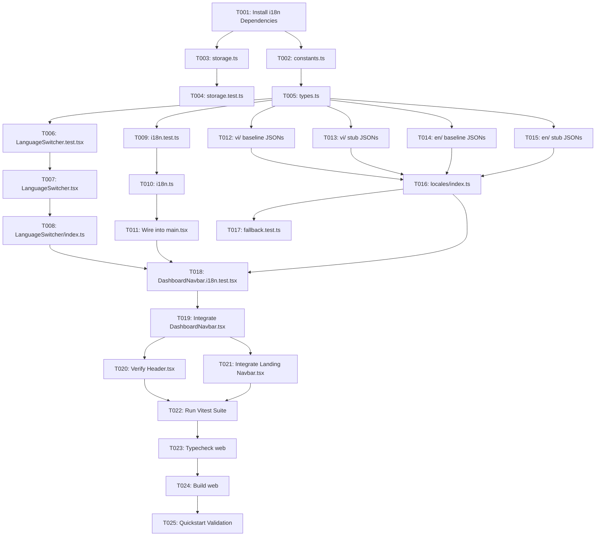

# Tasks: Core i18n Infrastructure & Instant Language Switcher

**Input**: Design documents from `.specify/features/i18n-core-switcher/`  
**Prerequisites**: [plan.md](./plan.md), [spec.md](./spec.md), [data-model.md](./data-model.md), [contracts/](./contracts/), [research.md](./research.md), [quickstart.md](./quickstart.md)  
**Feature Slug**: `i18n-core-switcher` | **Backlog Reference**: `US-I18N-01`

---

## Phase 1: Setup (Dependencies & Project Initialization)

**Purpose**: Add required i18n runtime packages to `apps/web/package.json`

- [x] T001 Install `i18next`, `react-i18next`, and `i18next-browser-languagedetector` in `apps/web/package.json`

---

## Phase 2: Foundational (Blocking Prerequisites)

**Purpose**: Core constants, resilient storage utility, and TypeScript namespace module declarations

**⚠️ CRITICAL**: Must complete before component and layout integration tasks

- [x] T002 [P] Create constants (`SUPPORTED_LOCALES`, `STORAGE_KEY`, `DEFAULT_LOCALE`) in `apps/web/src/locales/constants.ts`
- [x] T003 [P] Implement defensive storage utilities `safeGetLocale` and `safeSetLocale` in `apps/web/src/locales/utils/storage.ts`
- [x] T004 [P] Create unit test suite for storage utilities in `apps/web/src/locales/utils/__tests__/storage.test.ts`
- [x] T005 Implement TypeScript module declaration augmentation (`CustomTypeOptions`) in `apps/web/src/locales/types.ts`

**Checkpoint**: Foundational storage and types established.

---

## Phase 3: User Story 1 - Instant 1-Click Toggle via Obsidian Pill Switcher (Priority: P1) 🎯 MVP

**Goal**: Deliver the standalone Obsidian Pill `LanguageSwitcher` component with instant zero-reload language toggle and layout stability (`min-w-[72px]`, `rounded-full`, 1px hairline border).

**Independent Test**: Mount `LanguageSwitcher` in test harness, simulate click, verify locale toggles between `vi` and `en` with active display `🇻🇳 VI` ⇄ `🇬🇧 EN` within 16ms and zero layout jitter.

### Tests for User Story 1

> **NOTE: Write these tests FIRST, ensure they FAIL before implementation**

- [x] T006 [P] [US1] Create component tests for `LanguageSwitcher` verifying label, toggle click, keyboard trigger, and styling in `apps/web/src/components/LanguageSwitcher/LanguageSwitcher.test.tsx`

### Implementation for User Story 1

- [x] T007 [US1] Implement Obsidian Pill `LanguageSwitcher` component adhering to `apps/web/DESIGN.md` in `apps/web/src/components/LanguageSwitcher/LanguageSwitcher.tsx`
- [x] T008 [P] [US1] Create barrel export in `apps/web/src/components/LanguageSwitcher/index.ts`

**Checkpoint**: `LanguageSwitcher` component is fully functional, styled, and tested in isolation.

---

## Phase 4: User Story 2 - Automatic Browser Detection & Storage Persistence (Priority: P1)

**Goal**: Configure `i18next` with `i18next-browser-languagedetector` to inspect `navigator.language` on first visit and cache selection to `'wordstreak_locale'`.

**Independent Test**: Load `i18n.ts` under simulated `navigator.language = 'vi-VN'` and verify `i18n.language === 'vi'`; verify stored preference takes precedence on subsequent loads.

### Tests for User Story 2

- [x] T009 [P] [US2] Create unit test suite for i18n runtime initialization and browser detection in `apps/web/src/locales/__tests__/i18n.test.ts`

### Implementation for User Story 2

- [x] T010 [US2] Implement core `i18next` configuration and plugin pipeline in `apps/web/src/locales/i18n.ts`
- [x] T011 [US2] Import `./locales/i18n` in `apps/web/src/main.tsx` prior to React root render

**Checkpoint**: Browser detection and storage persistence are active on application boot.

---

## Phase 5: User Story 3 - Modular 9-Namespace Dictionaries & Fallback Resiliency (Priority: P1)

**Goal**: Create complete English and Vietnamese JSON resource files across all 9 domain namespaces (`common`, `auth`, `dashboard`, `decks`, `study`, `practice`, `community`, `analytics`, `settings`) with seamless fallback from `vi` to `en`.

**Independent Test**: Render localized strings from different namespaces; verify missing keys in `vi` fall back to `en` without crashing or printing key placeholders.

### Implementation for User Story 3

- [x] T012 [P] [US3] Create Vietnamese baseline dictionaries (`vi/common.json`, `vi/auth.json`, `vi/dashboard.json`, `vi/settings.json`) in `apps/web/src/locales/vi/`
- [x] T013 [P] [US3] Create Vietnamese stub dictionaries (`vi/decks.json`, `vi/study.json`, `vi/practice.json`, `vi/community.json`, `vi/analytics.json`) in `apps/web/src/locales/vi/`
- [x] T014 [P] [US3] Create English baseline dictionaries (`en/common.json`, `en/auth.json`, `en/dashboard.json`, `en/settings.json`) in `apps/web/src/locales/en/`
- [x] T015 [P] [US3] Create English stub dictionaries (`en/decks.json`, `en/study.json`, `en/practice.json`, `en/community.json`, `en/analytics.json`) in `apps/web/src/locales/en/`
- [x] T016 [US3] Create barrel export aggregating all namespace resources in `apps/web/src/locales/index.ts`
- [x] T017 [P] [US3] Create unit test verifying missing key fallback cascade in `apps/web/src/locales/__tests__/fallback.test.ts`

**Checkpoint**: All 9 domain namespaces populated in `vi` and `en` with type safety and fallback verification.

---

## Phase 6: User Story 4 - Responsive Cross-Layout Navigation Integration (Priority: P2)

**Goal**: Integrate `LanguageSwitcher` into `Header.tsx`, `DashboardNavbar.tsx`, and Landing Page `Navbar.tsx` with responsive layout alignment and zero layout shift.

**Independent Test**: Render `DashboardNavbar` and Landing `Navbar` across 320px, 768px, and 1280px breakpoints, verify switcher position, touch target accessibility, and localized nav link updates.

### Tests for User Story 4

- [x] T018 [P] [US4] Create integration test verifying language switcher interaction in `apps/web/src/features/dashboard/components/__tests__/DashboardNavbar.i18n.test.tsx`

### Implementation for User Story 4

- [x] T019 [US4] Integrate `LanguageSwitcher` into `apps/web/src/features/dashboard/components/DashboardNavbar.tsx` and translate nav links via `useTranslation('common')`
- [x] T020 [US4] Verify pass-through props and wrapper rendering in `apps/web/src/components/layout/Header.tsx`
- [x] T021 [US4] Integrate `LanguageSwitcher` into desktop action cluster and mobile drawer in `apps/web/src/features/landing/components/Navbar.tsx`

**Checkpoint**: All navigation headers feature the Obsidian Pill switcher with responsive alignment.

---

## Phase 7: Polish & Cross-Cutting Concerns

**Purpose**: Verification, quality gates, and build validation

- [x] T022 [P] Execute Vitest unit and integration test suite (`pnpm --filter web test:run`)
- [x] T023 Execute TypeScript typecheck with zero errors (`pnpm --filter web typecheck`)
- [x] T024 Execute production build verification (`pnpm --filter web build`)
- [x] T025 Execute end-to-end quickstart validation per `quickstart.md`

---

## Dependencies & Execution Order

---

## Parallel Opportunities

- **Phase 2**: `T002` (constants), `T003` (storage), and `T004` (storage test) can run in parallel.
- **Phase 3**: `T006` (switcher test) and `T008` (barrel export stub) can be prepared in parallel.
- **Phase 5**: `T012`, `T013`, `T014`, `T015` (all JSON translation dictionaries) can be generated completely in parallel across multiple workers.
- **Phase 6 / 7**: `T018` (integration test) and `T022` (test suite runner) can be executed as individual targets.

---

## Implementation Strategy & MVP Scope

- **MVP Target (Phases 1–3)**: Minimal viable deliverable comprises `i18next` runtime + Obsidian Pill `LanguageSwitcher` toggle working in isolation with unit tests passing.
- **Full Sprint 1 Release (Phases 1–7)**: Complete 9-namespace support, automatic browser detection with `localStorage` persistence, seamless cross-navigation integration (`Header.tsx`, `DashboardNavbar.tsx`, `Navbar.tsx`), 100% type safety, and zero-error build validation.
