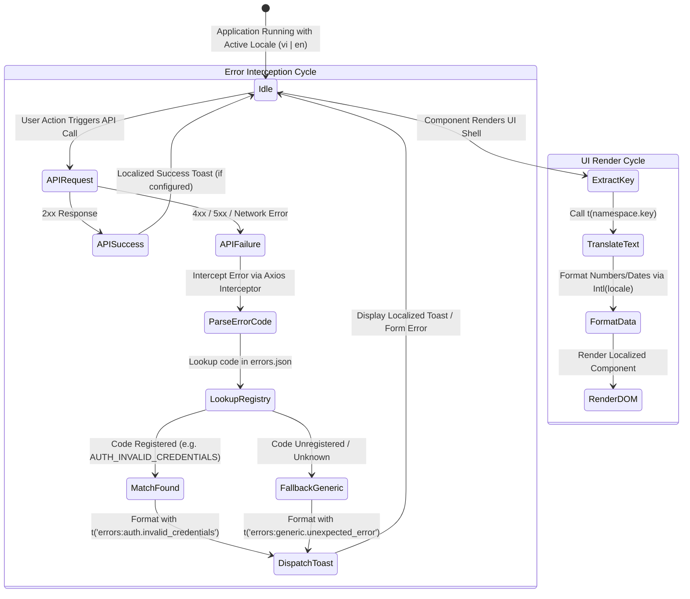

# Elicitation Interview: Complete UI Localization & Error Mapping (US-I18N-02)

- **Feature Slug**: `i18n-ui-localization`
- **Backlog Reference**: `US-I18N-02` (EPIC 10: Multi-language & Internationalization)
- **Date**: 2026-08-22
- **Interviewer**: Lead Business Analyst
- **Stakeholder / Sign-off**: Product Owner

---

## Stage 1 — Business Value

### 1. Problem & Pain Points

- **Current State Limitations**: Following the foundational delivery of `i18n-core-switcher` (`US-I18N-01`), the language toggle infrastructure exists, but significant portions of the application still contain hardcoded English strings, mixed Vietnamese/English views, and unlocalized UI chrome across complex modules (Decks, Cards, SRS Study, Practice Quiz modes, Speech Pronunciation, Gamification, Analytics, and Settings).
- **Leaked Technical Exceptions**: Backend API exceptions (NestJS `HttpException`, Prisma database errors, class-validator payload errors) frequently bubble up directly to end-user toasts as raw English error strings (e.g., `"Bad Request"`, `"deck_not_found"`, `"Token expired"`) or raw stack traces, creating user confusion and perceived unreliability.
- **Formatting Inconsistencies**: Numerical values (XP, card counts, streak counts) and dates/timestamps are rendered using default JavaScript formatters or hardcoded templates (e.g., `"1 cards"`, `"1000 XP"`, `"MM/DD/YYYY"`), which do not respect Vietnamese (`vi-VN`) or English (`en-US`) formatting standards or pluralization rules.
- **Risk of Over-Translation**: Without a strict boundary between UI Chrome and User-Generated Content (UGC), translation passes risk corrupting English vocabulary terms, phonetic IPA transcriptions, and custom study notes created by learners.
- **Consequence of Non-Action**: Poor user experience for Vietnamese learners (the core launch market), increased support burden due to unreadable error messages, inconsistent user interface branding, and degradation of flashcard study efficacy.

### 2. Target Personas

1. **Guest / Unauthenticated Visitor (`Persona-Guest`)**: Explores landing pages, public community decks, and authentication flows; requires 100% Vietnamese or English UI chrome and clear, friendly error feedback during login/registration.
2. **Authenticated Learner (`Persona-Learner`)**: Actively practices vocabulary, studies flashcards, completes quizzes, and tracks analytics; expects seamless native language UI chrome, locale-aware date/number formatting, and understandable error toasts when network or validation issues occur.
3. **Content Creator & Admin (`Persona-Admin` / `Persona-Creator`)**: Creates and curates community vocabulary decks; requires localized form controls, upload feedback, and clear validation errors while ensuring deck terms and definitions remain intact.

### 3. Success Metrics

- **Primary Business Metric**: 100% elimination of hardcoded strings across all 12 frontend feature modules and sub-screens.
- **Error Mapping Metric**: 100% of backend error codes mapped to localized, user-friendly toast and inline validation messages in `errors.json` (0 raw stack traces or untranslated error codes shown to end users).
- **Formatting Accuracy Metric**: 100% compliance with dynamic `Intl` locale-aware number/date formatting and i18next pluralization (`_one`/`_other`).
- **Content Integrity Metric**: 0% accidental translation or modification of User-Generated Content (cards, definitions, IPA transcriptions).

---

## Stage 2 — The 6 Domain Pillars

### Pillar 1 — Personas, Actors & RBAC

- **Decision**: UI localization, error translation, and locale-aware formatting apply universally across all user roles.
- **RBAC Matrix**:
  - `Guest`: Full access to localized UI chrome on public routes (Landing, Auth modals, Public Decks); receives localized error toasts on auth failures.
  - `Learner`: Full access to localized UI chrome across private routes (Dashboard, Decks, Study, Practice, Analytics, Gamification, Settings); receives localized error toasts on operational failures.
  - `Pro Subscriber`: Full localized access with identical localization coverage for premium feature badges and analytics.
  - `Admin / Creator`: Full access to localized administrative and deck-authoring controls.

### Pillar 2 — State Machine & Lifecycle

### Pillar 3 — Business Rules & Algorithms

- **Confirmed Core Decisions**:
  1. **Strict Error Code Registry**: All API error responses must contain a standard machine-readable error code (e.g. `DECK_NOT_FOUND`, `AUTH_EMAIL_EXISTS`). The frontend intercepts these codes and resolves them via `errors.json` (`errors:<domain>.<code_key>`). Unregistered or 500 errors fallback to a localized friendly message (`errors:generic.unexpected_error`) while suppressing all internal stack traces.
  2. **Unified Locale-Aware Formatting**: All numerical figures, counters, percentages, and timestamps must use standard ECMAScript `Intl` APIs (`Intl.NumberFormat`, `Intl.DateTimeFormat`, `Intl.RelativeTimeFormat`) bound dynamically to the active locale (`vi-VN` for Vietnamese, `en-US` for English). Pluralization must follow i18next count keys (`_one`, `_other` for English; standard single form for Vietnamese).
  3. **Strict UI Shell Isolation**: Only UI Chrome (navigation links, button labels, modal headers, filter badges, table columns, toast messages, SRS rating action buttons: Again/Hard/Good/Easy) is passed through `t()`. User-Generated Content (flashcard front term, back definition, phonetic IPA, user notes, example sentences) is strictly rendered raw without translation pass.

### Pillar 4 — Workflows & Edge Cases

- **Edge Case 1: Unknown / Unregistered Error Code**: If the backend returns a new error code not yet mapped in `errors.json`, the interceptor falls back to `errors:generic.unexpected_error` and logs the raw code to the browser console for developer inspection, shielding the learner from technical jargon.
- **Edge Case 2: Network Offline / DNS Disconnect**: When Axios encounters `ERR_NETWORK` or `ECONNABORTED`, it translates to `errors:network.connection_failed` ("Không thể kết nối đến máy chủ. Vui lòng kiểm tra mạng của bạn." / "Unable to connect to server. Please check your network connection.").
- **Edge Case 3: Missing Plural Key**: If an English plural string misses an `_other` key, i18next falls back to the base key without throwing runtime errors.
- **Edge Case 4: Text Expansion in Fixed Containers**: Vietnamese text strings are typically 20%–40% longer than English equivalents. All UI buttons, table cells, and badges must use flex-wrap or truncation with tooltips to prevent visual clipping or container blowout.
- **Edge Case 5: Special Characters / IPA in Flashcards**: Phonetic symbols (e.g., `/ˈæpl/`) and HTML-like characters in flashcards must not be parsed by i18next interpolation filters.

### Pillar 5 — Entities, Data Boundaries & Privacy

- **Client-Side JSON Architecture**: Localization resources are structured into modular JSON files under `apps/web/src/locales/{vi,en}/*.json`.
- **Zero Sensitive Data Leakage**: Error toast formatting filters out database query errors, file system paths, and raw exception stack traces before presenting the toast to the user.
- **Flashcard Content Boundary**: No database mutations or text transformations occur on card data during localization rendering.

### Pillar 6 — UX & Non-Functional Requirements

- **Design System Consistency**: Localized modals, tooltips, buttons, and toasts maintain WordStreak Obsidian/Liquid Glass styling with dark mode support.
- **Performance**: Locale switching and error resolution must execute in < 16ms (1 frame at 60fps) with 0 layout shift (CLS = 0).
- **Accessibility (A11y)**: Dynamic `aria-label` attributes on icon buttons, close triggers, and rating buttons must update in sync with the selected locale, adhering to WCAG 2.1 AA.
- **Observability**: Unmapped error codes are logged as warnings (`[i18n-error-mapper] Unmapped error code: <CODE>`) to facilitate error registry updates.

---

## Assumptions Confirmed

- **`ASM-I18N-001`**: The error mapping layer maps backend enum/error strings (`errorCode`) to localized messages in `errors.json`; unmapped errors fallback to `errors:generic.unexpected_error` and never expose raw backend stack traces to end-users.
- **`ASM-I18N-002`**: All dates, relative times, and numbers across all features must use standard browser `Intl` API (`Intl.DateTimeFormat`, `Intl.NumberFormat`, `Intl.RelativeTimeFormat`) parameterized dynamically by the active i18next language (`vi-VN` for `vi`, `en-US` for `en`).
- **`ASM-I18N-003`**: Pluralization for countable items (e.g., cards, reviews, days, streak freezes) must utilize i18next standard plural keys (`_one`, `_other` for English; base/other for Vietnamese).
- **`ASM-I18N-004`**: UI Shell Isolation strictly demarcates system chrome (labels, buttons, tooltips, toasts, modals, SRS rating buttons `Again`, `Hard`, `Good`, `Easy`) from User-Generated Content (cards, terms, definitions, phonetic transcripts, examples), guaranteeing UGC is rendered raw and untranslated.
- **`ASM-I18N-005`**: All 10+ core feature modules and their sub-screens must have 100% coverage in corresponding JSON translation namespaces (`common`, `auth`, `dashboard`, `decks`, `cards`, `study`, `practice`, `community`, `analytics`, `settings`, `gamification`, `ai_vocabulary`, `errors`).

---

## Open Questions

- _None_ — All elicitation interview questions, architecture boundaries, error mapping rules, and formatting standards are confirmed and locked.
