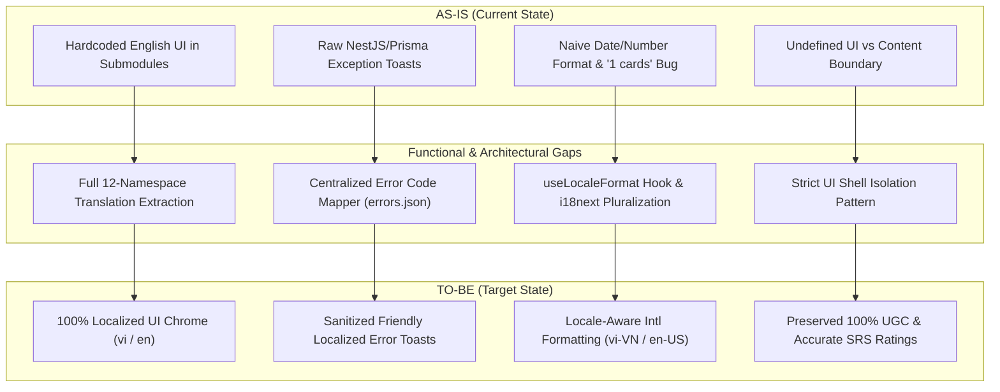

# Gap Analysis: Complete UI Localization & Error Mapping (US-I18N-02)

- **Feature Slug**: `i18n-ui-localization`
- **Backlog Reference**: `US-I18N-02` (EPIC 10: Multi-language & Internationalization)
- **Date**: 2026-08-22
- **Author**: Lead Business Analyst

---

## 1. AS-IS — Current State

### Current System State

1. **Partial Localization Coverage**:
   - Following `US-I18N-01` (`i18n-core-switcher`), the core i18next engine and language switcher pill were installed with preliminary keys in `common.json`, `auth.json`, `dashboard.json`, and `settings.json`.
   - However, large feature modules—such as `ai-vocabulary`, `practice` (Multiple Choice, Fill-in-the-Blank, Word Matching, Listening Practice, Speech Pronunciation), `decks`, `cards`, `study` (SRS Review interface), `gamification` (XP popups, level badges, streak freezes), and `analytics`—contain extensive hardcoded English strings in their JSX/TSX components.
2. **Raw Error Message Exposure**:
   - When backend API requests fail, frontend components directly consume `error.response?.data?.message` or `error.message` and display them via `toast.error()`.
   - Users frequently see technical NestJS validation messages (e.g., `"email must be an email"`, `"password is not strong enough"`), raw Prisma database error strings (e.g., `"Unique constraint failed on the fields: (email)"`), or unhandled generic exception strings (e.g., `"Internal Server Error"`).
3. **Inconsistent Date and Number Formatting**:
   - Dates, streaks, and card counts are formatted using naive template literals (e.g., `${count} cards`, `${xp} XP`) or standard `Date.toLocaleDateString()` without passing explicit locales.
   - This leads to awkward grammatical outputs such as `"1 cards"` in English, missing thousand-separators (`10000 XP` instead of `10.000 XP` / `10,000 XP`), and inconsistent date ordering (`MM/DD/YYYY` vs `DD/MM/YYYY`).
4. **Lack of Clear Content Boundary**:
   - There is no formal architectural rule separating UI Chrome from User-Generated Content (UGC), risking future regressions where flashcard terms or definitions are passed into translation functions.

---

## 2. TO-BE — Target State

### Target End-to-End Experience

1. **100% Comprehensive UI Shell Localization**:
   - All 12 web application domains (`common`, `auth`, `dashboard`, `decks`, `cards`, `study`, `practice`, `community`, `analytics`, `settings`, `gamification`, `ai_vocabulary`) feature 100% coverage in both Vietnamese (`vi`) and English (`en`).
   - Switching language instantaneously re-renders all headings, sub-screens, modals, table headers, action buttons, filter tags, and tooltips without requiring page reloads or incurring layout shifts.
2. **Centralized Error Code Registry & Friendly Fallback**:
   - All backend API errors and client validation failures are intercepted by an Axios response interceptor that extracts the standard machine-readable `errorCode` (or status code) and resolves it to a localized human-friendly string in `errors.json` (`errors:<namespace>.<error_key>`).
   - If an error code is unregistered or an internal 500 error occurs, a friendly localized fallback message (`errors:generic.unexpected_error`) is presented to the user, while internal stack traces and server details are strictly suppressed from the UI.
3. **Unified Locale-Aware Formatting (`Intl` + Pluralization)**:
   - A centralized set of formatting utilities and hooks (`useLocaleFormat`) formats all dates (`Intl.DateTimeFormat`), relative timestamps (`Intl.RelativeTimeFormat`), and numbers/XP/percentages (`Intl.NumberFormat`) strictly adhering to the active locale (`vi-VN` vs `en-US`).
   - All countable strings use proper i18next plural keys (`_one`, `_other` for English; single form for Vietnamese), ensuring accurate outputs like `"1 card"`, `"5 cards"`, `"1 thẻ"`, `"5 thẻ"`.
4. **Strict UI Shell vs UGC Boundary**:
   - Flashcard words, phonetic IPA transcriptions, example sentences, definitions, and user deck descriptions remain 100% untranslated, while SRS review action buttons (`Again` / `Lại`, `Hard` / `Khó`, `Good` / `Tốt`, `Easy` / `Dễ`) and interval estimates are cleanly localized.

---

## 3. Gap Analysis Across 4 Categories

### 3.1. Functional Gaps

| Area                     | AS-IS                                                                                       | TO-BE                                                                                 | Gap / Delta                                                                                             |
| :----------------------- | :------------------------------------------------------------------------------------------ | :------------------------------------------------------------------------------------ | :------------------------------------------------------------------------------------------------------ |
| **UI String Coverage**   | English hardcoded strings in Quiz, Speech, Decks, Study, AI Vocab, Gamification, Analytics. | 100% extraction into namespace JSON files (`vi` and `en`).                            | Extract ~250+ unique UI strings across all 12 feature domains.                                          |
| **Error Handling**       | Raw `error.message` passed directly to `toast.error()`.                                     | Centralized error interceptor mapping error codes to `errors.json`.                   | Implement `mapApiError(error)` helper & `errors.json` registry for all API status/error codes.          |
| **Pluralization**        | Hardcoded templates like `${count} cards`, `${days} days`.                                  | i18next plural keys (`card_one`, `card_other`, `day_one`, `day_other`).               | Refactor all countable text interpolations to use i18next plural syntax.                                |
| **Number & Date Format** | `toLocaleString()` or raw numbers without locale parameter.                                 | `Intl.NumberFormat` and `Intl.DateTimeFormat` with active locale (`vi-VN` / `en-US`). | Create `useLocaleFormat` hook exposing `formatNumber`, `formatDate`, `formatRelativeTime`.              |
| **SRS Rating Buttons**   | Fixed English labels (`Again`, `Hard`, `Good`, `Easy`).                                     | Localized SRS action buttons (`Lại`, `Khó`, `Tốt`, `Dễ`) with interval cues.          | Update `StudySession` component to localize rating labels while keeping SRS algorithm inputs invariant. |

### 3.2. Data Gaps

- **Database Schema Changes**: **None (0 schema migrations)**. Localization and error mapping are pure client-side transformations.
- **Client Resource Expansions**:
  - Addition of `errors.json` in `apps/web/src/locales/vi/` and `apps/web/src/locales/en/`.
  - Expansion of existing namespace JSON files (`decks.json`, `cards.json`, `study.json`, `practice.json`, `gamification.json`, `ai_vocabulary.json`, `analytics.json`, `settings.json`, `community.json`, `common.json`, `auth.json`, `dashboard.json`).

### 3.3. User Impact

- **Vietnamese Learners**: Immediate elimination of jarring English text in study and quiz interfaces; clear, actionable error messages in Vietnamese when actions fail; culturally intuitive number (`10.000 XP`) and date formatting (`22/08/2026`).
- **International / English Learners**: Seamless native English UI chrome, accurate singular/plural phrasing (`1 card` vs `2 cards`), standard English formatting (`10,000 XP`, `08/22/2026`).
- **Data & Workflow Disruption**: Zero disruption. Stored user decks, flashcards, study schedules, and SRS intervals remain 100% intact.

### 3.4. Transition Requirements

- **Zero Dual-Run Needed**: Pure frontend build-time and runtime feature; instantaneous transition upon deployment.
- **Graceful Unmapped Error Handling**: Axios error mapper must safely fallback to `errors:generic.unexpected_error` if the backend returns an unrecognized or unversioned error payload during API rollout.
- **Layout Expansion Verification**: Verification that Vietnamese text length (+20%–40%) does not clip, overflow, or break button geometry on mobile/desktop viewports.

---

## 4. Summary

The transition from AS-IS to TO-BE converts WordStreak from a partially localized prototype with exposed technical errors into an enterprise-grade bilingual learning platform featuring resilient error handling, precise cultural formatting, and robust protection of user flashcard content.
