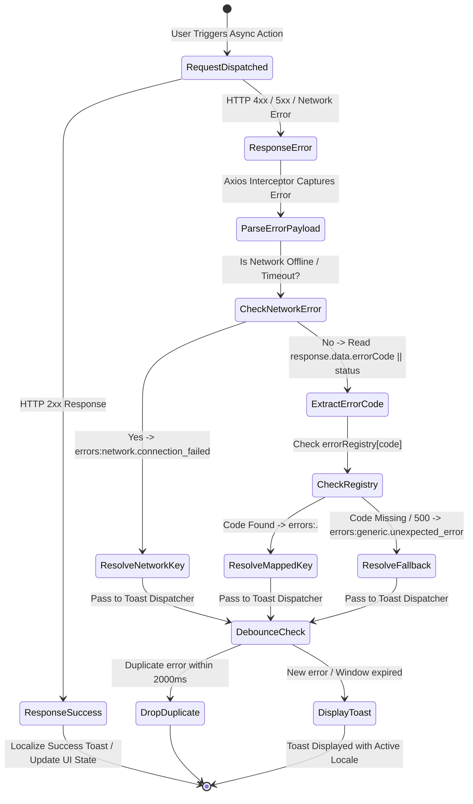
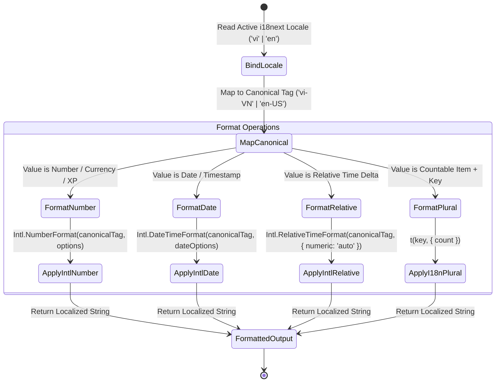
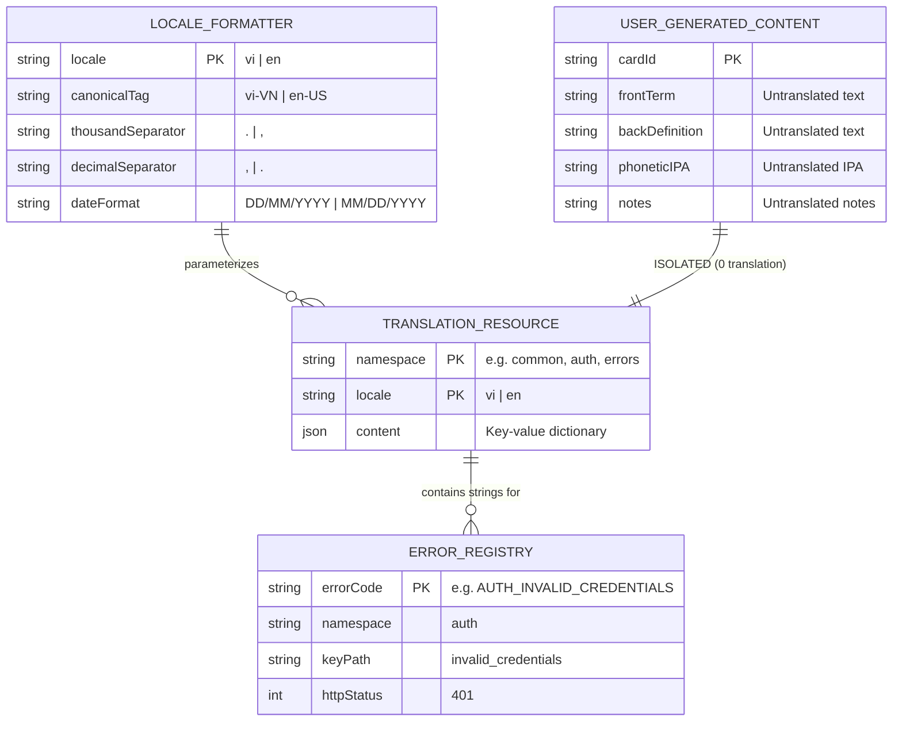

# Domain Model: Complete UI Localization & Error Mapping (US-I18N-02)

- **Feature Slug**: `i18n-ui-localization`
- **Backlog Reference**: `US-I18N-02` (EPIC 10: Multi-language & Internationalization)
- **Date**: 2026-08-22
- **Author**: Lead Business Analyst

---

## 1. RBAC Matrix

| Role                | View Localized UI Chrome |   Trigger Localized API Errors    | Format Dynamic Dates/Numbers | Translate Flashcard Terms (UGC) | Access All 12 Namespaces  |
| :------------------ | :----------------------: | :-------------------------------: | :--------------------------: | :-----------------------------: | :-----------------------: |
| **Guest / Visitor** |          ✅ Yes          |   ✅ Yes (Auth & Public routes)   | ✅ Yes (Public dates/counts) |     ❌ Prohibited (UGC Raw)     | ✅ Yes (Public resources) |
| **Learner**         |          ✅ Yes          |  ✅ Yes (All learner operations)  | ✅ Yes (XP, Streaks, Dates)  |     ❌ Prohibited (UGC Raw)     |          ✅ Yes           |
| **Pro Subscriber**  |          ✅ Yes          |    ✅ Yes (All pro operations)    | ✅ Yes (Advanced Analytics)  |     ❌ Prohibited (UGC Raw)     |          ✅ Yes           |
| **Content Creator** |          ✅ Yes          | ✅ Yes (Deck creation operations) |   ✅ Yes (Deck statistics)   |     ❌ Prohibited (UGC Raw)     |          ✅ Yes           |
| **System Admin**    |          ✅ Yes          |  ✅ Yes (Administrative actions)  |   ✅ Yes (System metrics)    |     ❌ Prohibited (UGC Raw)     |          ✅ Yes           |

_Note_: Localization and error mapping are universal client-side capabilities. User-Generated Content is strictly protected from translation across all user tiers.

---

## 2. State Machines & Lifecycles

### 2.1. API Error Interception & Localization Lifecycle



### 2.2. Dynamic Locale-Aware Format Lifecycle



---

## 3. Business Rules (`BR-I18N-###`)

- **`BR-I18N-001 (Supported Locales & Canonical Tags)`**:
  - The application strictly supports two UI languages: `'vi'` (Vietnamese) and `'en'` (English).
  - When invoking ECMAScript `Intl` formatters, `'vi'` must map to the canonical BCP-47 tag `'vi-VN'` and `'en'` must map to `'en-US'`.
- **`BR-I18N-002 (Error Code Resolution & Sanitization)`**:
  - All backend API exceptions must be mapped via the standardized Error Code Registry in `errors.json` (`errors:<namespace>.<error_key>`).
  - If an error code is not registered, or if an unhandled 500 Internal Server Error occurs, the interceptor must resolve to `errors:generic.unexpected_error`.
  - Raw exception payloads, database table names, SQL/Prisma error strings, and backend stack traces must be strictly suppressed and never rendered in user-facing toasts or DOM elements.
- **`BR-I18N-003 (Strict UI Shell vs UGC Boundary)`**:
  - **UI Shell**: Navigation menus, button labels, modal headers, form labels, tooltips, toasts, table headers, and SRS rating buttons (`Again`, `Hard`, `Good`, `Easy`) must be 100% localized via `t()`.
  - **User-Generated Content (UGC)**: Flashcard front terms, back definitions, phonetic IPA transcriptions, example sentences, user deck titles, and custom notes must **never** be passed through translation functions and must be displayed exactly as entered by the user.
- **`BR-I18N-004 (Unified Locale-Aware Number & Count Formatting)`**:
  - All numbers, XP figures, streak counts, and percentages must be formatted via `Intl.NumberFormat(localeTag)`:
    - Vietnamese (`vi-VN`): Thousand separator is period (`.`), decimal separator is comma (`,`) (e.g., `10.000 XP`, `95,5%`).
    - English (`en-US`): Thousand separator is comma (`,`), decimal separator is period (`.`) (e.g., `10,000 XP`, `95.5%`).
- **`BR-I18N-005 (Unified Locale-Aware Date & Time Formatting)`**:
  - Calendar dates and timestamps must be formatted using `Intl.DateTimeFormat(localeTag)`:
    - Vietnamese (`vi-VN`): Date format `DD/MM/YYYY` (e.g., `22/08/2026`).
    - English (`en-US`): Date format `MM/DD/YYYY` (e.g., `08/22/2026`).
  - Relative times must use `Intl.RelativeTimeFormat(localeTag, { numeric: 'auto' })` (e.g., `"hôm nay"`, `"2 giờ trước"`, `"today"`, `"2 hours ago"`).
- **`BR-I18N-006 (Standard Pluralization Rules)`**:
  - Countable nouns in English must provide plural keys (`_one` and `_other`).
  - Countable nouns in Vietnamese must provide the base key, as Vietnamese nouns do not conjugate with grammatical inflection (e.g., `1 thẻ`, `5 thẻ`).
  - Plural strings must use interpolation syntax `{{count}}`.
- **`BR-I18N-007 (Namespace Partitioning & Schema)`**:
  - Translation files must be strictly partitioned into 12 domain namespaces:
    1. `common` — Global navigation, buttons, generic actions, headers, footers.
    2. `auth` — Login, registration, password recovery, verification.
    3. `dashboard` — Dashboard widgets, streak overview, daily goals.
    4. `decks` — Deck management, filters, creation modal, tags.
    5. `cards` — Card creation, card editing, import/export controls, card table headers.
    6. `study` — Flashcard review interface, study summary, progress indicators.
    7. `practice` — Quiz modes (Multiple Choice, Fill-in-the-Blank, Word Matching, Listening, Speech Pronunciation).
    8. `community` — Public deck gallery, ratings, clone actions, deck sharing.
    9. `analytics` — Study heatmaps, accuracy graphs, SRS interval retention metrics.
    10. `settings` — User profile, security, appearance, audio settings.
    11. `gamification` — XP rewards, streak freezes, level-up celebration dialogs, badges.
    12. `ai_vocabulary` — AI deck generator modal, topic prompts, generation progress.
    13. `errors` — Centralized API error code and validation dictionary.
- **`BR-I18N-008 (SRS Review Rating Action Localization)`**:
  - SRS rating action buttons during study sessions must render localized standard terminology:
    - Button 1 (Rating 1): Vietnamese `"Lại"` / English `"Again"`
    - Button 2 (Rating 2): Vietnamese `"Khó"` / English `"Hard"`
    - Button 3 (Rating 3): Vietnamese `"Tốt"` / English `"Good"`
    - Button 4 (Rating 4): Vietnamese `"Dễ"` / English `"Easy"`
  - Rating buttons must preserve interval duration cues (e.g., `< 10p` / `< 10m`, `1 ngày` / `1d`, `4 ngày` / `4d`).
- **`BR-I18N-009 (Anti-Abuse & Error Flooding Resistance)`**:
  - To prevent toast notification spamming and browser layout thrashing during network disconnects or rapid user clicks, consecutive identical error messages dispatched within a `2000ms` window must be deduplicated (only 1 toast rendered).
- **`BR-I18N-010 (Boundary & Layout Overflow Invariance)`**:
  - All UI elements, buttons, modal dialogs, and table headers must accommodate up to **40% text length expansion** (typical of Vietnamese translations) without horizontal scrollbar emergence, text clipping, or button layout distortion. Long titles must wrap cleanly or use CSS text truncation with a full tooltip.

---

## 4. Translation Namespace Architecture & Error Code Registry

### 4.1. TypeScript Type Contracts

```typescript
// apps/web/src/locales/types.ts
export type SupportedLocale = "vi" | "en";
export type CanonicalLocaleTag = "vi-VN" | "en-US";

export interface TranslationNamespaces {
  common: typeof import("./en/common.json");
  auth: typeof import("./en/auth.json");
  dashboard: typeof import("./en/dashboard.json");
  decks: typeof import("./en/decks.json");
  cards: typeof import("./en/cards.json");
  study: typeof import("./en/study.json");
  practice: typeof import("./en/practice.json");
  community: typeof import("./en/community.json");
  analytics: typeof import("./en/analytics.json");
  settings: typeof import("./en/settings.json");
  gamification: typeof import("./en/gamification.json");
  ai_vocabulary: typeof import("./en/ai_vocabulary.json");
  errors: typeof import("./en/errors.json");
}
```

### 4.2. Error Code Mapping Registry

| Backend / API Error Code    | HTTP Status | `errors.json` Key Path             | Vietnamese Message (`vi`)                              | English Message (`en`)                              |
| :-------------------------- | :---------: | :--------------------------------- | :----------------------------------------------------- | :-------------------------------------------------- |
| `AUTH_INVALID_CREDENTIALS`  |     401     | `errors:auth.invalid_credentials`  | Email hoặc mật khẩu không chính xác.                   | Invalid email or password.                          |
| `AUTH_EMAIL_ALREADY_EXISTS` |     409     | `errors:auth.email_already_exists` | Email này đã được đăng ký tài khoản.                   | This email is already registered.                   |
| `AUTH_UNAUTHORIZED`         |     401     | `errors:auth.unauthorized`         | Phiên đăng nhập đã hết hạn. Vui lòng đăng nhập lại.    | Session expired. Please log in again.               |
| `AUTH_FORBIDDEN`            |     403     | `errors:auth.forbidden`            | Bạn không có quyền thực hiện hành động này.            | You do not have permission to perform this action.  |
| `DECK_NOT_FOUND`            |     404     | `errors:decks.not_found`           | Bộ từ không tồn tại hoặc đã bị xóa.                    | Deck not found or has been deleted.                 |
| `DECK_TITLE_REQUIRED`       |     400     | `errors:decks.title_required`      | Tên bộ từ không được để trống.                         | Deck title is required.                             |
| `CARD_NOT_FOUND`            |     404     | `errors:cards.not_found`           | Thẻ từ vựng không tồn tại.                             | Vocabulary card not found.                          |
| `CARD_LIMIT_EXCEEDED`       |     403     | `errors:cards.limit_exceeded`      | Đã đạt giới hạn số lượng thẻ trong bộ từ.              | Card limit exceeded for this deck.                  |
| `PRACTICE_NO_CARDS_DUE`     |     400     | `errors:practice.no_cards_due`     | Không có thẻ nào cần ôn tập lúc này!                   | No cards due for review at this time!               |
| `AI_GENERATION_FAILED`      |     502     | `errors:ai.generation_failed`      | Trí tuệ nhân tạo tạm thời bận. Vui lòng thử lại sau.   | AI service is temporarily busy. Please try again.   |
| `AI_QUOTA_EXCEEDED`         |     429     | `errors:ai.quota_exceeded`         | Bạn đã đạt hạn mức tạo từ AI hôm nay.                  | Daily AI generation quota reached.                  |
| `NETWORK_ERROR` / Timeout   |      0      | `errors:network.connection_failed` | Không thể kết nối đến máy chủ. Vui lòng kiểm tra mạng. | Unable to connect to server. Check your connection. |
| _Unmapped / 500_            |     500     | `errors:generic.unexpected_error`  | Đã có lỗi xảy ra. Vui lòng thử lại sau.                | An unexpected error occurred. Please try again.     |

---

## 5. Entities, Data Boundaries & Privacy



- **Data Privacy & Sanitization**: Error mappings guarantee that sensitive system data (stack traces, server environment paths, SQL query tokens, user hash salts) are stripped in the client interceptor prior to toast rendering.
- **Client-Side Boundary**: All localization dictionaries reside in client static bundles, requiring zero database lookups for UI strings.

---

## 6. UX States & Non-Functional Requirements (NFRs)

### 6.1. UX States

- **Loading State**: Fallback skeleton or shimmer components localized in active locale (e.g., `"Đang tải..."` / `"Loading..."`).
- **Empty State**: Friendly empty state placeholders localized per feature (e.g., `"Chưa có thẻ từ nào trong bộ từ này"` / `"No cards found in this deck"`).
- **Error State**: Non-blocking toast notifications in top-right viewport; inline form error text displayed directly beneath offending input fields in red text (`text-red-500`).
- **Success State**: Short-lived (3000ms) positive toast notifications with checkmark icon (e.g., `"Đã lưu thẻ thành công!"` / `"Card saved successfully!"`).

### 6.2. Non-Functional Requirements

- **Performance**:
  - `P95` error mapping resolution time < `2ms`.
  - `P95` locale switch UI re-render < `16ms` (1 frame at 60fps).
  - Translation bundle size per namespace < `15KB` gzipped.
- **Accessibility (A11y)**:
  - All interactive elements must maintain updated `aria-label` attributes corresponding to the active locale (`aria-label="Đóng cửa sổ"` / `aria-label="Close dialog"`).
  - Toast notifications must include `role="alert"` and `aria-live="polite"` or `"assertive"`.
- **Layout Stability**:
  - Zero Cumulative Layout Shift (`CLS = 0`) on language change.
  - Full adherence to 40% text expansion tolerance without visual overflow (`BR-I18N-010`).
