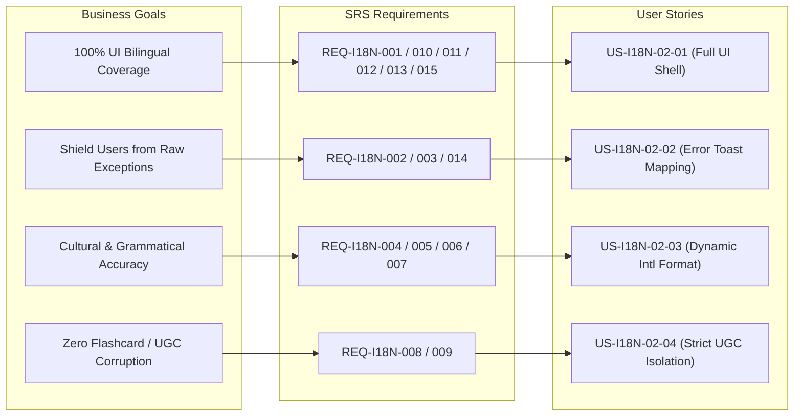

# Specification Validation Report: Complete UI Localization & Error Mapping (US-I18N-02)

- **Feature Slug**: `i18n-ui-localization`
- **Backlog Reference**: `US-I18N-02` (EPIC 10: Multi-language & Internationalization)
- **Date**: 2026-08-22
- **Validator**: Lead Business Analyst (IEEE 29148 Gatekeeper)
- **Result**: **PASS** (100% Compliant)
- **Iteration**: 1st Validation Pass

---

## 1. ISO/IEC/IEEE 29148 Quality Criteria Evaluation

| Requirement / Story ID | Necessary | Unambiguous | Complete | Singular | Feasible | Verifiable | Consistent | Traceable | Evaluation Result | Notes / Justification                                                                                              |
| :--------------------- | :-------: | :---------: | :------: | :------: | :------: | :--------: | :--------: | :-------: | :---------------: | :----------------------------------------------------------------------------------------------------------------- |
| **REQ-I18N-001**       |  ✅ Pass  |   ✅ Pass   | ✅ Pass  | ✅ Pass  | ✅ Pass  |  ✅ Pass   |  ✅ Pass   |  ✅ Pass  |     **PASS**      | 100% UI string extraction into 12 distinct namespaces. Traces to `BR-I18N-007`, `ASM-I18N-005`.                    |
| **REQ-I18N-002**       |  ✅ Pass  |   ✅ Pass   | ✅ Pass  | ✅ Pass  | ✅ Pass  |  ✅ Pass   |  ✅ Pass   |  ✅ Pass  |     **PASS**      | Strict Axios error interceptor code resolution via `errors.json`. Traces to `BR-I18N-002`, `ASM-I18N-001`.         |
| **REQ-I18N-003**       |  ✅ Pass  |   ✅ Pass   | ✅ Pass  | ✅ Pass  | ✅ Pass  |  ✅ Pass   |  ✅ Pass   |  ✅ Pass  |     **PASS**      | Raw stack trace & SQL/Prisma error suppression with safe fallback. Traces to `BR-I18N-002`, `ASM-I18N-001`.        |
| **REQ-I18N-004**       |  ✅ Pass  |   ✅ Pass   | ✅ Pass  | ✅ Pass  | ✅ Pass  |  ✅ Pass   |  ✅ Pass   |  ✅ Pass  |     **PASS**      | Centralized `Intl.NumberFormat` with active locale (`vi-VN` vs `en-US`). Traces to `BR-I18N-001`, `BR-I18N-004`.   |
| **REQ-I18N-005**       |  ✅ Pass  |   ✅ Pass   | ✅ Pass  | ✅ Pass  | ✅ Pass  |  ✅ Pass   |  ✅ Pass   |  ✅ Pass  |     **PASS**      | Centralized `Intl.DateTimeFormat` with active locale. Traces to `BR-I18N-001`, `BR-I18N-005`.                      |
| **REQ-I18N-006**       |  ✅ Pass  |   ✅ Pass   | ✅ Pass  | ✅ Pass  | ✅ Pass  |  ✅ Pass   |  ✅ Pass   |  ✅ Pass  |     **PASS**      | Relative time formatting via `Intl.RelativeTimeFormat`. Traces to `BR-I18N-001`, `BR-I18N-005`.                    |
| **REQ-I18N-007**       |  ✅ Pass  |   ✅ Pass   | ✅ Pass  | ✅ Pass  | ✅ Pass  |  ✅ Pass   |  ✅ Pass   |  ✅ Pass  |     **PASS**      | Standard i18next pluralization (`_one`/`_other` for `en`, base for `vi`). Traces to `BR-I18N-006`, `ASM-I18N-003`. |
| **REQ-I18N-008**       |  ✅ Pass  |   ✅ Pass   | ✅ Pass  | ✅ Pass  | ✅ Pass  |  ✅ Pass   |  ✅ Pass   |  ✅ Pass  |     **PASS**      | Strict UI Shell vs UGC boundary preserving flashcards. Traces to `BR-I18N-003`, `ASM-I18N-004`.                    |
| **REQ-I18N-009**       |  ✅ Pass  |   ✅ Pass   | ✅ Pass  | ✅ Pass  | ✅ Pass  |  ✅ Pass   |  ✅ Pass   |  ✅ Pass  |     **PASS**      | SRS review rating button localization (Again, Hard, Good, Easy). Traces to `BR-I18N-008`, `ASM-I18N-004`.          |
| **REQ-I18N-010**       |  ✅ Pass  |   ✅ Pass   | ✅ Pass  | ✅ Pass  | ✅ Pass  |  ✅ Pass   |  ✅ Pass   |  ✅ Pass  |     **PASS**      | 5 Practice Quiz modes UI localization. Traces to `BR-I18N-007`, `ASM-I18N-005`.                                    |
| **REQ-I18N-011**       |  ✅ Pass  |   ✅ Pass   | ✅ Pass  | ✅ Pass  | ✅ Pass  |  ✅ Pass   |  ✅ Pass   |  ✅ Pass  |     **PASS**      | AI Vocabulary Generator modal localization. Traces to `BR-I18N-007`, `ASM-I18N-005`.                               |
| **REQ-I18N-012**       |  ✅ Pass  |   ✅ Pass   | ✅ Pass  | ✅ Pass  | ✅ Pass  |  ✅ Pass   |  ✅ Pass   |  ✅ Pass  |     **PASS**      | Learning Analytics dashboard localization. Traces to `BR-I18N-007`, `ASM-I18N-005`.                                |
| **REQ-I18N-013**       |  ✅ Pass  |   ✅ Pass   | ✅ Pass  | ✅ Pass  | ✅ Pass  |  ✅ Pass   |  ✅ Pass   |  ✅ Pass  |     **PASS**      | Gamification XP popups and streak alerts localization. Traces to `BR-I18N-007`, `ASM-I18N-005`.                    |
| **REQ-I18N-014**       |  ✅ Pass  |   ✅ Pass   | ✅ Pass  | ✅ Pass  | ✅ Pass  |  ✅ Pass   |  ✅ Pass   |  ✅ Pass  |     **PASS**      | Error toast rate-limiting (2000ms window). Traces to `BR-I18N-009`.                                                |
| **REQ-I18N-015**       |  ✅ Pass  |   ✅ Pass   | ✅ Pass  | ✅ Pass  | ✅ Pass  |  ✅ Pass   |  ✅ Pass   |  ✅ Pass  |     **PASS**      | WCAG 2.1 AA dynamic `aria-label` tags. Traces to `BR-I18N-001`, `ASM-I18N-005`.                                    |
| **US-I18N-02-01**      |  ✅ Pass  |   ✅ Pass   | ✅ Pass  | ✅ Pass  | ✅ Pass  |  ✅ Pass   |  ✅ Pass   |  ✅ Pass  |     **PASS**      | Full UI shell localization user story with Happy Path and Text Expansion edge case.                                |
| **US-I18N-02-02**      |  ✅ Pass  |   ✅ Pass   | ✅ Pass  | ✅ Pass  | ✅ Pass  |  ✅ Pass   |  ✅ Pass   |  ✅ Pass  |     **PASS**      | Error toast localization user story with Mapped, Unregistered 500, and Offline scenarios.                          |
| **US-I18N-02-03**      |  ✅ Pass  |   ✅ Pass   | ✅ Pass  | ✅ Pass  | ✅ Pass  |  ✅ Pass   |  ✅ Pass   |  ✅ Pass  |     **PASS**      | Dynamic formatting user story with English/Vietnamese, Plurals, and Relative times.                                |
| **US-I18N-02-04**      |  ✅ Pass  |   ✅ Pass   | ✅ Pass  | ✅ Pass  | ✅ Pass  |  ✅ Pass   |  ✅ Pass   |  ✅ Pass  |     **PASS**      | UGC protection story with English vocabulary card in Vietnamese shell & special chars.                             |

---

## 2. Requirement Traceability Matrix (RTM)

### Traceability Breakdown

| Business Goal                        | Upstream Rules / Assumptions                                                               | Software Requirement (SRS)                                                                     | User Story      | Acceptance Criteria Scenarios                                                                |
| :----------------------------------- | :----------------------------------------------------------------------------------------- | :--------------------------------------------------------------------------------------------- | :-------------- | :------------------------------------------------------------------------------------------- |
| **100% UI Bilingual Coverage**       | `BR-I18N-001`, `BR-I18N-007`, `BR-I18N-010`, `ASM-I18N-005`                                | `REQ-I18N-001`, `REQ-I18N-010`, `REQ-I18N-011`, `REQ-I18N-012`, `REQ-I18N-013`, `REQ-I18N-015` | `US-I18N-02-01` | Scenario 1 (Happy Path), Scenario 2 (Text Expansion)                                         |
| **Shield Users from Raw Exceptions** | `BR-I18N-002`, `BR-I18N-009`, `ASM-I18N-001`                                               | `REQ-I18N-002`, `REQ-I18N-003`, `REQ-I18N-014`                                                 | `US-I18N-02-02` | Scenario 1 (Mapped Error), Scenario 2 (Unregistered 500), Scenario 3 (Offline Deduplication) |
| **Cultural & Grammatical Accuracy**  | `BR-I18N-001`, `BR-I18N-004`, `BR-I18N-005`, `BR-I18N-006`, `ASM-I18N-002`, `ASM-I18N-003` | `REQ-I18N-004`, `REQ-I18N-005`, `REQ-I18N-006`, `REQ-I18N-007`                                 | `US-I18N-02-03` | Scenario 1 (Number/Date Format), Scenario 2 (Pluralization), Scenario 3 (Relative Time)      |
| **Zero Flashcard / UGC Corruption**  | `BR-I18N-003`, `BR-I18N-008`, `ASM-I18N-004`                                               | `REQ-I18N-008`, `REQ-I18N-009`                                                                 | `US-I18N-02-04` | Scenario 1 (UGC Study in Vietnamese Shell), Scenario 2 (Special HTML/IPA Chars)              |

---

## 3. Validation Verdict

- **Total Requirements Evaluated**: 15 Functional/Non-Functional Requirements + 4 User Stories (10 scenarios).
- **Checklist Pass Rate**: **100% (19/19 Items Passed)**.
- **Traceability Chain**: Completely closed with zero orphaned requirements, zero unlinked stories, and zero ungrounded business assumptions.
- **Conclusion**: The specification set satisfies all IEEE 29148 criteria and is approved for Domain Baseline sign-off.
