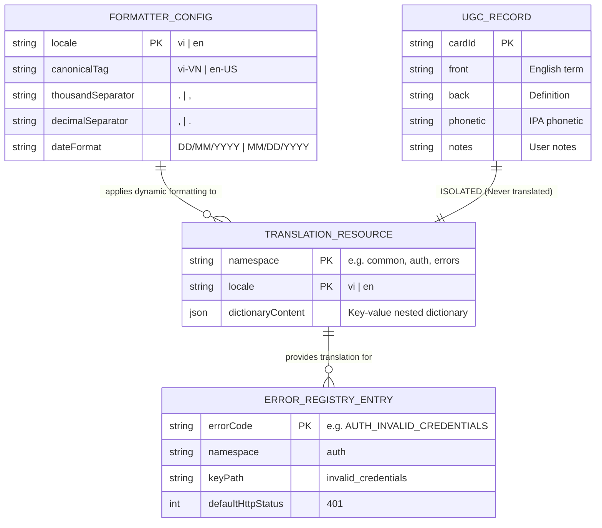

# Data Model & Schema Contracts: Complete UI Localization & Error Mapping (US-I18N-02)

- **Feature**: `i18n-ui-localization`
- **Epics**: `EPIC-10` (Multi-language & Internationalization)
- **Status**: SPECIFIED
- **Date**: 2026-08-22
- **Author**: Principal System Architect

---

## 1. Entity Relationship & Data Flow Architecture



---

## 2. TypeScript Type Contracts (`contracts/i18n-localization.contract.ts`)

```typescript
/**
 * Supported UI language codes in WordStreak.
 */
export type SupportedLocale = "vi" | "en";

/**
 * Canonical BCP-47 language tags for ECMAScript Intl formatters.
 */
export type CanonicalLocaleTag = "vi-VN" | "en-US";

/**
 * 12 Domain Translation Namespaces + Errors Dictionary.
 */
export type DomainNamespace =
  | "common"
  | "auth"
  | "dashboard"
  | "decks"
  | "cards"
  | "study"
  | "practice"
  | "community"
  | "analytics"
  | "settings"
  | "gamification"
  | "ai_vocabulary"
  | "errors";

/**
 * Strongly typed namespace dictionary mapping for i18next compile-time safety.
 */
export interface TranslationNamespaces {
  common: typeof import("../src/locales/en/common.json");
  auth: typeof import("../src/locales/en/auth.json");
  dashboard: typeof import("../src/locales/en/dashboard.json");
  decks: typeof import("../src/locales/en/decks.json");
  cards: typeof import("../src/locales/en/cards.json");
  study: typeof import("../src/locales/en/study.json");
  practice: typeof import("../src/locales/en/practice.json");
  community: typeof import("../src/locales/en/community.json");
  analytics: typeof import("../src/locales/en/analytics.json");
  settings: typeof import("../src/locales/en/settings.json");
  gamification: typeof import("../src/locales/en/gamification.json");
  ai_vocabulary: typeof import("../src/locales/en/ai_vocabulary.json");
  errors: typeof import("../src/locales/en/errors.json");
}

/**
 * Standardized Backend Error Code Keys recognized by WordStreak client.
 */
export type ErrorCodeKey =
  | "AUTH_INVALID_CREDENTIALS"
  | "AUTH_EMAIL_ALREADY_EXISTS"
  | "AUTH_UNAUTHORIZED"
  | "AUTH_FORBIDDEN"
  | "AUTH_ACCOUNT_LOCKED"
  | "AUTH_INVALID_TOKEN"
  | "AUTH_TOKEN_EXPIRED"
  | "DECK_NOT_FOUND"
  | "DECK_TITLE_REQUIRED"
  | "DECK_PERMISSION_DENIED"
  | "CARD_NOT_FOUND"
  | "CARD_LIMIT_EXCEEDED"
  | "PRACTICE_NO_CARDS_DUE"
  | "PRACTICE_SESSION_EXPIRED"
  | "AI_GENERATION_FAILED"
  | "AI_QUOTA_EXCEEDED"
  | "AI_WORD_NOT_FOUND"
  | "RATE_LIMIT_EXCEEDED"
  | "NETWORK_ERROR"
  | "UNEXPECTED_ERROR";

/**
 * Metadata for mapping API error codes to i18n translation keys.
 */
export interface ErrorRegistryMapping {
  namespace: string;
  keyPath: string;
  fallbackMessage: string;
}

/**
 * Number & Currency Formatting Options.
 */
export interface LocaleNumberFormatOptions extends Intl.NumberFormatOptions {
  compact?: boolean;
}

/**
 * Date Formatting Options.
 */
export interface LocaleDateFormatOptions extends Intl.DateTimeFormatOptions {
  preset?: "short" | "medium" | "long" | "timeOnly" | "dateTime";
}

/**
 * Relative Time Unit.
 */
export type RelativeTimeUnit =
  "year" | "quarter" | "month" | "week" | "day" | "hour" | "minute" | "second";

/**
 * SRS Rating Label Model.
 */
export interface SrsRatingOption {
  rating: 1 | 2 | 3 | 4;
  key: "again" | "hard" | "good" | "easy";
  label: string;
  intervalText: string;
  shortcut: string;
}
```

---

## 3. Namespace JSON Schema Definitions

### 3.1. `common.json`

```json
{
  "brand": {
    "name": "WordStreak",
    "tagline": "Master English Vocabulary with Spaced Repetition"
  },
  "nav": {
    "dashboard": "Dashboard",
    "decks": "Decks",
    "study": "Study",
    "practice": "Practice",
    "community": "Community",
    "analytics": "Analytics",
    "settings": "Settings"
  },
  "actions": {
    "save": "Save",
    "cancel": "Cancel",
    "delete": "Delete",
    "edit": "Edit",
    "create": "Create",
    "close": "Close",
    "confirm": "Confirm",
    "back": "Back",
    "next": "Next",
    "retry": "Retry",
    "search": "Search...",
    "filter": "Filter",
    "loading": "Loading..."
  },
  "a11y": {
    "close_dialog": "Close dialog",
    "play_audio": "Play pronunciation audio",
    "toggle_theme": "Toggle color theme",
    "language_menu": "Select language"
  }
}
```

### 3.2. `cards.json`

```json
{
  "title": "Cards",
  "add_card": "Add Card",
  "edit_card": "Edit Card",
  "delete_card": "Delete Card",
  "table": {
    "word": "Word",
    "phonetic": "Phonetic",
    "pos": "Part of Speech",
    "meaning": "Meaning",
    "status": "Status",
    "actions": "Actions",
    "no_cards": "No vocabulary cards found"
  },
  "form": {
    "word_label": "Word / Phrase",
    "word_placeholder": "e.g. resilience",
    "phonetic_label": "Phonetic (IPA)",
    "meaning_vi_label": "Vietnamese Meaning",
    "meaning_en_label": "English Nuance",
    "example_label": "Example Sentence",
    "notes_label": "Personal Notes",
    "auto_fill_ai": "✨ Auto-Fill with AI"
  },
  "bulk": {
    "selected": "{{count}} card selected",
    "selected_other": "{{count}} cards selected",
    "delete_selected": "Delete Selected",
    "move_selected": "Move to Deck",
    "reset_progress": "Reset Progress"
  },
  "status": {
    "new": "New",
    "learning": "Learning",
    "mastered": "Mastered"
  }
}
```

### 3.3. `study.json`

```json
{
  "title": "Study Session",
  "flip_hint": "Click or press Space to flip",
  "show_answer": "Show Answer",
  "rating": {
    "again": "Again",
    "hard": "Hard",
    "good": "Good",
    "easy": "Easy"
  },
  "intervals": {
    "less_than_10m": "< 10m",
    "one_day": "1d",
    "four_days": "4d",
    "ten_days": "10d"
  },
  "summary": {
    "session_complete": "Session Complete!",
    "cards_reviewed": "{{count}} card reviewed",
    "cards_reviewed_other": "{{count}} cards reviewed",
    "xp_earned": "+{{xp}} XP Earned",
    "retention_rate": "Retention: {{rate}}%",
    "back_to_decks": "Back to Decks"
  }
}
```

### 3.4. `gamification.json`

```json
{
  "streak": {
    "current_streak": "{{count}} Day Streak",
    "current_streak_other": "{{count}} Days Streak",
    "streak_saved": "Streak Saved with Freeze!",
    "freeze_active": "Freeze Active",
    "freeze_available": "{{count}} freeze remaining",
    "freeze_available_other": "{{count}} freezes remaining"
  },
  "xp": {
    "gained": "+{{amount}} XP",
    "total": "{{amount}} XP",
    "daily_goal_reached": "Daily Goal Reached!"
  },
  "level_up": {
    "title": "Level Up!",
    "reached": "You reached Level {{level}}!",
    "congratulations": "Keep up the momentum!"
  },
  "flame_mascot": {
    "greeting": "Let's learn new words today!",
    "encouragement": "You're on fire!",
    "nurture_modal_title": "Flame Mascot Nurture"
  }
}
```

### 3.5. `ai_vocabulary.json`

```json
{
  "modal_title": "AI Vocabulary Generator",
  "topic_label": "Topic / Theme",
  "topic_placeholder": "e.g. IELTS Writing Academic Vocabulary, Coffee Brewing",
  "cefr_label": "CEFR Level",
  "card_count_label": "Number of Cards",
  "generate_button": "Generate Cards",
  "generating": "Generating structured vocabulary...",
  "success": "Successfully generated {{count}} vocabulary card",
  "success_other": "Successfully generated {{count}} vocabulary cards",
  "quota_remaining": "{{remaining}}/{{max}} generations left today"
}
```

### 3.6. `errors.json`

```json
{
  "auth": {
    "invalid_credentials": "Invalid email or password.",
    "email_already_exists": "This email is already registered.",
    "unauthorized": "Session expired. Please log in again.",
    "forbidden": "You do not have permission to perform this action.",
    "account_locked": "Account is temporarily locked. Please try again later."
  },
  "decks": {
    "not_found": "Deck not found or has been deleted.",
    "title_required": "Deck title is required.",
    "permission_denied": "You do not have permission to modify this deck."
  },
  "cards": {
    "not_found": "Vocabulary card not found.",
    "limit_exceeded": "Card limit reached for this deck."
  },
  "practice": {
    "no_cards_due": "No cards due for review at this time!",
    "session_expired": "Practice session has expired."
  },
  "ai": {
    "generation_failed": "AI service is temporarily busy. Please try again.",
    "quota_exceeded": "Daily AI generation quota reached.",
    "word_not_found": "Word not found in dictionary or AI knowledge base."
  },
  "network": {
    "connection_failed": "Unable to connect to server. Check your connection."
  },
  "generic": {
    "unexpected_error": "An unexpected error occurred. Please try again.",
    "rate_limited": "Too many requests. Please slow down."
  }
}
```

---

## 4. Validation Rules & Invariants

1. **Dictionary Parity**: Every key in `apps/web/src/locales/en/<ns>.json` MUST have an exact matching key path in `apps/web/src/locales/vi/<ns>.json`.
2. **Plural Key Format**: English keys MUST end with `_one` and `_other` for countable nouns; Vietnamese keys MUST be the base key without suffix (`BR-I18N-006`).
3. **Interpolation Delimiters**: Variable placeholders MUST use double curly brackets `{{variableName}}`.
4. **Error Key Resolution Guarantee**: Every entry in `ErrorCodeKey` enum MUST have a corresponding path in `errors.json`.
