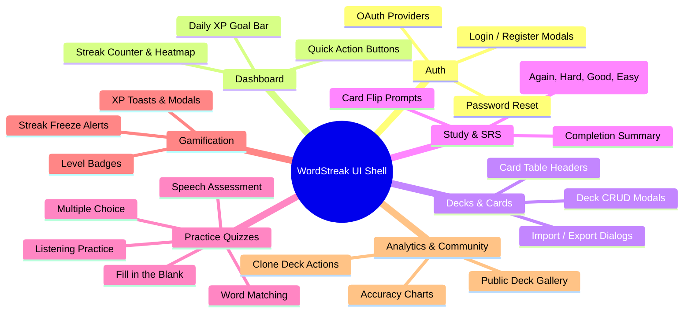

# Product Requirements Document (PRD)

## Feature: Complete UI Localization & Error Mapping (US-I18N-02)

- **Feature Slug**: `i18n-ui-localization`
- **Backlog Reference**: `US-I18N-02` (EPIC 10: Multi-language & Internationalization)
- **Target Release**: WordStreak MVP v1.0
- **Author**: Lead Business Analyst
- **Status**: Draft

---

## 1. Product Overview & User Experience

WordStreak requires complete bilingual support across all application surfaces for both Vietnamese (`vi`) and English (`en`) audiences. The product experience delivers:

1. **Fluid, Zero-Reload UI Localization**: Switching languages via the Obsidian Pill instantly updates 100% of visible system chrome without reloading or losing user context.
2. **Empathetic Error Guidance**: System errors, network disconnects, and form validation rejections are presented through clear, human-friendly, localized toast messages and inline field alerts.
3. **Culturally Intuitive Numbers and Dates**: Dynamic formatting of currency, XP counters, dates, and plural forms adhering strictly to regional conventions (`vi-VN` vs `en-US`).
4. **Untouched Learning Content**: Complete preservation of flashcard front terms, definitions, phonetic IPA, and notes in their original user-entered language.

---

## 2. Feature-by-Feature UI Localization Matrix

### 2.1. Feature Domain Breakdown

1. **Authentication (`auth`)**:
   - Localized headers, email/password labels, placeholder hints, "Remember me", "Forgot password?", social login buttons ("Continue with Google"), and switch between login/register tabs.
2. **Dashboard (`dashboard`)**:
   - Welcome greetings, active streak badges, daily study goal indicators, "Start Daily Review" action buttons, recent activity lists, and statistics summaries.
3. **Decks & Cards (`decks`, `cards`)**:
   - "Create New Deck" modal, search input placeholders, filter tabs ("All", "Studying", "Mastered"), sort dropdowns, card count badges, CSV import/export dialogs, and card edit forms.
4. **Study & Review Session (`study`)**:
   - Session progress indicators ("Card 3 of 20"), "Tap to flip", keyboard shortcuts hints (`Space`, `1-4`), session complete summary ("You reviewed 20 cards!"), and SRS rating action buttons:
     - Rating 1: `Again` / `Lại` (< 10m / < 10p)
     - Rating 2: `Hard` / `Khó` (1d / 1 ngày)
     - Rating 3: `Good` / `Tốt` (3d / 3 ngày)
     - Rating 4: `Easy` / `Dễ` (7d / 7 ngày)
5. **Practice Modes (`practice`)**:
   - Multiple Choice: "Select the correct definition", timer display, score summary.
   - Fill-in-the-Blank: "Type the missing word", hint button, "Check Answer".
   - Word Matching: "Match terms with their definitions", pair counter.
   - Listening Practice: Audio playback button, "Listen and select", speed toggle (`1x`, `0.75x`).
   - Speech Pronunciation Assessment: "Speak into microphone", pronunciation score percentage, phonetic feedback tips.
6. **Gamification (`gamification`)**:
   - XP gained toast alerts (`+50 XP`), level-up celebratory dialogs, streak milestone badges ("7-Day Streak Achieved!"), streak freeze usage notifications ("Streak Freeze Used").
7. **Learning Analytics (`analytics`)**:
   - Accuracy graphs, SRS retention curves, study time counters, weekly heatmaps, and mastery level breakdowns.
8. **Community Decks (`community`)**:
   - Deck gallery cards, author attribution ("By @author"), download/clone buttons ("Clone to My Decks"), star ratings, search and tag filters.
9. **Settings & Profile (`settings`)**:
   - Profile information inputs, change password fields, audio voice selection, daily reminder toggles, appearance theme toggles.
10. **AI Vocabulary Generator (`ai_vocabulary`)**:
    - Topic input modal, level selection pills (A1–C2), card count sliders, generation progress bar, "Add Generated Cards" action.

---

## 3. Error Handling Experience

### 3.1. Error Presentation Standards

- **Toast Notifications**: Rendered in top-right screen space via WordStreak Liquid Glass toast component with dark background, red hairline border, alert icon, localized title, and localized message.
- **Inline Validation**: Rendered immediately below form inputs with red helper text (`text-red-500 text-xs mt-1`).
- **Network & Fallback Handling**:
  - Offline: _"Không thể kết nối đến máy chủ. Vui lòng kiểm tra kết nối mạng."_ / _"Unable to connect to server. Please check your network connection."_
  - Unknown 500: _"Đã có lỗi xảy ra. Vui lòng thử lại sau."_ / _"An unexpected error occurred. Please try again."_
  - Zero raw stack traces, database schema details, or code exceptions are ever shown.

---

## 4. Unified Locale-Aware Formatting Specifications

### 4.1. Numeric and Metric Values

- Formatted via `Intl.NumberFormat(localeTag)`:
  - English (`en-US`): `10,000 XP`, `1,250 cards`, `95.5%`
  - Vietnamese (`vi-VN`): `10.000 XP`, `1.250 thẻ`, `95,5%`

### 4.2. Date and Relative Time Values

- Calendar Dates via `Intl.DateTimeFormat(localeTag, { dateStyle: 'medium' })`:
  - English (`en-US`): `Aug 22, 2026`
  - Vietnamese (`vi-VN`): `22 thg 8, 2026`
- Relative Time Deltas via `Intl.RelativeTimeFormat(localeTag, { numeric: 'auto' })`:
  - English: `"just now"`, `"5 minutes ago"`, `"yesterday"`, `"in 2 days"`
  - Vietnamese: `"vừa xong"`, `"5 phút trước"`, `"hôm qua"`, `"sau 2 ngày"`

### 4.3. Pluralization Rules

- English Countable:
  - `card_one`: `"{{count}} card"`
  - `card_other`: `"{{count}} cards"`
- Vietnamese Countable:
  - `card`: `"{{count}} thẻ"`

---

## 5. Strict UI Shell Isolation Policy

- **System UI Shell**: Includes all fixed text, labels, actions, hints, headers, and tooltips. Must be 100% translated.
- **User-Generated Content (UGC)**:
  - Term: e.g. `"serendipity"` → Kept `"serendipity"`.
  - Definition: e.g. `"finding valuable things not sought for"` → Kept verbatim.
  - IPA: e.g. `"/ˌserənˈdɪpəti/"` → Kept verbatim.
  - Examples / User Notes: Kept verbatim.

---

## 6. Non-Functional & Quality Requirements

- **Performance**: Instant UI re-render on locale switch (< 16ms, 60fps) with zero page reload.
- **Accessibility**: All icon buttons and interactive controls maintain synchronized `aria-label` values matching active locale (WCAG 2.1 AA).
- **Layout Robustness**: Flex-wrap and truncation applied across all badges, tabs, and headers to support +40% Vietnamese text length expansion.
