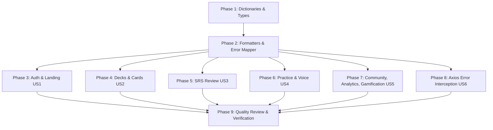

# Implementation Tasks: Complete UI Localization & Error Mapping (US-I18N-02)

- **Feature**: `i18n-ui-localization`
- **Epics**: `EPIC-10` (Multi-language & Internationalization)
- **Status**: SPECIFIED
- **Date**: 2026-08-22
- **Author**: Principal System Architect

---

## Phase 1: Setup & Locale Dictionaries

Goal: Establish the 12 domain namespaces + errors dictionary files in English and Vietnamese, update TypeScript type definitions, and configure i18next registration.

- [x] T001 [P] Create and update English JSON dictionaries (`cards.json`, `study.json`, `gamification.json`, `ai_vocabulary.json`, `errors.json`, `practice.json`, `community.json`, `analytics.json`, `dashboard.json`, `decks.json`, `auth.json`, `common.json`, `settings.json`) in `apps/web/src/locales/en/`
- [x] T002 [P] Create and update Vietnamese JSON dictionaries with linguistic parity and pluralization rules in `apps/web/src/locales/vi/`
- [x] T003 Update `apps/web/src/locales/types.ts` with complete `TranslationNamespaces`, `DomainNamespace`, `ErrorCodeKey`, `LocaleNumberFormatOptions`, and `LocaleDateFormatOptions` interfaces
- [x] T004 Update `apps/web/src/locales/index.ts` and `apps/web/src/locales/i18n.ts` to register all 13 namespaces in runtime resources and namespace array
- [x] T005 [P] Create dictionary parity and symmetry test in `apps/web/src/locales/__tests__/dictionaryParity.test.ts` to verify 100% key matching between `en` and `vi`

---

## Phase 2: Foundational Utilities & Formatting Engine

Goal: Implement Intl-based dynamic formatting utilities, error code resolution mapper, toast deduplication rate-limiter, and custom React hook.

- [x] T006 [P] Implement `apps/web/src/locales/utils/formatters.ts` providing `formatNumber`, `formatDate`, `formatRelativeTime`, and `formatPercent` leveraging ECMAScript `Intl`
- [x] T007 [P] Create unit tests for formatting utilities in `apps/web/src/locales/utils/__tests__/formatters.test.ts` testing `vi-VN` and `en-US` formatting rules and edge cases
- [x] T008 [P] Implement reactive hook `apps/web/src/locales/hooks/useLocaleFormat.ts` for component consumption
- [x] T009 [P] Implement `apps/web/src/locales/utils/errorMapper.ts` with `errorRegistry`, `mapApiError`, and 2000ms sliding window toast deduplication (`isDuplicateToast`)
- [x] T010 [P] Create unit tests for error mapping and deduplication in `apps/web/src/locales/utils/__tests__/errorMapper.test.ts` testing known codes, network drops, unmapped 500s, and rate limiting

---

## Phase 3: User Story 1 (US1) - Core UI Shell, Landing & Authentication Localization

Goal: Localize global navigation, header, landing page, and authentication forms with 0 hardcoded strings.

- [x] T011 [P] [US1] Localize `apps/web/src/components/layout/Header.tsx` and `apps/web/src/components/LanguageSwitcher/LanguageSwitcher.tsx` with dynamic `aria-label` tags
- [x] T012 [P] [US1] Localize `apps/web/src/pages/LandingPage.tsx` and `apps/web/src/features/landing/components/` (`HeroSection.tsx`, `FeatureGrid.tsx`, `CallToAction.tsx`, `LandingFooter.tsx`)
- [x] T013 [P] [US1] Localize `apps/web/src/features/auth/components/LoginForm.tsx` and `apps/web/src/features/auth/components/RegisterForm.tsx` using `t('auth:...')` and `t('common:...')`
- [x] T014 [P] [US1] Localize `apps/web/src/features/auth/pages/LoginPage.tsx`, `RegisterPage.tsx`, and `AuthShowcase.tsx`
- [x] T015 [US1] Add component tests for login/registration form localization in `apps/web/src/features/auth/components/__tests__/AuthForms.spec.tsx`

---

## Phase 4: User Story 2 (US2) - Decks & Card Management Localization (with UGC Isolation)

Goal: Localize deck list, deck detail, card CRUD modals, card data table, and bulk actions toolbar while preserving 100% untranslated user flashcard content.

- [x] T016 [P] [US2] Localize `apps/web/src/features/decks/pages/DecksPage.tsx` and `apps/web/src/features/decks/components/` (`CreateDeckModal.tsx`, `EditDeckModal.tsx`, `DeckCard.tsx`, `DeckFilterBar.tsx`, `DeckHeader.tsx`)
- [x] T017 [P] [US2] Localize `apps/web/src/features/decks/pages/DeckDetailPage.tsx` and `apps/web/src/pages/DeckDetailPage.tsx`
- [x] T018 [P] [US2] Localize `apps/web/src/features/cards/components/CardDataTable.tsx` table headers and status filters with UGC column data preservation
- [x] T019 [P] [US2] Localize `apps/web/src/features/cards/components/AddCardModal.tsx` and `EditCardModal.tsx` form labels, placeholders, and AI auto-fill button
- [x] T020 [P] [US2] Localize `apps/web/src/features/cards/components/BulkActionsToolbar.tsx`, `BulkMoveModal.tsx`, and `DeleteCardConfirmModal.tsx` with i18next pluralization (`{{count}}`)
- [x] T021 [P] [US2] Localize `apps/web/src/components/deck/` (`DeckImportModal.tsx`, `DeckExportModal.tsx`, `ImportPreviewTable.tsx`)
- [x] T022 [US2] Add unit tests verifying UGC isolation in `apps/web/src/features/cards/components/__tests__/CardIsolation.spec.tsx`

---

## Phase 5: User Story 3 (US3) - SRS Review Session & Rating Action Localization

Goal: Localize SRS study session interface, flip prompts, rating action buttons (`Again`/`Hard`/`Good`/`Easy`), interval cues, and session summary modal.

- [x] T023 [P] [US3] Localize `apps/web/src/features/reviews/components/SrsRatingButtons.tsx` displaying `Again`/`Lại`, `Hard`/`Khó`, `Good`/`Tốt`, `Easy`/`Dễ` with localized interval cues (`BR-I18N-008`)
- [x] T024 [P] [US3] Localize `apps/web/src/features/reviews/components/ReviewCard.tsx` flip triggers while keeping flashcard front/back text unmodified
- [x] T025 [P] [US3] Localize `apps/web/src/features/reviews/pages/StudyPage.tsx` and `apps/web/src/features/reviews/components/StudySummaryModal.tsx` with dynamic XP and retention stats
- [x] T026 [US3] Add unit tests for SRS rating button rendering in `apps/web/src/features/reviews/components/__tests__/SrsRatingButtons.spec.tsx`

---

## Phase 6: User Story 4 (US4) - Practice Quiz Modes & Voice Assessment Localization

Goal: Localize all 5 practice quiz modules, audio controls, and speech pronunciation assessment components.

- [x] T027 [P] [US4] Localize `apps/web/src/features/practice/pages/PracticePage.tsx` mode cards and instruction banners
- [x] T028 [P] [US4] Localize quiz components in `apps/web/src/features/practice/components/` (`MultipleChoiceQuiz.tsx`, `FillInTheBlankQuiz.tsx`, `WordMatchingQuiz.tsx`, `ListeningQuiz.tsx`, `QuizSummaryModal.tsx`)
- [x] T029 [P] [US4] Localize `apps/web/src/features/practice/components/SpeechPronunciationPractice.tsx` and voice modal components in `apps/web/src/components/voice/` (`AccentAudioSelector.tsx`, `MicPermissionBanner.tsx`, `PhoneticWordBreakdown.tsx`, `PronunciationPracticeModal.tsx`, `PronunciationScoreBadge.tsx`)
- [x] T030 [US4] Add component tests for practice quiz localization in `apps/web/src/features/practice/components/__tests__/PracticeQuizzes.spec.tsx`

---

## Phase 7: User Story 5 (US5) - Community, Analytics, Gamification & Settings Localization

Goal: Localize public deck gallery, learning analytics charts, streak/XP gamification dialogs, user settings, and AI vocabulary generator.

- [x] T031 [P] [US5] Localize `apps/web/src/features/community/pages/CommunityDecksPage.tsx` and components (`CommunityDeckCard.tsx`, `CommunityDeckPreviewModal.tsx`, `RateDeckModal.tsx`, `CategoryFilterBar.tsx`)
- [x] T032 [P] [US5] Localize `apps/web/src/features/analytics/pages/AnalyticsPage.tsx` and components (`ActivityHeatmap.tsx`, `MasteryDistributionCard.tsx`, `AnalyticsHeroStats.tsx`, `DeckProgressTable.tsx`, `DashboardAnalyticsWidget.tsx`)
- [x] T033 [P] [US5] Localize `apps/web/src/features/dashboard/pages/DashboardPage.tsx` and gamification components in `apps/web/src/features/gamification/components/` (`LevelUpModal.tsx`, `StreakBanner.tsx`, `XpBadge.tsx`, `StreakFreezeModal.tsx`, `FlameNurtureModal.tsx`, `StreakCelebrationModal.tsx`, `DraggableFlameMascot.tsx`)
- [x] T034 [P] [US5] Localize `apps/web/src/features/user-profile/pages/UserProfileModal.tsx`, `LanguageSelector.tsx`, and `ThemeSettings.tsx`
- [x] T035 [P] [US5] Localize `apps/web/src/features/ai-vocabulary/` components with CEFR level badges and generator states

---

## Phase 8: User Story 6 (US6) - Centralized Axios Interception & Error Toast Integration

Goal: Integrate error mapper with Axios response interceptor and Toast provider, ensuring zero raw stack traces and deduplicating rapid errors.

- [x] T036 [US6] Update `apps/web/src/common/api/axios.ts` to integrate `mapApiError` and dispatch sanitized, localized error toasts on API rejection
- [x] T037 [US6] Add integration tests in `apps/web/src/common/api/__tests__/axiosInterceptor.spec.ts` verifying error translation, sanitization, and 2000ms deduplication

---

## Phase 9: Quality Review, Verification & Documentation

Goal: Monorepo verification, UI anti-slop audit against DESIGN.md, layout expansion check, and feature documentation.

- [x] T038 Execute full web test suite: `pnpm --filter web test`
- [x] T039 Execute web typecheck and production build: `pnpm --filter web typecheck && pnpm --filter web build`
- [x] T040 Perform UI layout review against `apps/web/DESIGN.md` for +40% Vietnamese text expansion tolerance (`BR-I18N-010`)
- [x] T041 Create technical documentation and user guide in `docs/features/i18n-ui-localization/README.md`
- [x] T042 Update `docs/PRODUCT_BACKLOG_ROADMAP.md` marking `US-I18N-02` as `[x]`

---

## Dependencies & Implementation Ordering

- **MVP Scope**: Phase 1 (Dictionaries & Types) + Phase 2 (Formatters & Error Mapper) + Phase 3 (Auth/Landing) + Phase 4 (Decks & Cards) + Phase 5 (SRS Review) + Phase 8 (Error Interceptor).
- **Parallel Opportunities**: All tasks marked with `[P]` across different components and test files can be executed concurrently.
