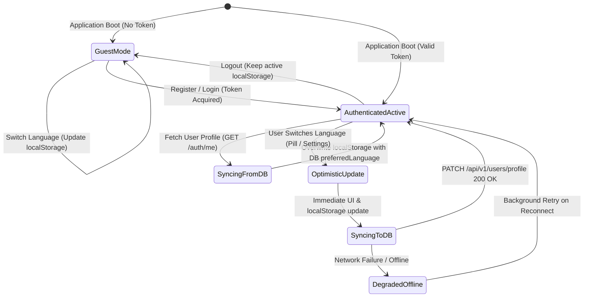
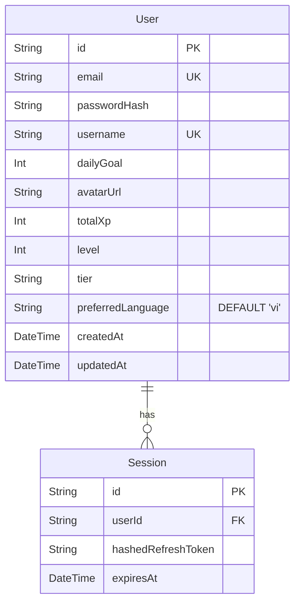

# Domain Model: User Language Preferences Sync (US-I18N-03)

- **Feature**: `US-I18N-03`: Cài đặt tùy chọn ngôn ngữ & Đồng bộ hồ sơ người dùng (User Language Preferences Sync)
- **Slug**: `i18n-user-preferences-sync`
- **Protocol**: Bounded Task
- **Date**: 2026-08-22

---

## 1. RBAC Matrix

| Role                      |   Read Preference (Local)   |    Read Preference (DB)     | Switch UI Locale (Optimistic) |          Sync to Backend Profile           |
| ------------------------- | :-------------------------: | :-------------------------: | :---------------------------: | :----------------------------------------: |
| **Guest / Anonymous**     | ✅ Allowed (`localStorage`) |           ❌ N/A            |          ✅ Allowed           |                   ❌ N/A                   |
| **Authenticated Learner** |         ✅ Allowed          | ✅ Allowed (`GET /auth/me`) |          ✅ Allowed           | ✅ Allowed (`PATCH /api/v1/users/profile`) |
| **System Administrator**  |         ✅ Allowed          |         ✅ Allowed          |          ✅ Allowed           |                 ✅ Allowed                 |

- **Ownership Rule**: Authenticated learners may only view and mutate their own `preferredLanguage` record (`req.user.id`).

---

## 2. State Machine & Lifecycle

### State Transitions Table

| Current State         | Trigger                    | Action                                                                                    | Target State          |
| --------------------- | -------------------------- | ----------------------------------------------------------------------------------------- | --------------------- |
| `GuestMode`           | Guest toggles language     | Update `localStorage['wordstreak_locale']`                                                | `GuestMode`           |
| `GuestMode`           | Guest submits registration | Send `preferredLanguage` in `POST /auth/register`                                         | `AuthenticatedActive` |
| `AuthenticatedActive` | Session init / Login       | `GET /auth/me` returns `preferredLanguage` → update `localStorage` & `i18n`               | `AuthenticatedActive` |
| `AuthenticatedActive` | User toggles language      | Update `i18n` runtime (`<16ms`) + `localStorage` → dispatch `PATCH /api/v1/users/profile` | `SyncingToDB`         |
| `SyncingToDB`         | HTTP 200 OK                | Database updated successfully                                                             | `AuthenticatedActive` |
| `SyncingToDB`         | Network Error / 5xx        | Keep local UI locale active; log warning                                                  | `DegradedOffline`     |
| `AuthenticatedActive` | User logs out              | Clear token; preserve current `localStorage`                                              | `GuestMode`           |

---

## 3. Business Rules

### `BR-I18N-SYNC-001`: Supported Locales Validation

- Language preference values are strictly constrained to the `AppLanguage` enum: `'vi'` (Tiếng Việt) and `'en'` (English).
- Any API request containing a language value other than `'vi'` or `'en'` MUST be rejected with HTTP `400 Bad Request` (`VALIDATION_ERROR`).

### `BR-I18N-SYNC-002`: DB Authority on Authentication

- Upon successful login (`POST /auth/login`) or session restoration (`GET /auth/me`), the backend user profile `preferredLanguage` serves as the authoritative source of truth.
- The client MUST synchronize `localStorage['wordstreak_locale']` with the retrieved DB value and trigger an immediate zero-reload `i18n.changeLanguage()` if it differs from the current active locale.

### `BR-I18N-SYNC-003`: Optimistic UI Transition with Async Background Sync

- When an authenticated learner switches languages (via the Obsidian Pill switcher or the Profile/Settings page):
  1. The client MUST update the React `i18n` context and `localStorage` immediately within `< 16ms` (zero reload).
  2. The client MUST dispatch an asynchronous non-blocking `PATCH /api/v1/users/profile` request with `{ preferredLanguage: newLocale }`.
  3. The UI MUST NOT display a blocking loading spinner for language switching.

### `BR-I18N-SYNC-004`: Registration Preference Inheritance

- When an unauthenticated guest registers an account (`POST /auth/register`), the client MUST pass the active `preferredLanguage` (from `localStorage` or active `i18n` instance) in the request body.
- The backend MUST persist this initial preference into the created `User` record. If omitted, it defaults to `'vi'`.

### `BR-I18N-SYNC-005`: Offline & Network Failure Graceful Degradation

- If the background sync request (`PATCH /api/v1/users/profile`) fails due to network outage or API error:
  1. The client-side UI MUST remain in the newly selected language without crashing or reverting.
  2. The error MUST be caught silently or logged without interrupting user flow with intrusive error dialogs.
  3. The local `localStorage` maintains the user's latest selection for subsequent sessions.

### `BR-I18N-SYNC-006`: Database Default for Existing & New Users

- The database schema default for `User.preferredLanguage` MUST be `'vi'`.
- Database migrations adding `preferredLanguage` MUST set `'vi'` for all existing user rows with `NOT NULL DEFAULT 'vi'`.

### `BR-I18N-SYNC-007`: Debounced & Idempotent Mutex

- Rapid consecutive toggles of the language switcher MUST update local UI state immediately on every click, while debouncing the background API PATCH request (e.g. 300ms debounce) to prevent request flooding.

---

## 4. Workflows & Edge Cases

### Workflow 1: Multi-Device Login Sync (Happy Path)

1. User sets language to English (`en`) on Device A. `User.preferredLanguage` in DB is updated to `'en'`.
2. User opens WordStreak on Device B (where browser default or local cache is `'vi'`).
3. App boots and calls `GET /auth/me`.
4. Response returns `{ id: '...', email: '...', preferredLanguage: 'en', ... }`.
5. Frontend detects mismatch (`localStorage` = `'vi'`, DB = `'en'`).
6. Client updates `localStorage` to `'en'` and switches active UI language to `'en'` instantaneously.

### Workflow 2: In-Session Language Switch (Happy Path)

1. Authenticated user clicks Obsidian Pill (`🇻🇳 VI` ⇄ `🇬🇧 EN`) on top navigation.
2. `i18next.changeLanguage('en')` is invoked (`< 16ms`). All UI strings re-render in English.
3. `localStorage.setItem('wordstreak_locale', 'en')` is executed.
4. Background service calls `api.patch('/users/profile', { preferredLanguage: 'en' })`.
5. Backend updates PostgreSQL record and returns updated profile.

### Workflow 3: Offline / Network Outage Edge Case

1. Authenticated user loses internet connection during study session.
2. User switches language to English in Profile Settings.
3. Local UI switches to English immediately; `localStorage` is updated.
4. Background `PATCH` fails with `NetworkError`.
5. Error is caught gracefully by the sync service; local study session continues smoothly in English.

---

## 5. Entities, Data Boundaries & ERD

### Schema Attributes Specification

| Field Name          | Type                  | Nullable | Default | Constraints                                 | Description                  |
| ------------------- | --------------------- | -------- | ------- | ------------------------------------------- | ---------------------------- |
| `preferredLanguage` | `String` (VARCHAR(5)) | `false`  | `'vi'`  | `CHECK (preferredLanguage IN ('vi', 'en'))` | User's preferred UI language |

---

## 6. UX States & Non-Functional Requirements

- **Switch Latency**: Optimistic UI transition `< 16ms` (1 frame at 60fps), strictly zero full-page reload (`window.location.reload()` forbidden).
- **API Performance**: Background `PATCH /api/v1/users/profile` P95 latency `< 150ms`.
- **Layout Stability**: Zero layout shift (`CLS = 0.00`) during preference sync.
- **Accessibility**: Language toggles must have `aria-label="Switch to English"` / `aria-label="Chuyển sang Tiếng Việt"` and proper keyboard focus states (`WCAG 2.1 AA`).
- **Observability**: Structured logs on backend for invalid locale rejections (`WARN [UsersService] Invalid preferredLanguage rejected`).
