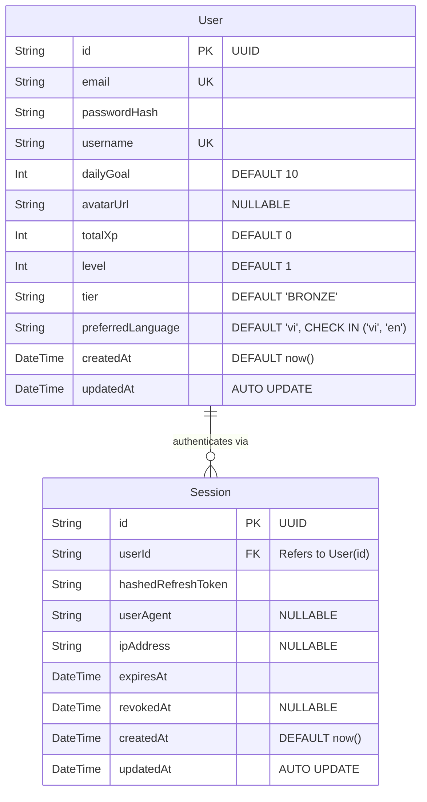
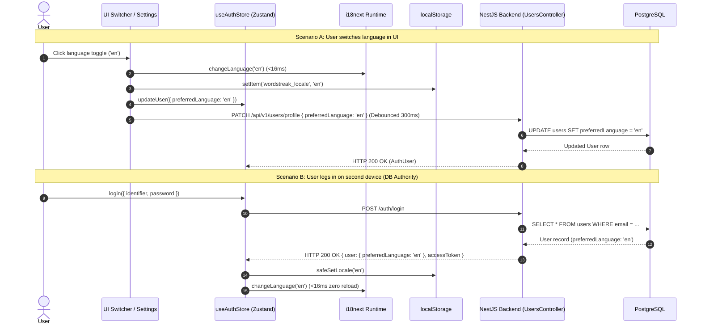

# Data Model: User Language Preferences Sync (US-I18N-03)

**Feature**: `US-I18N-03`: Cài đặt tùy chọn ngôn ngữ & Đồng bộ hồ sơ người dùng (User Language Preferences Sync)  
**Slug**: `i18n-user-preferences-sync`  
**Date**: 2026-08-22  
**Status**: Approved (Phase 3 - Plan)

---

## 1. Entity-Relationship Model (ERD)



---

## 2. Schema Specification & Prisma Changes

### Prisma Schema (`apps/api/prisma/schema.prisma`)

```prisma
model User {
  id                String             @id @default(uuid())
  email             String             @unique
  passwordHash      String
  username          String             @unique
  dailyGoal         Int                @default(10)
  avatarUrl         String?
  totalXp           Int                @default(0)
  level             Int                @default(1)
  tier              String             @default("BRONZE")
  preferredLanguage String             @default("vi")
  createdAt         DateTime           @default(now())
  updatedAt         DateTime           @updatedAt
  sessions          Session[]
  decks             Deck[]
  progress          UserCardProgress[]
  streaks           UserStreak[]
  reviewLogs        ReviewLog[]
  activityLogs      UserActivityLog[]
  ratings           DeckRating[]

  @@map("users")
}
```

### Attributes & Constraints Table

| Column              | PostgreSQL Type | Nullable | Default             | Constraints                                 | Description                  |
| ------------------- | --------------- | -------- | ------------------- | ------------------------------------------- | ---------------------------- |
| `id`                | `UUID`          | `false`  | `gen_random_uuid()` | Primary Key                                 | User unique identifier       |
| `email`             | `VARCHAR(255)`  | `false`  | None                | Unique                                      | User email address           |
| `username`          | `VARCHAR(30)`   | `false`  | None                | Unique                                      | User display handle          |
| `preferredLanguage` | `VARCHAR(5)`    | `false`  | `'vi'`              | `CHECK (preferredLanguage IN ('vi', 'en'))` | User's preferred UI language |
| `dailyGoal`         | `INTEGER`       | `false`  | `10`                | `CHECK (dailyGoal BETWEEN 1 AND 100)`       | Cards to review per day      |
| `avatarUrl`         | `VARCHAR(500)`  | `true`   | `NULL`              | None                                        | Avatar preset or URL         |

---

## 3. Database Migration SQL

```sql
-- Migration: Add preferredLanguage to users table
ALTER TABLE "users" ADD COLUMN "preferredLanguage" VARCHAR(5) NOT NULL DEFAULT 'vi';

-- Add check constraint for valid locales
ALTER TABLE "users" ADD CONSTRAINT "users_preferred_language_check"
  CHECK ("preferredLanguage" IN ('vi', 'en'));

-- Comment on column
COMMENT ON COLUMN "users"."preferredLanguage" IS 'User preferred application locale (vi = Vietnamese, en = English)';
```

---

## 4. Shared Contract Types (`packages/shared-types/src/auth.ts`)

```typescript
export type AppLanguage = "vi" | "en";

export interface AuthUser {
  id: string;
  email: string;
  username: string;
  dailyGoal: number;
  avatarUrl?: string | null;
  preferredLanguage?: AppLanguage;
  createdAt: string | Date;
  updatedAt?: string | Date;
}

export interface UpdateProfileDto {
  dailyGoal?: number;
  avatarUrl?: string;
  preferredLanguage?: AppLanguage;
}

export interface RegisterDto {
  email: string;
  username: string;
  password: string;
  preferredLanguage?: AppLanguage;
}
```

---

## 5. Client State & Sync Lifecycle


