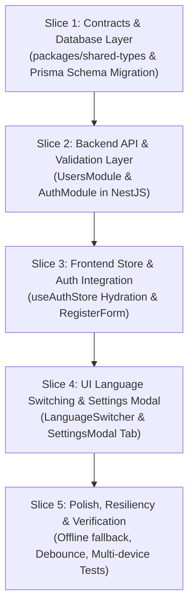

# Implementation Plan: User Language Preferences Sync (US-I18N-03)

**Branch**: `feat/i18n-user-preferences-sync` | **Date**: 2026-08-22 | **Spec**: [`.specify/features/i18n-user-preferences-sync/spec.md`](file:///Users/vutuanhau/Documents/PROJECT/WordStreak/.specify/features/i18n-user-preferences-sync/spec.md)

---

## 1. Summary

This plan outlines the end-to-end architecture and implementation strategy for **US-I18N-03 (User Language Preferences Sync)**. The feature adds database-level persistence (`preferredLanguage` in PostgreSQL via Prisma), updates the NestJS auth and users modules, enhances shared DTOs in `@wordstreak/shared-types`, and connects React 19 frontend stores (`useAuthStore`, `LanguageSwitcher`, `SettingsModal`) to enable optimistic <16ms UI updates with debounced background database synchronization.

---

## 2. Technical Context

- **Language/Version**: TypeScript 5.7+ (Node.js LTS, strict mode enabled)
- **Primary Dependencies**:
  - Backend: NestJS 11, Prisma ORM 6+, class-validator 0.14+, class-transformer 0.5+
  - Frontend: React 19, i18next 24+, react-i18next 15+, Zustand 5+, Axios, Lucide React, Framer Motion
  - Shared: `@wordstreak/shared-types`
- **Storage**: PostgreSQL 16 with Prisma ORM
- **Testing**: Vitest (Web & Unit), Jest (NestJS Unit/Integration), Supertest (e2e)
- **Target Platform**: Modern Web (Chrome, Firefox, Safari, Edge, Mobile Responsive)
- **Project Type**: Fullstack Monorepo (`pnpm workspace`)
- **Performance Goals**:
  - UI Language Transition Latency: `< 16ms` (Zero full-page reload)
  - Background Profile Sync P95: `< 150ms`
  - Cumulative Layout Shift: `CLS = 0.00`
- **Constraints**:
  - Only `'vi'` and `'en'` supported
  - Graceful degradation on network outages (zero blocking error dialogs)
  - Debounced sync dispatch (300ms trailing)

---

## 3. Constitution Check

_GATE: Evaluation against WordStreak Constitution v1.0.0_

| Principle                     | Check / Status | Compliance Notes                                                                                                                  |
| ----------------------------- | -------------- | --------------------------------------------------------------------------------------------------------------------------------- |
| **I. Code Quality First**     | ✅ PASS        | Strict typing, no `any`, shared types in `@wordstreak/shared-types`, zero lint warnings, files < 800 lines.                       |
| **II. Testing Standards**     | ✅ PASS        | Unit tests for `UsersService`, `AuthService`, `useAuthStore`, `LanguageSwitcher`, and `SettingsModal` with ≥ 80% branch coverage. |
| **III. UX Consistency**       | ✅ PASS        | Adheres to Obsidian design tokens, zero layout shift, seamless optimistic switching, WCAG AA keyboard accessibility.              |
| **IV. Performance Goals**     | ✅ PASS        | UI switch <16ms, zero page reload, debounced API calls, background sync P95 < 150ms.                                              |
| **V. Technology Constraints** | ✅ PASS        | NestJS + Prisma + PostgreSQL + React 19 + Vite + Tailwind CSS. All schema changes via Prisma migration.                           |

_Gate Result: ALL GATES PASSED. Ready for Phase 1 Design._

---

## 4. Project Structure & File Layout

### Documentation

```text
.specify/features/i18n-user-preferences-sync/
├── baseline.md                           # Domain baseline
├── spec.md                               # Feature specification
├── checklists/requirements.md            # Quality validation checklist
├── research.md                           # Architecture decisions
├── plan.md                               # This implementation plan
├── data-model.md                         # Prisma schema & ERD
├── contracts/                            # API contracts & DTO specs
│   └── user-language-preferences.contract.md
├── quickstart.md                         # Validation & test guide
└── tasks.md                              # Dependency-ordered tasks
```

### Source Code Tree

```text
packages/shared-types/
├── src/
│   ├── auth.ts                           # Add AppLanguage, update AuthUser, RegisterDto, UpdateProfileDto
│   └── index.ts                          # Export AppLanguage and updated User

apps/api/
├── prisma/
│   ├── schema.prisma                     # Add preferredLanguage to User model
│   └── migrations/                       # Migration for preferredLanguage column
└── src/
    └── modules/
        ├── auth/
        │   ├── auth.service.ts           # Include preferredLanguage in mapToAuthUser & register
        │   ├── dto/register.dto.ts       # Validate optional preferredLanguage (@IsIn(['vi', 'en']))
        │   └── auth.service.spec.ts      # Unit tests for auth registration with preferredLanguage
        └── users/
            ├── users.service.ts          # Include preferredLanguage in getProfile & updateProfile
            ├── users.controller.ts       # Ensure PATCH /profile returns preferredLanguage
            ├── dto/update-profile.dto.ts # Validate optional preferredLanguage (@IsIn(['vi', 'en']))
            └── users.service.spec.ts     # Unit tests for profile preference persistence

apps/web/
└── src/
    ├── store/
    │   └── useAuthStore.ts               # Hydrate i18n from user.preferredLanguage on login/getMe
    ├── components/
    │   └── LanguageSwitcher/
    │       ├── LanguageSwitcher.tsx      # Dispatch debounced profile sync if authenticated
    │       └── LanguageSwitcher.test.tsx # Component test for optimistic toggle & sync trigger
    ├── features/
    │   ├── auth/
    │   │   └── components/
    │   │       └── RegisterForm.tsx      # Pass active i18n locale in register payload
    │   └── user-profile/
    │       ├── components/
    │       │   └── SettingsModal.tsx     # Add "Language & Region" tab with interactive selector
    │       └── services/
    │           └── userService.ts        # Ensure updateProfile sends preferredLanguage
    └── locales/
        └── utils/
            └── syncManager.ts            # Debounced language sync coordinator
```

---

## 5. Vertical Slicing Strategy



### Slice Breakdown

- **Slice 1 (Data & Types)**: Define `AppLanguage` in `shared-types`, update Prisma `User.preferredLanguage` schema with `@default("vi")`, run migration.
- **Slice 2 (Backend Services & DTOs)**: Update `RegisterDto`, `UpdateProfileDto`, `UsersService`, `AuthService`, and unit tests.
- **Slice 3 (Client Auth Hydration)**: Update `useAuthStore` to sync DB language to `localStorage` and `i18next` on `initializeAuth` and `login`; update `RegisterForm` to send active language.
- **Slice 4 (UI Interaction)**: Connect `LanguageSwitcher` to debounced `userService.updateProfile()`; add "Language & Region" tab to `SettingsModal`.
- **Slice 5 (Resiliency & Edge Cases)**: Test offline degradation, debounce mutex, invalid payload rejection, and verify zero layout shift.

---

## 6. Migration & Rollback Strategy

1. **Database Migration**:
   - `preferredLanguage` column is added with `NOT NULL DEFAULT 'vi'` and a `CHECK` constraint.
   - Zero downtime: Existing rows automatically receive `'vi'`.
   - Rollback: If needed, migration can be reverted with `ALTER TABLE users DROP COLUMN "preferredLanguage"`.
2. **Backward Compatibility**:
   - `preferredLanguage` is optional in `RegisterDto` and `UpdateProfileDto`. Older clients omitting the field will continue to function without errors.
   - Frontend safely falls back to local storage if API does not return `preferredLanguage`.
