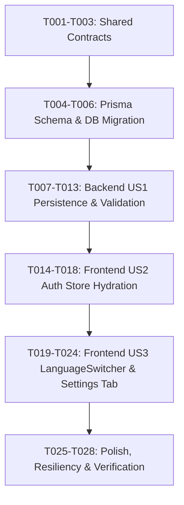

# Tasks: User Language Preferences Sync (US-I18N-03)

**Feature**: `US-I18N-03`: Cài đặt tùy chọn ngôn ngữ & Đồng bộ hồ sơ người dùng (User Language Preferences Sync)  
**Slug**: `i18n-user-preferences-sync`  
**Plan**: [`.specify/features/i18n-user-preferences-sync/plan.md`](file:///Users/vutuanhau/Documents/PROJECT/WordStreak/.specify/features/i18n-user-preferences-sync/plan.md)  
**Spec**: [`.specify/features/i18n-user-preferences-sync/spec.md`](file:///Users/vutuanhau/Documents/PROJECT/WordStreak/.specify/features/i18n-user-preferences-sync/spec.md)  
**Date**: 2026-08-22

---

## 1. Task Breakdown by Phase

### Phase 1: Setup & Shared Contracts

- [x] T001 Define `AppLanguage = 'vi' | 'en'` and update `AuthUser`, `RegisterDto`, and `UpdateProfileDto` in `packages/shared-types/src/auth.ts`
- [x] T002 Export updated auth and user types from `packages/shared-types/src/index.ts`
- [x] T003 Build shared contracts package via `pnpm --filter @wordstreak/shared-types build`

---

### Phase 2: Foundational & Database Layer

- [x] T004 Add `preferredLanguage String @default("vi")` field to `User` model in `apps/api/prisma/schema.prisma`
- [x] T005 Generate Prisma client and create database migration in `apps/api/prisma/migrations/`
- [x] T006 Add database check constraint `CHECK (preferredLanguage IN ('vi', 'en'))` in the migration script

---

### Phase 3: User Story 1 (P1) - Backend Auth & Profile Persistence

**Goal**: Enable backend persistence and retrieval of `preferredLanguage` via NestJS auth and users modules with class-validator enforcement.  
**Independent Test**: Run unit tests in `users.service.spec.ts` and `auth.service.spec.ts` confirming `preferredLanguage` is returned in profile and registration responses, and invalid values are rejected with 400.

- [x] T007 [P] [US1] Write unit tests for `preferredLanguage` validation and persistence in `apps/api/src/modules/users/users.service.spec.ts`
- [x] T008 [P] [US1] Write unit tests for registration preference persistence in `apps/api/src/modules/auth/auth.service.spec.ts`
- [x] T009 [US1] Update `UpdateProfileDto` in `apps/api/src/modules/users/dto/update-profile.dto.ts` with `@IsIn(['vi', 'en'])` validation
- [x] T010 [US1] Update `RegisterDto` in `apps/api/src/modules/auth/dto/register.dto.ts` with `@IsIn(['vi', 'en'])` validation
- [x] T011 [US1] Update `UsersService` (`create`, `mapToProfile`, `updateProfile`) in `apps/api/src/modules/users/users.service.ts` to handle `preferredLanguage`
- [x] T012 [US1] Update `AuthService` (`mapToAuthUser`, `register`, `login`, `getMe`) in `apps/api/src/modules/auth/auth.service.ts` to pass and return `preferredLanguage`
- [x] T013 [US1] Run backend unit test suite `pnpm --filter @wordstreak/api test -- users.service.spec.ts auth.service.spec.ts` and verify 100% pass

---

### Phase 4: User Story 2 (P1) - Frontend Auth Store Hydration & Registration Carryover

**Goal**: Ensure client store hydrations (`initializeAuth`, `login`) apply DB `preferredLanguage` to `localStorage` and `i18next`, and `RegisterForm` transmits guest's active language.  
**Independent Test**: Run `useAuthStore` and `RegisterForm` test suites verifying DB preference overrides local cache on login, and registration passes active language.

- [x] T014 [P] [US2] Write unit tests for auth store language hydration in `apps/web/src/store/__tests__/useAuthStore.i18n.test.ts`
- [x] T015 [P] [US2] Write unit tests for registration language payload in `apps/web/src/features/auth/components/__tests__/RegisterForm.i18n.test.tsx`
- [x] T016 [US2] Update `useAuthStore.ts` in `apps/web/src/store/useAuthStore.ts` to hydrate `localStorage` and invoke `i18n.changeLanguage(user.preferredLanguage)` upon `login()` and `initializeAuth()`
- [x] T017 [US2] Update `RegisterForm.tsx` in `apps/web/src/features/auth/components/RegisterForm.tsx` to include `i18n.language` in the registration payload
- [x] T018 [US2] Run frontend auth test suite `pnpm --filter @wordstreak/web test -- useAuthStore.i18n.test.ts RegisterForm.i18n.test.tsx`

---

### Phase 5: User Story 3 (P1) - In-Session Optimistic Switch & Settings Tab

**Goal**: Connect `LanguageSwitcher` to debounced background sync when user is authenticated, and add "Language & Region" tab in `SettingsModal`.  
**Independent Test**: Click language toggle in `LanguageSwitcher` and `SettingsModal`, verifying instant (<16ms) UI re-render, local storage update, and debounced API call.

- [x] T019 [P] [US3] Create debounced language sync utility in `apps/web/src/locales/utils/syncManager.ts`
- [x] T020 [P] [US3] Write component tests for optimistic toggle and sync dispatch in `apps/web/src/components/LanguageSwitcher/__tests__/LanguageSwitcher.sync.test.tsx`
- [x] T021 [P] [US3] Write component tests for SettingsModal Language tab in `apps/web/src/features/user-profile/components/__tests__/SettingsModal.language.test.tsx`
- [x] T022 [US3] Update `LanguageSwitcher.tsx` in `apps/web/src/components/LanguageSwitcher/LanguageSwitcher.tsx` to invoke debounced profile sync if authenticated
- [x] T023 [US3] Update `SettingsModal.tsx` in `apps/web/src/features/user-profile/components/SettingsModal.tsx` to add "Language & Region" tab with interactive language selector and feedback
- [x] T024 [US3] Run switcher and settings tests `pnpm --filter @wordstreak/web test -- LanguageSwitcher.sync.test.tsx SettingsModal.language.test.tsx`

---

### Phase 6: Polish, Resiliency & Verification

- [x] T025 [P] Verify offline graceful degradation (mock network failure on background sync and assert zero UI crash/alerts)
- [x] T026 [P] Verify debouncing prevents API flooding during rapid clicking (5 clicks in 1 second -> exactly 1 API call dispatched)
- [x] T027 Run full repository lint and typecheck: `pnpm lint && pnpm type-check`
- [x] T028 Run full test suites across workspace: `pnpm test`

---

## 2. Dependencies & Execution Order

---

## 3. Parallel Execution Examples

- **Phase 3 (Backend US1)**: `T007` (`users.service.spec.ts`) and `T008` (`auth.service.spec.ts`) can be authored concurrently.
- **Phase 4 (Frontend US2)**: `T014` (`useAuthStore.i18n.test.ts`) and `T015` (`RegisterForm.i18n.test.tsx`) can be authored concurrently.
- **Phase 5 (Frontend US3)**: `T019` (`syncManager.ts`), `T020` (`LanguageSwitcher.sync.test.tsx`), and `T021` (`SettingsModal.language.test.tsx`) can be developed in parallel.

---

## 4. Implementation Strategy & MVP Scope

- **MVP Scope**: Phases 1, 2, 3, and 4 (Tasks T001 - T018) provide fully functional cross-device login synchronization and registration carryover.
- **Incremental Enhancement**: Phase 5 (Tasks T019 - T024) completes in-session optimistic switching and dedicated Settings Modal preferences UI.
- **Hardening**: Phase 6 (Tasks T025 - T028) ensures network failure resiliency and prevents request spamming.
