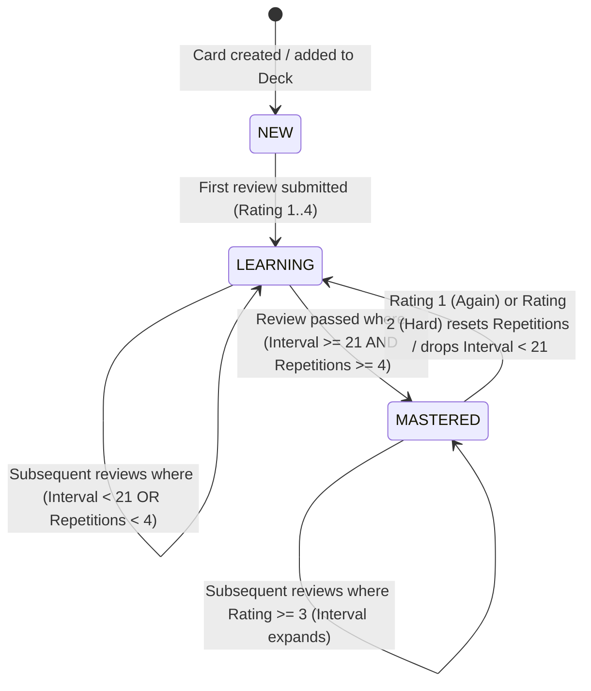
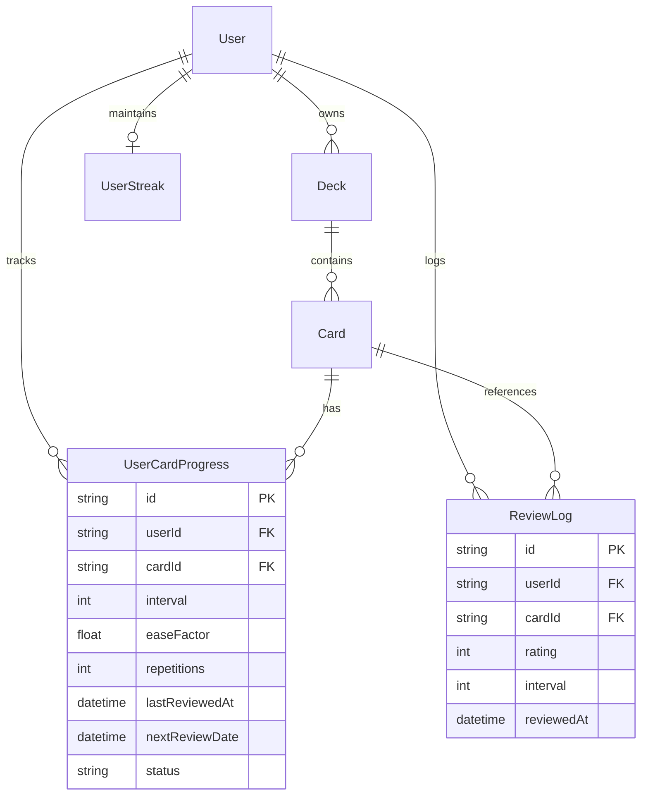

# Domain Model: Learning Analytics & Retention Dashboard

- **Feature Slug**: `learning-analytics`
- **Date**: 2026-08-21
- **Status**: Completed

---

## 1. RBAC Matrix

| Role                        |     View Personal Analytics      | View Deck Analytics | Export Analytics |        View Other Users' Data         |
| :-------------------------- | :------------------------------: | :-----------------: | :--------------: | :-----------------------------------: |
| **Guest / Unauthenticated** |      ❌ (Redirect `/login`)      |         ❌          |        ❌        |                  ❌                   |
| **Learner (Authenticated)** |          ✅ (Self only)          |  ✅ (Owned decks)   | ✅ (CSV summary) |       ❌ (Strict 403 Forbidden)       |
| **System Admin**            | ✅ (Aggregated system telemetry) |         ✅          |        ✅        | ❌ (No PII leakage without audit log) |

---

## 2. State Machine: Vocabulary Card Mastery Lifecycle

---

## 3. Business Rules & Algorithms

### **BR-STAT-001 (Mastery Status Classification)**

- A card's mastery status is derived as:
  - `MASTERED`: `interval >= 21` (days) AND `repetitions >= 4`.
  - `LEARNING`: `interval > 0` AND (`interval < 21` OR `repetitions < 4`).
  - `NEW`: `repetitions == 0` AND `interval == 0` (card has never been evaluated in a review session).

### **BR-STAT-002 (365-Day Rolling Heatmap Window)**

- The activity heatmap calculates daily review submission counts across a rolling 365-day (52-week) window ending on today's local date (`User Timezone`).
- Timezone is resolved from the client header `x-timezone` (or fallback to `UTC`).
- Each bucket represents `[local_midnight_start, local_midnight_end]`.

### **BR-STAT-003 (Heatmap Activity Levels)**

- Review count mapping to visual intensity levels:
  - `Level 0`: `count == 0` (Base border canvas)
  - `Level 1`: `1 <= count <= 5` (Subtle tint)
  - `Level 2`: `6 <= count <= 15` (Medium tint)
  - `Level 3`: `16 <= count <= 30` (Strong tone)
  - `Level 4`: `count >= 31` (Vibrant purple accent / max glow)

### **BR-STAT-004 (Deck Completion Forecast Algorithm)**

- Let `TotalCards` = total active cards in deck.
- Let `MasteredCards` = count of cards in deck with status `MASTERED`.
- Let `RemainingCards` = `max(0, TotalCards - MasteredCards)`.
- Let `DailyVelocity` = average count of unique cards reviewed per day over the past 7 active calendar days in this deck (or globally if deck reviews < 3 days).
- If `DailyVelocity == 0`, fallback to `User.dailyGoal / 2`.
- `EstimatedDays = ceil(RemainingCards / max(DailyVelocity, 1))`.
- `TargetCompletionDate = CurrentDate + EstimatedDays (days)`.
- If `RemainingCards == 0`, `EstimatedDays = 0`, status = "Completed 🎉".

### **BR-STAT-005 (30-Day Retention Rate Metric)**

- `RetentionRate = (Count of reviews with rating >= 3 in past 30 days) / (Total reviews in past 30 days) * 100%`.
- If total reviews in past 30 days is 0, return `null` / `"N/A - Chưa có dữ liệu"`.

### **BR-STAT-006 (Review Event Logging & Idempotency)**

- Every successful call to `POST /api/v1/reviews/submit` creates an immutable `ReviewLog` record with: `userId`, `cardId`, `rating`, `interval`, `reviewedAt`.
- Rapid duplicate submissions within < 2000ms for the same `userId` and `cardId` are deduplicated.

### **BR-STAT-007 (Gamification & Telemetry Anti-Abuse Pass)**

- **Clock Manipulation**: Daily timestamps are anchored to server UTC time and converted using authenticated IANA timezone headers.
- **Bot/Script Review Spam**: Analytics rate limits aggregation endpoints to 60 requests/minute per user. Rate limit for review submissions is 120 submissions/minute.
- **Data Scoping**: Aggregations strictly filter by `userId` and `deck.isArchived = false`.

---

## 4. Workflows & Edge Cases

### Happy Path: Viewing Learning Analytics

1. User visits `/analytics` or loads `/dashboard`.
2. Frontend requests `GET /api/v1/analytics/overview` (passing `x-timezone: Asia/Ho_Chi_Minh`).
3. Backend performs indexed aggregation over `user_card_progress` and `review_logs`.
4. Response returns in < 40ms.
5. User interacts with heatmap cells to inspect historical review counts, hovers over mastery donut slices, and filters deck forecasts.

### Edge Cases & Resiliency:

- **Zero Historical Reviews**: Shows onboarding empty state ("Hãy bắt đầu phiên học đầu tiên để kích hoạt biểu đồ tiến độ!") with a direct CTA button "Bắt đầu học ngay".
- **Archived Decks**: Excluded from global active mastery calculations unless explicitly requested with `?includeArchived=true`.
- **Timezone Crossing / DST**: Timezone string validated against standard IANA timezone database; invalid timezones safely fallback to `UTC`.
- **Deleted Cards**: `ReviewLog` has cascade delete on `Card` and `User` foreign keys.

---

## 5. Entity-Relationship Diagram (ERD)

---

## 6. UX States & Non-Functional Requirements

### UX States:

- **Loading**: Skeleton pulse placeholders for KPI cards, Donut chart, and Heatmap grid.
- **Empty State**: Document-first minimal card with Purple Flame mascot and CTA button.
- **Error State**: Non-blocking toast notification + inline retry button.

### Non-Functional Requirements:

- **Performance**: P95 query latency < 50ms for 365-day aggregation using composite index `[userId, reviewedAt]`.
- **Anti-AI-Slop Compliance**: Pure white canvas (`#ffffff`), 1px hairline borders (`#e5e5e5`), Obsidian black pills (`#000000`, `rounded-full`), stable outer hover anchors.
- **Accessibility**: WCAG 2.1 AA compliant colors, keyboard focus on heatmap days with tooltip announcement.
- **i18n**: Fully localized in Vietnamese with bilingual metric labels (Mastered / Thành thạo, Learning / Đang học, New / Từ mới).
