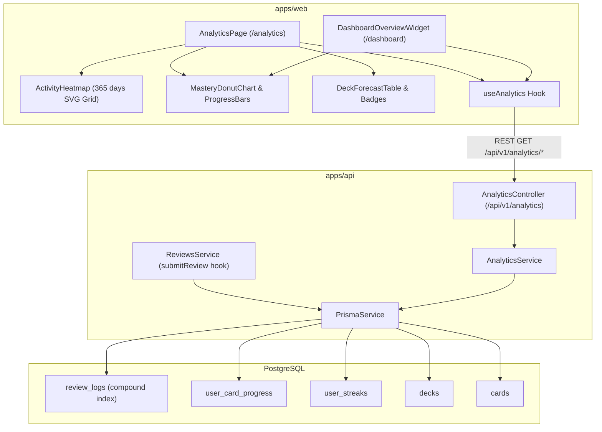

# Technical Implementation Plan: Learning Analytics & Retention Dashboard

**Feature Slug**: `learning-analytics`  
**Date**: 2026-08-21

---

## 1. Architecture Overview

---

## 2. Implementation Slices

### Slice 1: Database Migration & Shared Contracts

- Update `packages/shared-types` with analytics interfaces.
- Add `ReviewLog` model in `apps/api/prisma/schema.prisma`.
- Run Prisma migration + client generation.
- Hook review submission in `ReviewsService.submitReview` to create `ReviewLog`.

### Slice 2: Backend Analytics Engine & Endpoints

- Create `AnalyticsModule`, `AnalyticsController`, `AnalyticsService` in `apps/api/src/modules/analytics`.
- Implement `GET /api/v1/analytics/overview` (Mastery summary, retention rate, stats).
- Implement `GET /api/v1/analytics/activity-heatmap` (Rolling 365 days, timezone aggregation, levels 0-4).
- Implement `GET /api/v1/analytics/deck-forecast/:deckId` & `GET /api/v1/analytics/decks-progress`.
- Write comprehensive Jest unit tests (`analytics.service.spec.ts`, `analytics.controller.spec.ts`).

### Slice 3: Frontend UI Components & State

- Create `useAnalytics` hook in `apps/web/src/hooks/useAnalytics.ts`.
- Build `ActivityHeatmap` component (52-week SVG/CSS grid with accessible tooltips).
- Build `MasteryDonutChart` / `MasteryProgressCard` component.
- Build `DeckForecastTable` and `DeckForecastBadge` component.
- Create full `AnalyticsPage` route at `/analytics` and add navigation item in Sidebar/Header.
- Embed compact Analytics Widget on `/dashboard`.
- Write Vitest component tests.

### Slice 4: Anti-AI-Slop Review & Verification

- Adversarial UI review matching `DESIGN.md` and `MEMORY.md`.
- Run full test suites (`pnpm test`).
