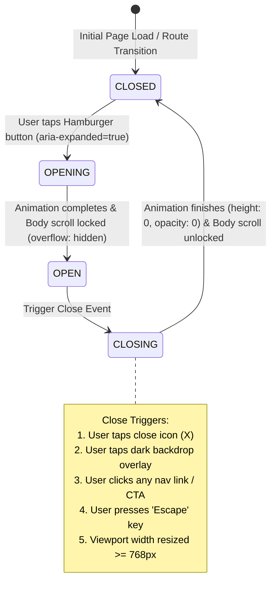
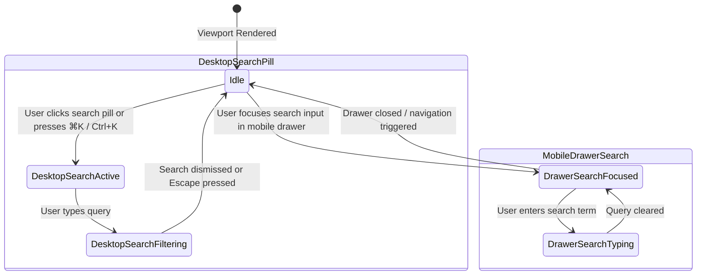

# Domain Model: Mobile Responsive Layout & Header Navigation (TASK-MOBILE-RESPONSIVE)

## 1. Responsive Breakpoint Matrix

| Breakpoint                  | Viewport Width | Target Devices                                         | Header Navigation Spec                                                                                | Content Layout & Container Spec                                                                                                                      |
| :-------------------------- | :------------- | :----------------------------------------------------- | :---------------------------------------------------------------------------------------------------- | :--------------------------------------------------------------------------------------------------------------------------------------------------- |
| **`xs` (Compact)**          | 320px – 374px  | Galaxy Fold (outer cover), iPhone SE (1st gen)         | Compact brand logo, circular hamburger button (`44x44px` touch target), search integrated into drawer | Single column, container padding `px-3` or `px-4`, font scaled via responsive classes, 3D card scaled to `100% max-w-full`, buttons stack full-width |
| **`sm` (Mobile)**           | 375px – 639px  | iPhone SE (2nd/3rd gen), iPhone Mini, standard Android | Brand logo + free badge, circular hamburger button, mobile drawer navigation                          | Single column, container padding `px-4 sm:px-6`, cards and grids auto-fit without overflow                                                           |
| **`md` (Tablet / Phablet)** | 640px – 767px  | Large smartphones landscape, iPad Mini                 | Brand logo, Language Switcher visible or condensed, circular hamburger button                         | 2-column grids for feature cards, relaxed spacing `px-6`                                                                                             |
| **`lg` (Desktop Standard)** | 768px – 1023px | iPad landscape, smaller laptops                        | Full horizontal nav links, compact search pill, action cluster (Sign In, CTA)                         | Multi-column grid (2–3 columns), sidebar/topbar desktop layouts                                                                                      |
| **`xl` (Wide Desktop)**     | 1024px+        | Desktop monitors, large displays                       | Full nav links, expanded search pill with `⌘K` keyboard shortcut hint, full CTA cluster               | Max-w-6xl centered containers                                                                                                                        |

---

## 2. UI State Machines & Lifecycle

### 2.1 Mobile Drawer Navigation State Machine

### 2.2 Search Modal / Input Focus State Machine (Mobile vs Desktop)

---

## 3. Business & UI Rules

- **BR-MOBILE-001 (Zero Horizontal Scroll Guarantee)**:
  - The root document element (`html`, `body`, `#root`, `.landing-canvas`) MUST strictly prevent horizontal scrolling (`overflow-x: clip` or `overflow-x: hidden`).
  - No child section, container, image, code block, or 3D transform element may specify a fixed pixel width that exceeds `100vw` minus container padding on any viewport `>= 320px`.

- **BR-MOBILE-002 (Header Responsive Breakpoint & Hamburger Collapse)**:
  - On viewports `< 768px` (`md` breakpoint), desktop navigation links (`<nav>`) and desktop CTA buttons MUST be hidden (`hidden md:flex`).
  - A circular hamburger toggle button MUST be rendered on mobile viewports with minimum tap dimensions of `36x36px` to `44x44px` (`rounded-full border border-[#e5e5e5] bg-[#fafafa]`).

- **BR-MOBILE-003 (Mobile Drawer Component Spec & Contents)**:
  - When opened, the Mobile Drawer MUST render above all underlying page content (`z-50`) with an accessible backdrop overlay (`z-40`, `bg-black/40`).
  - The drawer MUST contain:
    1. Search input pill (`search-pill-input w-full`).
    2. Navigation section anchor links (`Interactive Demo`, `Features`, `How It Works`, `Study Goals`, `FAQ`).
    3. Integrated `LanguageSwitcher` row with label.
    4. "Sign In" link (`/login`).
    5. Primary CTA button ("Start Learning Free" -> `/register`).

- **BR-MOBILE-004 (Body Scroll Lock on Drawer Open)**:
  - When the Mobile Drawer transitions to `OPEN`, `document.body.style.overflow = 'hidden'` MUST be set to prevent background page scrolling.
  - When the Mobile Drawer transitions to `CLOSED` or is unmounted, `document.body.style.overflow` MUST be restored cleanly.

- **BR-MOBILE-005 (Hero Section & Interactive 3D Card Scaling)**:
  - The Hero section title, subtitle, search lookup input, and interactive 3D flashcard / keyboard preview MUST scale fluidly down to `320px` without text truncation or clipping.
  - On screens `< 640px`, interactive preview layouts MUST stack vertically (`flex-col`) with responsive padding (`p-3 sm:p-6`) and `max-w-full`.

- **BR-MOBILE-006 (Touch Target & Safe Area Compliance)**:
  - All interactive mobile elements (buttons, inputs, language selector pills, links) MUST provide an effective hit area of at least 44x44px to comply with WCAG 2.1 Success Criterion 2.5.5/2.5.8.
  - Drawers and bottom sheets MUST account for iOS home indicator bar using `env(safe-area-inset-bottom)`.

- **BR-MOBILE-007 (In-App Dashboard & Flashcard Compact Layout)**:
  - The in-app topbar (`DashboardNavbar`) MUST condense widgets (Streak flame, Level/XP, Profile avatar, Offline sync pill) into compact badge representations on viewports `< 640px` to prevent overflow or wrapping glitches.
  - In-app deck cards and study flashcards MUST maintain proportional aspect ratios and full readability down to 320px.

- **BR-MOBILE-008 (Auth Pages Mobile Optimization)**:
  - Authentication forms (`/login`, `/register`) MUST use responsive container widths (`w-full max-w-md mx-auto`) with comfortable mobile padding (`px-4 py-6 sm:p-8`) and full-width input fields / buttons down to 320px.

---

## 4. Workflows & Edge Cases

### Happy Path Workflows

- **WF-01 (Landing Page Mobile Navigation)**:
  1. User loads landing page on a 375px mobile screen.
  2. Header displays brand logo + free badge on the left, and circular hamburger button on the right.
  3. User taps hamburger button -> Mobile drawer smoothly expands downward with backdrop overlay.
  4. User taps "How It Works" link -> Drawer closes, page smoothly scrolls to `#how-it-works` section.

- **WF-02 (Language Switch inside Mobile Drawer)**:
  1. User opens mobile drawer.
  2. User taps `LanguageSwitcher` pill and selects "Tiếng Việt".
  3. All menu links, badges, and landing page copy immediately update to Vietnamese.
  4. Drawer remains open and responsive until closed by user.

### Edge Cases

- **EC-01 (Screen Resize / Device Rotation)**: If a user rotates a phone from portrait (375px) to landscape (812px) or resizes browser window beyond `768px`, the mobile drawer MUST automatically close and body scroll lock MUST be cleared.
- **EC-02 (Keyboard Popup in Mobile Drawer Search)**: When virtual keyboard pops up during drawer search input focus, the drawer layout MUST preserve visibility of the active input without displacing the top header bar.
- **EC-03 (Ultra-compact 320px Display)**: Long brand or badge text MUST gracefully wrap or condense (`text-[10px]` badge, truncated long text if necessary) without overflowing the 320px boundary.
