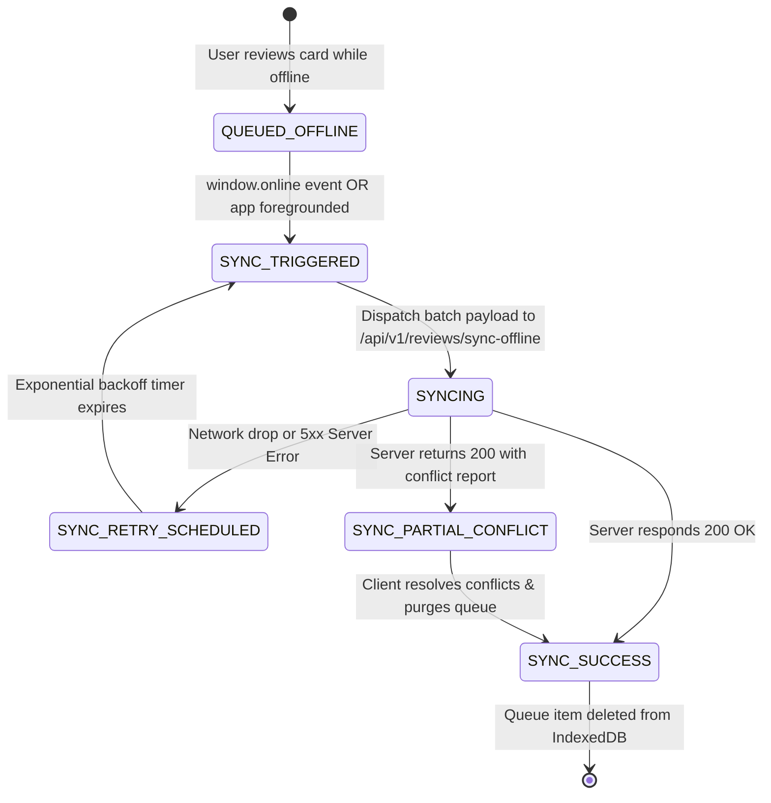
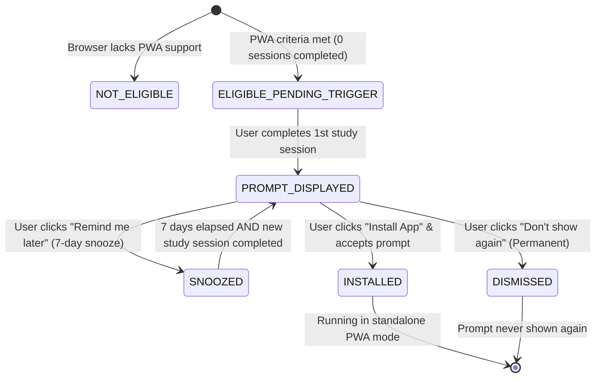
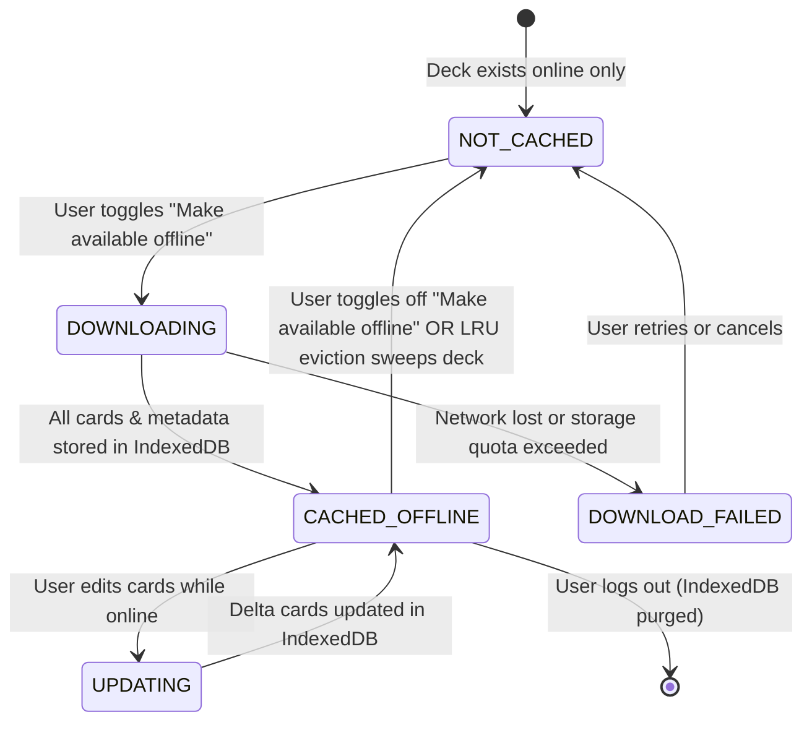
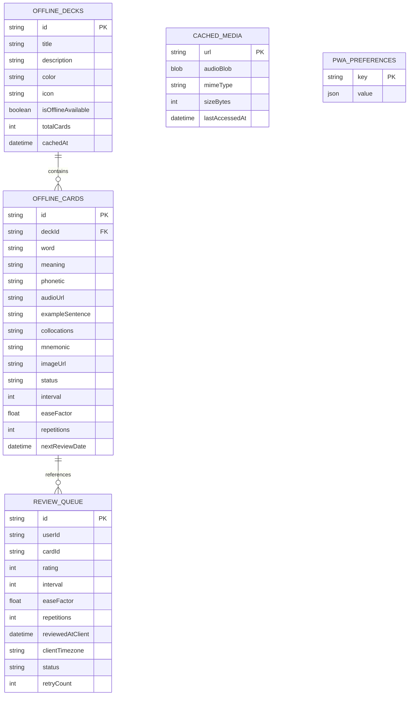

# Domain Model: Progressive Web App (PWA) & Offline Study Mode

- **Feature Slug**: `pwa-offline-mode`
- **Target User Story**: `US-ECO-04`
- **Date**: 2026-08-24
- **Stage**: Stage 4 — Domain Modeling

---

## 1. RBAC Matrix

The PWA and Offline Mode subsystem interacts with users across various authentication and operational tiers:

| Role                                 | Install PWA Shell | Access Cached Shell  | Auto-Cache Due Cards | Manual Deck Pre-Cache     | Perform Offline Reviews | Sync Offline Queue       | Purge Cache on Logout |
| ------------------------------------ | ----------------- | -------------------- | -------------------- | ------------------------- | ----------------------- | ------------------------ | --------------------- |
| **Guest / Anonymous**                | ✅ Yes            | ✅ Yes (Public demo) | ❌ No                | ❌ No                     | ❌ No                   | ❌ No                    | N/A                   |
| **Learner (Free Tier)**              | ✅ Yes            | ✅ Yes               | ✅ Yes (Today's due) | ✅ Yes (Up to 50MB quota) | ✅ Yes (Local SM-2)     | ✅ Yes (Auto-sync)       | ✅ Yes (Auto-wipe)    |
| **Learner (Pro Tier)**               | ✅ Yes            | ✅ Yes               | ✅ Yes (Today's due) | ✅ Yes (Up to 50MB quota) | ✅ Yes (Local SM-2)     | ✅ Yes (Auto-sync)       | ✅ Yes (Auto-wipe)    |
| **System Admin**                     | ✅ Yes            | ✅ Yes               | ✅ Yes               | ✅ Yes                    | ✅ Yes                  | ✅ Yes                   | ✅ Yes                |
| **Service Worker / Background Sync** | N/A               | N/A                  | N/A                  | N/A                       | N/A                     | ✅ Yes (Batch processor) | N/A                   |

### Ownership & Boundary Rules:

- **Card & Deck Scope**: Offline caches in IndexedDB are strictly bound to the authenticated `userId`.
- **Cross-User Protection**: If User A logs out and User B logs in on the same browser instance, all IndexedDB stores are deleted during logout to prevent User B from reading User A's decks, cards, or study progress.

---

## 2. State Machines & Entity Lifecycles

### A. Local Review Queue State Machine (`LocalReviewItem`)

---

### B. PWA Installation State Machine

---

### C. Offline Deck Caching Lifecycle

---

## 3. Business Rules & Formulas

### BR-PWA-001: Hybrid Pre-caching Strategy

- **Auto-Cache Rule**: Upon application bootstrap or dashboard load while online, the client queries `/api/v1/reviews/due` and stores all cards with `status = NEW | LEARNING | DUE` into IndexedDB store `offline_cards`.
- **Manual Full-Deck Pre-cache**: Users can toggle `isOfflineAvailable` on any deck. When enabled:
  1. Fetch and store all cards belonging to the deck.
  2. Prefetch audio pronunciation links into `cached_media` until storage quota limit is reached.

### BR-PWA-002: Storage Quota & LRU Media Eviction

- **Hard Storage Cap**: Maximum storage footprint for `WordStreakOfflineDB` is **50 MB** per browser origin.
- **Eviction Threshold**: Triggered when IndexedDB usage reaches **90% (45 MB)**.
- **Eviction Order**:
  1. Oldest audio blobs in `cached_media` sorted ascending by `lastAccessedAt`.
  2. Cached full decks where no cards have been reviewed in $> 30$ days.
- **Absolute Preservation Restriction**: Items in `review_queue` (pending sync) and cards scheduled as due today MUST NEVER be evicted under any circumstances.

### BR-PWA-003: Client-Side SuperMemo-2 (SM-2) Interval Calculation

When an offline review is performed, the client computes next SRS properties locally using the exact WordStreak SM-2 specification:

1. **Rating Grade Mapping**:
   $$\text{grade} = \begin{cases} 2 & \text{if rating} = 1 \text{ (Again)} \\ 3 & \text{if rating} = 2 \text{ (Hard)} \\ 4 & \text{if rating} = 3 \text{ (Good)} \\ 5 & \text{if rating} = 4 \text{ (Easy)} \end{cases}$$
2. **Ease Factor Calculation**:
   $$\text{diff} = 5 - \text{grade}$$
   $$EF_{\text{next}} = \max(1.3, \text{round}(EF + (0.1 - \text{diff} \times (0.08 + \text{diff} \times 0.02)), 2))$$
3. **Repetitions & Interval Calculation**:
   - If $\text{rating} < 3$ (Again / Hard):
     $$\text{repetitions}_{\text{next}} = 0, \quad \text{interval}_{\text{next}} = 1$$
   - If $\text{rating} \ge 3$ (Good / Easy):
     $$\text{repetitions}_{\text{next}} = \text{repetitions} + 1$$
     $$\text{interval}_{\text{next}} = \begin{cases} 1 & \text{if } \text{repetitions}_{\text{next}} = 1 \\ 6 & \text{if } \text{repetitions}_{\text{next}} = 2 \\ \text{round}(\text{interval} \times EF_{\text{next}}) & \text{if } \text{repetitions}_{\text{next}} \ge 3 \text{ and rating} = 3 \\ \text{round}(\text{interval} \times EF_{\text{next}} \times 1.3) & \text{if } \text{repetitions}_{\text{next}} \ge 3 \text{ and rating} = 4 \end{cases}$$
4. **Next Review Date**:
   $$\text{nextReviewDate} = \text{now()} + \text{interval}_{\text{next}} \text{ days}$$
5. **Status Update**:
   $$\text{status} = \begin{cases} \text{MASTERED} & \text{if } \text{interval}_{\text{next}} \ge 21 \text{ and } \text{repetitions}_{\text{next}} \ge 4 \\ \text{NEW} & \text{if } \text{repetitions}_{\text{next}} = 0 \text{ and } \text{interval}_{\text{next}} = 0 \\ \text{LEARNING} & \text{otherwise} \end{cases}$$

### BR-PWA-004: 48-Hour Streak Reconciliation Tolerance Window

- **Timestamp Evaluation**: Offline review payloads contain `reviewedAtClient` (ISO-8601 UTC) and `clientTimezone` (IANA format, e.g. `Asia/Ho_Chi_Minh`).
- **Server Backfill Window**:
  - The server verifies:
    $$T_{\text{server}} - T_{\text{reviewedAtClient}} \le 48 \text{ hours}$$
  - If within 48h, the server evaluates activity for the respective calendar day in `clientTimezone`, backfilling `UserStreak.lastActiveDate` and protecting active streaks.
  - If $> 48\text{h}$, the card SRS progress and XP are still recorded, but historical streak backfill is bypassed.

### BR-PWA-005: Offline Gamification & Anti-Abuse Protection

To prevent streak/XP farming via local device clock manipulation:

1. **Clock Drift Buffer**: Reviews with $T_{\text{client}} > T_{\text{server}} + 5\text{ minutes}$ are rejected or clamped to current server time.
2. **Review Rate Limit**: Minimum elapsed duration between reviews on the same card is **5 seconds**.
3. **Monotonic Timestamps**: Within a single sync batch, timestamps must be strictly non-decreasing.
4. **XP Payload Cap**: A single offline batch sync payload cannot award $> 500\text{ XP}$. If exceeded, surplus reviews are processed for SRS progress, but excess XP is flagged for anomaly auditing.

### BR-PWA-006: Deterministic Conflict Resolution on Sync

- **Conflict Rule A (Card Deleted on Server)**:
  - If `cardId` does not exist on the server (deleted while user was offline), the server ignores the progress update, credits base review XP, and instructs the client to delete the card from IndexedDB.
- **Conflict Rule B (Card Content Modified on Server)**:
  - If card definition or translation was updated on the server, the server preserves the updated content and updates `UserCardProgress` with the offline SM-2 calculation.
- **Conflict Rule C (Concurrent Device Reviews)**:
  - If multiple offline reviews exist for the same `cardId`, the review with the latest `reviewedAtClient` timestamp determines the active `UserCardProgress` interval and ease factor. Both reviews are recorded in `review_logs`.

### BR-PWA-007: Universal Pronunciation Audio Fallback

- When an audio playback request occurs:
  1. Check `cached_media` in IndexedDB. If present, play local audio blob.
  2. If online and URL exists, fetch and play remote MP3.
  3. If offline and not in cache, invoke native `window.speechSynthesis` with `SpeechSynthesisUtterance(card.word, lang='en-US')`.
  4. Render `🔊 [TTS]` icon badge next to the word to indicate native synthesis.

### BR-PWA-008: Secure Multi-User Logout & Cache Purge

- When logout is triggered:
  - If `review_queue` count $> 0$, display modal: _"You have N un-synced reviews. Logging out will discard them. Discard and Log Out / Cancel"_.
  - Upon confirmation, delete `WordStreakOfflineDB` entirely via `window.indexedDB.deleteDatabase('WordStreakOfflineDB')`.

### BR-PWA-009: PWA Install Prompt Display Criteria

- The Obsidian pill install banner is displayed if and only if:
  1. `beforeinstallprompt` event was captured.
  2. The user has completed at least 1 full study session (`completedSessionsCount >= 1`).
  3. `pwa_preferences.installPromptDismissed` is not `true`.
  4. Current timestamp $> \text{snoozedUntil}$ (if previously snoozed for 7 days).

### BR-PWA-010: Background Sync Retry & Exponential Backoff

- If sync request fails due to network error or HTTP 5xx:
  - Retry 1: 5 seconds
  - Retry 2: 15 seconds
  - Retry 3: 30 seconds
  - Retry 4: 60 seconds
- After 4 retries, pause background sync until next `window.online` or manual retry tap on the Topbar status pill.

---

## 4. Workflows & Edge Cases

### Happy Path Workflows

1. **WP-1 (Commuter Workflow)**:
   - Dashboard auto-caches 25 due cards.
   - User goes underground (offline).
   - User completes all 25 cards with instant feedback (<16ms).
   - Reconnects upon exit -> Topbar changes from `Offline • 25 queued` to `Syncing...` to `All synced`.
   - Streak increments for today; XP credited (+250 XP).

2. **WP-2 (Pre-Flight Deck Download)**:
   - User toggles "Make available offline" on "IELTS Master Deck" (200 cards).
   - Client downloads all cards and phonetics into IndexedDB in < 2 seconds.
   - User reviews 80 cards during flight.
   - On landing, batch syncs cleanly within 48h window.

### Edge Case Workflows

1. **EC-1 (Server Card Deletion During Offline Review)**:
   - User reviews Card #101 offline. Meanwhile, deck owner deletes Card #101 on web.
   - Upon sync, backend identifies missing card -> drops progress write, logs review XP, returns `{ synced: 1, conflicts: [{ cardId: '101', action: 'DELETED_CARD_DROPPED' }] }`.
   - Client deletes Card #101 from local IndexedDB.

2. **EC-2 (Device Storage Pressure - 50MB Cap)**:
   - User downloads multiple decks. Storage reaches 46 MB.
   - Client triggers LRU sweep, removing 8MB of audio blobs that haven't been played in > 14 days.
   - Active cards and review queue remain 100% intact.

3. **EC-3 (Unsynced Logout Attempt)**:
   - User has 10 reviews in queue and clicks "Log Out".
   - App blocks immediate logout and presents warning modal.
   - User chooses "Cancel", turns on Wi-Fi, lets pill transition to `All synced`, then safely logs out.

---

## 5. Entities, Data Boundaries & Privacy

### Client-Side IndexedDB Schema (`WordStreakOfflineDB`, v1)

---

## 6. UX States & Non-Functional Requirements

### A. UX Components & States

1. **Topbar Floating Offline Status Pill**:
   - `ONLINE_IDLE`: Hidden / subtle green dot indicator.
   - `OFFLINE_ACTIVE`: Obsidian border pill with text `⚪ Offline • N queued`.
   - `SYNCING`: Animated spinning sync glyph with text `🔄 Syncing (N)...`.
   - `SYNC_SUCCESS`: Green checkmark with text `✅ All synced` (auto-dismisses after 3 seconds).
   - `SYNC_ERROR`: Amber warning glyph with text `⚠️ Sync paused • Tap to retry`.

2. **Obsidian Pill PWA Install Banner**:
   - Location: Sticky bottom floating banner or top dashboard pill.
   - Content: _"Install WordStreak on your device for instant offline practice and faster loading."_
   - Buttons: `[Install App]` (Obsidian solid button), `[Remind me later]` (Subtle text), `[✕]` (Dismiss).

3. **Audio Fallback Indicator**:
   - Audio button displays normal speaker icon for cached MP3.
   - Displays `🔊 [TTS]` when falling back to native browser speech synthesis.

### B. Non-Functional Requirements (NFRs)

- **NFR-PERF-01 (Interaction Latency)**: Offline card flip and rating interaction must complete in **< 16 ms** (60 FPS rendering budget).
- **NFR-PERF-02 (IndexedDB Read Latency)**: Batch retrieval of 50 due cards from IndexedDB must take **< 15 ms**.
- **NFR-PERF-03 (Service Worker Shell Cache)**: Cached static HTML/JS/CSS assets must return **< 50 ms** on 3G and offline modes.
- **NFR-SEC-01 (Zero Token Persistence in IDB)**: Authentication tokens, password hashes, or session secrets MUST NEVER be written to IndexedDB.
- **NFR-SEC-02 (Multi-User Purge)**: `indexedDB.deleteDatabase` must complete synchronously before redirecting to login page upon user logout.
- **NFR-A11Y-01 (Accessibility)**: All offline status pills, banners, and review controls must meet **WCAG 2.1 Level AA**, including screen-reader live region alerts (`aria-live="polite"`) for online/offline transitions.
- **NFR-I18N-01 (Internationalization)**: All offline UI strings, banner texts, and modal warnings must support English (`en`) and Vietnamese (`vi`).
