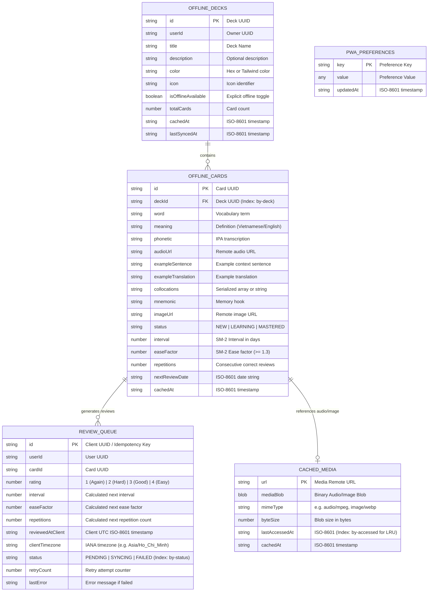
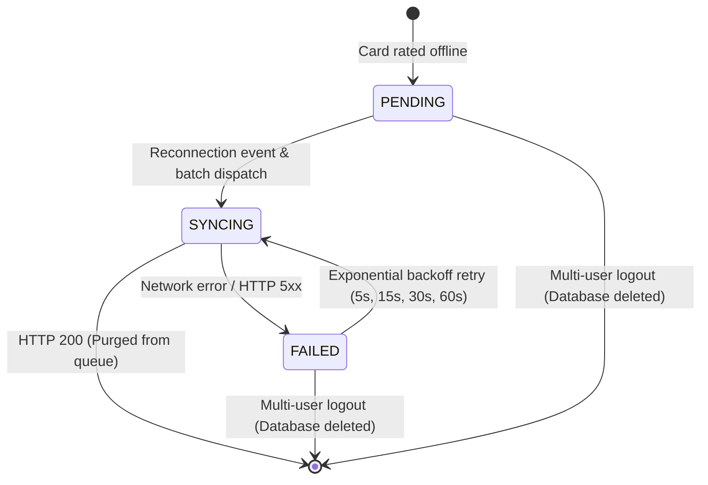
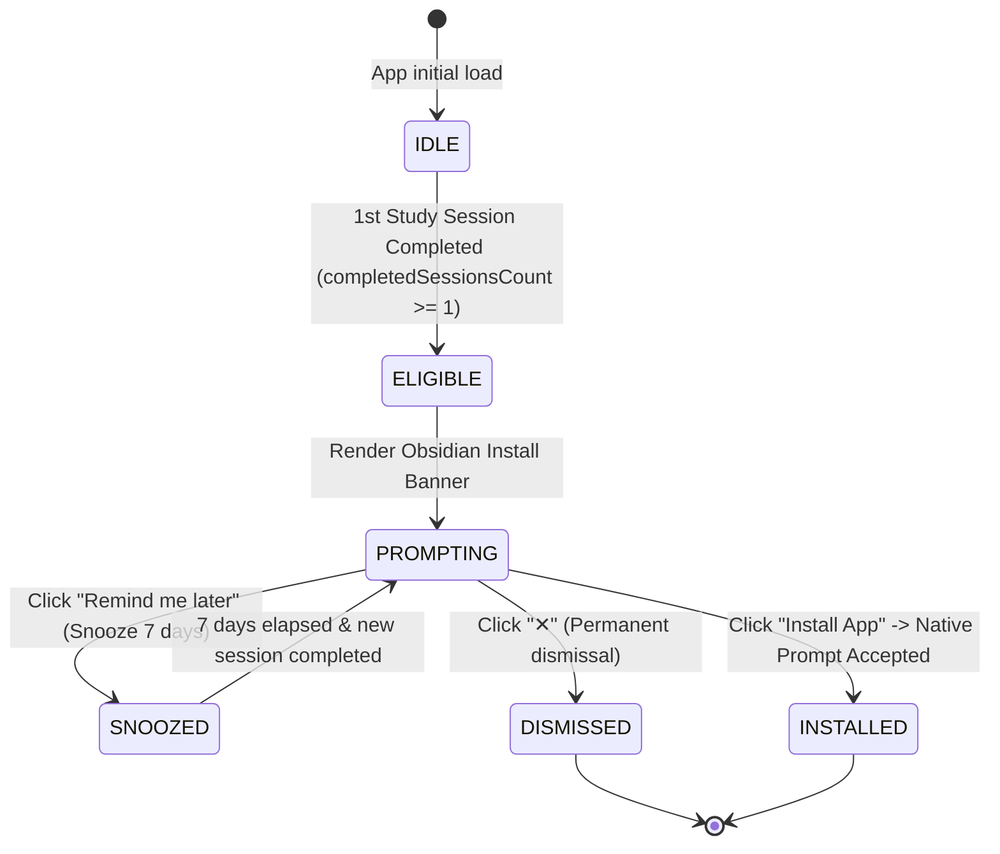

# Data Model & Storage Schema: PWA & Offline Study Mode

- **Feature Slug**: `pwa-offline-mode`
- **Target User Story**: `US-ECO-04` (Epic: `EPIC-05: Ecosystem & Platform`)
- **Status**: SPECIFIED
- **Version**: 1.0
- **Date**: 2026-08-24
- **Lead BA / Architect**: Senior Business Analyst & Domain Architect

---

## 1. Client-Side IndexedDB Schema (`WordStreakOfflineDB`)

The client offline persistence layer is managed via `idb` under database name `WordStreakOfflineDB` (**Database Version 1**). It contains 5 specialized object stores:



---

## 2. Object Stores Specification

### 2.1 `offline_decks`

- **Primary Key**: `id` (`string`, UUID)
- **Indexes**: None (typically < 100 decks per user)
- **Fields**:
  - `id`: Deck UUID
  - `userId`: Owning user ID
  - `title`: Deck title
  - `description`: Deck description (optional)
  - `color`: Visual color token
  - `icon`: Icon identifier
  - `isOfflineAvailable`: `true` if manually marked for offline download
  - `totalCards`: Total cards present in deck
  - `cachedAt`: ISO-8601 timestamp of initial download
  - `lastSyncedAt`: ISO-8601 timestamp of latest cache refresh

### 2.2 `offline_cards`

- **Primary Key**: `id` (`string`, UUID)
- **Indexes**:
  - `by-deck`: Index on `deckId` (for querying cards by deck)
  - `by-status`: Index on `status` (for filtering due cards)
  - `by-due-date`: Index on `nextReviewDate` (for sorting due reviews)
- **Fields**:
  - `id`: Card UUID
  - `deckId`: Reference to deck UUID
  - `word`: Word text
  - `meaning`: Word meaning
  - `phonetic`: IPA phonetic transcription (optional)
  - `audioUrl`: Remote audio asset URL (optional)
  - `exampleSentence`: Context sentence (optional)
  - `exampleTranslation`: Sentence translation (optional)
  - `collocations`: Collocations list (optional)
  - `mnemonic`: Mnemonic text (optional)
  - `imageUrl`: Visual illustration URL (optional)
  - `status`: `'NEW' | 'LEARNING' | 'MASTERED'`
  - `interval`: Integer SRS interval (days)
  - `easeFactor`: Float SRS ease factor (e.g. `2.50`)
  - `repetitions`: Integer consecutive repetition count
  - `nextReviewDate`: ISO-8601 date string
  - `cachedAt`: ISO-8601 timestamp

### 2.3 `review_queue`

- **Primary Key**: `id` (`string`, UUID - client-generated idempotency key)
- **Indexes**:
  - `by-status`: Index on `status` (`'PENDING' | 'SYNCING' | 'FAILED'`)
  - `by-client-time`: Index on `reviewedAtClient` (for sorting chronological replay)
- **Fields**:
  - `id`: UUID (idempotency key)
  - `userId`: User UUID
  - `cardId`: Card UUID
  - `rating`: Rating grade (`1 | 2 | 3 | 4`)
  - `interval`: Locally calculated next interval
  - `easeFactor`: Locally calculated ease factor
  - `repetitions`: Locally calculated repetition count
  - `reviewedAtClient`: ISO-8601 UTC timestamp of client action
  - `clientTimezone`: IANA timezone string
  - `status`: `'PENDING' | 'SYNCING' | 'FAILED'`
  - `retryCount`: Integer retry counter
  - `lastError`: Error description if failed (optional)

### 2.4 `cached_media`

- **Primary Key**: `url` (`string`, remote media URL)
- **Indexes**:
  - `by-accessed`: Index on `lastAccessedAt` (used for LRU eviction sweep)
- **Fields**:
  - `url`: Remote URL string
  - `mediaBlob`: `Blob` object
  - `mimeType`: String (e.g. `'audio/mpeg'`)
  - `byteSize`: Number of bytes
  - `lastAccessedAt`: ISO-8601 timestamp (updated on every playback)
  - `cachedAt`: ISO-8601 timestamp

### 2.5 `pwa_preferences`

- **Primary Key**: `key` (`string`)
- **Key Records**:
  - `install_prompt_snoozed_until`: ISO-8601 timestamp (7-day snooze)
  - `install_prompt_dismissed`: Boolean
  - `completed_sessions_count`: Number
  - `storage_quota_bytes`: Number
  - `tts_voice_preference`: String (e.g. `'en-US'`)

---

## 3. Backend Sync DTOs & Contracts

### 3.1 `SyncReviewItemDto`

```typescript
export class SyncReviewItemDto {
  @IsUUID("4", { message: "idempotencyKey must be a valid UUID v4" })
  idempotencyKey: string;

  @IsUUID("4", { message: "cardId must be a valid UUID v4" })
  cardId: string;

  @IsInt()
  @Min(1)
  @Max(4)
  rating: 1 | 2 | 3 | 4;

  @IsInt()
  @Min(0)
  interval: number;

  @IsNumber({ maxDecimalPlaces: 2 })
  @Min(1.3)
  easeFactor: number;

  @IsInt()
  @Min(0)
  repetitions: number;

  @IsISO8601(
    {},
    { message: "reviewedAtClient must be a valid ISO-8601 string" },
  )
  reviewedAtClient: string;
}
```

### 3.2 `SyncReviewBatchDto`

```typescript
export class SyncReviewBatchDto {
  @IsString()
  @IsOptional()
  clientTimezone?: string;

  @IsArray()
  @ValidateNested({ each: true })
  @Type(() => SyncReviewItemDto)
  @ArrayMinSize(1)
  @ArrayMaxSize(100)
  reviews: SyncReviewItemDto[];
}
```

### 3.3 `SyncReviewResponseDto`

```typescript
export interface SyncConflictResolution {
  cardId: string;
  action: "DELETED_CARD_DROPPED" | "CONTENT_PRESERVED" | "TIMESTAMP_RESOLVED";
  reason?: string;
}

export interface SyncReviewResponseDto {
  processedCount: number;
  syncedCardIds: string[];
  totalXpAwarded: number;
  streakUpdated: boolean;
  currentStreak: number;
  bestStreak: number;
  conflicts: SyncConflictResolution[];
  serverTimestamp: string;
}
```

---

## 4. State Machine Lifecycles

### 4.1 Local Review Queue State Lifecycle



### 4.2 PWA Install Prompt Lifecycle



---

## 5. Storage Quota & LRU Eviction Model

```
+-------------------------------------------------------------+
|               IndexedDB Total Cap: 50 MB                    |
|                                                             |
|  [ Text Metadata: Decks & Cards ] -> 100% Protected (No Evict)
|  [ Review Queue & Preferences ]   -> 100% Protected (No Evict)
|                                                             |
|  [ Audio & Media Blobs (cached_media) ]                     |
|  +-------------------------------------------------------+  |
|  | 0 MB ........... 45 MB (90%) ................. 50 MB  |  |
|  +-------------------------------------------------------+  |
|                         ^                                   |
|             LRU Eviction Trigger Sweep                      |
|             Sort by lastAccessedAt ASC -> delete oldest     |
+-------------------------------------------------------------+
```

1. **Safety Threshold**: When storage reaches **45 MB** (90% of the 50 MB budget), an automatic background LRU sweep runs.
2. **Eviction Target**: Oldest audio files in `cached_media` (sorted by `lastAccessedAt ASC`) are unlinked until usage falls below **35 MB** (70% target).
3. **Immutability of Text Data**: Flashcard text, phonetic transcription, and review queue records are **never** evicted.
