# Implementation Plan: Progressive Web App (PWA) & Offline Study Mode

- **Feature Slug**: `pwa-offline-mode`
- **Target User Story**: `US-ECO-04` (Epic: `EPIC-05: Ecosystem & Platform`)
- **Status**: PLANNED
- **Version**: 1.0
- **Date**: 2026-08-24
- **Lead BA / Architect**: Senior Business Analyst & Domain Architect

---

## 1. Technical Architecture Overview

The PWA & Offline Study subsystem integrates client-side Service Worker caching and an IndexedDB persistence wrapper (`idb`) with the NestJS backend batch synchronization endpoint.

```mermaid
flowchart TB
    subgraph Client ["Client Browser / Installed PWA (React 19)"]
        subgraph PWA_Infra ["PWA & Service Worker Layer"]
            SW["Service Worker (Workbox precache-manifest)"]
            MAN["manifest.webmanifest (Standalone, #000000)"]
            INSTALL_HOOK["usePwaInstall() (beforeinstallprompt)"]
        end

        subgraph Offline_Storage ["IndexedDB Storage Layer (idb)"]
            DB[("WordStreakOfflineDB (v1)")]
            DECKS["offline_decks"]
            CARDS["offline_cards (index: deckId)"]
            QUEUE["review_queue (index: status)"]
            MEDIA["cached_media (index: lastAccessedAt)"]
            PREFS["pwa_preferences"]
            DB --> DECKS & CARDS & QUEUE & MEDIA & PREFS
        end

        subgraph Offline_Engines ["Client Engines & Hooks"]
            CLIENT_SM2["ClientSm2Engine (arithmetic parity with SrsService)"]
            SYNC_ENG["ReconnectionSyncEngine (window.online, backoff 5s-60s)"]
            TTS_ENG["TtsAudioPlayer (Cached MP3 -> Web Speech API fallback)"]
            HOOK_STATUS["useNetworkStatus() + useSyncStatus()"]
        end

        subgraph UI_Components ["UI Components (Obsidian Pill UX)"]
            TOPBAR_PILL["OfflineSyncPill (Floating Obsidian Pill)"]
            BANNER["PwaInstallBanner (Obsidian bottom banner, 7d snooze)"]
            DECK_TOGGLE["DeckOfflineToggle (Make available offline)"]
            REVIEW_SCREEN["ReviewSessionContainer (Offline-aware)"]
        end

        SW -.->|Precaches shell & assets| UI_Components
        REVIEW_SCREEN -->|1. Fetch due cards| CARDS
        REVIEW_SCREEN -->|2. Rate card| CLIENT_SM2
        CLIENT_SM2 -->|3. Update local card progress| CARDS
        CLIENT_SM2 -->|4. Enqueue pending review| QUEUE
        REVIEW_SCREEN -->|5. Play phonetic pronunciation| TTS_ENG
        TTS_ENG -->|5a. Fetch cached blob| MEDIA
        TTS_ENG -->|5b. Fallback on miss| window.speechSynthesis
        SYNC_ENG -->|6. Check pending queue| QUEUE
        HOOK_STATUS --> TOPBAR_PILL
    end

    subgraph Backend ["NestJS Backend Subsystem"]
        SYNC_API["ReviewsController: POST /api/v1/reviews/sync-batch"]
        SYNC_SRV["ReviewsSyncService (Atomic Prisma Transaction)"]
        SRS_SRV["SrsService (calculateSm2)"]
        STRK_SRV["StreakService (48h Backfill & Freeze Reconcile)"]
        XP_SRV["XpService (500 XP Capped Award)"]
        PG[("PostgreSQL Database (Prisma ORM)")]

        SYNC_API --> SYNC_SRV
        SYNC_SRV --> SRS_SRV
        SYNC_SRV --> STRK_SRV
        SYNC_SRV --> XP_SRV
        SYNC_SRV --> PG
    end

    SYNC_ENG -->|7. POST batch review payload| SYNC_API
```



---

## 2. Directory Structure & Component Breakdown

### 2.1 Shared Types (`packages/shared-types/src/`)

- `pwa-offline.ts`: Defines TypeScript interfaces for IndexedDB entities (`OfflineDeckEntity`, `OfflineCardEntity`, `ReviewQueueEntity`, `CachedMediaEntity`, `PwaPreferencesEntity`), DTO contracts (`SyncReviewBatchDto`, `SyncReviewItemDto`, `SyncReviewResponseDto`), and synchronization state enums.
- `index.ts`: Re-exports all PWA types.

### 2.2 Backend Module (`apps/api/src/modules/reviews/`)

- `dto/sync-review-batch.dto.ts`: `SyncReviewBatchDto` with `class-validator` rules (`@IsArray()`, `@ValidateNested()`, `@ArrayMaxSize(100)`, `@IsString()`, `@IsOptional()`).
- `dto/sync-review-response.dto.ts`: Output DTO with processed counts, XP awarded, streak status, conflicts.
- `reviews.controller.ts`: Exposes `POST /api/v1/reviews/sync-batch` (and `/sync-offline` alias) protected by `JwtAuthGuard`.
- `reviews-sync.service.ts`: Handles atomic batch persistence, monotonic timestamp checks, 48h streak forgiveness window, anti-abuse XP capping, and conflict resolution.
- `reviews.module.ts`: Providers registration and exports.

### 2.3 Frontend Subsystem (`apps/web/src/`)

- `pwa/`:
  - `registerServiceWorker.ts`: Registers Workbox SW, manages `onNeedRefresh`, `onOfflineReady`, and periodic update checks.
  - `pwaInstallContext.tsx`: Tracks `beforeinstallprompt` event, completed study session counts, 7-day snooze timestamp, and install dismissal.
- `services/offline/`:
  - `offlineDatabase.ts`: Wrapper around `idb` initializing `WordStreakOfflineDB` v1 with object stores, indexes, and LRU eviction.
  - `clientSm2Engine.ts`: Client-side SM-2 arithmetic logic matching backend `SrsService`.
  - `reconnectionSyncEngine.ts`: Reconnection listener, exponential backoff dispatcher (5s, 15s, 30s, 60s), and batch dispatcher.
  - `precacheManager.ts`: Automatic due-cards pre-cacher and manual deck pre-downloader with 50MB storage quota enforcement.
  - `ttsAudioPlayer.ts`: Media cache reader and native `window.speechSynthesis` English TTS fallback player.
- `hooks/`:
  - `useOfflineDatabase.ts`: React hook to interact with `WordStreakOfflineDB`.
  - `useNetworkStatus.ts`: Online/offline status listener with navigator.onLine and ping fallback.
  - `useSyncQueue.ts`: Reactive queue watcher tracking pending review count and sync state.
  - `usePwaInstall.ts`: Hook exposing install trigger, snooze, and eligibility.
  - `useTtsFallback.ts`: Hook for pronouncing card words with audio caching and TTS badge state.
- `components/pwa/`:
  - `OfflineSyncPill.tsx`: Floating Obsidian pill in top navigation header (`Online` / `Offline • N queued` / `Syncing (N)...` / `All synced` / `Sync paused`).
  - `PwaInstallBanner.tsx`: Bottom Obsidian pill banner appearing after 1st completed session with full pill styling (`rounded-full`).
  - `DeckOfflineToggle.tsx`: Switch component on Deck Details page with badge `Offline Ready (N cards)`.
  - `LogoutWarningModal.tsx`: Warning dialog when un-synced reviews exist before logging out.

---

## 3. Technology Stack & Tooling Decisions

| Layer                | Decision                              | Rationale                                                                                                | Alternatives Evaluated                                                          |
| :------------------- | :------------------------------------ | :------------------------------------------------------------------------------------------------------- | :------------------------------------------------------------------------------ |
| **PWA Tooling**      | `vite-plugin-pwa` + `workbox-build`   | Zero-config Workbox integration with Vite 8, automatic precache manifest injection, manifest generation. | Hand-written Service Worker (high maintenance, error-prone cache invalidation). |
| **Client Storage**   | `idb` (IndexedDB lightweight wrapper) | Native Promise-based API, ~1.2KB bundle size, typed object stores, zero runtime bloat.                   | `Dexie.js` (50KB+ overhead), `localForage` (no multi-store transactions).       |
| **TTS Engine**       | Web Speech API (`SpeechSynthesis`)    | 100% offline support built into all modern browsers; zero network required; zero payload size.           | Pre-recorded MP3 bundling (explodes bundle size by > 200MB).                    |
| **Backend Batching** | Prisma `$transaction` in NestJS       | Guarantees atomic writes for all reviews in a batch; prevents partial progress updates.                  | Redis job queue (unnecessary complexity for sub-100 review batches).            |

---

## 4. Implementation Slices

### Slice 1: Shared Types & DTO Contracts (`packages/shared-types`)

- Create `packages/shared-types/src/pwa-offline.ts`:
  - `OfflineDeckEntity`, `OfflineCardEntity`, `ReviewQueueEntity`, `CachedMediaEntity`, `PwaPreferencesEntity`.
  - `SyncReviewItemDto`, `SyncReviewBatchDto`, `SyncReviewResponseDto`, `SyncConflictResolution`.
  - `PwaInstallPromptEvent`, `SyncStatusState`.
- Export from `packages/shared-types/src/index.ts`.
- Build package: `pnpm --filter @wordstreak/shared-types build`.

### Slice 2: Backend Batch Sync Endpoint & Streak Reconciliation (`apps/api`)

- Create `apps/api/src/modules/reviews/dto/sync-review-batch.dto.ts` and `sync-review-response.dto.ts`.
- Create `apps/api/src/modules/reviews/reviews-sync.service.ts`:
  - Enforce monotonic review timestamps ($T_i < T_{i+1}$, $T_{\text{client}} \le T_{\text{server}} + 60\text{s}$).
  - Enforce 48h tolerance window ($T_{\text{server}} - T_{\text{reviewedAtClient}} \le 48\text{h}$) for streak backfills.
  - Reconcile missed calendar dates into `UserStreak` using `StreakService`.
  - Atomically upsert `UserCardProgress` and create immutable `ReviewLog` entries.
  - Cap XP awards to 500 XP per batch payload via `XpService`.
  - Gracefully handle deleted cards (`DELETED_CARD_DROPPED` conflict record).
- Add endpoint `POST /api/v1/reviews/sync-batch` (and `/sync-offline` alias) in `ReviewsController`.
- Wire `ReviewsSyncService` into `ReviewsModule`.
- Unit tests in `reviews-sync.service.spec.ts` & `reviews.controller.spec.ts` covering:
  - Happy path batch sync (<48h, multiple cards).
  - Stale sync (>48h, XP awarded but streak skipped).
  - Deleted card handling.
  - Anti-abuse: future timestamp rejection, XP cap capping at 500 XP.
  - Monotonicity checks.

### Slice 3: Frontend PWA Plugin, Manifest & Service Worker (`apps/web`)

- Install `vite-plugin-pwa` and `idb` in `apps/web`.
- Configure `vite.config.ts`:
  - `VitePWA` with `registerType: 'autoUpdate'`.
  - Web App Manifest: `name: "WordStreak"`, `short_name: "WordStreak"`, `theme_color: "#000000"`, `background_color: "#ffffff"`, `display: "standalone"`, `orientation: "portrait-primary"`.
  - Maskable SVG and PNG icon configurations (192x192, 512x512).
  - Workbox glob patterns: precache `.html`, `.js`, `.css`, `.woff2`, `.svg`, `.png`.
  - Runtime caching for Google Fonts with `CacheFirst` strategy.
- Add `registerServiceWorker.ts` in `src/pwa/`.
- Add PWA meta tags in `index.html` (apple-mobile-web-app-capable, theme-color).

### Slice 4: Frontend IndexedDB Layer & Offline SM-2 Engine (`apps/web`)

- Create `apps/web/src/services/offline/offlineDatabase.ts`:
  - Initialize `WordStreakOfflineDB` (v1) with 5 stores (`offline_decks`, `offline_cards`, `review_queue`, `cached_media`, `pwa_preferences`).
  - Indexes: `offline_cards.by-deck` (`deckId`), `review_queue.by-status` (`status`), `cached_media.by-accessed` (`lastAccessedAt`).
  - Storage calculation and LRU eviction when usage $\ge 45\text{MB}$ (90% of 50MB).
  - Multi-user purge helper `purgeOfflineDatabase()`.
- Create `apps/web/src/services/offline/clientSm2Engine.ts`:
  - Exact port of SM-2 algorithm matching `SrsService.calculateSm2` ($EF'$, repetitions, interval, ratings 1..4 -> grades 2..5).
  - Unit tests verifying exact 1:1 mathematical parity with backend.
- Create `apps/web/src/services/offline/precacheManager.ts`:
  - Pre-caching due cards on online dashboard visit (`autoPrecacheDueCards`).
  - Manual deck pre-download with audio blobs (`precacheFullDeck`).

### Slice 5: Reconnection Auto-Sync Engine & TTS Fallback (`apps/web`)

- Create `apps/web/src/services/offline/reconnectionSyncEngine.ts`:
  - Event listeners for `window.online` and `document.visibilitychange`.
  - Exponential backoff retry handler (5s, 15s, 30s, 60s) for HTTP 5xx / connection aborts.
  - Dispatch queued items to `POST /api/v1/reviews/sync-batch`.
  - Mark queued items as `SYNCING` during dispatch, purge on success.
- Create `apps/web/src/services/offline/ttsAudioPlayer.ts`:
  - Check `cached_media` for MP3 blob -> play if available.
  - If uncached or offline -> invoke `window.speechSynthesis.speak()` with `SpeechSynthesisUtterance` (`lang: 'en-US'`).
- React hooks: `useNetworkStatus`, `useSyncQueue`, `useTtsFallback`.

### Slice 6: Obsidian Status Pill, PWA Install Banner & Deck Download Toggle (`apps/web`)

- Create `apps/web/src/components/pwa/OfflineSyncPill.tsx`:
  - Floating Obsidian pill in top navigation header.
  - States: `Online` (subtle/hidden), `Offline • N queued`, `Syncing (N)...`, `All synced` (3s fade), `Sync paused`.
  - Adheres to `DESIGN.md` Obsidian pill tokens (`rounded-full`, `#000000` background, pure white text, hairline border).
- Create `apps/web/src/components/pwa/PwaInstallBanner.tsx`:
  - Contextual bottom banner appearing only after 1st completed session.
  - Buttons: `[Install App]`, `[Remind me later]`, `[✕]`.
  - 7-day snooze persisted in `pwa_preferences` store.
- Create `apps/web/src/components/pwa/DeckOfflineToggle.tsx`:
  - Toggle switch on Deck Detail page with download progress indicator and storage size badge.
- Create `apps/web/src/components/pwa/LogoutWarningModal.tsx`:
  - Displays un-synced reviews warning with `[Discard & Log Out]` and `[Cancel]` actions.
- Integrate with Study Review screen: seamless offline card retrieval and rating queueing.

### Slice 7: Verification, Test Coverage & Quality Gates

- Backend unit tests (Jest) for `ReviewsSyncService` and `ReviewsController`.
- Frontend unit tests (Vitest) for `offlineDatabase`, `clientSm2Engine`, `reconnectionSyncEngine`, and `OfflineSyncPill`.
- E2E tests (Playwright) simulating:
  - Airplane mode toggle, offline card rating, queue count update in Topbar pill.
  - Network restore, automatic batch sync, streak backfill, pill fade-out.
  - PWA install prompt trigger and snooze persistence.
  - Logout with un-synced reviews modal warning and IndexedDB deletion.

---

## 5. Dual-Run Migration & Fallback Strategies

```mermaid
flowchart TD
    START["Learner submits card review"]
    CHECK_NET{"Network online?"}
    START --> CHECK_NET

    CHECK_NET -->|Yes| TRY_ONLINE["Attempt POST /api/v1/reviews/:cardId"]
    TRY_ONLINE -->|Success 200| FINISH_ONLINE["Update local cache & UI"]
    TRY_ONLINE -->|Network Drop / Error| ENQUEUE_OFFLINE["Fallback: Calculate SM-2 locally & write to review_queue"]

    CHECK_NET -->|No (Offline)| ENQUEUE_OFFLINE
    ENQUEUE_OFFLINE --> UPDATE_LOCAL["Update offline_cards locally & increment queued pill count"]

    UPDATE_LOCAL --> RECONNECT_EVENT{"Reconnection detected?"}
    RECONNECT_EVENT -->|Yes| SYNC_BATCH["POST /api/v1/reviews/sync-batch"]
    SYNC_BATCH -->|Success 200| CLEAR_QUEUE["Clear synced items from review_queue & show 'All synced'"]
    SYNC_BATCH -->|Fail / Timeout| RETRY_BACKOFF["Retry backoff (5s, 15s, 30s, 60s)"]
    RETRY_BACKOFF --> RECONNECT_EVENT
```

### Dual-Run Safety

1. **Zero Breaking Changes**: Existing online endpoints (`POST /api/v1/reviews/:cardId` and `GET /api/v1/reviews/due`) remain 100% active and untouched.
2. **Idempotency Guarantees**: Every queued offline review contains a client-generated UUID `idempotencyKey`. If a batch is retransmitted due to network timeout, the backend deduplicates by `(userId, idempotencyKey)` preventing double XP or duplicate review logs.
3. **Rollback Procedure**: If PWA service worker issues occur in production:
   - Deploy `vite-plugin-pwa` config with `self.registration.unregister()` to immediately deactivate service workers for all clients.
   - The app immediately reverts to 100% standard SPA online mode without database migration rollbacks.
