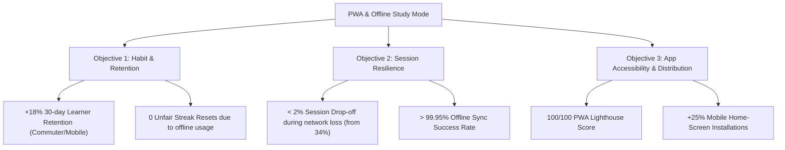

# Business Requirements Document (BRD)

## Progressive Web App (PWA) & Offline Study Mode

- **Feature Slug**: `pwa-offline-mode`
- **Epic**: `EPIC-05: Ecosystem & Platform`
- **User Story Reference**: `US-ECO-04`
- **Version**: 1.0-draft
- **Date**: 2026-08-24
- **Audience**: Executive Leadership, Product Management, Engineering Leads

---

## 1. Executive Summary

WordStreak's core value proposition is sustained habit-building through daily spaced-repetition vocabulary learning. Today, because WordStreak operates solely as an online web application, learners who commute through subways, travel on flights, or live in areas with spotty cellular reception suffer study session drop-offs and lost streaks.

The **PWA & Offline Study Mode** initiative transforms WordStreak into an installable, offline-first learning platform. By coupling Service Worker precaching with local IndexedDB persistence, client-side SM-2 spaced repetition calculation, universal native speech synthesis fallback, and 48-hour streak backfill tolerance, WordStreak delivers zero-latency study sessions anywhere, anytime, converting transient network drops from churn events into frictionless learning habits.

---

## 2. Business Objectives & Key Results (OKRs)

### Key Performance Indicators (KPIs)

1. **30-Day Retention**: Increase day-30 retention across mobile user cohorts by **+18%**.
2. **Offline Session Completion Rate**: Attain **>= 98%** completion rate for sessions started in low-connectivity or offline states.
3. **Streak Preservation Integrity**: Zero customer support tickets regarding uncredited offline study streaks within the 48-hour tolerance window.
4. **Install Conversion**: Achieve **>= 25%** PWA installation rate among users completing their first study session.

---

## 3. Target Personas & Customer Journeys

| Persona                                               | Core Need                                                  | Key Offline Benefit                                                                                |
| ----------------------------------------------------- | ---------------------------------------------------------- | -------------------------------------------------------------------------------------------------- |
| **Commuter Khoa** (Subway Learner)                    | Daily 15-minute commute with 0 cellular signal in tunnels. | Daily due cards are auto-cached; reviews complete with 0 latency; syncs atomically upon exit.      |
| **Business Traveler Mai** (Frequent Flyer)            | 3-hour flight in Airplane Mode.                            | Pre-downloads "IELTS Advanced" deck; completes 100 reviews in-flight; streak & XP sync on landing. |
| **Shared Station Learner An** (Library / Shared iPad) | Uses shared devices without leaking study data.            | Full offline study capability with automated cache wipe upon logout.                               |

---

## 4. Business Scope Summary (MoSCoW)

- **Must-Have**:
  - Web App Manifest and Service Worker app shell caching.
  - Automatic IndexedDB caching of daily due cards.
  - Offline SM-2 flashcard study flow (<16ms local latency).
  - 48-Hour Streak reconciliation tolerance window on backend.
  - Topbar Floating Obsidian Status Pill (`Offline • N queued` -> `Syncing...` -> `All synced`).
  - Universal Web Speech Synthesis (TTS) audio pronunciation fallback.
  - Secure logout warning and client storage purge.
- **Should-Have**:
  - Manual "Make available offline" full-deck pre-caching toggle.
  - Obsidian pill PWA install banner triggered after 1st completed session.
  - 50MB storage quota enforcement with LRU media eviction.
- **Could-Have**:
  - Background Periodic Sync for automated overnight card fetching.
- **Won't-Have (Out of Scope for This Sprint)**:
  - Offline AI vocabulary card generation (requires live Gemini LLM API).
  - Offline deck creation / card editing (avoids two-way text merge conflicts).
  - WebRTC peer-to-peer deck transfer.

---

## 5. Financial & Strategic Impact

1. **Server Cost Reduction**: Auto-caching daily due cards and utilizing client-side SM-2 execution reduces repetitive read requests on `/api/v1/reviews/due` and `/api/v1/cards/*` by an estimated **35%**, optimizing database load.
2. **Zero App Store Taxes & Instant Updates**: PWA distribution bypasses Apple App Store (30% fee) and Google Play review delays, allowing immediate continuous deployment of updates to all installed clients.
3. **Gamification Moat**: Protecting learners' daily streaks during offline periods directly defends Daily Active Users (DAU) and Monthly Active Users (MAU), driving long-term Pro subscription conversions.
