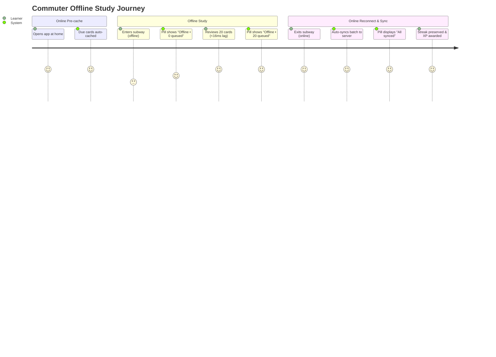

# Product Requirements Document (PRD)

## Progressive Web App (PWA) & Offline Study Mode

- **Feature Slug**: `pwa-offline-mode`
- **Epic**: `EPIC-05: Ecosystem & Platform`
- **User Story Reference**: `US-ECO-04`
- **Version**: 1.0-draft
- **Date**: 2026-08-24
- **Audience**: Product Managers, UI/UX Designers, Frontend & Backend Engineers, QA Engineers

---

## 1. Product Overview & Vision

WordStreak PWA & Offline Study Mode delivers a resilient, zero-latency spaced-repetition experience that operates seamlessly regardless of network conditions. By converting WordStreak into an installable Progressive Web App with local client persistence and smart synchronization, learners can study anywhere—from underground transit to international flights—without ever risking their daily streak or session progress.

---

## 2. Target Personas & Use Cases

---

## 3. Detailed Functional Specifications

### Feature 1: PWA Web App Manifest & Install Banner

- **Web App Manifest**:
  - `name`: "WordStreak - Spaced Repetition Vocabulary"
  - `short_name`: "WordStreak"
  - `start_url`: "/"
  - `display`: "standalone"
  - `background_color`: "#ffffff"
  - `theme_color`: "#000000"
  - `icons`: Scalable SVGs, 192x192, 512x512 maskable PNGs.
- **Install Prompt Trigger**:
  - Captured via `beforeinstallprompt` event.
  - Gated: Displayed ONLY after the user completes their **1st full study session** (`completedSessionsCount >= 1`).
  - Form Factor: Obsidian pill prompt banner at the bottom/top of the screen.
  - Actions:
    - `[Install App]`: Invokes native browser prompt; on acceptance, records `INSTALLED` state.
    - `[Remind me later]`: Hides prompt for 7 calendar days.
    - `[✕] / [Don't show again]`: Permanently suppresses prompt in `pwa_preferences`.

---

### Feature 2: Hybrid Offline Storage & Pre-Caching

- **Auto-Caching (Daily Due Cards)**:
  - Whenever an authenticated learner visits the dashboard or study hub while online, the app fetches and stores all cards with `status = NEW | LEARNING | DUE` into IndexedDB store `offline_cards`.
- **Manual Deck Pre-Caching**:
  - Deck Detail screens include a toggle: _"Make available offline"_.
  - When enabled, fetches all deck cards, phonetics, and collocations into `offline_decks` and `offline_cards`, and queues audio MP3s for background caching.
- **50MB Storage Quota & LRU Eviction**:
  - Hard storage cap: **50 MB** per origin.
  - At >= 90% (45 MB), triggers LRU eviction of oldest audio MP3 blobs in `cached_media`.
  - **Invariant**: Pending items in `review_queue` and active daily due cards are immune to eviction.

---

### Feature 3: Offline Flashcard Study & Client SM-2 Engine

- **Local Interaction Speed**: Card flip, rating selection (Again, Hard, Good, Easy), and transition to the next card must execute in **< 16 ms** with zero network dependency.
- **Client SM-2 Engine**:
  - Executes exact arithmetic parity with server SM-2 algorithm (`SrsService`).
  - Computes `interval`, `easeFactor`, `repetitions`, `status`, and `nextReviewDate` immediately.
  - Updates card status in local `offline_cards` store so sequential reviews within the session reflect updated intervals.
- **Queueing**:
  - Appends review payload to `review_queue` in IndexedDB with `reviewedAtClient` (UTC ISO string) and `clientTimezone`.

---

### Feature 4: Universal Pronunciation Audio Fallback

- **Primary Playback**: Checks `cached_media` for offline MP3 blob; if online, streams remote MP3.
- **TTS Fallback**: If offline and MP3 is not in `cached_media`:
  - Invokes `window.speechSynthesis.speak(new SpeechSynthesisUtterance(card.word))`.
  - Configures `lang = 'en-US'` or `en-GB`.
  - Displays `🔊 [TTS]` badge to visually clarify that native device speech synthesis is active.

---

### Feature 5: Reconnect Sync Engine & 48-Hour Streak Protection

- **Sync Triggers**:
  - Network state change: `window.addEventListener('online')`.
  - Window visibility / focus: `document.addEventListener('visibilitychange')`.
  - Service Worker Background Sync event: `sync` (where supported).
- **Sync Payload (`POST /api/v1/reviews/sync-offline`)**:
  - Transmits batch of pending reviews from `review_queue`.
  - Server processes batch atomically in a single PostgreSQL transaction.
  - **48-Hour Streak Reconciliation**: Server inspects `reviewedAtClient` and `clientTimezone`. If $T_{\text{server}} - T_{\text{client}} \le 48\text{h}$, missed days are backfilled and the streak is preserved.
  - **Anti-Abuse Checks**: Monotonic timestamps, $\le 5\text{s}$ interval between same-card reviews, 500 XP batch cap.
- **Conflict Resolution**:
  - Deleted card -> review discarded, XP awarded, card evicted from client.
  - Edited card -> SRS progress applied, server content preserved.
  - Concurrent multi-device reviews -> latest client timestamp wins for SRS interval; both logged in `ReviewLog`.

---

### Feature 6: Topbar Status Feedback & Secure Logout

- **Topbar Floating Obsidian Status Pill**:
  - `Online`: Hidden / minimal green dot.
  - `Offline`: `⚪ Offline • N queued`.
  - `Syncing`: Animated pulse `🔄 Syncing (N)...`.
  - `All Synced`: Green check `✅ All synced` (auto-dismisses in 3s).
  - `Error`: Amber alert `⚠️ Sync paused • Tap to retry`.
- **Secure Multi-User Logout**:
  - If `review_queue.length > 0`, prompts confirmation modal: _"You have N un-synced reviews. Logging out will discard them."_
  - On confirmed logout, unconditionally executes `indexedDB.deleteDatabase('WordStreakOfflineDB')`.

---

## 4. UI / UX Design Specifications

- **Design Tokens**:
  - Canvas: `#ffffff`
  - Text Primary: `#111827`
  - Text Secondary: `#6b7280`
  - Accent / Primary Buttons: Obsidian `#000000` (Hover: `#1f2937`)
  - Border: 1px `#e5e5e5`
  - Fonts: `Nunito` (Headers, Badges), `Inter` (Body, Controls)
- **Zero-Flicker Transitions**:
  - Topbar status pill uses stable outer width containers to prevent layout shift during status changes.

---

## 5. Scope Boundaries

### In Scope

- Web App Manifest & Service Worker precaching.
- IndexedDB storage for due cards, downloaded decks, review queue, and audio cache.
- Local SM-2 study session execution.
- Universal native Web Speech Synthesis TTS fallback.
- Batch offline sync API with 48h streak tolerance.
- Topbar status pill & PWA install banner.
- Secure logout cache purge.

### Out of Scope

- Offline AI vocabulary card generation.
- Offline card editing and deck creation.
- Peer-to-peer WebRTC deck sharing.
- Offline speech recognition pronunciation scoring.
