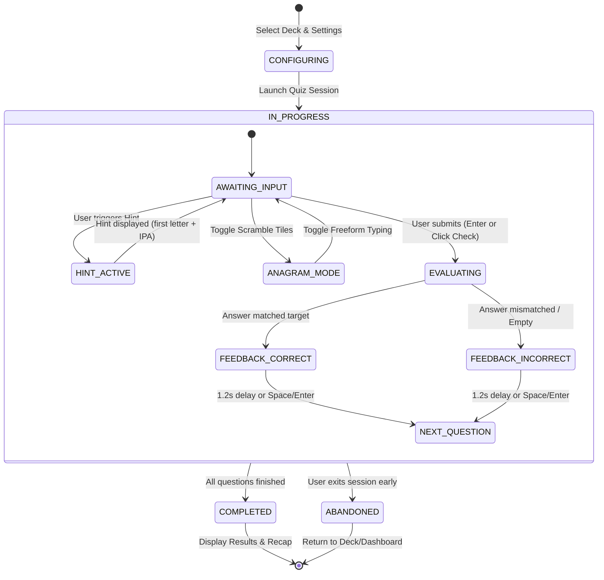

# Domain Model: Fill-in-the-blank Quiz (US-QUIZ-02)

- **Feature**: Fill-in-the-blank Quiz Mode
- **Date**: 2026-08-20
- **Status**: COMPLETE

---

## 1. Role-Based Access Control (RBAC)

| Role                               |       Start Quiz        | Submit Answers | Access Private Deck Cards | Access Public Deck Cards |
| :--------------------------------- | :---------------------: | :------------: | :-----------------------: | :----------------------: |
| **Guest / Anonymous**              | ❌ (Redirects to Login) |       ❌       |            ❌             |            ❌            |
| **Authenticated Learner (Owner)**  |           ✅            |       ✅       |            ✅             |            ✅            |
| **Authenticated Learner (Viewer)** |           ✅            |       ✅       |            ❌             |            ✅            |

---

## 2. State Machine & Question Lifecycle



---

## 3. Business Rules & Algorithms

- `BR-FILL-001` (**Eligibility & Guard**): A deck must have at least 1 valid card to start a fill-in-the-blank quiz. If the deck has cards without example sentences, the generator applies fallback sentence templates (`BR-FILL-004`).
- `BR-FILL-002` (**Morphological Sentence Masking Algorithm**):
  - Step 1: Normalize target word $W = \text{trim}(w)$.
  - Step 2: Construct regex $R = \text{new RegExp}(`\b(${W}(?:s|es|ed|d|ing|ly)?)\b`, 'gi')$.
  - Step 3: Match against `card.exampleSentence`.
  - Step 4: If matched token $T$ is found, split sentence into `prefix`, `maskedToken` ($T$), and `suffix`.
  - Step 5: Replace $T$ with blank `[ _____ ]`.
- `BR-FILL-003` (**Letter Scramble / Anagram Generation**):
  - Generate an array of characters from target word $W$ (excluding spaces/hyphens), shuffle with Fisher-Yates algorithm ensuring the scrambled result is not identical to original word when length $> 2$.
- `BR-FILL-004` (**Graceful Fallback Template**):
  - If `exampleSentence` is empty or regex matching fails:
    - `promptSentence`: `"Complete the word: \"${card.meaning}\""`
    - `maskedToken`: $W$
    - `prefix`: `"Complete the word: \"${card.meaning}\" ("`
    - `suffix`: `")"`
- `BR-FILL-005` (**Answer Normalization & Validation**):
  - Submitted text is trimmed and converted to lower case: $S = \text{trim}(s)\text{.toLowerCase()}$.
  - Target text: $T_{base} = \text{trim}(W)\text{.toLowerCase()}$, $T_{inflected} = \text{trim}(T)\text{.toLowerCase()}$.
  - Correct if $S === T_{base} \lor S === T_{inflected}$.
- `BR-FILL-006` (**XP & Gamification Formula**):
  - Base Reward: $+10\text{ XP}$ per correct answer.
  - Speed Bonus: $+15\text{ XP}$ if time spent $\le 8000\text{ms}$ and 0 hints used.
  - Combo Multiplier: $x2$ for 3-4 consecutive correct, $x3$ for $5+$ consecutive.
- `BR-FILL-007` (**SM-2 Independence**): Fill-in-the-blank is a pure practice drill; it does not mutate SM-2 spaced repetition fields (`interval`, `easeFactor`, `repetitions`, `nextReviewDate`).
- `BR-FILL-008` (**Progressive Hint Mechanism**):
  - Level 1: Reveal first letter + length guide (e.g. `s _ _ _ _`).
  - Level 2: Phonetic IPA audio button enabled.
  - Using a hint disqualifies the question from the speed bonus.
- `BR-FILL-009` (**Timer & Zen Mode**):
  - Default: 25 seconds per question.
  - Zen Mode: Disables timer.
  - If timer expires: marked incorrect, reveals correct answer, advances to next.
- `BR-FILL-010` (**Keyboard Shortcuts**):
  - `Enter`: Submit answer / instant advance during feedback.
  - `Space`: Instant advance during feedback window.
  - `Ctrl+H` / `Cmd+H`: Trigger Hint.

---

## 4. DTO Contracts

```typescript
export interface FillBlankQuestionDto {
  id: string;
  cardId: string;
  sentenceWithBlank: string; // e.g. "The scientist made an important [ _____ ] in genetics."
  sentencePrefix: string; // e.g. "The scientist made an important "
  sentenceSuffix: string; // e.g. " in genetics."
  targetWord: string; // e.g. "discovery"
  targetInflection?: string; // e.g. "discovery" or "discoveries"
  meaning: string; // e.g. "sự khám phá, phát hiện"
  phonetic?: string | null; // e.g. "/dɪˈskʌv.ər.i/"
  audioUrl?: string | null;
  scrambledLetters: string[]; // e.g. ["e", "v", "d", "s", "r", "c", "i", "o", "y"]
  wordLength: number;
}

export interface GetFillBlankQuestionsQueryDto {
  deckId: string;
  limit?: number;
}
```

---

## 5. Non-Functional Requirements (NFR)

- **Performance**: Question generation response latency $< 100\text{ms}$ for up to 50 cards.
- **Accessibility (WCAG AA)**: Form input has clear aria labels, focus ring on active text input and anagram buttons, contrast ratio $\ge 4.5:1$.
- **Responsiveness**: Fully touch-operable on mobile with anagram tiles sized $\ge 44 \times 44\text{px}$.
