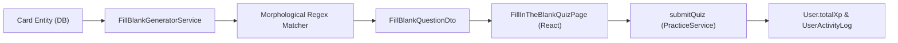

# Data Model & Schema Impact: Fill-in-the-blank Quiz (US-QUIZ-02)

**Feature**: Fill-in-the-blank Quiz Mode  
**Status**: APPROVED

---

## 1. Database Schema Impact

- **Prisma Schema Changes**: `None` (0 schema migrations required).
- The fill-in-the-blank practice mode operates entirely in-memory for question generation by transforming existing `Card` rows (`word`, `meaning`, `phonetic`, `audioUrl`, `exampleSentence`, `mnemonic`), and records session outcomes using the existing `UserActivityLog` and user XP fields.

---

## 2. Entity Transformation Pipeline

---

## 3. Data Transfer Objects (DTO)

1. `GetFillBlankQuestionsDto`:
   - `deckId: string` (UUID, required)
   - `limit?: number` (Optional, default 10, max 50)
2. `FillBlankQuestionDto`:
   - `id: string` (Generated question UUID)
   - `cardId: string`
   - `sentenceWithBlank: string`
   - `sentencePrefix: string`
   - `sentenceSuffix: string`
   - `targetWord: string`
   - `targetInflection?: string`
   - `meaning: string`
   - `phonetic?: string | null`
   - `audioUrl?: string | null`
   - `scrambledLetters: string[]`
   - `wordLength: number`
