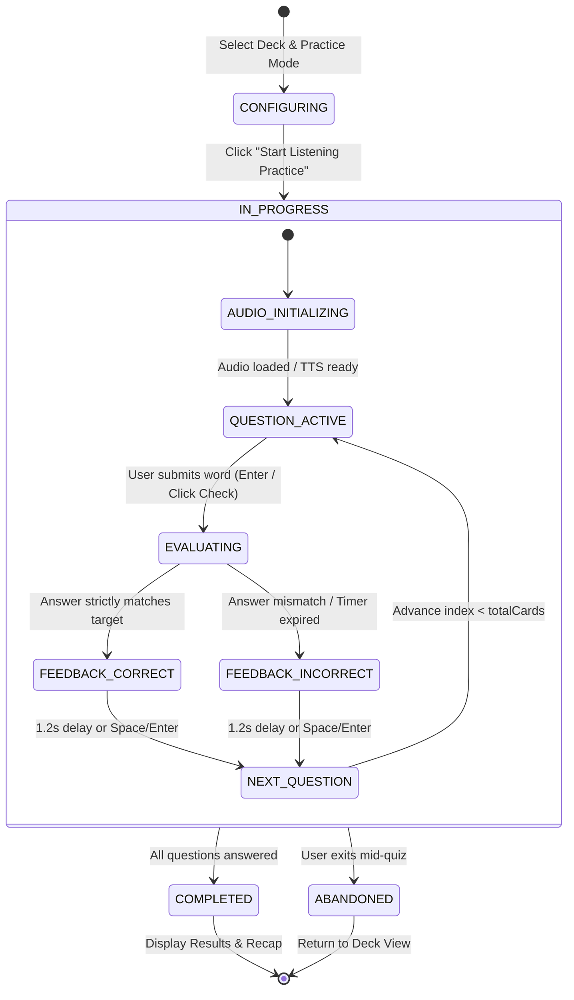
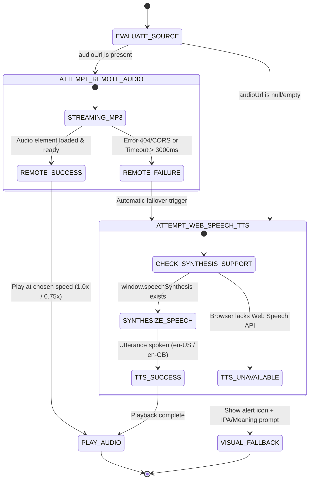
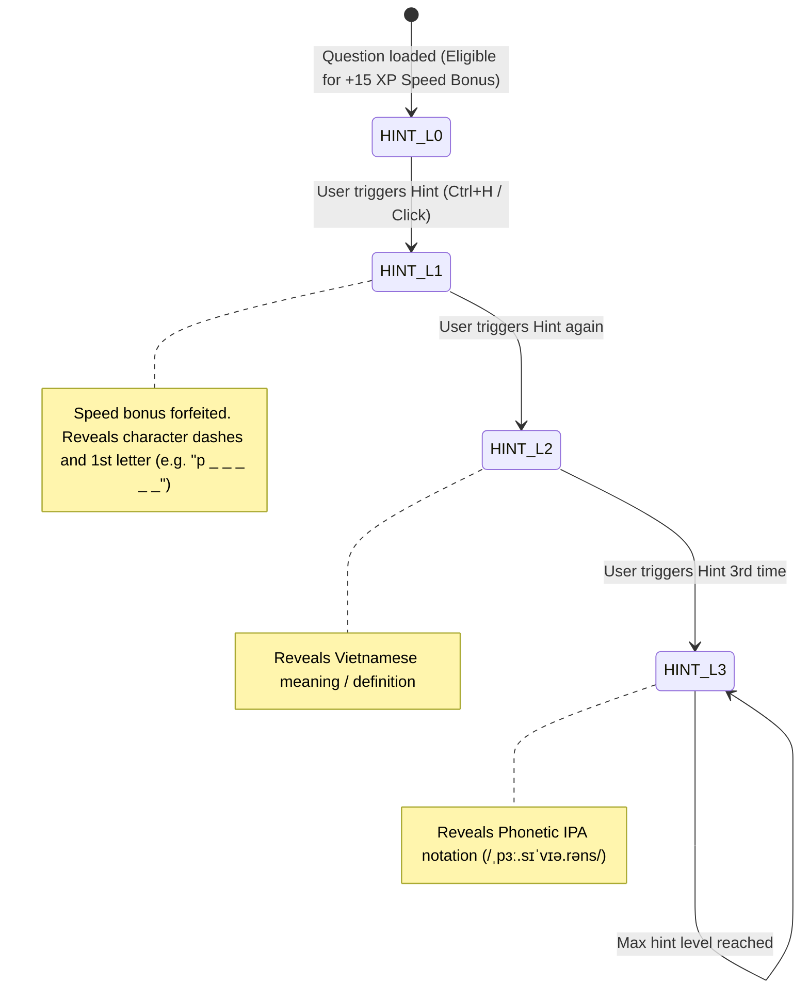
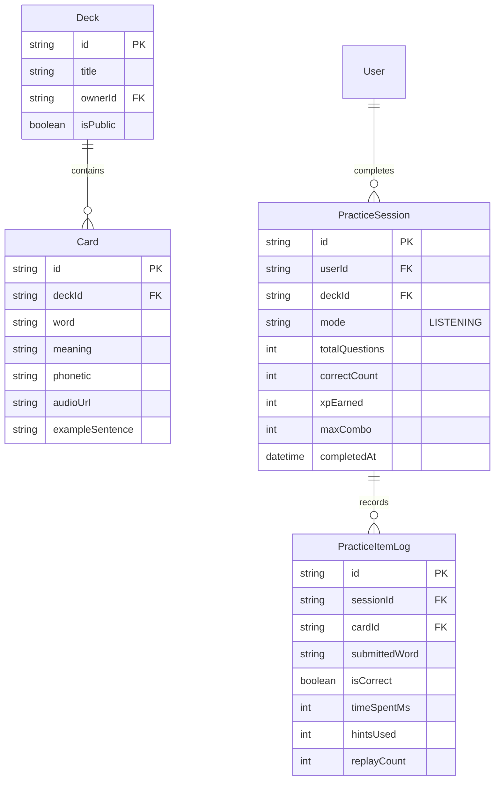

# Domain Model: Listening & Typing Practice Quiz (US-QUIZ-03)

- **Feature**: Listening & Typing Practice Mode (`quiz-listening-practice`)
- **Epic**: EPIC-04 Multi-format Practice & Quiz Modes (Sprint 5)
- **Date**: 2026-08-21
- **Status**: COMPLETE

---

## 1. Role-Based Access Control (RBAC)

| Role                               |  Start Listening Quiz   | Submit Quiz & Earn XP | Access Private Deck Cards | Access Public Deck Cards |
| :--------------------------------- | :---------------------: | :-------------------: | :-----------------------: | :----------------------: |
| **Guest / Anonymous**              | ❌ (Redirect to /login) |          ❌           |            ❌             |   ❌ (Login required)    |
| **Authenticated Learner (Owner)**  |           ✅            |          ✅           |            ✅             |            ✅            |
| **Authenticated Learner (Viewer)** |           ✅            |          ✅           |            ❌             |            ✅            |
| **System Admin**                   |           ✅            |          ✅           |     ✅ (System audit)     |            ✅            |

---

## 2. State Machines & Lifecycles

### 2.1 Quiz Session Lifecycle



### 2.2 Audio Source Resolution & Fallback Cascade



### 2.3 Progressive Hint Lifecycle



---

## 3. Business Rules & Algorithms

- `BR-QUIZ-LISTEN-001` (**Deck Eligibility & Availability**):
  - A deck must contain $\ge 1$ card to start a listening practice session.
  - Cards are randomized (Fisher-Yates shuffle) and bounded by the user-selected limit (10, 20, or All).
- `BR-QUIZ-LISTEN-002` (**Audio Source Cascade & Web Speech API Fallback**):
  - Primary source: Card's `audioUrl` via HTML5 `<audio>` element with `preload="auto"`.
  - Failover trigger: If `audioUrl` is null, empty, encounters network error (404/CORS), or exceeds a 3000ms load timeout, the client immediately switches to `window.speechSynthesis.speak(new SpeechSynthesisUtterance(card.word))` with `lang = 'en-US'` (or `'en-GB'`).
  - Terminal fallback: If Web Speech API is unsupported, the question enters visual fallback mode displaying an accessible warning badge and opening the meaning prompt.
- `BR-QUIZ-LISTEN-003` (**Playback Speed & Replay Controls**):
  - Normal Speed: `1.0x` (default).
  - Slow Speed: `0.75x` (lowers audio element `playbackRate` to `0.75` or utterance `rate` to `0.75`).
  - Auto-play: Audio plays on question entry (with browser autoplay gesture protection).
  - Hotkeys: `Space` or `R` to replay; `Shift+Space` or `S` to toggle speed (1.0x $\leftrightarrow$ 0.75x).
  - Unlimited replays are permitted; however, $\le 2$ replays are required to qualify for the speed bonus (`BR-QUIZ-LISTEN-007`).
- `BR-QUIZ-LISTEN-004` (**Text Normalization & Fuzzy / Strict Spelling Validation**):
  - Normalization algorithm:
    $$\text{normalize}(str) = str.\text{trim}().\text{toLowerCase}().\text{replace}(/[\s\-_]+/g, \text{''}).\text{replace}(/[.,\/#!$%\^&\*;:{}=\-_`~()?'"]/g, \text{''})$$
  - Evaluation: Submitted answer $S$ is correct if and only if $\text{normalize}(S) === \text{normalize}(T_{target})$.
  - Special punctuation handling: Hyphenated words (e.g. `"state-of-the-art"`) and contraction apostrophes (e.g. `"don't"`) accept both hyphenated/unhyphenated and apostrophe/no-apostrophe inputs.
- `BR-QUIZ-LISTEN-005` (**Progressive 3-Tier Hint Engine**):
  - **Level 1**: Word length dashes with first character revealed ($W_0 + \text{"\_" } \times (\text{length} - 1)$).
  - **Level 2**: Vietnamese meaning displayed.
  - **Level 3**: Phonetic IPA displayed.
  - Activating any hint level permanently sets `hintsUsed > 0` for the current question.
- `BR-QUIZ-LISTEN-006` (**Immediate Feedback & Character Diff Visualizer**):
  - Correct answer: Input border turns emerald green (`#27c93f`), play subtle success sound/animation, increment combo multiplier.
  - Incorrect answer: Input shakes horizontally (red `#ff5f56`), reveals the correct word with character-level diff highlighting:
    - Missing characters in blue/gray.
    - Extra/wrong characters in strikethrough red.
  - Question auto-advances after 1.2s delay or instantly upon pressing `Enter` or `Space`.
- `BR-QUIZ-LISTEN-007` (**XP, Speed Bonus & Anti-Abuse Gamification Formula**):
  - **Base XP**: $+10\text{ XP}$ per correct answer.
  - **Speed / Precision Bonus**: $+15\text{ XP}$ if time spent $\le 8000\text{ms}$, `hintsUsed === 0`, and `replayCount <= 2`.
  - **Combo Multipliers**:
    - 1–2 consecutive: $1.0\times$
    - 3–4 consecutive: $2.0\times$ (Combo streak)
    - $\ge 5$ consecutive: $3.0\times$ (Max flame combo)
  - **Anti-Abuse Pass**:
    - Time-spent guard: Answers submitted under $400\text{ms}$ are rejected as bot/script spam.
    - Daily practice XP cap: User can earn a maximum of $500\text{ XP}$ per day from practice drills to prevent automated farming scripts.
    - Server-side validation: XP is computed and verified by the backend on `POST /api/v1/practice/submit-quiz` based on card timestamps and answer logs.
- `BR-QUIZ-LISTEN-008` (**SM-2 Spaced Repetition Isolation**):
  - Listening Practice is a pure skill-building drill; it does **not** update or overwrite `UserCardProgress` spaced repetition memory parameters (`interval`, `easeFactor`, `repetitions`, `nextReviewDate`).
- `BR-QUIZ-LISTEN-009` (**Timer & Zen Mode**):
  - Default countdown: 20 seconds per question.
  - Zen Mode: Disables the countdown timer for relaxed ear training.
  - Expiration: When the countdown reaches 0, the question is evaluated as incorrect, reveals the correct word, and transitions to feedback.
- `BR-QUIZ-LISTEN-010` (**Keyboard Shortcuts & WCAG Accessibility**):
  - Shortcuts: `Enter` (Submit / Next), `Space` / `R` (Replay audio), `Shift+Space` / `S` (Toggle 0.75x speed), `Ctrl+H` / `Cmd+H` (Hint), `Esc` (Pause/Exit).
  - Accessibility: Full keyboard focus management, ARIA live region (`aria-live="polite"`) announcing playback speed changes and feedback results.

---

## 4. Entity Relationships & Data Model



### Data Deletion & Cascade Policy

- Deleting a `Deck` cascades hard-deletion to its `Card`s.
- Deleting a `User` cascades deletion to associated `PracticeSession` records and logs.
- Client-side audio blobs/cache are ephemeral and cleared on session completion.

---

## 5. DTO Contracts

```typescript
export interface ListeningQuestionDto {
  id: string;
  cardId: string;
  word: string;
  phonetic?: string | null;
  meaning: string;
  audioUrl?: string | null;
  wordLength: number;
  firstLetterHint: string;
}

export interface GetListeningQuestionsQueryDto {
  deckId: string;
  limit?: number; // default 10, max 100
}

export interface ListeningAnswerSubmissionDto {
  cardId: string;
  submittedWord: string;
  timeSpentMs: number;
  hintsUsed: number;
  replayCount: number;
  audioSpeedUsed: number; // 1.0 or 0.75
}

export interface SubmitListeningQuizDto {
  deckId: string;
  mode: "LISTENING";
  answers: ListeningAnswerSubmissionDto[];
}
```

---

## 6. UX States & Non-Functional Requirements (NFR)

- **Performance**:
  - Listening question generation latency $< 100\text{ms}$ for up to 100 cards.
  - Audio initialization latency $< 150\text{ms}$.
  - Web Speech API fallback invocation $< 50\text{ms}$ upon remote audio timeout/error.
- **Visual Design & UI Tokens** (`DESIGN.md` & `MEMORY.md`):
  - Canvas: Pure white (`#ffffff`).
  - Controls: Obsidian black pills (`rounded-full`, `#000000`, text `#ffffff`).
  - Active audio waveform: Royal violet pulse (`#9333ea` / `#7e22ce`).
  - Error state: `#ff5f56`, Success state: `#27c93f`.
  - Typography: `Nunito` for headings, `Inter` for body copy and typing input, `JetBrains Mono` for phonetic IPA.
- **Accessibility (WCAG 2.1 AA)**:
  - Minimum touch target $\ge 44 \times 44\text{px}$ for audio replay and speed toggle buttons.
  - Clear visual focus rings (`rgba(59,130,246,0.5)`).
  - Dynamic screen reader announcements via `aria-live`.
- **Resilience & Observability**:
  - Client-side error telemetry logs remote audio loading failures to monitor CDN health.
  - Zero-blocking design: learner can proceed through all questions regardless of remote audio availability.
