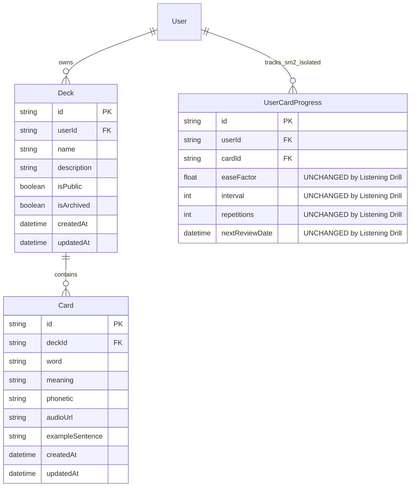
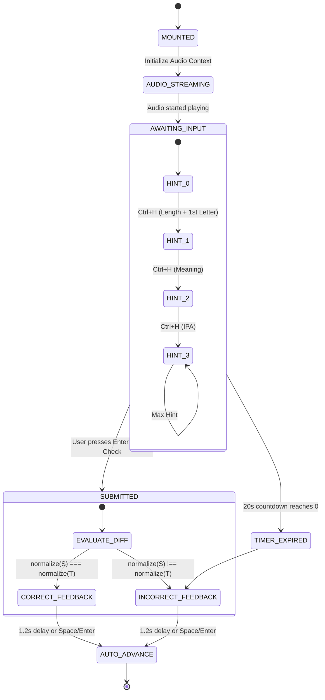

# Data Model: Listening & Typing Practice Quiz (US-QUIZ-03)

**Feature**: `quiz-listening-practice`  
**Epic**: EPIC-04 Multi-format Practice & Quiz Modes (Sprint 5)  
**Date**: 2026-08-21  
**Status**: COMPLETE

---

## 1. Entity-Relationship Model (Prisma & Database Schema)

The Listening & Typing Practice mode reads from existing `Deck` and `Card` entities and uses client-side ephemeral session management for fast interactive drills.



### Database Indexes & Performance Optimization

| Table   | Index Columns            | Type   | Purpose                                                |
| :------ | :----------------------- | :----- | :----------------------------------------------------- |
| `decks` | `(user_id, is_archived)` | B-Tree | Fast lookup of user's active decks                     |
| `decks` | `(is_public)`            | B-Tree | Fast query for public decks accessible to all learners |
| `cards` | `(deck_id)`              | B-Tree | High-speed retrieval of cards for question generation  |

---

## 2. Shared TypeScript DTO Contracts (`packages/shared-types`)

### 2.1 Question Generation DTOs

```typescript
export interface ListeningQuestionDto {
  id: string;
  cardId: string;
  word: string;
  phonetic?: string | null;
  meaning: string;
  audioUrl?: string | null;
  wordLength: number;
  firstLetterHint: string;
}

export interface GetListeningQuestionsQueryDto {
  deckId: string;
  limit?: number; // default: 10, min: 1, max: 100
}
```

### 2.2 Answer & Submission DTOs

```typescript
export interface ListeningAnswerSubmissionDto {
  cardId: string;
  submittedWord: string;
  isCorrect: boolean;
  timeSpentMs: number;
  hintsUsed: number; // 0, 1, 2, or 3
  replayCount: number;
  audioSpeedUsed: number; // 1.0 or 0.75
}

export interface SubmitListeningQuizDto {
  deckId: string;
  totalQuestions?: number;
  answers: ListeningAnswerSubmissionDto[];
}
```

### 2.3 Quiz Result Response DTOs

```typescript
export interface MissedCardDto {
  cardId: string;
  word: string;
  meaning: string;
  phonetic?: string | null;
  audioUrl?: string | null;
}

export interface QuizResultResponseDto {
  totalQuestions: number;
  correctCount: number;
  accuracyPercentage: number;
  totalXpEarned: number;
  maxCombo: number;
  missedCards: MissedCardDto[];
}
```

### 2.4 Character Diff Visualizer Contracts

```typescript
export type DiffSpanType = "MATCH" | "MISSING" | "EXTRA" | "WRONG";

export interface DiffSpan {
  char: string;
  type: DiffSpanType;
}
```

---

## 3. Validation Rules & Invariants

| Field / Object   | Rule / Constraint                                                            | Error Behavior       |
| :--------------- | :--------------------------------------------------------------------------- | :------------------- |
| `deckId`         | Must be a valid UUID/CUID string pointing to an existing, non-archived deck. | `404 Not Found`      |
| `deck.userId`    | Must match requesting `userId` OR `deck.isPublic === true`.                  | `403 Forbidden`      |
| `deck.cards`     | Deck must contain $\ge 1$ card.                                              | `400 Bad Request`    |
| `limit`          | Optional integer: $\ge 1$ and $\le 100$. Default = 10.                       | `400 Bad Request`    |
| `submittedWord`  | String trimmed and bounded to $\le 100$ characters.                          | Stripped & validated |
| `timeSpentMs`    | Integer $\ge 0$. If $< 400\text{ms}$, speed bonus is forfeited (anti-abuse). | Scoring penalty      |
| `hintsUsed`      | Integer $\in [0, 3]$. If $> 0$, speed bonus is forfeited.                    | Scoring rule         |
| `audioSpeedUsed` | Must be either `1.0` or `0.75`.                                              | Default `1.0`        |

---

## 4. State Lifecycles & State Transitions

### 4.1 Per-Question State Machine



### 4.2 Spaced Repetition Isolation Invariant

- **Principle**: Listening Practice is an active auditory recall drill, NOT a scheduled SRS flashcard review.
- **Invariant**: No records in `UserCardProgress` (`interval`, `easeFactor`, `repetitions`, `nextReviewDate`) are updated by the listening quiz endpoint.
- **Gamification Only**: Session results only increment the user's daily XP counter and streak tracker.
