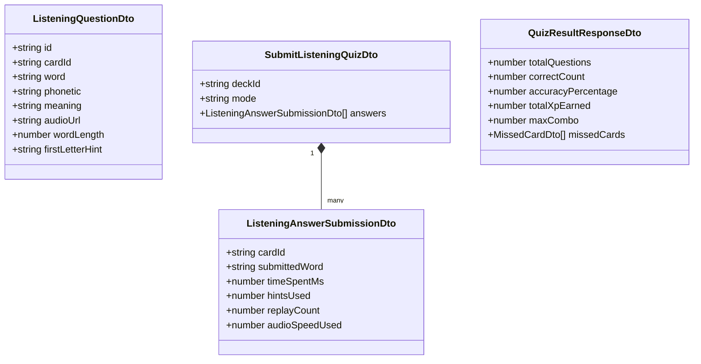

# Feature Specification: Listening & Typing Practice Quiz (US-QUIZ-03)

**Feature Branch**: `feat/quiz-listening-practice`  
**Created**: 2026-08-21  
**Status**: Specified / Ready for Implementation  
**Epic**: EPIC-04 Multi-format Practice & Quiz Modes (Sprint 5)  
**Input**: Approved Domain Baseline (`baseline.md`, `01-elicitation.md`, `03-domain-model.md`, `spec/user-stories.md`)

---

## 1. Executive Summary & Value Proposition

Traditional vocabulary practice often relies on passive visual recognition (multiple-choice or flashcard flipping). The **Listening & Typing Practice Mode** (`US-QUIZ-03`) introduces an active auditory-to-orthographic feedback loop. Learners listen to native pronunciation at normal (`1.0x`) or slow articulation (`0.75x`), type the exact word in dynamic character slots, request progressive hints when stuck, and receive instant character-level diff feedback.

A resilient client-side audio engine guarantees 100% audio availability through a dual-layer cascade: primary CDN MP3 audio with an automatic zero-latency fallback to the browser's native Web Speech API (`window.speechSynthesis`). Completed sessions award XP and streak bonuses while keeping spaced repetition memory intervals (`UserCardProgress`) completely isolated.

---

## 2. User Scenarios & Testing (Prioritized Journeys)

### User Story 1 — Core Listening & Typing Drill with Auto-Play & Normalization (Priority: P1 🎯 MVP)

_As an authenticated learner,_  
_I want to hear target vocabulary audio and type the word into dynamic character slots with instant feedback,_  
_So that I can verify my auditory recall and correct spelling._

- **Why this priority**: Core value driver of auditory vocabulary acquisition. Without audio playback and accurate answer validation, no listening practice is possible.
- **Independent Test**: Launch a practice session with 10 cards, listen to audio, type words, submit via `Enter`, and observe correct (green) / incorrect (red) feedback with 100% accurate normalization.

#### Acceptance Scenarios:

1. **Scenario 1.1 (Happy Path - Clean Submission)**:
   - **Given** an authenticated learner launches a Listening Practice quiz on a deck with 10 cards
   - **When** the first question loads
   - **Then** the target word audio automatically plays at `1.0x` speed
   - **And** the input shows empty character slots `_ _ _ _ _ _ _ _` corresponding to the target word's letter count
   - **When** the user types `"efficient"` and presses `Enter` (or clicks "Check")
   - **Then** the input borders glow emerald green (`#27c93f`), combo multiplier increments, and the next question loads after a 1.2s delay (or instantly on `Enter`/`Space`).

2. **Scenario 1.2 (Normalized Matching - Case, Whitespace & Punctuation)**:
   - **Given** the target word is `"state-of-the-art"`
   - **When** the user inputs `"  State of the art  "` or `"State-of-the-art!"`
   - **Then** the normalization engine strips extraneous spaces, symbols, and standardizes case, marking the answer as **Correct**.

3. **Scenario 1.3 (Apostrophe Normalization)**:
   - **Given** the target word is `"don't"`
   - **When** the user inputs `"dont"` or uses a curly apostrophe `"don’t"`
   - **Then** the normalization engine accepts both forms as **Correct**.

---

### User Story 2 — Audio Speed Articulation & Resilient Web Speech API Fallback (Priority: P1 🎯 MVP)

_As a learner listening in noisy environments or studying complex words,_  
_I want to slow down audio playback to 0.75x and have guaranteed audio playback via browser Web Speech API if card audio fails,_  
_So that I never get blocked by network glitches or missing media files._

- **Why this priority**: Reliability is paramount. Broken audio files or unintelligible fast speech causes user churn.
- **Independent Test**: Toggle 0.75x speed using `Shift+Space` or UI pill; verify audio playback slows down. Simulate a broken/null `audioUrl` and verify seamless fallback to `window.speechSynthesis`.

#### Acceptance Scenarios:

1. **Scenario 2.1 (0.75x Slow Playback Articulation)**:
   - **Given** the question is playing target word `"phenomenon"` at `1.0x`
   - **When** the user clicks the `"0.75x"` speed button (or presses `Shift+Space` / `S`)
   - **And** triggers replay (`Space` or `R`)
   - **Then** the audio plays at `0.75x` rate with clear phonetic articulation
   - **And** the speed toggle button visually indicates active slow mode.

2. **Scenario 2.2 (Missing / Broken Audio URL Web Speech Fallback)**:
   - **Given** a card has `audioUrl: null` or the CDN MP3 returns `404 Not Found` / CORS error / network timeout (>3000ms)
   - **When** the question mounts
   - **Then** the audio controller intercepts the failure within 50ms and invokes `window.speechSynthesis.speak()` with `lang: 'en-US'`
   - **And** the target word is spoken clearly with an accessible badge indicating native TTS synthesis.

3. **Scenario 2.3 (Browser Autoplay Security Fallback)**:
   - **Given** the browser blocks automatic audio playback due to lack of prior user interaction
   - **When** the question loads
   - **Then** the UI renders a prominent Obsidian pill: `"Play Audio (Space)"`
   - **When** the user presses `Space` or clicks the button
   - **Then** audio context unlocks and plays normally for all subsequent questions.

---

### User Story 3 — Progressive 3-Tier Hint Engine with Speed Bonus Forfeiture (Priority: P2)

_As a learner who is struggling to identify a word from audio alone,_  
_I want to request progressive, tiered hints (first letter, meaning, phonetic IPA),_  
_So that I can learn the word without looking up external resources while maintaining fair scoring._

- **Why this priority**: Reduces cognitive frustration and drop-off during difficult cards.
- **Independent Test**: Press `Ctrl+H` sequentially; verify Tier 1 reveals the first letter, Tier 2 reveals the Vietnamese meaning, Tier 3 reveals the IPA, and speed bonus is marked forfeited.

#### Acceptance Scenarios:

1. **Scenario 3.1 (Progressive Hint Disclosure)**:
   - **Given** the target word is `"perseverance"`
   - **When** the user presses `Ctrl+H` (or clicks "Hint") once
   - **Then** Hint Tier 1 is activated, revealing: `"p _ _ _ _ _ _ _ _ _ _ _"` (length 12)
   - **When** the user presses `Ctrl+H` a second time
   - **Then** Hint Tier 2 is activated, displaying meaning: `"sự kiên trì, bền bỉ"`
   - **When** the user presses `Ctrl+H` a third time
   - **Then** Hint Tier 3 is activated, displaying phonetic IPA: `"/ˌpɜː.sɪˈvɪə.rəns/"`
   - **And** the UI records `hintsUsed = 3` and forfeits the +15 XP speed bonus.

---

### User Story 4 — Character Diff Visualizer & Error Feedback (Priority: P2)

_As a learner who spelled a word incorrectly,_  
_I want to see an exact character-level comparison between what I typed and the correct spelling,_  
_So that I can immediately spot missing, extra, or transposed letters._

- **Why this priority**: Essential for orthographic learning; users learn faster when they see exactly where they made a spelling mistake.
- **Independent Test**: Type `"acomodation"` for target `"accommodation"`; verify red shake animation and character diff highlighting missing `'c'` and `'m'`.

#### Acceptance Scenarios:

1. **Scenario 4.1 (Character Diff Rendering)**:
   - **Given** target word `"accommodation"`
   - **When** the user submits `"acomodation"`
   - **Then** the input displays a red shake animation (`#ff5f56`)
   - **And** a character diff view shows:
     - Target: `a c c o m m o d a t i o n`
     - Typed: `a [c] o [m] o d a t i o n` (with missing characters highlighted in blue badge)
   - **And** the card is flagged and appended to `missedCardIds[]`.

---

### User Story 5 — Practice Session Recap, Gamification & Timer Modes (Priority: P3)

_As an authenticated learner completing a session,_  
_I want to view my final score, XP earned, combo streaks, and missed cards with audio replay,_  
_So that I feel motivated and can review difficult words._

- **Why this priority**: Closes the learning loop and feeds gamification metrics without contaminating spaced repetition schedules.
- **Independent Test**: Complete a 10-question quiz, view `QuizResultsView`, verify XP calculation (+10 XP base, speed bonuses, combos), check that SM-2 review dates remain untouched, and test audio replay on missed cards.

#### Acceptance Scenarios:

1. **Scenario 5.1 (Recap View & XP Award)**:
   - **Given** a finished quiz session with 8/10 correct answers, 4 speed bonuses, and a 5x max combo
   - **When** the final question is submitted
   - **Then** `POST /api/v1/practice/submit-quiz` is called
   - **And** the `QuizResultsView` displays accuracy (`80%`), total XP earned, max combo (`5x`), and a list of the 2 missed cards with audio replay buttons
   - **And** the learner's daily XP increments while `UserCardProgress` SM-2 parameters (`easeFactor`, `interval`) remain unchanged.

2. **Scenario 5.2 (20-Second Countdown & Zen Mode)**:
   - **Given** timed practice mode is enabled
   - **When** the timer counts down from 20s to 0s without user submission
   - **Then** the system automatically marks the question incorrect, reveals the correct word, and resets combo streak to 1x
   - **And** if "Zen Mode" is toggled in Setup Modal, the timer is hidden and disabled.

---

## 3. Edge Cases & Handling Strategies

| Edge Case ID | Scenario                                      | System Behavior                                                                                                                                                                              |
| :----------- | :-------------------------------------------- | :------------------------------------------------------------------------------------------------------------------------------------------------------------------------------------------- |
| **EDGE-001** | **Browser Autoplay Blocked**                  | Renders an Obsidian `"Play Audio (Space)"` button to capture the first user gesture. Once clicked, audio unlocks for all remaining cards.                                                    |
| **EDGE-002** | **Remote MP3 404 / CORS / Timeout (>3s)**     | Aborts remote `<audio>` stream within 50ms and seamlessly invokes `window.speechSynthesis.speak()` with `lang: 'en-US'`.                                                                     |
| **EDGE-003** | **Hyphenated / Contraction Words**            | Normalizer strips hyphens and accepts both forms (`"state-of-the-art"` $\leftrightarrow$ `"state of the art"`, `"don't"` $\leftrightarrow$ `"dont"` $\leftrightarrow$ `"don’t"`).            |
| **EDGE-004** | **Rapid Double Submission / Enter Hammering** | Input is locked immediately upon first submission (`isSubmitting = true`). Subsequent `Enter` or `Space` presses during the 1.2s feedback window act as an explicit "Skip to Next Question". |
| **EDGE-005** | **Deck with < 1 Card**                        | API throws `400 Bad Request` ("Deck has no cards to practice"). UI Setup Modal disables the "Start Practice" button with an informative tooltip.                                             |
| **EDGE-006** | **Sub-400ms Submissions (Anti-Abuse)**        | Submissions with `timeSpentMs < 400` are flagged as automated bot scripts; speed bonus is zeroed.                                                                                            |
| **EDGE-007** | **Daily Practice XP Cap (500 XP)**            | Backend caps daily practice drill XP at 500 XP to prevent automated script farming.                                                                                                          |
| **EDGE-008** | **No Web Speech API Support in Browser**      | If both remote MP3 and Web Speech API fail, question enters visual fallback displaying meaning and phonetic IPA prompts with an alert banner.                                                |

---

## 4. Functional Requirements Traceability Matrix

| Requirement ID     | Description                                                                                                            | Source Business Rule                       | User Story    |
| :----------------- | :--------------------------------------------------------------------------------------------------------------------- | :----------------------------------------- | :------------ |
| **REQ-LISTEN-001** | `GET /api/v1/practice/listening` endpoint to fetch randomized cards with length & first letter                         | `BR-QUIZ-LISTEN-001`                       | US1           |
| **REQ-LISTEN-002** | Dual-speed audio controller (`1.0x` Normal, `0.75x` Slow) with UI pill and `Shift+Space` / `S` hotkeys                 | `BR-QUIZ-LISTEN-003`                       | US2           |
| **REQ-LISTEN-003** | Automatic zero-latency fallback to Web Speech API (`SpeechSynthesisUtterance`) on remote audio failure                 | `BR-QUIZ-LISTEN-002`                       | US2           |
| **REQ-LISTEN-004** | Dynamic typing input with character slot visual guide (`_ _ _ _ _`)                                                    | `BR-QUIZ-LISTEN-004`                       | US1           |
| **REQ-LISTEN-005** | Strict/normalized answer validation (case-insensitive, trimmed, punctuation-stripped)                                  | `BR-QUIZ-LISTEN-004`                       | US1           |
| **REQ-LISTEN-006** | 3-Tier progressive hint engine (Length/1st Letter $\rightarrow$ Meaning $\rightarrow$ IPA) with speed bonus forfeiture | `BR-QUIZ-LISTEN-005`                       | US3           |
| **REQ-LISTEN-007** | Immediate feedback with red shake animation and character-level diff highlighting                                      | `BR-QUIZ-LISTEN-006`                       | US4           |
| **REQ-LISTEN-008** | Gamification XP scoring (+10 XP base, +15 XP speed bonus, combos) isolated from SM-2 memory parameters                 | `BR-QUIZ-LISTEN-007`, `BR-QUIZ-LISTEN-008` | US5           |
| **REQ-LISTEN-009** | 20s countdown timer with toggleable Zen Mode                                                                           | `BR-QUIZ-LISTEN-009`                       | US5           |
| **REQ-LISTEN-010** | Comprehensive keyboard shortcuts (`Space`/`R`, `Shift+Space`/`S`, `Enter`, `Ctrl+H`, `Esc`) meeting WCAG 2.1 AA        | `BR-QUIZ-LISTEN-010`                       | US1, US2, US3 |

---

## 5. Key Entities & Domain Contracts

---

## 6. Measurable Success Criteria

- **SC-001 (Audio Playback Latency)**: Audio playback initiation latency is $< 150\text{ms}$ on modern browsers for remote audio and $< 50\text{ms}$ for Web Speech API fallback.
- **SC-002 (Audio Availability)**: 100% audio availability guaranteed across all test sessions via Web Speech API failover cascade.
- **SC-003 (Session Completion Rate)**: $\ge 80\%$ quiz completion rate across listening practice sessions.
- **SC-004 (Evaluation Speed)**: Local client validation evaluates within $< 16\text{ms}$ (1 frame), providing immediate UI responsiveness.
- **SC-005 (SM-2 Isolation Guarantee)**: 0 mutations to `UserCardProgress` spaced repetition records during or after listening practice sessions.

---

## 7. Assumptions & Domain Invariants

- `ASM-QUIZ-020`: Audio plays automatically on question load when permitted by browser autoplay policy.
- `ASM-QUIZ-021`: Discrete playback rates are restricted to `1.0x` and `0.75x` for optimal perceptual clarity.
- `ASM-QUIZ-022`: Web Speech API `window.speechSynthesis` is supported on all major modern browsers (Chrome, Edge, Safari, Firefox).
- `ASM-QUIZ-023`: Answer validation performs whitespace trimming, lowercasing, and non-alphanumeric punctuation removal.
- `ASM-QUIZ-024`: 3-Tier progressive hints provide scaffolding while forfeiting speed bonuses to ensure gamification integrity.
- `ASM-QUIZ-025`: Listening Practice is an isolated drill awarding XP and streak progress without modifying SM-2 spaced repetition memory state.
- `ASM-QUIZ-026`: Full keyboard shortcuts enable hands-free operation (`Space`/`R`, `Shift+Space`/`S`, `Enter`, `Ctrl+H`, `Esc`).
- `ASM-QUIZ-027`: Audio failover cascade guarantees learners can complete listening practice sessions in offline or low-bandwidth environments.
