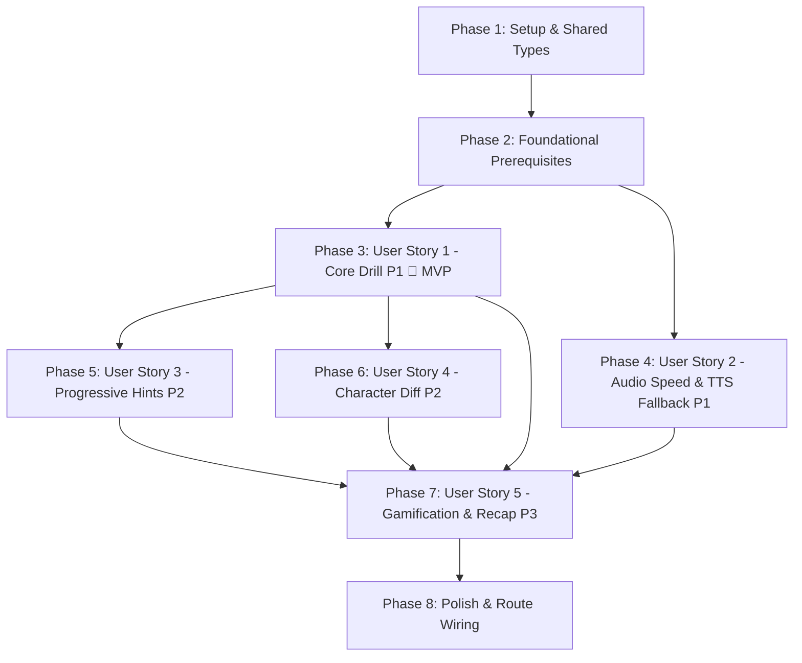

# Tasks: Listening & Typing Practice Quiz (US-QUIZ-03)

**Input**: Design documents from `.specify/features/quiz-listening-practice/` (`spec.md`, `plan.md`, `data-model.md`, `contracts/`, `research.md`, `quickstart.md`)  
**Status**: Ready for Implementation  
**Epic**: EPIC-04 Multi-format Practice & Quiz Modes (Sprint 5)

---

## Task Format Checklist

- Format: `- [ ] [TaskID] [P?] [Story?] Description with exact file path`
- `[P]`: Parallelizable task (independent file / no unfinished dependencies)
- `[Story]`: User story label (`[US1]`, `[US2]`, `[US3]`, `[US4]`, `[US5]`)
- Red-Green-Refactor TDD workflow: Unit & contract tests defined before implementation.

---

## Phase 1: Setup & Shared Contracts

**Purpose**: Initialize contracts and shared DTOs across the monorepo.

- [x] T001 [P] Add `ListeningQuestionDto`, `GetListeningQuestionsQueryDto`, `ListeningAnswerSubmissionDto`, and `DiffSpan` types in `packages/shared-types/src/practice.ts`
- [x] T002 Re-export listening quiz types from `packages/shared-types/src/index.ts` and compile package via `pnpm --filter @wordstreak/shared-types build`

---

## Phase 2: Foundational Prerequisites (Blocking)

**Purpose**: Core backend validation DTOs and client-side utility algorithms required across all user stories.

**⚠️ CRITICAL**: Must complete before starting user story implementations.

- [x] T003 [P] Create query validation DTO `apps/api/src/modules/practice/dto/get-listening-questions.dto.ts` with class-validator annotations (`deckId`, `limit` min 1 max 100)
- [x] T004 [P] Write unit tests for text normalizer and character diff utility in `apps/web/src/features/practice/utils/spellingDiff.spec.ts` (TDD RED)
- [x] T005 Implement `normalizeSpelling`, `checkAnswer`, and `computeCharacterDiff` (LCS algorithm) in `apps/web/src/features/practice/utils/spellingDiff.ts` (TDD GREEN)
- [x] T006 [P] Write unit tests for `useAudioPlayer` hook covering HTML5 audio, playback rate, and Web Speech API fallback in `apps/web/src/features/practice/hooks/useAudioPlayer.spec.ts` (TDD RED)
- [x] T007 Implement `useAudioPlayer` custom hook with HTML5 audio playback and browser `window.speechSynthesis` failover in `apps/web/src/features/practice/hooks/useAudioPlayer.ts` (TDD GREEN)

**Checkpoint**: Foundation ready — shared contracts, backend DTOs, text normalizer, and audio player engine are fully tested.

---

## Phase 3: User Story 1 — Core Listening & Typing Drill (Priority: P1 🎯 MVP)

**Goal**: Enable authenticated learners to fetch randomized listening cards, hear audio, type answers into dynamic character slots, and receive immediate validated feedback.

**Independent Test**: Load a listening quiz session, hear target audio, type the target word, submit via `Enter`, and observe correct (emerald green) / incorrect (red) feedback with 100% accurate normalization.

### Tests for User Story 1 ⚠️

- [x] T008 [P] [US1] Write unit tests for `ListeningGeneratorService` covering deck ownership, public decks, card shuffling, and limit constraints in `apps/api/src/modules/practice/listening-generator.service.spec.ts` (TDD RED)
- [x] T009 [P] [US1] Write controller integration test for `GET /practice/listening` endpoint in `apps/api/src/modules/practice/practice.controller.spec.ts` (TDD RED)
- [x] T010 [P] [US1] Write unit tests for `useListeningQuiz` hook state transitions and input handling in `apps/web/src/features/practice/hooks/useListeningQuiz.spec.ts` (TDD RED)

### Implementation for User Story 1

- [x] T011 [US1] Implement `ListeningGeneratorService.generateQuestions` in `apps/api/src/modules/practice/listening-generator.service.ts`
- [x] T012 [US1] Add `GET /practice/listening` endpoint in `apps/api/src/modules/practice/practice.controller.ts` and register service in `apps/api/src/modules/practice/practice.module.ts`
- [x] T013 [US1] Add `getListeningQuiz` API client method in `apps/web/src/features/practice/services/practiceService.ts`
- [x] T014 [US1] Implement core `useListeningQuiz` hook (question indexing, typing input, answer checking, 1.2s auto-advance) in `apps/web/src/features/practice/hooks/useListeningQuiz.ts`
- [x] T015 [P] [US1] Implement `ListeningTypingInput.tsx` with dynamic letter slots (`_ _ _ _ _`), autofocus, and emerald/red feedback borders in `apps/web/src/features/practice/components/ListeningTypingInput.tsx`
- [x] T016 [US1] Build `ListeningQuizCard.tsx` with speaker pulse animation, replay button, and input container in `apps/web/src/features/practice/components/ListeningQuizCard.tsx`

**Checkpoint**: User Story 1 works as a standalone MVP drill with audio playback and normalized answer checking.

---

## Phase 4: User Story 2 — Dual Playback Speeds & Resilient Web Speech Fallback (Priority: P1 🎯 MVP)

**Goal**: Support 0.75x slow articulation and automatic seamless failover to browser `window.speechSynthesis` when remote MP3 fails or is missing.

**Independent Test**: Toggle 0.75x speed via `Shift+Space` or UI pill; verify slower audio playback rate. Pass a card with `audioUrl: null` and verify speech synthesis articulates the target word.

### Tests for User Story 2 ⚠️

- [x] T017 [P] [US2] Add test cases for 0.75x speed rate toggle and Web Speech failover cascade in `apps/web/src/features/practice/hooks/useAudioPlayer.spec.ts`
- [x] T018 [P] [US2] Write component tests for speed pill toggle and autoplay unlock button in `apps/web/src/features/practice/components/ListeningQuizCard.spec.tsx` (TDD RED)

### Implementation for User Story 2

- [x] T019 [US2] Enhance `useAudioPlayer.ts` with 3000ms timeout guard, `NotAllowedError` autoplay gesture detection, and speed rate synchronization (`audio.playbackRate = 0.75` / `utterance.rate = 0.75`)
- [x] T020 [US2] Integrate speed toggle pill (`1.0x` / `0.75x Slow`) and "Click to Listen (`Space`)" autoplay fallback button into `apps/web/src/features/practice/components/ListeningQuizCard.tsx`
- [x] T021 [US2] Wire keyboard hotkeys (`Shift+Space` / `S` for speed toggle, `Space` / `R` for replay) in `apps/web/src/features/practice/hooks/useListeningQuiz.ts`

**Checkpoint**: User Story 2 ensures high audio reliability and acoustic clarity for difficult words.

---

## Phase 5: User Story 3 — Progressive 3-Tier Hint Engine (Priority: P2)

**Goal**: Provide 3 tiers of progressive hints (Length + 1st Letter $\rightarrow$ Meaning $\rightarrow$ Phonetic IPA) and handle speed bonus forfeiture.

**Independent Test**: Press `Ctrl+H` sequentially; verify Tier 1 reveals first letter and dashes, Tier 2 displays meaning, Tier 3 displays IPA, and speed bonus is marked forfeited.

### Tests for User Story 3 ⚠️

- [x] T022 [P] [US3] Add hint level progression and speed bonus forfeiture test cases in `apps/web/src/features/practice/hooks/useListeningQuiz.spec.ts`
- [x] T023 [P] [US3] Write component tests for `ProgressiveHintBox` in `apps/web/src/features/practice/components/ProgressiveHintBox.spec.tsx` (TDD RED)

### Implementation for User Story 3

- [x] T024 [P] [US3] Implement `ProgressiveHintBox.tsx` with animated disclosure for Tier 1 (letter slots), Tier 2 (Vietnamese meaning), and Tier 3 (IPA) in `apps/web/src/features/practice/components/ProgressiveHintBox.tsx`
- [x] T025 [US3] Add hint dispatching (`requestHint`, `Ctrl+H` hotkey, `hintsUsed` tracking, speed bonus forfeiture flag) in `apps/web/src/features/practice/hooks/useListeningQuiz.ts`
- [x] T026 [US3] Embed `ProgressiveHintBox` within `apps/web/src/features/practice/components/ListeningQuizCard.tsx`

**Checkpoint**: Progressive hints provide learning scaffolding without compromising gamification fairness.

---

## Phase 6: User Story 4 — Character Diff Visualizer & Error Feedback (Priority: P2)

**Goal**: Display exact character-by-character diffs on incorrect submissions to highlight missing, wrong, or transposed letters.

**Independent Test**: Submit `"acomodation"` for `"accommodation"`; verify red shake animation and character diff highlighting missing `'c'` and `'m'` in blue badge.

### Tests for User Story 4 ⚠️

- [x] T027 [P] [US4] Write component tests verifying character diff rendering on incorrect answers in `apps/web/src/features/practice/components/ListeningTypingInput.spec.tsx` (TDD RED)

### Implementation for User Story 4

- [x] T028 [US4] Integrate `computeCharacterDiff` into evaluation lifecycle in `apps/web/src/features/practice/hooks/useListeningQuiz.ts`
- [x] T029 [US4] Render character diff badge overlay (blue for missing, strikethrough red for wrong) below input during error state in `apps/web/src/features/practice/components/ListeningTypingInput.tsx`

**Checkpoint**: Immediate character diff gives clear visual feedback for spelling mastery.

---

## Phase 7: User Story 5 — Gamification, Timer/Zen Mode & Results Recap (Priority: P3)

**Goal**: Calculate XP (+10 base, +15 speed bonus, combos), provide 20s countdown and Zen mode, submit session to backend, and render recap view with missed cards audio replay.

**Independent Test**: Complete a quiz session, submit to `POST /practice/submit-quiz`, verify accuracy %, XP breakdown, combo streak, missed cards replay list, and verify SM-2 intervals remain unmodified.

### Tests for User Story 5 ⚠️

- [x] T030 [P] [US5] Add unit tests in `apps/api/src/modules/practice/practice.service.spec.ts` for listening quiz speed bonus (+15 XP for $\le 8000\text{ms}$, 0 hints, $\le 2$ replays) and sub-400ms anti-abuse guard (TDD RED)
- [x] T031 [P] [US5] Write component tests for `ListeningQuizPage` timer expiration and results summary transition in `apps/web/src/features/practice/pages/ListeningQuizPage.spec.tsx` (TDD RED)

### Implementation for User Story 5

- [x] T032 [US5] Update `PracticeService.submitQuiz` in `apps/api/src/modules/practice/practice.service.ts` to compute listening speed bonuses and apply anti-abuse thresholds
- [x] T033 [US5] Implement 20-second countdown timer and Zen Mode toggle in `apps/web/src/features/practice/hooks/useListeningQuiz.ts`
- [x] T034 [US5] Build `ListeningQuizPage.tsx` integrating header (progress bar, timer badge, combo multiplier), active card, keyboard listeners, and `QuizResultsView` transition in `apps/web/src/features/practice/pages/ListeningQuizPage.tsx`
- [x] T035 [US5] Update `QuizSetupModal.tsx` in `apps/web/src/features/practice/components/QuizSetupModal.tsx` to include "Listening & Typing" mode tab and navigation handler

---

## Phase 8: Polish, Routing & Integration

**Purpose**: Monorepo integration, route configuration, accessibility verification, and end-to-end testing.

- [x] T036 Register `/practice/listening` route in `apps/web/src/App.tsx`
- [x] T037 [P] Audit WCAG 2.1 AA accessibility (ARIA live regions for audio speed/feedback, high contrast focus rings, touch targets $\ge 44\text{px}$) across all listening practice components
- [x] T038 Execute developer verification guide in `.specify/features/quiz-listening-practice/quickstart.md`
- [x] T039 Run full workspace typecheck, linting, and test suite (`pnpm -r test && pnpm -r typecheck`)

---

## Dependencies & Execution Order

### Parallel Execution Opportunities

- **Phase 1 & Phase 2**: `T001`, `T003`, `T004`, `T006` can be executed concurrently.
- **Phase 3 (US1)**: Backend tasks `T008`, `T011`, `T012` can be developed in parallel with frontend tasks `T010`, `T014`, `T015`.
- **Phase 4 & Phase 5**: Once US1 completes, hints (`T024`-`T026`) and character diff (`T027`-`T029`) can proceed in parallel.

---

## Implementation Strategy & MVP Delivery

1. **Step 1: MVP Delivery (Phase 1 + Phase 2 + Phase 3 + Phase 4)**:
   - Delivers a fully functional Listening & Typing practice quiz with audio playback, 0.75x speed toggle, Web Speech API fallback, and normalized answer validation.
2. **Step 2: Scaffolding & Feedback (Phase 5 + Phase 6)**:
   - Adds 3-tier progressive hints and character-level diff visualizer.
3. **Step 3: Gamification & Polish (Phase 7 + Phase 8)**:
   - Completes XP calculation, anti-abuse guards, Zen mode, recap view, and monorepo routing.
