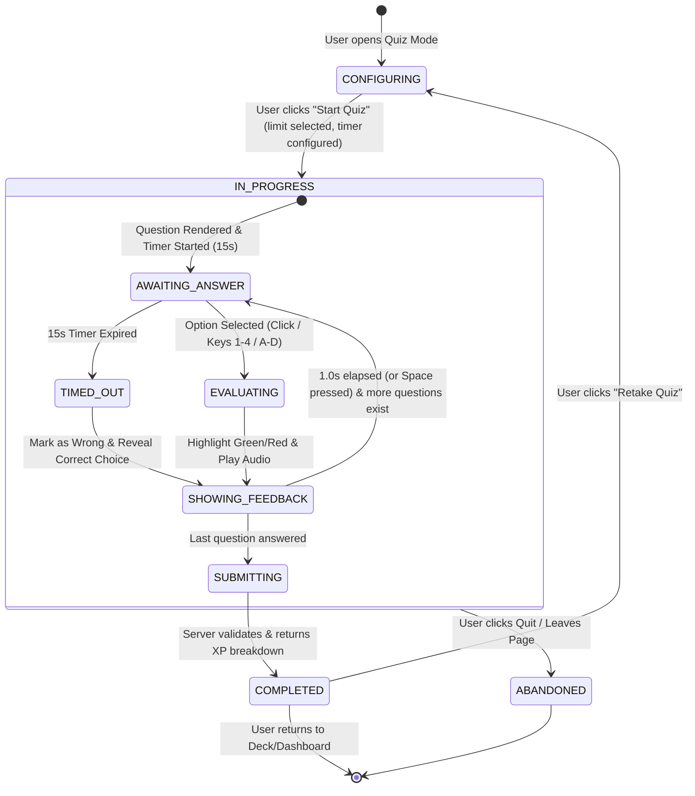
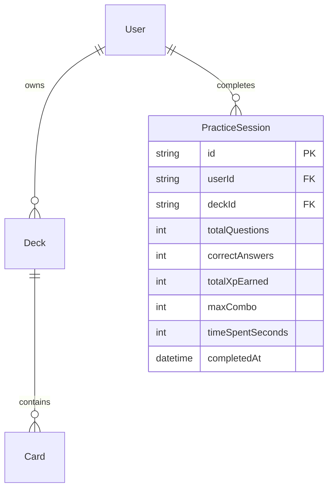

# Domain Model: Multiple Choice Quiz (US-QUIZ-01)

## 1. RBAC Matrix

| Role                        |    Generate Quiz     | Start/Play Quiz | Submit Answers | View Own Quiz History | View Other User History |
| :-------------------------- | :------------------: | :-------------: | :------------: | :-------------------: | :---------------------: |
| **Guest** (Unauthenticated) |          ❌          |       ❌        |       ❌       |          ❌           |           ❌            |
| **Learner** (Authenticated) | ✅ (Own/Public Deck) |       ✅        |       ✅       |          ✅           |           ❌            |
| **System Admin**            |          ✅          |       ✅        |       ✅       |          ✅           |           ✅            |

_Ownership Rule_: A user can generate and play quizzes for any deck they own (`deck.userId === user.id`) or any deck marked `isPublic === true`.

---

## 2. State Machine & Entity Lifecycle

---

## 3. Business Rules & Algorithms

- **`BR-QUIZ-001` (Question Format Generation)**:
  - Questions are generated with a 50/50 probability between two formats:
    - **Format A (EN $\rightarrow$ VI)**: Question prompt shows English `word`, `phonetic`, and `audioUrl`. Options consist of 1 correct Vietnamese `meaning` and 3 distractor Vietnamese meanings.
    - **Format B (VI $\rightarrow$ EN)**: Question prompt shows Vietnamese `meaning` and optional `exampleSentence` (with target word masked as `_____`). Options consist of 1 correct English `word` and 3 distractor English words.

- **`BR-QUIZ-002` (Smart Distractor Sourcing)**:
  - 3 distractor options must be distinct from the correct card and unique among themselves.
  - Distractors are picked randomly from other cards in the same deck.
  - If the same deck contains fewer than 4 total cards, distractors are drawn from other active decks belonging to the user.
  - Minimum guard: If total user cards $< 4$, quiz cannot be launched (returns `400 Bad Request: At least 4 cards required for Multiple Choice Quiz`).

- **`BR-QUIZ-003` (Option Shuffling)**:
  - The 4 choices (1 correct + 3 distractors) must be randomly shuffled using Fisher-Yates algorithm so the correct option is uniformly distributed across positions A, B, C, D (indices 0, 1, 2, 3).

- **`BR-QUIZ-004` (Timer & Auto-Timeout)**:
  - In standard mode, each question has a 15-second countdown timer.
  - If the timer reaches 0s without user input, the system records `selectedOption = null`, `isCorrect = false`, `timeSpentMs = 15000`, displays the correct answer with a red prompt, and pauses 1.0s before moving to the next question.
  - If Zen Mode is enabled, timer is disabled (`timeSpentMs` recorded as actual response time).

- **`BR-QUIZ-005` (Scoring, Speed Bonus & Combo Multiplier)**:
  - Base XP per correct answer: **+10 XP**.
  - Speed Bonus: If answered correctly in $\le 5.0$ seconds, award additional **+5 XP** (Total: +15 XP).
  - Combo Multiplier:
    - 3–4 consecutive correct answers: **1.2x XP multiplier**.
    - 5+ consecutive correct answers: **1.5x XP multiplier**.
  - Incorrect answer resets combo streak counter to 0.

- **`BR-QUIZ-006` (SM-2 State Immutability)**:
  - Multiple Choice Quiz is strictly a Practice Mode. Answering quiz questions does NOT mutate `UserCardProgress` (`interval`, `repetitions`, `easeFactor`, `nextReviewDate`, `status`).

- **`BR-QUIZ-007` (Anti-Abuse Pass for XP Rewards)**:
  - _Abuse Vector 1: Rapid Scripted Quiz Submission_: Session submission must contain individual `questionId`, `selectedOptionId`, and `timeSpentMs`. If total quiz duration for 10 questions is $< 3000$ms (impossible human reading speed), XP award is capped at 0 and flagged.
  - _Abuse Vector 2: Repeated Farming on Same Small Deck_: A user cannot earn XP more than 5 times per calendar day on the exact same deck quiz session. Subsequent quizzes on the same deck award 0 XP with a friendly message "Practice for mastery! Daily XP cap for this deck reached."

---

## 4. Workflows & Edge Cases

### Happy Path:

1. User navigates to Deck Detail (`/decks/:id`) and clicks "Practice Quiz".
2. Setup drawer opens: user selects question count (10, 20, All) and Timer mode (Standard 15s / Zen Mode), then clicks "Start Quiz".
3. Client requests `GET /api/v1/practice/multiple-choice?deckId=...&limit=10`.
4. User answers questions 1-by-1 using mouse or keys `1-4` / `A-D`.
5. On the final question, client sends `POST /api/v1/practice/submit-quiz`.
6. Client displays celebratory Results Screen with accuracy score, total XP gained, highest combo, and a list of cards missed with instant "Review Missed Cards" action.

### Edge Cases:

- **Deck Has $< 4$ Cards**: API returns friendly error with `code: "INSUFFICIENT_CARDS"`. Frontend displays modal explaining that $\ge 4$ cards are required.
- **Card Missing Audio or Example**: Format A renders gracefully without audio button if `audioUrl` is null. Format B renders without example sentence if missing.
- **Network Disconnection on Submit**: Client caches quiz result locally in `localStorage` and provides a "Retry Submission" button so learner does not lose earned XP.

---

## 5. Entities, Data Boundaries & Privacy

---

## 6. UX & Non-Functional Requirements

- **Design System Tokens (Strict Compliance)**:
  - Background: Pure white `#ffffff`.
  - Borders: 1px hairline `#e5e5e5` / `#d4d4d4`.
  - Buttons & Badges: Obsidian pure black `#000000` with `rounded-full` pills.
  - Typography: Headings in `Nunito`, Body in `Inter`, Hotkeys/Timer in `JetBrains Mono`.
  - Motion: Smooth Framer Motion spring physics with stable outer hover anchors to prevent jitter.
- **Accessibility**: WCAG 2.1 AA compliant. High-contrast indicators for correct (Green `#10B981`) and incorrect (Red `#EF4444`) states that do not rely solely on color (includes checkmark/cross icons).
- **Performance Target**: API question generation P95 latency $< 80$ms.
