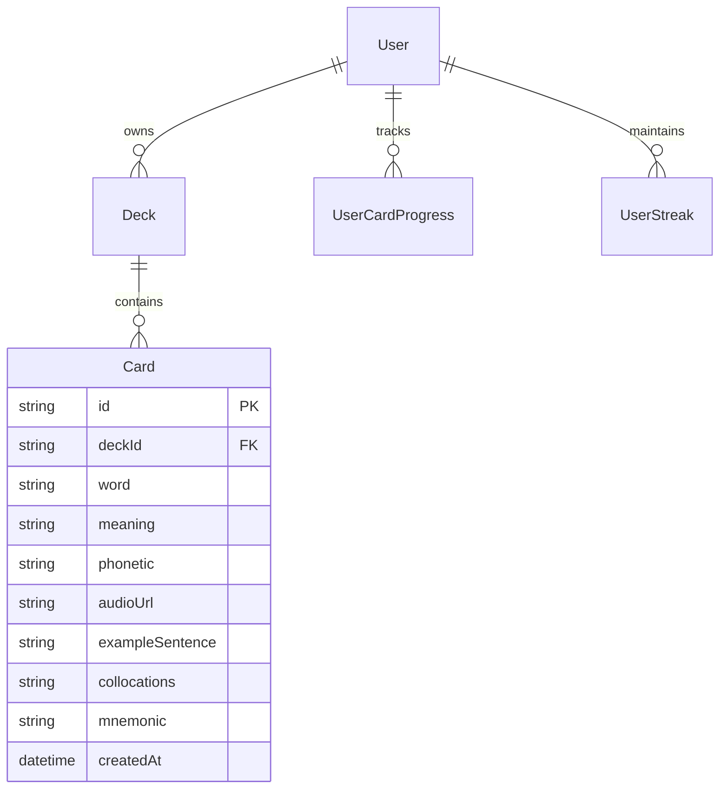

# Data Model: Multiple Choice Quiz

## 1. Entities & Schema Relationship

The Multiple Choice Quiz feature builds upon existing `Deck` and `Card` entities and does not require destructive database migrations.



## 2. In-Memory Session / DTO Models

### Question Model (`QuizQuestionDto`)

- `id`: Unique string per question instance (UUID or `q_${index}`)
- `cardId`: Source card ID
- `format`: `'EN_TO_VI'` | `'VI_TO_EN'`
- `prompt`: String shown to user (`word` or `meaning`)
- `phonetic`: Optional IPA string (Format A)
- `audioUrl`: Optional pronunciation URL
- `exampleContext`: Optional example sentence with blank (`_____`) for target word (Format B)
- `options`: Array of 4 `QuizOptionDto` `{ id, text, isCorrect }` uniformly shuffled

### Client-side Quiz State

```typescript
interface QuizState {
  questions: QuizQuestionDto[];
  currentIndex: number;
  selectedOptionId: string | null;
  feedbackState: "IDLE" | "CORRECT" | "INCORRECT" | "TIMEOUT";
  timerSeconds: number;
  isZenMode: boolean;
  currentCombo: number;
  highestCombo: number;
  score: number;
  totalXp: number;
  answers: QuizAnswerSubmissionDto[];
  isCompleted: boolean;
}
```

## 3. Business Rule Validations

- `deckId`: Must exist and be accessible to current user (owner or `isPublic: true`).
- Minimum Cards: Total cards available across user account $\ge 4$.
- Distractor Selection: 3 distinct cards randomly selected; option text deduplicated by normalized string.
