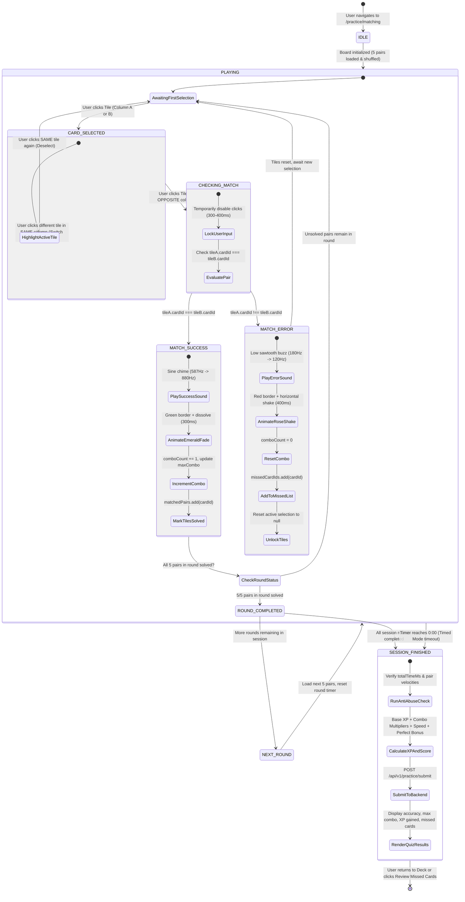
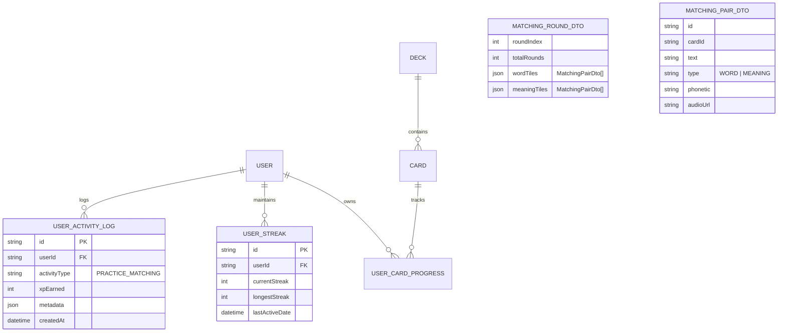

# Domain Model: Chế độ Nối từ vựng (Word Matching Game)

- **Feature Slug**: `quiz-word-matching`
- **Epics**: `EPIC-04` (Multi-format Practice & Quiz Modes — US-QUIZ-04)
- **Date**: 2026-08-21

---

## 1. RBAC Matrix

| Role                        |     Access Matching Mode     |     Play Demo Round     |        Earn & Save XP        | Contribute to Daily Streak | Inspect Quiz Missed Cards |
| :-------------------------- | :--------------------------: | :---------------------: | :--------------------------: | :------------------------: | :-----------------------: |
| **Guest / Unauthenticated** |    ✅ (Public Demo Decks)    | ✅ (1 Round of 5 cards) |   ❌ (Client-only preview)   |        ❌ Forbidden        | ✅ (Current session only) |
| **Learner (Authenticated)** |   ✅ (Own / Cloned Decks)    |     ✅ (All rounds)     |     ✅ (Persisted to DB)     |    ✅ (Upon completion)    | ✅ (Persisted in Results) |
| **System Admin**            | ✅ (All public/system decks) |    ✅ (Full access)     |              ✅              |             ✅             |            ✅             |
| **System Service**          |      ✅ (Internal API)       |           N/A           | ✅ (Auto-grants XP & Streak) | ✅ (Updates Streak Engine) |            N/A            |

### Ownership & Data Boundaries:

- Authenticated learners can launch Word Matching on any personal deck they own or any public community deck containing $\ge 5$ cards.
- Practice quiz session logs and XP awards are keyed strictly to the authenticated `userId`.
- Results from practice modes never alter `UserCardProgress` SRS scheduling fields (`interval`, `easeFactor`, `repetitions`, `nextReviewDate`).

---

## 2. State Machine & Entity Lifecycle

---

## 3. Numbered Business Rules & Calculation Formulas

### `BR-MATCH-001` (Round Size & Column Layout)

- Each matching round presents exactly 5 pairs of cards (10 tiles total).
- Column A (Left) displays 5 English target terms (with optional phonetic IPA).
- Column B (Right) displays 5 Vietnamese definitions/meanings.
- If total selected practice limit is $> 5$ cards (e.g. 10, 15, 20), the session is divided into sequential rounds of 5 pairs each.

### `BR-MATCH-002` (Independent Column Randomization)

- Column A tiles and Column B tiles are shuffled independently using the Fisher-Yates shuffle algorithm on round start.
- Corresponding English and Vietnamese tiles for the same card must never be guaranteed to appear at the same vertical row index.

### `BR-MATCH-003` (Bidirectional Selection)

- Learners can initiate a match by clicking a tile in Column A first, followed by Column B, or by clicking Column B first, followed by Column A.
- Selection order has zero impact on match scoring or correctness.

### `BR-MATCH-004` (In-Column Switching & Self-Deselection)

- If a tile is active in Column A and the user taps a _different_ tile in Column A, the active selection moves to the newly clicked tile immediately with zero error penalty.
- If the user taps the _currently active_ tile again, the tile deselects back to the neutral state with zero error penalty.

### `BR-MATCH-005` (Interaction Locking & Animation Duration)

- When a second tile in the opposing column is selected, the board enters `CHECKING_MATCH`:
  - User pointer interactions are locked on all tiles.
  - On **Match**: Emerald highlight displays for $300\text{ms}$ before tiles dissolve/fade out.
  - On **Mismatch**: Rose highlight with horizontal shake animation (`animate-shake`) displays for $400\text{ms}$ before tiles revert to neutral.
  - No concurrent or queued clicks are processed during this window.

### `BR-MATCH-006` (Base XP Formula)

- Each correctly matched pair awards a base of $+2\text{ XP}$.
- A standard 5-pair round provides $10\text{ XP}$ base upon completion.

### `BR-MATCH-007` (Combo Multiplier Calculation)

- Consecutive correct matches without any intervening error increment the `comboStreak`:
  $$ \text{Combo Multiplier } M(c) = \begin{cases}
  1.0 & \text{if } c \in [1, 2] \\
  1.2 & \text{if } c \in [3, 4] \\
  1.5 & \text{if } c \in [5, 9] \quad (\text{Clean Round}) \\
  2.0 & \text{if } c \ge 10 \quad (\text{Multi-round Super Streak})
  \end{cases}$$
  $$
- Calculated XP per pair: $\text{XP}_{\text{pair}} = \text{round}(2 \times M(c))$.

### `BR-MATCH-008` (Round Speed Bonus)

- In timed or stopwatch mode, if a 5-pair round is completely cleared in $t \le 15.0\text{ seconds}$ with zero mismatches, the learner is awarded a $+10\text{ XP}$ Speed Bonus for that round.

### `BR-MATCH-009` (Perfect Round Accuracy Bonus)

- If all 5 pairs of a round are matched on the first attempt (error count $= 0$), a $+5\text{ XP}$ Perfect Accuracy Bonus is awarded.

### `BR-MATCH-010` (Anti-Abuse Velocity & Bot Guard)

- The backend validates the submission telemetry:
  1. If a 5-pair round is completed in $T_{\text{round}} < 1500\text{ms}$ (average $< 300\text{ms}$ per pair), OR
  2. If any single pair match has $t_{\text{pair}} < 200\text{ms}$,
- The submission is marked as `IS_BOT_DETECTED`: total XP awarded is forced to $0\text{ XP}$, streak progression is skipped, and a security audit warning is recorded in the activity log.

### `BR-MATCH-011` (Daily Practice XP Cap)

- Non-SRS practice modes (Multiple Choice, Fill-in-the-blank, Listening, Word Matching) draw from a shared daily practice XP pool capped at $500\text{ XP/day}$.
- Once the cap is reached, users can continue playing for practice, but XP awarded per session is $0$.

### `BR-MATCH-012` (Free SM-2 Decoupling & Missed Card Handling)

- Practice matches do NOT alter `interval`, `easeFactor`, `repetitions`, or `nextReviewDate` in `UserCardProgress`.
- Cards that experienced at least 1 mismatch are aggregated into `missedCards` in `QuizResultResponseDto` so learners can inspect them in `QuizResultsView` and launch a targeted SRS review if desired.

---

## 4. Workflows & Resiliency Matrix

| Workflow ID     | Scenario & Trigger                                       | System Behavior                                                                                                                                 | Error Handling & Fallback                                 |
| :-------------- | :------------------------------------------------------- | :---------------------------------------------------------------------------------------------------------------------------------------------- | :-------------------------------------------------------- |
| **WF-MATCH-01** | **Flawless Round** (5 correct pairs in 12s)              | Plays success sounds, scales combo from 1x to 1.5x, awards $10\text{ XP (base)} + 5\text{ XP (perfect)} + 10\text{ XP (speed)} = 25\text{ XP}$. | Smooth transition to next round or results.               |
| **WF-MATCH-02** | **Mismatch & Recovery** (Wrong tile tapped)              | 400ms shake animation + soft buzz, combo resets to 0, card added to `missedCards`, tiles unlock.                                                | User can immediately re-attempt pairing.                  |
| **WF-MATCH-03** | **Deck Size $< 5$ Cards** (Insufficient cards)           | Frontend disables Word Matching tab with badge `"Cần tối thiểu 5 thẻ"`. Backend endpoint returns `400 Bad Request` if invoked directly.         | Clear error toast with link to Add Cards.                 |
| **WF-MATCH-04** | **Timer Timeout** (45s expired in Timed Mode)            | Board locks, remaining unmatched pairs marked as missed, session transitions to `SESSION_FINISHED`.                                             | Partial score and XP calculated for completed pairs only. |
| **WF-MATCH-05** | **Zen Mode (Untimed)**                                   | Timer is replaced with elapsed stopwatch. No timeout failure state.                                                                             | Speed bonus is calculated from total elapsed time.        |
| **WF-MATCH-06** | **Rapid Click Spamming** ($< 100\text{ms}$ multi-clicks) | State machine ignores clicks when state is not `AwaitingFirstSelection` or `CARD_SELECTED`.                                                     | Zero duplicate events or state corruption.                |
| **WF-MATCH-07** | **Early Session Exit** (Back button / Close)             | Confirmation dialog: _"Bạn có chắc muốn thoát? Tiến độ vòng hiện tại sẽ không được lưu."_                                                       | User can confirm exit or resume play.                     |
| **WF-MATCH-08** | **Offline / Network Drop on Submit**                     | Client queues submission in `localStorage` or displays retry button on `QuizResultsView`.                                                       | Prevent loss of earned XP.                                |

---

## 5. ERD & Shared Contract Entities

---

## 6. UX States & Non-Functional Requirements

### 6.1. Visual Design & Theme Tokens

- **Canvas**: Clean dark `#09090b` / light `#ffffff`.
- **Tile Dimensions**: Responsive height ($64\text{px}$ mobile, $76\text{px}$ desktop), minimum touch target $48\text{px} \times 48\text{px}$.
- **States**:
  - `Neutral`: `border border-neutral-200 dark:border-neutral-800 bg-white dark:bg-neutral-900 text-neutral-900 dark:text-neutral-100 hover:border-neutral-300 dark:hover:border-neutral-700 shadow-sm`.
  - `Selected`: `ring-2 ring-violet-500 border-violet-500 bg-violet-50/60 dark:bg-violet-950/40 text-violet-900 dark:text-violet-200 scale-[1.02] shadow-md`.
  - `Matched`: `border-emerald-500 bg-emerald-50 text-emerald-700 dark:bg-emerald-950/40 dark:text-emerald-300 opacity-0 pointer-events-none transition-all duration-300`.
  - `Mismatch`: `border-rose-500 bg-rose-50 text-rose-700 dark:bg-rose-950/40 dark:text-rose-300 animate-shake`.

### 6.2. Audio Feedback (Web Audio API Synthesizer)

- Zero external MP3 asset dependency: synthesized via HTML5 `AudioContext`:
  - **Success Chime**: 2-tone frequency sweep ($587.33\text{Hz [D5]} \to 880\text{Hz [A5]}$, sine wave, $120\text{ms}$, exponential decay).
  - **Mismatch Buzz**: Low sawtooth double-pulse ($180\text{Hz} \to 120\text{Hz}$, sawtooth wave, $180\text{ms}$, linear decay).
  - **Combo Streak**: High bell ping ($1046.5\text{Hz [C6]}$, sine wave, $150\text{ms}$).
- Sound volume controlled via master audio setting with a 1-click header mute toggle.

### 6.3. Keyboard Navigation

- Keys `1, 2, 3, 4, 5`: Select/toggle Column A tiles (top to bottom).
- Keys `Q, W, E, R, T` (or `6, 7, 8, 9, 0`): Select/toggle Column B tiles (top to bottom).
- Key `Space`: Replay pronunciation audio for selected English word.
- Key `Escape`: Deselect active tile.

### 6.4. Non-Functional Performance & Accessibility Targets

- **Input Latency**: Tile highlight triggers in $< 16\text{ms}$ (60fps animation frame).
- **Accessibility**: WCAG 2.1 AA compliant, screen reader announcements for match/mismatch via `aria-live="polite"`.
- **Bundle Impact**: Zero heavy third-party game libraries (pure React 19 + Tailwind CSS + Framer Motion).
