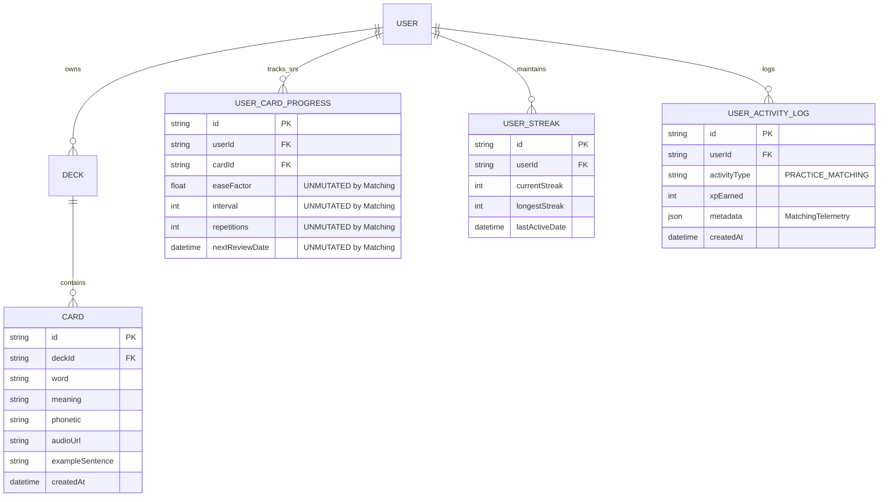
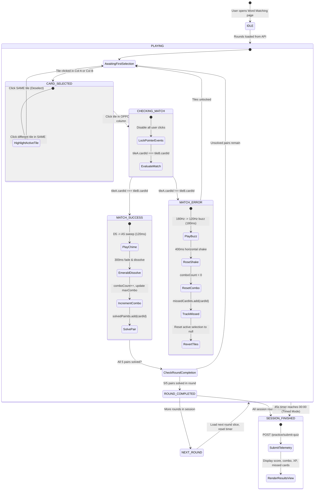

# Data Model Analysis: Chế độ Nối từ vựng (Word Matching Game) (US-QUIZ-04)

**Feature Slug**: `quiz-word-matching`  
**Epic**: `EPIC-04` (Multi-format Practice & Quiz Modes — US-QUIZ-04)  
**Status**: APPROVED  
**Migration Impact**: Pure In-Memory Practice Generator (Zero Schema Migrations)

---

## 1. Relational Entity Architecture & Schema Analysis

Word Matching Game operates as an additive, ephemeral practice engine. It constructs dynamic in-memory pairing boards from existing `Deck` and `Card` database records and emits completion telemetry to `UserActivityLog` and `UserStreak` without altering any persistent Spaced Repetition (SM-2) memory models.



### 1.1. Zero Migration Confirmation

- **No Table Creations or Alterations**: The PostgreSQL database schema requires zero changes.
- **SM-2 State Protection**: Practice mode submissions do not execute updates against `UserCardProgress`. Card accuracy in practice modes is reported in session summaries and activity logs only.

---

## 2. In-Memory DTOs & API Contracts

### 2.1. Generation Contracts

```typescript
export type MatchingTileType = "WORD" | "MEANING";

export type MatchingTileState = "NEUTRAL" | "SELECTED" | "MATCHED" | "MISMATCH";

/**
 * Individual tile presented in either Column A (English) or Column B (Vietnamese).
 */
export interface MatchingCardItemDto {
  id: string; // Unique tile instance ID (e.g., `w_cardId` or `m_cardId`)
  cardId: string; // Source card ID
  text: string; // Target text (English term or Vietnamese definition)
  type: MatchingTileType; // 'WORD' | 'MEANING'
  phonetic?: string | null; // IPA phonetic string (for English tiles)
  audioUrl?: string | null; // Audio pronunciation URL
}

/**
 * Single 5-pair round container with independently shuffled columns.
 */
export interface MatchingRoundDto {
  roundIndex: number; // 0-indexed round index
  totalRounds: number; // Total number of rounds in this session
  wordTiles: MatchingCardItemDto[]; // 5 English tiles (Fisher-Yates shuffled)
  meaningTiles: MatchingCardItemDto[]; // 5 Vietnamese tiles (Fisher-Yates shuffled)
}

/**
 * Generation request parameters.
 */
export interface GetMatchingQuizQueryDto {
  deckId: string; // UUID of deck
  limit?: number; // Total cards requested (default: 10, min: 5, max: 50)
}

/**
 * Generator response payload.
 */
export interface MatchingQuizResponseDto {
  deckId: string;
  totalCards: number;
  totalRounds: number;
  rounds: MatchingRoundDto[];
}
```

### 2.2. Submission & Telemetry Contracts

```typescript
/**
 * Per-pair match telemetry recorded by frontend engine.
 */
export interface MatchingAnswerSubmissionDto {
  cardId: string;
  matchedInMs: number; // Duration elapsed before successful match
  attempts: number; // Number of tries (1 = flawless first attempt)
  isCorrectFirstTry: boolean;
}

/**
 * Payload sent to backend upon session completion.
 */
export interface MatchingSubmitQuizDto {
  deckId: string;
  mode: "MATCHING";
  totalPairs: number;
  totalTimeMs: number;
  answers: MatchingAnswerSubmissionDto[];
}

/**
 * Detailed XP calculation breakdown returned from server.
 */
export interface MatchingXpBreakdownDto {
  baseXp: number; // 2 XP per pair
  comboBonusXp: number; // Multiplier bonus (1.2x, 1.5x, 2.0x)
  speedBonusXp: number; // +10 XP if round <= 15s with 0 errors
  perfectBonusXp: number; // +5 XP if round has 0 errors
  totalXp: number;
  isDailyCapped: boolean; // True if daily 500 XP cap reached
  isBotDetected: boolean; // True if submission flagged (< 1500ms round / < 200ms pair)
}

/**
 * Missed card item for post-quiz review.
 */
export interface MatchingMissedCardDto {
  cardId: string;
  word: string;
  meaning: string;
  phonetic?: string | null;
  audioUrl?: string | null;
  errorAttempts: number;
}

/**
 * Evaluation response returned to client.
 */
export interface MatchingQuizResultDto {
  totalPairs: number;
  matchedCount: number;
  accuracyPercentage: number;
  maxCombo: number;
  totalTimeMs: number;
  totalXpEarned: number;
  xpBreakdown: MatchingXpBreakdownDto;
  missedCards: MatchingMissedCardDto[];
}
```

---

## 3. Client-Side Runtime State Machine



### 3.1. Client Runtime State Interface

```typescript
export interface MatchingGameState {
  status:
    | "IDLE"
    | "PLAYING"
    | "CHECKING_MATCH"
    | "ROUND_COMPLETED"
    | "SESSION_FINISHED";
  rounds: MatchingRoundDto[];
  currentRoundIndex: number;
  selectedTile: MatchingCardItemDto | null;
  opposingTile: MatchingCardItemDto | null;
  solvedCardIds: Set<string>;
  mismatchedTileIds: Set<string>;
  comboCount: number;
  maxCombo: number;
  roundStartTimeMs: number;
  pairStartTimeMs: number;
  totalElapsedMs: number;
  timerSecondsRemaining: number;
  isZenMode: boolean;
  isAudioMuted: boolean;
  answersTelemetry: MatchingAnswerSubmissionDto[];
  missedCardIds: Set<string>;
  isLocked: boolean; // True during 300-400ms evaluation animation
}
```

---

## 4. Business Rule Constraints & Mathematical Validation

| Rule ID          | Parameter          | Formula / Constraint                                                                                                | Enforcement Point  |
| :--------------- | :----------------- | :------------------------------------------------------------------------------------------------------------------ | :----------------- |
| **BR-MATCH-001** | Round Size         | Exactly 5 pairs ($10$ tiles) per round.                                                                             | Backend Generator  |
| **BR-MATCH-002** | Randomization      | Independent Fisher-Yates shuffle on `wordTiles` and `meaningTiles`.                                                 | Backend Generator  |
| **BR-MATCH-006** | Base XP            | $\text{XP}_{\text{base}} = 2\text{ XP} \times \text{matchedPairs}$.                                                 | Backend Service    |
| **BR-MATCH-007** | Combo Multiplier   | $M(c) = \begin{cases} 1.0 & c \in [1, 2] \\ 1.2 & c \in [3, 4] \\ 1.5 & c \in [5, 9] \\ 2.0 & c \ge 10 \end{cases}$ | Backend Service    |
| **BR-MATCH-008** | Speed Bonus        | $+10\text{ XP}$ if $T_{\text{round}} \le 15000\text{ms}$ and $\text{errors} = 0$.                                   | Backend Service    |
| **BR-MATCH-009** | Perfect Bonus      | $+5\text{ XP}$ if $\text{errors} = 0$ for the round.                                                                | Backend Service    |
| **BR-MATCH-010** | Bot Velocity       | If $T_{\text{round}} < 1500\text{ms}$ or $t_{\text{pair}} < 200\text{ms} \implies \text{Total XP} = 0$.             | Backend Service    |
| **BR-MATCH-011** | Daily Practice Cap | Total non-SRS practice XP $\le 500\text{ XP/day}$.                                                                  | Backend Service    |
| **BR-MATCH-012** | Minimum Deck Size  | Deck card count $\ge 5$. If $< 5$, throw HTTP 400.                                                                  | Backend / Frontend |
