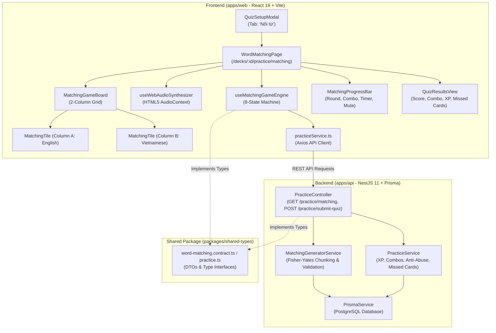
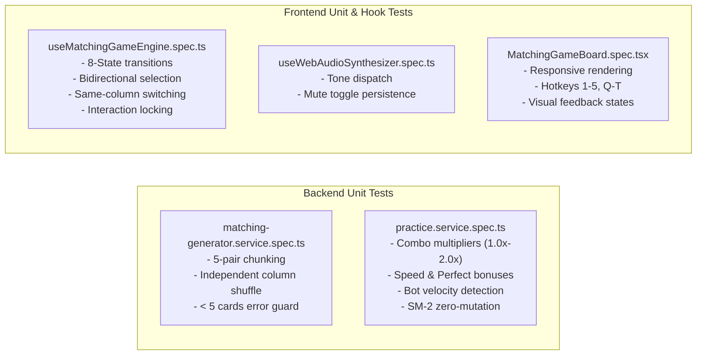

# Technical Implementation Plan: Chế độ Nối từ vựng (Word Matching Game) (US-QUIZ-04)

**Feature Slug**: `quiz-word-matching`  
**Epic**: `EPIC-04` (Multi-format Practice & Quiz Modes — US-QUIZ-04)  
**Status**: APPROVED  
**Architecture Pattern**: Monorepo NestJS 11 REST API + React 19 Vite SPA + Pure Web Audio API Synthesizer

---

## 1. Technical Context & Component Architecture

---

## 2. Shared Types (`packages/shared-types`)

- Update `packages/shared-types/src/practice.ts` (and maintain standalone contract in `.specify/features/quiz-word-matching/contracts/word-matching.contract.ts`) exporting:
  - `MatchingTileType`: `'WORD' | 'MEANING'`
  - `MatchingTileState`: `'NEUTRAL' | 'SELECTED' | 'MATCHED' | 'MISMATCH'`
  - `MatchingCardItemDto`: `{ id: string; cardId: string; text: string; type: MatchingTileType; phonetic?: string | null; audioUrl?: string | null; }`
  - `MatchingPairDto`: Alias for `MatchingCardItemDto`
  - `MatchingRoundDto`: `{ roundIndex: number; totalRounds: number; wordTiles: MatchingCardItemDto[]; meaningTiles: MatchingCardItemDto[]; }`
  - `GetMatchingQuizQueryDto`: `{ deckId: string; limit?: number; }`
  - `MatchingQuizResponseDto`: `{ deckId: string; totalCards: number; totalRounds: number; rounds: MatchingRoundDto[]; }`
  - `MatchingAnswerSubmissionDto`: `{ cardId: string; matchedInMs: number; attempts: number; isCorrectFirstTry: boolean; }`
  - `SubmitMatchingQuizDto`: `{ deckId: string; mode: 'MATCHING'; totalPairs: number; totalTimeMs: number; answers: MatchingAnswerSubmissionDto[]; }`
  - `MatchingMissedCardDto`: `{ cardId: string; word: string; meaning: string; phonetic?: string | null; audioUrl?: string | null; errorAttempts: number; }`
  - `MatchingXpBreakdownDto`: `{ baseXp: number; comboBonusXp: number; speedBonusXp: number; perfectBonusXp: number; totalXp: number; isDailyCapped: boolean; isBotDetected: boolean; }`
  - `MatchingQuizResultDto`: `{ totalPairs: number; matchedCount: number; accuracyPercentage: number; maxCombo: number; totalTimeMs: number; totalXpEarned: number; xpBreakdown: MatchingXpBreakdownDto; missedCards: MatchingMissedCardDto[]; }`
- Export all matching interfaces from `packages/shared-types/src/index.ts`.

---

## 3. Backend Implementation (`apps/api`)

### 3.1. `MatchingGeneratorService` (`apps/api/src/modules/practice/matching-generator.service.ts`)

- **Card Retrieval & Deck Validation**:
  - Fetch active cards belonging to `deckId` accessible by `userId`.
  - Validate minimum deck size: if total cards $< 5$, throw `BadRequestException` with message `'INSUFFICIENT_CARDS_FOR_MATCHING'`.
- **Round Chunking & Independent Fisher-Yates Shuffling**:
  - Limit total selected cards by `query.limit` (default: 10, min: 5, max: 50).
  - Shuffle total candidate cards with Fisher-Yates algorithm.
  - Chunk cards into 5-pair slices (e.g. 10 cards = 2 rounds of 5 pairs).
  - For each 5-pair slice:
    - Create `wordTiles`: map each card to `{ id: \`w_${card.id}\`, cardId: card.id, text: card.word, type: 'WORD', phonetic: card.phonetic, audioUrl: card.audioUrl }`.
    - Create `meaningTiles`: map each card to `{ id: \`m_${card.id}\`, cardId: card.id, text: card.meaning, type: 'MEANING', phonetic: null, audioUrl: null }`.
    - Shuffle `wordTiles` array independently using Fisher-Yates.
    - Shuffle `meaningTiles` array independently using Fisher-Yates.
  - Return `MatchingRoundDto[]`.

### 3.2. `PracticeService` Scoring & Anti-Abuse (`apps/api/src/modules/practice/practice.service.ts`)

- **Matching Submission Evaluator**:
  - Support `mode === 'MATCHING'` in `submitQuiz` or dedicated `submitMatchingQuiz(userId, dto)`.
  - **Base XP**: $+2\text{ XP}$ per matched pair ($10\text{ XP}$ per clean round).
  - **Combo Multipliers** (`BR-MATCH-007`):
    - $c \in [1, 2] \implies 1.0\times$
    - $c \in [3, 4] \implies 1.2\times$
    - $c \in [5, 9] \implies 1.5\times$ (Clean Round)
    - $c \ge 10 \implies 2.0\times$ (Multi-round Streak)
  - **Round Bonuses**:
    - Speed Bonus (`BR-MATCH-008`): $+10\text{ XP}$ if 5-pair round completed in $t \le 15000\text{ms}$ with 0 errors.
    - Perfect Round Bonus (`BR-MATCH-009`): $+5\text{ XP}$ if 5-pair round completed with 0 errors.
  - **Anti-Abuse Bot Velocity Guard** (`BR-MATCH-010`):
    - Flag as bot if: (1) 5-pair round total duration $< 1500\text{ms}$, OR (2) any single pair match duration $< 200\text{ms}$.
    - If bot detected: override `totalXpEarned = 0`, skip daily streak increment, and log warning in `Logger`.
  - **Daily Practice XP Cap** (`BR-MATCH-011`):
    - Enforce $500\text{ XP/day}$ cap across non-SRS practice modes.
  - **SM-2 Decoupling & Missed Cards** (`BR-MATCH-012`):
    - Fetch card details for cards with attempts $> 1$ or unmatched pairs without updating `UserCardProgress`.

### 3.3. DTOs & Controller Integration

- `apps/api/src/modules/practice/dto/get-matching-quiz.dto.ts`:
  - `deckId: string` (`@IsUUID()`)
  - `limit?: number` (`@IsOptional()`, `@Type(() => Number)`, `@IsInt()`, `@Min(5)`, `@Max(50)`)
- `apps/api/src/modules/practice/dto/submit-matching-quiz.dto.ts`:
  - Validates `deckId`, `mode: 'MATCHING'`, `totalPairs`, `totalTimeMs`, and `answers` array.
- `apps/api/src/modules/practice/practice.controller.ts`:
  - `GET /api/v1/practice/matching`: Protected with `JwtAuthGuard`, delegates to `MatchingGeneratorService`.
  - `POST /api/v1/practice/submit-quiz`: Handles `MATCHING` mode submissions.
- `apps/api/src/modules/practice/practice.module.ts`:
  - Register `MatchingGeneratorService` in providers.

---

## 4. Frontend Client Implementation (`apps/web`)

### 4.1. Audio Synthesizer Hook (`apps/web/src/features/practice/hooks/useWebAudioSynthesizer.ts`)

- Direct HTML5 `AudioContext` sound generation without external audio files.
- Methods:
  - `playSuccessChime()`: 2-tone frequency sweep ($587.33\text{Hz [D5]} \to 880.00\text{Hz [A5]}$, sine wave, $120\text{ms}$ duration, exponential decay).
  - `playMismatchBuzz()`: Double-pulse sawtooth wave ($180\text{Hz} \to 120\text{Hz}$, $180\text{ms}$ duration, linear decay).
  - `playComboDing()`: Bell chime ($1046.50\text{Hz [C6]}$, sine wave, $150\text{ms}$ duration).
- Controls:
  - Master volume clamped to `0.25`.
  - Mute state stored in `localStorage` (`'wordstreak_matching_muted'`).
  - Auto-resume `AudioContext` on first user click gesture to satisfy browser autoplay policies.

### 4.2. Matching Game Engine Hook (`apps/web/src/features/practice/hooks/useMatchingGameEngine.ts`)

- Manages the 8-state deterministic machine:
  - `IDLE` $\to$ `PLAYING` $\to$ `CARD_SELECTED` $\to$ `CHECKING_MATCH` $\to$ `MATCH_SUCCESS` / `MATCH_ERROR` $\to$ `ROUND_COMPLETED` $\to$ `SESSION_FINISHED`.
- Handles bidirectional selection, same-column switching, and self-deselection.
- Manages interaction locking ($300\text{ms}$ for success dissolve, $400\text{ms}$ for mismatch shake).
- Tracks high-resolution timer (`performance.now()`), per-pair timestamps, attempts, combo streaks, and missed card IDs.
- Dispatches synthesized sound effects for matches, mismatches, and combo milestones.
- Dispatches submit API request on session completion and returns results.

### 4.3. UI Components (`apps/web/src/features/practice/components/`)

- `MatchingTile.tsx`:
  - Renders individual tile with touch target $\ge 48\text{px} \times 48\text{px}$.
  - Visual states: Neutral, Selected (`ring-2 ring-violet-500 bg-violet-50/60 dark:bg-violet-950/40`), Matched (emerald border + dissolve), Mismatch (rose border + `animate-shake`).
  - Shortcut badge (`1-5` for Left, `Q-T` for Right) and pronunciation speaker button for English tiles.
- `MatchingGameBoard.tsx`:
  - 2-column grid layout (`grid-cols-2 gap-4 md:gap-6 max-w-4xl mx-auto`).
  - Renders Column A (English terms) and Column B (Vietnamese definitions).
- `MatchingProgressBar.tsx`:
  - Round indicator (`Vòng 1/2`), combo streak badge (`🔥 5x Combo`), timer countdown (45s) or Zen stopwatch, and audio mute toggle button.
- `QuizSetupModal.tsx`:
  - Add "Nối từ" tab with matching icon.
  - Disable tab with `"Cần tối thiểu 5 thẻ"` badge if `totalCards < 5`.
  - Card count presets (5 Cards / 1 round, 10 Cards / 2 rounds, 15 Cards / 3 rounds, 20 Cards / 4 rounds) and Zen mode toggle.
- `QuizResultsView.tsx`:
  - Render matching mode summary stats (Accuracy %, Max Combo, Total Time, XP breakdown with speed and perfect bonuses, and interactive missed cards list).

### 4.4. Page & Routing Integration

- `apps/web/src/features/practice/pages/WordMatchingPage.tsx`: Fullscreen matching game view.
- `apps/web/src/App.tsx`: Register routes `/decks/:id/practice/matching` and `/practice/matching`.
- `apps/web/src/features/practice/services/practiceService.ts`: Add `getMatchingQuiz(deckId, limit)` and `submitMatchingQuiz(dto)`.

---

## 5. Testing Strategy (TDD)

- **Backend Unit Tests**:
  - `matching-generator.service.spec.ts`:
    - Validates deck card fetch and throws `BadRequestException` when $< 5$ cards.
    - Validates 5-pair chunking for 5, 10, 15, 20 cards.
    - Validates independent shuffling of `wordTiles` and `meaningTiles` (no guaranteed row alignment).
  - `practice.service.spec.ts`:
    - Validates calculation of base XP (+2/pair), combo multipliers, speed bonus (+10 for $\le 15\text{s}$), perfect bonus (+5).
    - Validates bot detection for $< 1500\text{ms}$ round or $< 200\text{ms}$ pair.
    - Validates that `UserCardProgress` SRS scheduling fields are never touched.
- **Frontend Unit & Hook Tests**:
  - `useMatchingGameEngine.spec.ts`:
    - Validates state machine transitions (`IDLE` $\to$ `PLAYING` $\to$ `CARD_SELECTED` $\to$ `CHECKING_MATCH`).
    - Validates bidirectional selection (Left $\to$ Right, Right $\to$ Left).
    - Validates same-column switching and self-deselection.
    - Validates interaction locking during $300\text{–}400\text{ms}$ evaluation window.
    - Validates timeout in timed mode and elapsed time in Zen mode.
  - `useWebAudioSynthesizer.spec.ts`:
    - Validates tone generation calls, mute state toggling, and localStorage caching.
  - `MatchingGameBoard.spec.tsx`:
    - Validates tile rendering, click events, keyboard shortcuts (`1-5`, `Q-T`, `Escape`, `Space`), and accessibility attributes.

---

## 6. Security, Anti-Abuse & Performance Safeguards

1. **Velocity & Bot Guard**:
   - Telemetry strictly validated on server: Total round duration $< 1500\text{ms}$ or any pair match duration $< 200\text{ms}$ forces $0\text{ XP}$ award and security warning.
2. **Zero-Trust Client Scoring**:
   - Server re-calculates all XP, combos, and bonus awards from submitted answer telemetry.
3. **Daily Practice Cap**:
   - Enforced globally at $500\text{ XP/day}$ across non-SRS practice modes.
4. **Sub-16ms UI Feedback**:
   - Pure React state transitions and CSS hardware-accelerated animations ensure fluid 60fps interaction on mobile and desktop devices.
