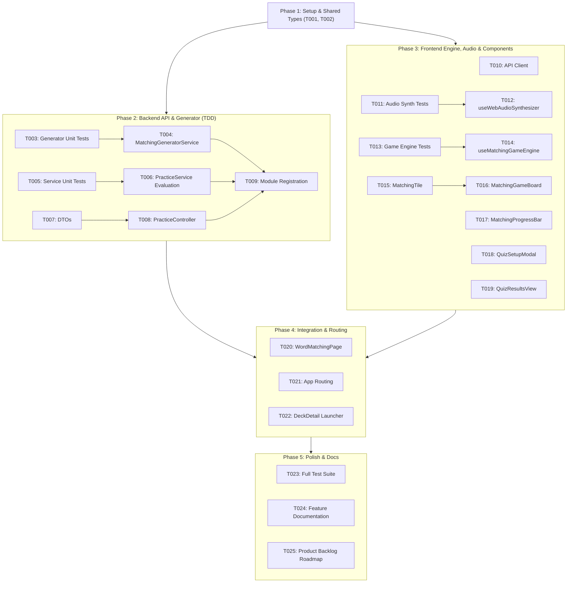

# Implementation Tasks: Chế độ Nối từ vựng (Word Matching Game) (US-QUIZ-04)

**Feature**: Word Matching Game Mode  
**Slug**: `quiz-word-matching`  
**Epic**: `EPIC-04` (Multi-format Practice & Quiz Modes — US-QUIZ-04)  
**Total Tasks**: 25 (Dependency-Ordered & TDD Structured)

---

## Phase 1: Setup & Shared Types

- [x] T001 [P] Define Word Matching quiz interfaces and DTOs (`MatchingTileType`, `MatchingTileState`, `MatchingCardItemDto`, `MatchingRoundDto`, `GetMatchingQuizQueryDto`, `MatchingQuizResponseDto`, `MatchingAnswerSubmissionDto`, `SubmitMatchingQuizDto`, `MatchingQuizResultDto`) in `packages/shared-types/src/practice.ts`
- [x] T002 Export all Word Matching types in `packages/shared-types/src/index.ts` and compile `packages/shared-types`

---

## Phase 2: Foundational & Backend API Implementation (TDD)

- [x] T003 [P] Write unit tests for `MatchingGeneratorService` (5-pair chunking, independent Fisher-Yates column shuffles, `< 5` cards exception guard) in `apps/api/src/modules/practice/matching-generator.service.spec.ts`
- [x] T004 Implement `MatchingGeneratorService` with card querying, deck size validation, and dual independent Fisher-Yates shuffles in `apps/api/src/modules/practice/matching-generator.service.ts`
- [x] T005 [P] Write unit tests for `PracticeService` matching evaluation (base XP, combo multipliers $1.0\times\text{--}2.0\times$, speed bonus, perfect bonus, anti-abuse velocity detection, daily 500 XP cap, SM-2 zero-mutation) in `apps/api/src/modules/practice/practice.service.spec.ts`
- [x] T006 Implement `PracticeService` matching quiz evaluation and anti-abuse bot velocity guard in `apps/api/src/modules/practice/practice.service.ts`
- [x] T007 [P] Create DTOs (`get-matching-quiz.dto.ts`, `submit-matching-quiz.dto.ts`) with class-validator and class-transformer in `apps/api/src/modules/practice/dto/`
- [x] T008 Update `PracticeController` with `GET /practice/matching` and matching quiz submission handler in `apps/api/src/modules/practice/practice.controller.ts`
- [x] T009 Register `MatchingGeneratorService` in `apps/api/src/modules/practice/practice.module.ts` and verify backend test suite passes (`pnpm --filter api test`)

---

## Phase 3: Frontend Core Engine, Audio Synthesizer & Components (TDD)

- [x] T010 [P] [US1] Add Word Matching API client methods (`getMatchingQuiz`, `submitMatchingQuiz`) to `apps/web/src/features/practice/services/practiceService.ts`
- [x] T011 [P] [US2] Write unit tests for `useWebAudioSynthesizer` (success chime $587\text{Hz}\to 880\text{Hz}$, mismatch buzz $180\text{Hz}\to 120\text{Hz}$, combo bell $1046\text{Hz}$, mute toggle persistence) in `apps/web/src/features/practice/hooks/useWebAudioSynthesizer.spec.ts`
- [x] T012 [P] [US2] Implement `useWebAudioSynthesizer` hook using native HTML5 `AudioContext` and frequency sweeps in `apps/web/src/features/practice/hooks/useWebAudioSynthesizer.ts`
- [x] T013 [P] [US2] Write unit tests for `useMatchingGameEngine` (8-state machine, bidirectional selection, same-column switching, self-deselection, interaction locking, combo streaks, timers) in `apps/web/src/features/practice/hooks/useMatchingGameEngine.spec.ts`
- [x] T014 [US2] Implement `useMatchingGameEngine` custom hook managing game state, timing, and submission in `apps/web/src/features/practice/hooks/useMatchingGameEngine.ts`
- [x] T015 [P] [US2] Implement `MatchingTile` component with Obsidian design tokens, hotkey indicators, speaker pronunciation button, and Framer Motion animations in `apps/web/src/features/practice/components/MatchingTile.tsx`
- [x] T016 [P] [US2] Implement `MatchingGameBoard` component with responsive 2-column layout and keyboard event listeners (`1-5`, `Q-T`, `Space`, `Escape`) in `apps/web/src/features/practice/components/MatchingGameBoard.tsx`
- [x] T017 [P] [US2] Implement `MatchingProgressBar` with round indicator, combo streak flame badge, timer/stopwatch, and header mute toggle in `apps/web/src/features/practice/components/MatchingProgressBar.tsx`
- [x] T018 [P] [US1] Update `QuizSetupModal` to add "Nối từ" tab, minimum 5 cards guard badge, round presets, and Zen mode switch in `apps/web/src/features/practice/components/QuizSetupModal.tsx`
- [x] T019 [P] [US3] Update `QuizResultsView` to support Word Matching results (accuracy %, max combo, XP breakdown with speed/perfect bonuses, missed cards review) in `apps/web/src/features/practice/components/QuizResultsView.tsx`

---

## Phase 4: Frontend Page Integration & Routing

- [x] T020 [US1] Implement `WordMatchingPage` fullscreen practice game container in `apps/web/src/features/practice/pages/WordMatchingPage.tsx`
- [x] T021 [US1] Register `/decks/:id/practice/matching` and `/practice/matching` routes in `apps/web/src/App.tsx`
- [x] T022 [US1] Update `DeckDetailPage` practice launcher to support launching Word Matching Game in `apps/web/src/features/decks/pages/DeckDetailPage.tsx`

---

## Phase 5: Polish, Anti-Abuse / Audio Verification & Documentation

- [ ] T023 Run full monorepo test suites (`pnpm --filter shared-types test`, `pnpm --filter api test`, `pnpm --filter web test`)
- [ ] T024 Create technical feature documentation in `docs/features/quiz-word-matching/README.md` and update `docs/features/README.md`
- [ ] T025 Update `docs/PRODUCT_BACKLOG_ROADMAP.md` marking US-QUIZ-04 as planned and verified

---

## Dependencies & Execution Order

---

## Parallel Execution Opportunities

- **Backend Parallel**: `T003` (Generator Tests), `T005` (Service Tests), and `T007` (DTOs) can be developed concurrently.
- **Frontend Parallel**: `T010` (API Client), `T011`/`T012` (Audio Synthesizer), `T015` (MatchingTile), `T017` (ProgressBar), `T018` (SetupModal), and `T019` (ResultsView) can be implemented in parallel before assembling `T020` (`WordMatchingPage`).
